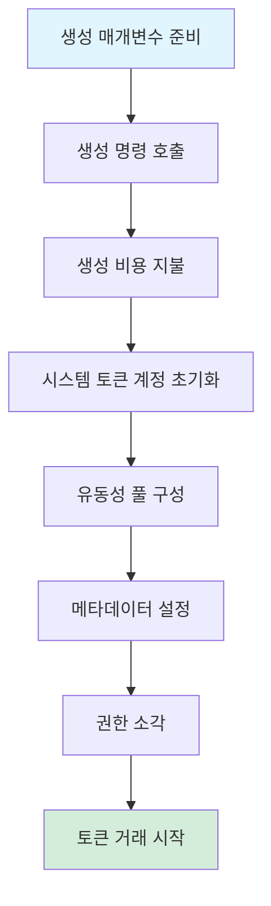
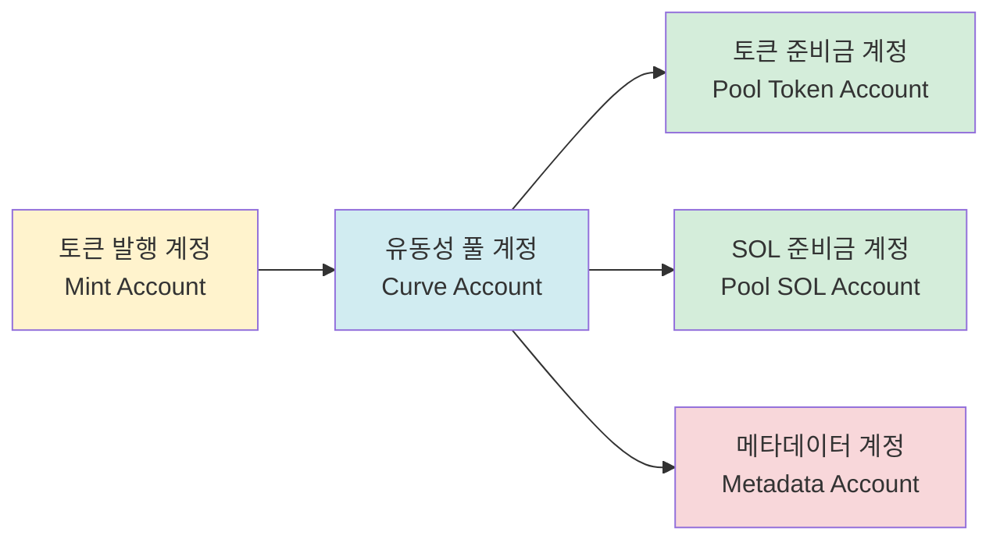
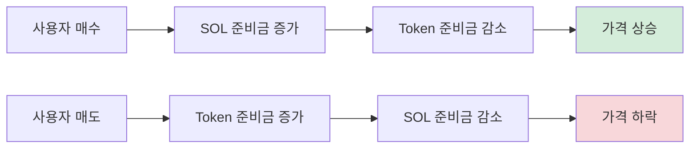

# 🪙 PinPet 토큰 생성 기능 소개

## 일、📋 기능 개요

### 💎 토큰 생성이란

토큰 생성은 PinPet 플랫폼의 핵심 기능 중 하나로, 사용자가 원클릭으로 전혀 새로운 SPL 토큰(솔라나 블록체인 표준 토큰)을 발행하고 자동으로 거래 시장을 구성할 수 있습니다. 이 기능을 통해 사용자는 복잡한 블록체인 기술을 깊이 이해하지 않아도 완전한 메타데이터, 자동 유동성 지원 및 즉시 거래 가능한 토큰을 빠르게 생성할 수 있습니다.

### ❓ 왜 토큰 생성이 필요한가

**⚠️ 전통적인 토큰 발행의 문제점:**
- 전문적인 기술 지식 필요(솔라나 프로그래밍, SPL Token 표준)
- 발행 권한, 유동성 풀, 메타데이터 등 여러 단계를 수동으로 구성
- 즉각적인 유동성과 거래 시장 부족
- 복잡한 보안 설정(권한 소각, 추가 발행 방지 등)

**✅ PinPet 토큰 생성의 장점:**
- **⚡ 원클릭 발행**: 토큰 이름, 심볼, 아이콘 세 가지 기본 정보만 제공하면 됨
- **🚀 즉시 상장**: 생성 완료 즉시 거래 가능, 유동성 축적 대기 불필요
- **🔒 자동 보안 설정**: 발행 권한 및 동결 권한 자동 소각, 악의적인 추가 발행 방지
- **🏦 내장 거래 시장**: 항등 곱 AMM 알고리즘 기반, 현물 및 레버리지 거래 지원
- **✔️ 규격 메타데이터**: Metaplex 표준 준수, 지갑과 거래소에서 자동 인식

### ⭐ 핵심 특성

| 특성 | 설명 |
|------|------|
| 토큰 표준 | SPL Token(솔라나 공식 표준) |
| 정밀도 | 소수점 6자리(1 Token = 1,000,000 최소 단위) |
| 총 공급량 | 1,609,500,000,000,000 단위(고정 공급, 추가 발행 불가) |
| 메타데이터 표준 | Metaplex Token Metadata |
| 초기 가격 | 약 0.0000000000279589934762 SOL/Token |
| 유동성 모델 | 항등 곱 AMM(x × y = k) |

---

## 이、🔄 토큰 생성 프로세스

### 👤 사용자 작업 단계



### 📊 상세 프로세스 설명

#### 📝 단계 1: 매개변수 준비
사용자는 세 가지 기본 매개변수를 제공해야 합니다:

| 매개변수 | 타입 | 설명 | 예시 |
|------|------|------|------|
| name | 문자열 | 토큰 전체 이름 | "PinPet Token" |
| symbol | 문자열 | 토큰 심볼(3-10자) | "PINPET" |
| uri | 문자열 | 메타데이터 JSON 파일의 링크 | "https://example.com/metadata.json" |

#### 🔧 단계 2: 계정 초기화
시스템이 자동으로 다음 계정을 생성하고 구성합니다:



#### 💧 단계 3: 유동성 풀 초기화
시스템이 자동으로 두 개의 자금 풀을 구성합니다:

**1. 현물 유동성 풀(LP Pool)**
- 토큰 준비금: 1,073,000,000,000,000 단위
- SOL 준비금: 30 SOL(가상 잔액)
- 실제 SOL: 10,000 lamports(잔액 부족 방지)
- 용도: 현물 거래 지원(매수/매도)

**2. 레버리지 대출 풀(Borrow Pool)**
- 토큰 준비금: 536,500,000,000,000 단위
- SOL 준비금: 10,000,000 SOL(가상 잔액)
- 용도: 마진 거래 지원(롱/숏)

**📊 자금 분배 도표:**
```
💰 총 공급량: 1,609,500,000,000,000 단위
├── 현물 유동성 풀: 1,073,000,000,000,000 (66.67%)
└── 레버리지 대출 풀:  536,500,000,000,000 (33.33%)
```

#### 📄 단계 4: 메타데이터 생성
시스템이 Metaplex Token Metadata 프로그램을 호출하여 토큰 메타데이터를 생성합니다:

| 메타데이터 필드 | 내용 | 설명 |
|-----------|------|------|
| name | 사용자 제공 이름 | 지갑에 표시되는 토큰 이름 |
| symbol | 사용자 제공 심볼 | 토큰 약칭 |
| uri | 사용자 제공 링크 | 아이콘, 설명 등의 정보가 포함된 JSON 지정 |
| creators | 생성자 주소 | 토큰 생성자 표시, 미인증 상태 |
| seller_fee_basis_points | 0 | 로열티 수수료(0으로 설정) |
| is_mutable | true | 메타데이터 업데이트 허용 |

**📋 메타데이터 JSON 표준 형식 예시:**
```json
{
  "name": "PinPet Token",
  "symbol": "PINPET",
  "description": "PinPet 플랫폼 기반 발행 토큰",
  "image": "https://example.com/logo.png",
  "attributes": [],
  "properties": {
    "files": [
      {
        "uri": "https://example.com/logo.png",
        "type": "image/png"
      }
    ]
  }
}
```

#### 🔒 단계 5: 권한 소각
토큰의 보안성과 불변성을 보장하기 위해 시스템이 자동으로 실행합니다:

| 작업 | 목적 | 효과 |
|------|------|------|
| 발행 권한 소각 | 추가 발행 방지 | 총 공급량 영구 고정 |
| 동결 권한 소각 | 사용자 계정 동결 방지 | 토큰 영구 유통 가능 |

#### 💵 단계 6: 수수료 설정
시스템이 파트너 매개변수 계정에서 수수료 설정을 읽습니다:

| 수수료 타입 | 기본값 | 설명 |
|---------|--------|------|
| 현물 거래 수수료 | 1% | 매매 거래 시 차감 |
| 마진 거래 수수료 | 0.25% | 레버리지 거래 시 차감 |
| 수수료 할인 플래그 | 0(정상가) | 거래량에 따라 자동 조정 가능 |
| 수수료 배분 비율 | 20%/80% | 기술팀/파트너 분배 비율 |

---

## 삼、💧 유동성 풀 메커니즘

### 🔢 항등 곱 공식

PinPet은 자동 마켓 메이커(AMM) 모델을 채택하며, 핵심 공식은 다음과 같습니다:

```
x × y = k
```

여기서:
- **x**: SOL 준비금
- **y**: Token 준비금
- **k**: 상수 곱(초기값 = 30 × 1,073,000,000 = 32,190,000,000)

### 💰 초기 가격 계산

```
초기 가격 = SOL 준비금 ÷ Token 준비금
         = 30 ÷ 1,073,000,000
         ≈ 0.0000000279589934762 SOL/Token
```

### 📈 가격 변동 메커니즘



### 🛡️ 가격 슬리피지 보호

유동성 풀을 보호하기 위해 시스템은 다중 보안 메커니즘을 채택합니다:

| 보호 조치 | 설명 |
|---------|------|
| 정밀도 계수 | 가격에 10^26 정밀도 계수 사용, 반올림 오류 방지 |
| 오버플로우 검사 | 모든 계산에 `checked_*` 메서드 사용, 오버플로우 방지 |
| 가격 상한 | 최고 가격 제한 50,000,000,000,000,000,000,000,000,000 |
| 가격 하한 | 최저 가격 제한 0.000000001(0으로 나누기 방지) |

---

## 사、📝 토큰 메타데이터 설명

### ✅ Metaplex 표준

PinPet은 Metaplex Token Metadata v5.1.1 표준을 사용하여 솔라나 생태계에서 토큰의 호환성을 보장합니다:

**✨ 표준의 장점:**
- 💳 주요 지갑(Phantom, Solflare) 자동 인식
- 🔄 DEX 플랫폼(Jupiter, Raydium) 자동 정보 수집
- 🎨 NFT 마켓플레이스와 애그리게이터 자동 색인
- 🔍 블록체인 탐색기(Solscan, Solana Explorer) 완전 표시

### 🗂️ 메타데이터 계정 구조

```
메타데이터 계정 주소 (PDA)
├── 파생 시드: ["metadata", Metaplex Program ID, Mint Address]
├── 저장 내용:
│   ├── 토큰 이름
│   ├── 토큰 심볼
│   ├── URI(메타데이터 JSON 링크)
│   ├── 생성자 정보
│   ├── 로열티 설정
│   └── 컬렉션 정보(선택사항)
└── 권한:
    ├── 업데이트 권한: 유동성 풀 계정(PDA)
    └── 가변성: true(업데이트 허용)
```

### 🌐 URI 호스팅 권장사항

| 호스팅 방식 | 장점 | 단점 | 적용 시나리오 |
|---------|------|------|---------|
| IPFS | 탈중앙화, 영구 저장 | 액세스 속도가 느림 | 장기 프로젝트 |
| Arweave | 영구 저장, 빠른 속도 | 유료 | 고가치 토큰 |
| 클라우드 스토리지(AWS S3/CDN) | 빠른 속도, 저렴 | 중앙화, 실효 가능성 | 테스트 또는 단기 프로젝트 |

---

## 오、🎯 사용 사례

### 🚀 시나리오 1: 스타트업 팀의 프로젝트 토큰 발행

**요구사항:**
Web3 스타트업 팀이 자사의 DeFi 프로젝트를 위한 거버넌스 토큰을 발행하고자 함

**작업 프로세스:**
1. 토큰 아이콘 및 설명 문서 디자인
2. 메타데이터 JSON을 IPFS에 업로드
3. 매개변수 준비:
   - name: "SuperDeFi Governance Token"
   - symbol: "SDEFI"
   - uri: "https://ipfs.io/ipfs/QmXXX..."
4. PinPet 생성 명령 호출, 소량의 생성 비용 지불
5. 토큰 즉시 상장, 팀원 및 커뮤니티가 즉시 거래 가능

**✅ 장점:**
- ⚡ 스마트 컨트랙트 작성 불필요
- 💧 내장 유동성 시장
- 🔒 프로토콜이 보장하는 보안

---

### 🎉 시나리오 2: 커뮤니티 밈 토큰 발행

**요구사항:**
커뮤니티가 엔터테인먼트와 거래를 위한 테마 밈 토큰을 발행하고자 함

**작업 프로세스:**
1. 커뮤니티 투표로 토큰 이름과 아이콘 결정
2. 무료 이미지 호스팅 사용
3. 매개변수 준비:
   - name: "Doge to the Moon"
   - symbol: "DMOON"
   - uri: "https://cloudinary.com/dmoon.json"
4. 커뮤니티 구성원 중 한 명이 생성 시작
5. 커뮤니티 구성원들이 즉시 거래 시작

**✅ 장점:**
- 💰 저렴한 비용으로 빠른 발행
- 👥 기술 배경 불필요
- 🔒 자동 추가 발행 방지 메커니즘

---

### 🎨 시나리오 3: NFT 프로젝트의 유틸리티 토큰 발행

**요구사항:**
NFT 프로젝트 팀이 생태계 인센티브를 위한 유틸리티 토큰을 발행하고자 함

**작업 프로세스:**
1. NFT 스타일에 맞는 토큰 이미지 디자인
2. 상세한 토큰 백서 준비
3. Arweave를 사용하여 메타데이터 영구 저장
4. 매개변수 준비:
   - name: "CryptoArt Utility Token"
   - symbol: "CART"
   - uri: "ar://abc123..."
5. 토큰 생성 및 수수료 수취 계정 설정
6. NFT 보유자가 스테이킹하여 토큰 보상 획득

**✅ 장점:**
- 💾 메타데이터 영구 저장
- 🔗 NFT 생태계와 원활한 통합
- 📊 복잡한 경제 모델 지원

---

## 육、⚠️ 주의사항 및 제한사항

### 📝 생성 전 준비 작업

| 체크 항목 | 설명 |
|--------|------|
| 지갑 잔액 | 생성 비용을 지불할 충분한 SOL 확보(약 0.01-0.05 SOL) |
| 메타데이터 준비 | JSON 파일이 업로드되어 액세스 가능 |
| 토큰 정보 | 이름과 심볼이 규격에 맞고 모호하지 않음 |
| 파트너 계정 | 파트너 매개변수 계정 생성됨(처음에는 생성 필요) |

### 🚫 토큰 생성 제한사항

**⚙️ 기술적 제한:**
- 토큰 정밀도는 소수점 6자리로 고정, 생성 후 수정 불가
- 총 공급량 고정, 발행 권한 소각 후 추가 발행 불가
- 초기 유동성 구성 고정, 사용자 정의 불가

**🔒 보안 제한:**
- 수수료율 상한 10%, 초과 시 생성 실패
- 메타데이터 업데이트 권한은 유동성 풀 계정 소유
- 동결 권한 소각됨, 사용자 계정 동결 불가

**💰 경제적 제한:**
- 초기 가격은 알고리즘으로 계산, 사용자 정의 불가
- 유동성 배분 비율 고정(현물 66.67%, 레버리지 33.33%)
- SOL 준비금은 가상 잔액, 직접 출금 불가

### ❓ 자주 묻는 질문

**💵 Q1: 토큰 생성에 얼마의 비용이 드나요?**
A: 주요 비용은 계정 렌트(약 0.01-0.03 SOL)와 거래 수수료(약 0.00001 SOL)로, 총 약 0.01-0.05 SOL입니다.

**✏️ Q2: 토큰 생성 후 이름이나 심볼을 수정할 수 있나요?**
A: 메타데이터 URI가 가리키는 JSON 파일 내용을 수정하여 변경 가능하지만, 온체인에 기록된 name과 symbol은 불변입니다.

**🔒 Q3: 토큰 보안을 어떻게 보장하나요?**
A: 시스템이 자동으로 발행 및 동결 권한을 소각하여 공급량이 고정되고 변조 불가능하도록 보장합니다. 탈중앙화 스토리지(IPFS/Arweave)를 사용하여 메타데이터를 호스팅할 것을 권장합니다.

**❗ Q4: 생성 실패 시 어떻게 처리하나요?**
A: 지갑 잔액, 매개변수 형식, 파트너 계정 상태를 확인하세요. 일반적인 오류로는 수수료율 초과, 유효하지 않은 URI 등이 있습니다.

**🗑️ Q5: 토큰을 소각할 수 있나요?**
A: 토큰 계정 자체는 소각할 수 없지만, 블랙홀 주소(0x000...)로 전송하여 토큰을 영구적으로 잠글 수 있습니다.

### 💡 모범 사례 권장사항

1. **메타데이터 호스팅**: IPFS 또는 Arweave와 같은 탈중앙화 스토리지 우선 사용, 링크 실효 방지
2. **토큰 네이밍**: 간결명료하게, 유명 프로젝트와의 혼동 방지, 침해 방지
3. **아이콘 디자인**: 고품질 이미지 사용(512x512 픽셀 권장), 토큰 포지셔닝에 부합
4. **백서 준비**: URI가 가리키는 JSON에 상세한 프로젝트 설명과 로드맵 포함
5. **커뮤니티 구축**: 생성 후 즉시 소셜 미디어 계정 구축, 토큰 인지도 향상
6. **규정 준수**: 토큰 용도가 합법적이고 현지 법규 위반하지 않도록 보장

---

## 칠、🔧 기술 지원

### 📍 관련 계정 주소

| 계정 타입 | 파생 규칙 | 설명 |
|---------|---------|------|
| 유동성 풀 계정 | `["borrowing_curve", mint_address]` | 유동성 및 거래 매개변수 관리 |
| 토큰 준비금 계정 | `["pool_token", mint_address]` | 유동성 풀의 토큰 저장 |
| SOL 준비금 계정 | `["pool_sol", mint_address]` | 유동성 풀의 SOL 저장 |
| 메타데이터 계정 | Metaplex 표준 PDA | 토큰 메타데이터 저장 |

### 🖥️ 프로그램 인터페이스

**✨ 생성 명령:**
```
함수명: create
매개변수:
  - name: String(토큰 이름)
  - symbol: String(토큰 심볼)
  - uri: String(메타데이터 URI)
```

**📡 이벤트 리스닝:**
생성 성공 후 `TokenCreatedEvent` 이벤트 발생, 다음 정보 포함:
- 발행 계정 주소
- 유동성 풀 계정 주소
- 수수료 설정
- 토큰 이름, 심볼, URI

---

## 🎯 결론

PinPet 토큰 생성 기능은 사용자에게 🔒 안전하고, ⚡ 편리하며, 💰 저렴한 토큰 발행 솔루션을 제공합니다. 자동화된 유동성 구성과 표준화된 메타데이터 관리를 통해 사용자는 몇 분 안에 토큰 생성을 완료하고 즉시 거래를 시작할 수 있으며, 기술적 세부사항이나 보안 문제에 대해 걱정할 필요가 없습니다.

🚀 스타트업 팀의 프로젝트 토큰 발행, 🎉 커뮤니티의 밈 토큰 생성, 🎨 NFT 프로젝트의 유틸리티 토큰 발행 등 어떤 경우에도 PinPet은 완전한 지원을 제공하여 토큰 발행을 간단하고 효율적으로 만듭니다.
