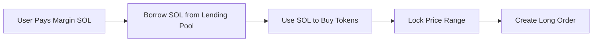
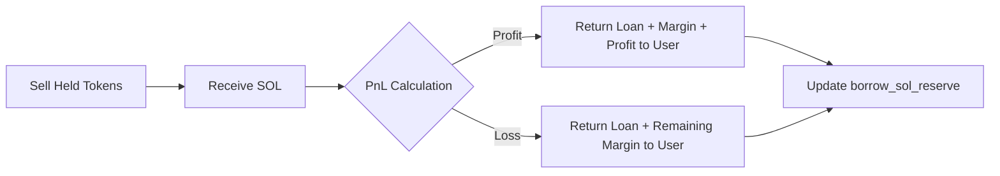
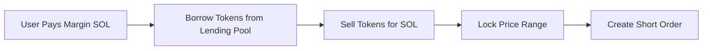
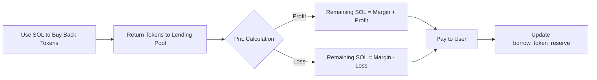
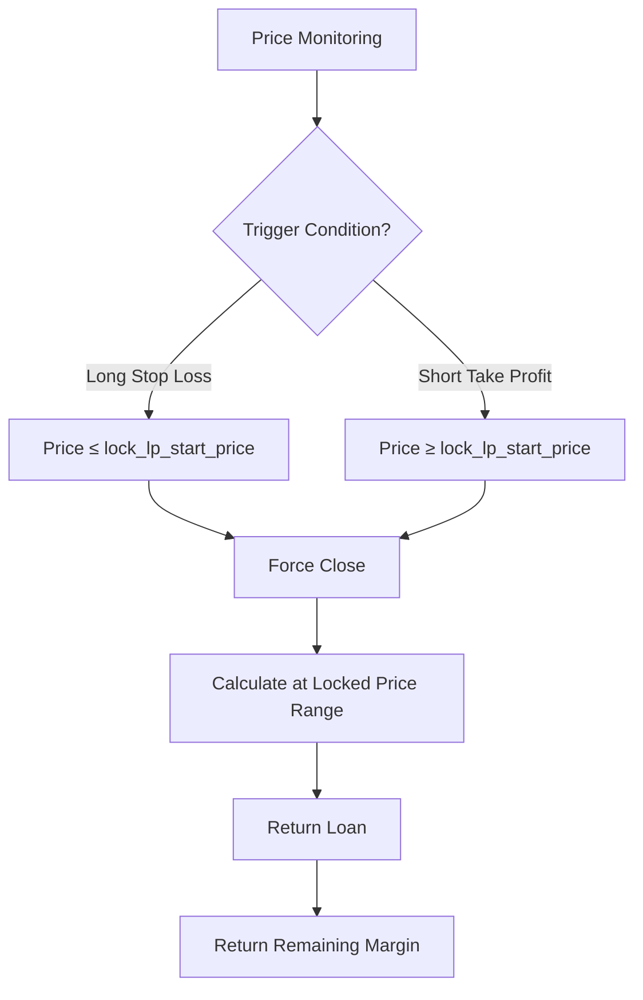
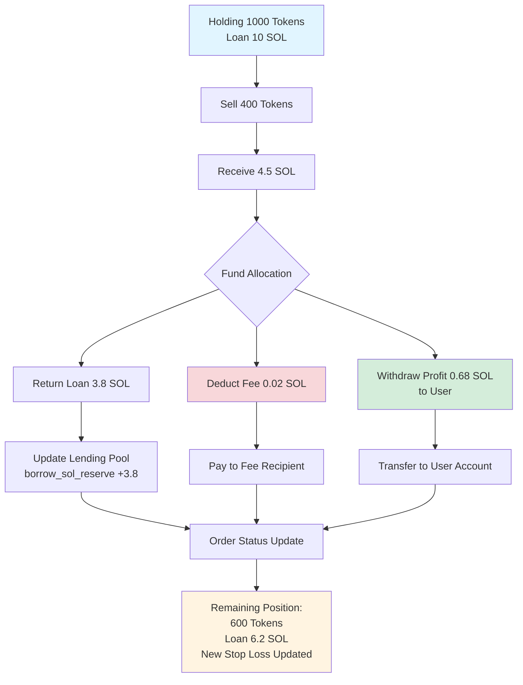
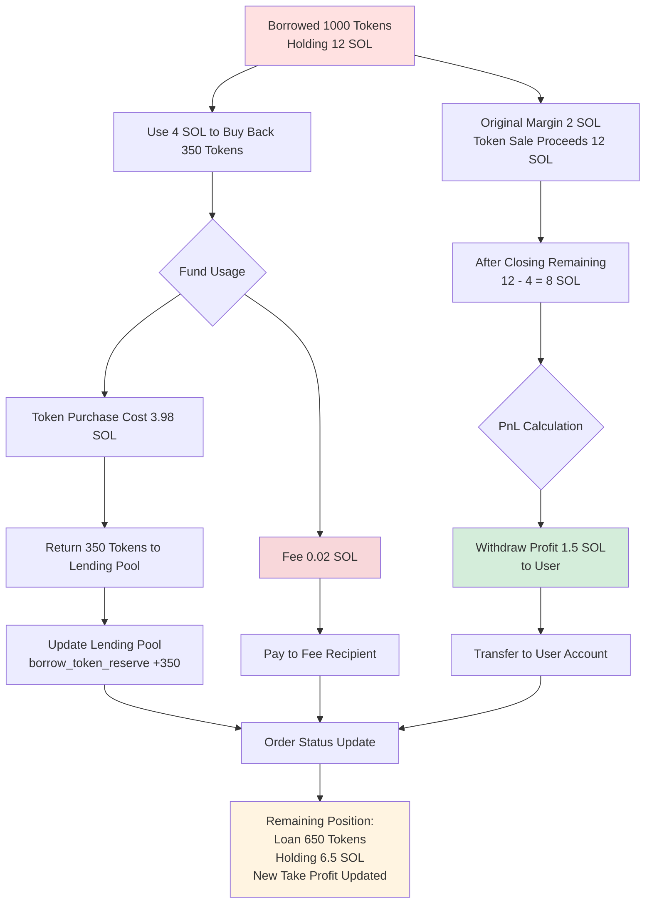

# 🏦 Lending Pool Feature Introduction

## 1. 📋 Overview

The PinPet lending pool is the core module supporting leveraged trading, providing SOL and token borrowing services for users to enable long and short positions. The lending pool uses a **virtual reserve pool** mechanism, independent of the spot trading liquidity pool, ensuring that leveraged trading does not affect the normal operation of the spot market.

## 2. 🎭 Dual Role of the Lending Pool

### 2.1 💰 As a Funding Pool
- **SOL Lending Pool**: Provides SOL borrowing for long traders
- **Token Lending Pool**: Provides token borrowing for short traders

### 2.2 📦 Reserve Management
The lending pool maintains two independent virtual reserves:

| Reserve Type | Description | Purpose |
|--------------|-------------|---------|
| `borrow_sol_reserve` | SOL Virtual Reserve | Available for long traders to borrow |
| `borrow_token_reserve` | Token Virtual Reserve | Available for short traders to borrow |

These reserves are **virtual ledgers**, with actual funds stored in the spot liquidity pool, isolated through price range locking mechanisms.

## 3. 🔄 Leveraged Trading Borrowing Process

### 3.1 📈 Long Trading - Borrow SOL to Buy Tokens

#### ⬆️ Opening Position


**Detailed Process**:
1. **User Investment**: Pay margin (e.g., 0.5 SOL) 💵
2. **Lending Pool Loan**: Borrow SOL from `borrow_sol_reserve` (e.g., 4.5 SOL) 💸
3. **Execute Trade**: Use a total of 5 SOL to buy tokens on the AMM ⚙️
4. **Price Range Lock**: Record the price range at purchase time for closing calculation 🔒
5. **Order Record**: Create `MarginOrder`, recording borrowed amount, margin, and held token quantity 📝


#### ⬇️ Closing Position


**Fund Settlement**:
- Total SOL received from selling tokens = `output_sol` 💰
- Deduct trading fees 💸
- Return to lending pool: `borrow_amount` returns to `borrow_sol_reserve` ⬅️
- User profit = Total - Loan - Margin ✅

### 3.2 📉 Short Trading - Borrow Tokens to Sell for SOL

#### ⬆️ Opening Position


**Detailed Process**:
1. **User Investment**: Pay margin SOL 💵
2. **Lending Pool Loan**: Borrow tokens from `borrow_token_reserve` 💎
3. **Execute Trade**: Sell tokens for SOL, deposit into pool ⚙️
4. **Price Range Lock**: Record the price range at sell time 🔒
5. **Order Record**: Create `MarginOrder`, recording borrowed token quantity, margin, and held SOL 📝


#### ⬇️ Closing Position


**Fund Settlement**:
- Total SOL required to buy back tokens = `required_sol` + fees 💰
- Return to lending pool: `borrow_amount` (tokens) returns to `borrow_token_reserve` ⬅️
- User profit = SOL from opening sale - SOL spent on closing buy - Margin ✅

## 4. 💸 Lending Pool Repayment Mechanism

### 4.1 ✅ Active Closing Repayment
When users actively close positions, the system automatically executes repayment:

| Trade Type | Repayment Asset | Repayment Source | Return Reserve |
|------------|----------------|------------------|----------------|
| Close Long | SOL | Proceeds from selling tokens | `borrow_sol_reserve` |
| Close Short | Tokens | Buy back tokens | `borrow_token_reserve` |

**Repayment Priority**:
1. Deduct trading fees 💸
2. Return loan principal ⬅️
3. Return margin 💰
4. Distribute profit/handle loss 📊

### 4.2 ⚠️ Forced Liquidation Repayment
When price reaches stop-loss/take-profit levels, the system automatically forces position closure:



**Liquidation Protection** 🛡️:
- Through price range locking, ensures that even with severe market price fluctuations, positions can be closed at predetermined prices
- Margin design ensures lending pool fund safety

### 4.3 ⏰ Expiration Liquidation
After order expiration, anyone can trigger position closure:

- Long orders: Expiration time `end_time` = Opening time + `borrow_duration` ⏱️
- Short orders: Same as above
- After expiration, forced closure at current market price, return loan ⚡

## 5. 🛡️ Lending Pool Fund Safety Mechanisms

### 5.1 💼 Margin Requirements
- **Minimum Margin**: `MIN_MARGIN_SOL_AMOUNT` (system parameter) 💰
- **Margin Ratio**: Dynamically calculated based on leverage multiple and price volatility range 📊
- **Margin Purpose**: Cover losses from adverse price movements 🔒

### 5.2 🔐 Price Range Locking
Each order locks liquidity for a specific price range:

```
Long Lock: [lock_lp_start_price, lock_lp_end_price] (price decline range)
Short Lock: [lock_lp_start_price, lock_lp_end_price] (price increase range)
```

This ensures sufficient liquidity to return the loan when closing positions. ✅

### 5.3 ✔️ Reserve Checks
Before opening positions, the system checks:

| Check Item | Condition | Error Code |
|-----------|----------|------------|
| SOL Reserve | `required_borrow_sol ≤ borrow_sol_reserve` | `InsufficientBorrowingReserve` |
| Token Reserve | `required_borrow_token ≤ borrow_token_reserve` | `InsufficientBorrowingReserve` |


## 6. 💸 Fee Mechanism

### 6.1 📊 Leveraged Trading Fees
- **Fee Rate**: `borrow_fee` (e.g., 0.5% = 50 basis points) 💰
- **Fee Timing**: Charged at both opening and closing ⏰
- **Fee Distribution**:
  - Partner: `fee_split` ratio (e.g., 80%) 🤝
  - Technology Provider: 100% - `fee_split` (e.g., 20%) ⚙️

### 6.2 ⚡ Forced Liquidation Fees
- Additional `borrow_fee` charged as liquidation fee when triggering liquidation 💸
- Used to incentivize third parties to execute expiration liquidations 🎯

## 7. 🎯 Partial Closing Feature

Users can partially close positions for flexible risk management: ⚙️

### 7.1 📈 Long Partial Closing



**Order Update Details**:

| Field | Before Closing | After Closing | Description |
|-------|----------------|---------------|-------------|
| `position_asset_amount` | 1000 Tokens | 600 Tokens | Remaining position |
| `borrow_amount` | 10 SOL | 6.2 SOL | Remaining loan |
| `lock_lp_start_price` | Original stop loss | New stop loss | Recalculated based on new position |
| `realized_sol_amount` | 0 SOL | 0.68 SOL | Accumulated realized profit |

### 7.2 📉 Short Partial Closing



**Order Update Details**:

| Field | Before Closing | After Closing | Description |
|-------|----------------|---------------|-------------|
| `borrow_amount` | 1000 Tokens | 650 Tokens | Remaining loan (tokens) |
| `position_asset_amount` | 12 SOL | 6.5 SOL | Remaining held SOL |
| `lock_lp_start_price` | Original take profit | New take profit | Recalculated based on new position |
| `realized_sol_amount` | 0 SOL | 1.5 SOL | Accumulated realized profit |

### 7.3 ⚠️ Minimum Position Limit
After partial closing, remaining position must be ≥ `MIN_TRADE_TOKEN_AMOUNT * 2`, preventing tiny positions that cannot be liquidated.

## 8. 🔗 Relationship Between Lending Pool and Liquidity Pool

### 8.1 🔒 Fund Isolation
- **Spot Liquidity Pool**: `lp_sol_reserve` + `lp_token_reserve`
- **Lending Virtual Pool**: `borrow_sol_reserve` + `borrow_token_reserve`

Although actual funds are all in the same `pool_sol_account` and `pool_token_account`, logical isolation is achieved through price range locking mechanisms. 🛡️

### 8.2 🔄 Price Synchronization
- Spot trading and leveraged trading share the same `price` (current market price) 💹
- After price updates, the system recalculates liquidity reserves: `price_to_reserves(price)` ⚙️

### 8.3 🤝 Liquidity Complementarity
- Price ranges locked by leveraged trading do not participate in spot trading 🔐
- Spot trading can trigger forced liquidation of leveraged orders, releasing liquidity ⚡

## 9. ✨ Key Advantages

| Feature | Description | Advantage |
|---------|-------------|-----------|
| Virtual Reserves | Lending pool is a ledger record, not an actual fund pool | High capital efficiency, no additional funding required |
| Price Range Locking | Predictable closing prices | Reduces liquidation risk, protects lending pool |
| Bidirectional Lending | Supports both SOL and token bidirectional lending | Complete long and short functionality |
| Partial Closing | Flexible position adjustment | Good user experience, controllable risk |
| Expiration Liquidation | Time limit + third-party incentives | Ensures timely fund return |


