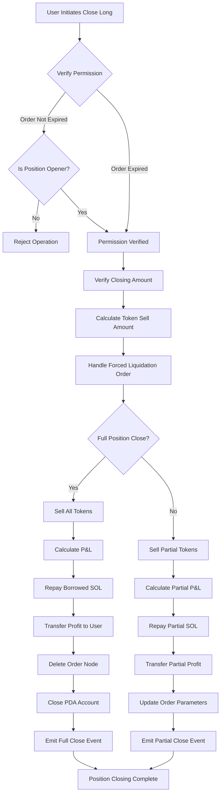
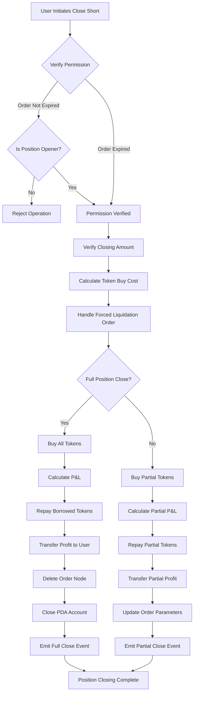

# 💼 PinPet Leverage Position Closing Feature Guide

## 1. 📋 Feature Overview

### 🤔 What is Position Closing?

Position closing refers to the operation where users close their leveraged trading positions. On the PinPet platform, when users open a position, a margin order is created to record the lending relationship and position information. The closing operation settles the order, repays the borrowed funds, and transfers the profit or loss to the user.

### 💡 Why Close Positions?

| Closing Reason | Description |
|---------|------|
| **🎯 Take Profit/Stop Loss** | User actively closes position to lock in profits or limit losses |
| **⏰ Order Expiration** | After expiration, anyone can trigger position closing to return borrowed resources |
| **💰 Fund Management** | Release margin and flexibly adjust trading strategies |
| **🛡️ Risk Control** | Avoid greater losses due to market volatility |

### 📊 Position Closing Types

- **🔚 Full Position Close**: Close the entire position at once, settling all profit and loss
- **✂️ Partial Position Close**: Close positions in batches, realize partial profits, and retain remaining positions

## 2. 📈 Close Long Position Feature (Close Long)

### 📝 Feature Description

Closing a long position is essentially a **token selling** operation. When users previously opened a long position, they borrowed SOL to buy tokens. When closing, they need to sell tokens to get SOL back to repay the loan.

### 🔄 Operation Flow Chart



### ⚙️ Key Parameter Description

| Parameter Name | Purpose | Example Value |
|---------|---------|--------|
| `sell_token_amount` | Desired token amount to sell (not exact, may have slight deviation) | 1000000 (1 token) |
| `min_sol_output` | Minimum SOL amount expected after selling (slippage protection) | 50000000 (0.05 SOL) |
| `prev_order_id` | Index position of previous order in linked list | 2 |
| `close_order_id` | Index of order to close in order array | 5 |
| `next_order_id` | Index position of next order in linked list | 7 |
| `close_order_address` | Address of closing order (for security verification) | "Abc123..." |

### 🧮 Profit and Loss Calculation

#### 🔚 Full Position Close Scenario

**Calculation Formula**:

```
Profit SOL = (SOL from Token Sale) + (Margin SOL) - (Borrowed SOL)
```

**Calculation Steps**:
1. Sell all held tokens to get SOL (fees already deducted)
2. Add the margin deposited when opening position
3. Subtract the SOL borrowed when opening position
4. Positive value is profit, negative value is loss

#### ✂️ Partial Position Close Scenario

**Calculation Formula**:

```
Current Profit = (Current Sale SOL) + (Total Margin) + (Remaining Token Future Sale SOL) - (Total Borrowed SOL)
```

**Calculation Steps**:
1. Calculate SOL obtained from selling tokens this time
2. Calculate SOL that remaining tokens can be sold for at new stop-loss price (after fees)
3. Total Assets = Current Proceeds + Margin + Remaining Proceeds
4. Subtract total loan to get partial profit
5. Repay partial loan, remaining margin continues holding position

### 💹 Profit and Loss Scenario Comparison

| Scenario | Opening Price | Closing Price | Held Tokens | Borrowed SOL | Margin | Sale Proceeds SOL | P&L Result |
|------|---------|---------|---------|---------|--------|-------------|---------|
| **🟢 Profit Scenario** | 0.05 SOL | 0.08 SOL | 100 Token | 5 SOL | 0.5 SOL | 8 SOL | +2.5 SOL |
| **🔴 Loss Scenario** | 0.05 SOL | 0.03 SOL | 100 Token | 5 SOL | 0.5 SOL | 3 SOL | -1.5 SOL |
| **⚖️ Break-even Scenario** | 0.05 SOL | 0.055 SOL | 100 Token | 5 SOL | 0.5 SOL | 5.5 SOL | 0 SOL |

## 3. 📉 Close Short Position Feature (Close Short)

### 📝 Feature Description

Closing a short position is essentially a **token buying** operation. When users previously opened a short position, they borrowed tokens and sold them to get SOL. When closing, they need to use SOL to buy back tokens to repay the loan.

### 🔄 Operation Flow Chart



### ⚙️ Key Parameter Description

| Parameter Name | Purpose | Example Value |
|---------|---------|--------|
| `buy_token_amount` | Desired token amount to buy | 1000000 (1 token) |
| `max_sol_amount` | Maximum SOL amount willing to pay (slippage protection) | 60000000 (0.06 SOL) |
| `prev_order_id` | Index position of previous order in linked list | 1 |
| `close_order_id` | Index of order to close in order array | 3 |
| `next_order_id` | Index position of next order in linked list | 6 |
| `close_order_address` | Address of closing order (for security verification) | "Def456..." |

### 🧮 Profit and Loss Calculation

#### 🔚 Full Position Close Scenario

**Calculation Formula**:

```
Profit SOL = (SOL from Opening Token Sale with Fees) - (SOL Spent Buying Back Tokens) - (Fees)
```

**Calculation Steps**:
1. Use SOL to buy back all borrowed tokens
2. Return borrowed tokens to lending pool
3. Calculate: Opening sale proceeds - Closing buy cost - Fees
4. Positive value is profit, negative value is loss

#### ✂️ Partial Position Close Scenario

**Calculation Formula**:

```
Current Profit = (Current Buyback Range with Fees) - (Actual Buyback Cost SOL) - (Buyback Fees)
```

**Calculation Steps**:
1. Calculate cost of buying back partial tokens this time (including fees)
2. Calculate cost of buying back remaining tokens in future (including fees)
3. Current Profit = Current Due - Actual Spent
4. Repay partial tokens, update order parameters
5. Remaining margin continues holding position

### 💹 Profit and Loss Scenario Comparison

| Scenario | Opening Price | Closing Price | Borrowed Tokens | Sale Proceeds SOL | Margin | Buyback Cost SOL | P&L Result |
|------|---------|---------|---------|-------------|--------|-------------|---------|
| **🟢 Profit Scenario** | 0.08 SOL | 0.05 SOL | 100 Token | 8 SOL | 0.5 SOL | 5 SOL | +2.5 SOL |
| **🔴 Loss Scenario** | 0.05 SOL | 0.08 SOL | 100 Token | 5 SOL | 0.5 SOL | 8 SOL | -2.5 SOL |
| **⚖️ Break-even Scenario** | 0.06 SOL | 0.06 SOL | 100 Token | 6 SOL | 0.5 SOL | 6 SOL | -0.06 SOL (fees) |

## 4. ⏰ Position Closing Timing and Strategies

### 🎯 Active Closing Timing

| Timing Type | Applicable Scenario | Suggested Strategy |
|---------|---------|---------|
| **📈 Take Profit Close** | Price reaches expected target | Partially close to lock in profits, keep remaining position |
| **🛑 Stop Loss Close** | Price breaks below stop-loss level | Fully close position promptly to control losses |
| **🔧 Position Adjustment** | Market trend changes | Reduce or increase position to optimize holding structure |
| **⏳ Close Before Expiration** | Approaching order expiration time | Actively close to avoid forced liquidation |

### ⚡ Passive Closing (Forced Liquidation)

**Trigger Conditions**:
- ⏰ Order expiration time has passed
- 👥 Any user can trigger liquidation
- 💵 Liquidator can receive certain fee rewards

**⚠️ Risk Warning**:
- 📉 May be forcibly closed at unfavorable prices after expiration
- 💡 Recommended to actively manage positions before expiration

## 5. 📖 Usage Scenario Examples

### 🟢 Scenario 1: Close Long Position with Profit

**Background**:
- User went long at 0.05 SOL price, bought 100 tokens
- Borrowed 4.5 SOL, deposited 0.5 SOL margin
- Current price rose to 0.08 SOL

**Operation**:
1. User decides to fully close position to lock in profits
2. Sell 100 tokens, get approximately 8 SOL (after fees)
3. Repay 4.5 SOL loan
4. Recover 0.5 SOL margin
5. Net profit: 8 - 4.5 + 0.5 (margin already counted when opening) = approximately 3 SOL

**✅ Result**: Successfully achieved 60% return

### 🔴 Scenario 2: Close Short Position with Stop Loss

**Background**:
- User went short at 0.05 SOL price, borrowed and sold 100 tokens, got 5 SOL
- Deposited 0.5 SOL margin
- Price rose to 0.08 SOL, hitting stop-loss price

**Operation**:
1. User urgently closes position with stop loss
2. Use 8 SOL to buy back 100 tokens (including fees)
3. Return 100 tokens to lending pool
4. Margin 0.5 SOL + Opening proceeds 5 SOL = 5.5 SOL available funds
5. Net loss: 5.5 - 8 = -2.5 SOL

**✅ Result**: Timely stop loss, avoided greater losses

### ✂️ Scenario 3: Partial Position Close for Adjustment

**Background**:
- User holds 200 tokens in long position
- Price has already risen 30%
- User wants to lock in partial profits but continue holding, optimistic about future

**Operation**:
1. Partially close 100 tokens
2. Repay partial SOL loan
3. Obtain partial profit transferred to account
4. Remaining 100 tokens continue holding
5. Order parameters updated, stop-loss price adjusted

**✅ Result**: Achieved flexible position management strategy

## 6. ⚠️ Precautions and Limitations

### 🚫 Operation Restrictions

| Restriction Type | Specific Requirements | Description |
|---------|---------|------|
| **🔐 Permission Verification** | Only position opener can close when order not expired | Protect user asset security |
| **💳 Settlement Address** | Must be position opener's wallet address | Funds can only return to original address |
| **📏 Minimum Trade Volume** | No less than 2x minimum trade volume for partial close | Avoid dust orders |
| **📊 Remaining Quantity** | After partial close, remaining not less than minimum trade volume | Ensure order validity |

### ⚠️ Risk Warnings

#### 📉 Slippage Risk
- Actual execution price when closing may deviate from expected
- Recommended to set reasonable slippage protection parameters
- Slippage impact is more significant for large position closes

#### 💸 Fee Costs
- Every closing incurs transaction fees
- Frequent closing increases costs
- Partial closing requires two fees (current + future full close)

#### ⏰ Time Risk
- Anyone can trigger closing after expiration
- May be liquidated at unfavorable prices
- Recommended to manage orders approaching expiration in advance

#### 🌊 Market Risk
- Rapid price volatility may lead to poor closing timing
- Extreme market conditions may result in liquidation
- Recommended to set reasonable stop-loss levels

### 💡 Best Practice Recommendations

1. **🛡️ Set Reasonable Stop Loss**: Plan stop-loss price when opening, strictly execute
2. **✂️ Close in Batches**: For large positions, suggest closing in batches to reduce market impact
3. **⏰ Monitor Expiration Time**: Actively manage orders approaching expiration 1-2 days in advance
4. **💰 Control Fees**: Avoid overly frequent partial closing operations
5. **📊 Monitor Market Depth**: Check market liquidity before large position closes

### 🔒 Technical Security Safeguards

- **✅ Address Verification**: Verify order address when closing to prevent operating wrong orders
- **🔐 Permission Check**: Multiple permission verifications to ensure only authorized users can operate
- **🛡️ Overflow Protection**: All numerical calculations use safe checked methods
- **⚛️ Atomic Operations**: All steps in closing process execute atomically to prevent state inconsistency

---

## 📚 Appendix: Terminology

| Term | Explanation |
|------|------|
| **PDA** | Program Derived Address, used to store order data |
| **Margin** | SOL deposited by user when opening position as risk guarantee |
| **Lending Pool** | Virtual pool providing leverage funds |
| **Stop Loss Price** | Price threshold where order is forcibly closed |
| **Fee Discount** | Fee benefits enjoyed after meeting conditions |
| **Forced Liquidation** | Mechanism where orders are automatically closed after expiration |
| **Linked List Node** | Position of order in linked list, used for efficient management of multiple orders |

---

*This document is a product feature guide and does not include technical implementation details. For technical implementation, please refer to project code and technical documentation.*
