# 📊 PinPet Leverage Trading Feature Introduction

## 1. Feature Overview 🎯

### What is Leverage Trading 💹

Leverage trading is a financial tool that uses borrowed funds to amplify trading scale, allowing users to control larger asset values with less margin. The PinPet platform provides both long and short leverage trading methods, enabling users to profit from both rising and falling token prices.

### Core Concepts 💡

- **Margin** 💰: The SOL funds invested by the user as collateral for trading
- **Borrow** 💵: Assets borrowed from the platform (borrow SOL for long, borrow tokens for short)
- **Stop Loss Price** 🛡️: When the price reaches this level, the system automatically closes the position to control risk
- **Close Position** 🔄: The operation of repaying the loan and settling profit/loss

### Leverage Types 📈📉

| Trading Type | Market Expectation | Borrowed Asset | Held Asset | Profit Condition |
|---------|---------|---------|---------|---------|
| Long 🟢 | Bullish ⬆️ | Borrow SOL | Hold Tokens | Token price rises |
| Short 🔴 | Bearish ⬇️ | Borrow Tokens | Hold SOL | Token price falls |

---

## 2. Long Trading 🟢📈

### Feature Description ✨

Going long means the user is bullish on the token's future price increase. By borrowing SOL from the platform to buy more tokens, they can sell the tokens after the price rises to repay the loan and profit.

### User Operation Flow 🔄


### Long Trading Flow Diagram 📋


### Key Parameter Description 📝

| Parameter Name | Description | Example Value | Constraints |
|---------|------|--------|---------|
| buy_token_amount | Desired token amount to buy | 1,000,000 (1 token) | Not less than min trade volume (1 token) |
| max_sol_amount | Maximum SOL willing to pay | 100,000,000 (0.1 SOL) | Actual may be less (slippage protection) |
| margin_sol_max | Maximum margin user willing to invest | 50,000,000 (0.05 SOL) | Not less than 0.03 SOL |
| close_price | Stop loss price (auto-close trigger) | 95% of current price | Must be below 97% of current price |
| borrow_amount | Actual borrow amount calculated by system | 50,000,000 (0.05 SOL) | Not exceeding lending pool reserve |
| position_asset_amount | Held token amount | 1,000,000 (1 token) | Equal to bought token amount |

### Margin Calculation Logic 🧮

The purpose of margin is to ensure the user can repay the loan when stop loss is triggered. The calculation formula is:

```
Actual Margin = Total Cost of Buying Tokens - Returns When Stop Loss is Triggered (After Fees)
```

**Example:**

Assuming current token price is 0.1 SOL/Token:

1. User wants to buy 1 token, needs approximately 0.1 SOL
2. User invests 0.05 SOL margin, borrows 0.05 SOL
3. Sets stop loss price at 0.095 SOL/Token (95% of current price)
4. System calculates: If selling 1 token at 0.095 price, after fees gets approximately 0.0945 SOL
5. Calculate margin: 0.1 - 0.0945 = 0.0055 SOL (actual required margin)
6. User's 0.05 SOL is greater than 0.0055 SOL, meets opening condition

### Risk Warning ⚠️

- **Stop Loss Trigger** 🛑: When token price drops to stop loss price, system automatically sells tokens to repay loan, user loses margin
- **Order Expiration** ⏰: After exceeding loan period (default 7 days) without closing, anyone can force close, user should close proactively as soon as possible
- **Borrowing Cost** 💸: Both opening and closing require fees (default 0.25%)

---

## 3. Short Trading 🔴📉

### Feature Description ✨

Going short means the user is bearish on the token's future price decline. By borrowing tokens from the platform and immediately selling them for SOL, they can buy back tokens at a lower price to repay the loan and profit.

### User Operation Flow 🔄


### Short Trading Flow Diagram 📋

```mermaid
sequenceDiagram
    participant User 👤
    participant PinPet Platform
    participant Liquidity Pool
    participant Lending Pool

    User->>PinPet Platform: Initiate Short (Margin + Trading Params)
    PinPet Platform->>PinPet Platform: Validate Trade Volume and Stop Loss Price
    PinPet Platform->>Lending Pool: Check if Lending Reserve is Sufficient
    Lending Pool-->>PinPet Platform: Confirm Tokens Can Be Borrowed

    PinPet Platform->>Liquidity Pool: Calculate SOL Obtainable from Selling Tokens
    Liquidity Pool-->>PinPet Platform: Return Calculation Results

    PinPet Platform->>PinPet Platform: Calculate Margin and Stop Loss Cost
    PinPet Platform->>PinPet Platform: Verify Margin is Sufficient

    PinPet Platform->>Liquidity Pool: Execute Sell Transaction (Borrow Tokens for SOL)
    Liquidity Pool-->>PinPet Platform: Return SOL

    User->>PinPet Platform: Transfer Margin
    User->>PinPet Platform: Pay Opening Fee

    PinPet Platform->>PinPet Platform: Create Margin Order (Record Borrow and Position)
    PinPet Platform->>Lending Pool: Reduce Available Token Reserve

    PinPet Platform-->>User: Opening Successful (Holding SOL, Waiting for Close)
```



### Key Parameter Description 📝

| Parameter Name | Description | Example Value | Constraints |
|---------|------|--------|---------|
| borrow_sell_token_amount | Token amount to borrow and sell | 1,000,000 (1 token) | Not less than min trade volume (1 token) |
| min_sol_output | Minimum SOL expected after selling | 90,000,000 (0.09 SOL) | Actual may be more (slippage protection) |
| margin_sol_max | Maximum margin user willing to invest | 50,000,000 (0.05 SOL) | Not less than 0.03 SOL |
| close_price | Stop loss price (auto-close trigger) | 105% of current price | Must be above 103% of current price |
| borrow_amount | Actual borrow amount calculated by system | 1,000,000 (1 token) | Not exceeding lending pool reserve |
| position_asset_amount | Held SOL amount | 95,000,000 (0.095 SOL) | Equal to SOL obtained from selling (after fees) |

### Margin Calculation Logic 🧮

The margin for shorting ensures the user can buy back tokens to repay the loan when stop loss is triggered. The calculation formula is:

```
Actual Margin = Buyback Cost at Stop Loss (With Fees) - Returns from Selling (After Fees)
```

**Example:**

Assuming current token price is 0.1 SOL/Token:

1. User borrows 1 token and sells it, after fees gets approximately 0.0975 SOL
2. Sets stop loss price at 0.105 SOL/Token (105% of current price)
3. System calculates: If buying back 1 token at 0.105 price, with fees needs approximately 0.1053 SOL
4. Calculate margin: 0.1053 - 0.0975 = 0.0078 SOL (actual required margin)
5. User needs to invest at least 0.0078 SOL as margin
6. User provides 0.05 SOL margin, greater than 0.0078 SOL, meets opening condition

### Risk Warning ⚠️

- **Stop Loss Trigger** 🛑: When token price rises to stop loss price, system automatically buys back tokens to repay loan, user loses margin
- **Unlimited Risk** ⛔: Theoretically token price can rise infinitely, short risk is greater than long
- **Order Expiration** ⏰: After exceeding loan period (default 7 days) without closing, anyone can force close
- **Borrowing Cost** 💸: Both opening and closing require fees (default 0.25%)

---

## 4. Leverage Trading Risk and Returns 📊💰

### Return Amplification Effect 📈💎

The core advantage of leverage trading is controlling larger asset scales with less principal, thereby amplifying returns.

**Long Profit Example:**

Assuming user invests 0.05 SOL margin to long 1 token:

| Scenario | Entry Price | Exit Price | Position Value | Repayment Amount | Net Profit | Return Rate |
|------|--------|--------|----------|----------|--------|--------|
| Small Gain | 0.1 | 0.11 | 0.11 SOL | 0.05 SOL | 0.06 SOL | +120% |
| Large Gain | 0.1 | 0.15 | 0.15 SOL | 0.05 SOL | 0.10 SOL | +200% |
| Small Loss | 0.1 | 0.095 | 0.095 SOL | 0.05 SOL | 0.045 SOL | -10% |
| Stop Loss Triggered | 0.1 | 0.095 | 0.095 SOL | 0.05 SOL | 0.045 SOL | -10% |

**Short Profit Example:**

Assuming user invests 0.05 SOL margin to short 1 token:

| Scenario | Entry Price | Exit Price | Position Value | Buyback Cost | Net Profit | Return Rate |
|------|--------|--------|----------|----------|--------|--------|
| Small Drop | 0.1 | 0.09 | 0.0975 SOL | 0.09 SOL | 0.0075 SOL | +15% |
| Large Drop | 0.1 | 0.05 | 0.0975 SOL | 0.05 SOL | 0.0475 SOL | +95% |
| Small Rise | 0.1 | 0.105 | 0.0975 SOL | 0.105 SOL | -0.0075 SOL | -15% |
| Stop Loss Triggered | 0.1 | 0.105 | 0.0975 SOL | 0.1053 SOL | -0.0078 SOL | -16% |

### Risk Factors ⚠️

#### 1. Price Volatility Risk 📉📈

- **Long Risk** 🟢: Token price drops below stop loss price, lose all margin
- **Short Risk** 🔴: Token price rises above stop loss price, lose all margin
- **Sharp Volatility** ⚡: Large price swings in short time may trigger rapid stop loss

#### 2. Liquidity Risk 💧

- **Lending Pool Depletion** 📛: If lending pool reserve is insufficient, cannot open position
- **Slippage Loss** 📊: Excessive trade volume may cause actual execution price to deviate from expected

#### 3. Time Risk ⏰

- **Order Expiration** 🔔: After exceeding 7 days without closing, anyone can force close, may be liquidated at unfavorable price
- **Holding Cost** 💸: Long-term holding bears time cost and market uncertainty

#### 4. System Risk 🔧

- **Price Calculation** 🧮: Based on constant product algorithm, large trades may face significant slippage
- **Fee Accumulation** 💰: Multiple open/close operations accumulate fees that erode profits

### Risk Control Measures 🛡️

PinPet platform provides multiple risk control mechanisms:


---

## 5. Use Case Examples 💼

### Scenario 1: Bullish Long Position 🟢⬆️

**Background** 📖: Xiao Ming sees an upward trend in a Meme token, current price 0.1 SOL

**Operation Steps** 🎯:
1. Xiao Ming invests 0.1 SOL margin
2. Borrows 0.1 SOL (platform lends to Xiao Ming)
3. Uses total 0.2 SOL to buy 2 tokens
4. Sets stop loss price at 0.095 SOL (auto stop loss if drops below)

**Profit Scenario** 💰📈: Token rises to 0.15 SOL
- Sells 2 tokens for 0.3 SOL (after fees approximately 0.2985 SOL)
- Repays loan 0.1 SOL, remaining 0.1985 SOL
- Minus margin 0.1 SOL, net profit 0.0985 SOL (approximately +98.5%)

**Stop Loss Scenario** 🛑📉: Token drops to 0.095 SOL (triggers stop loss)
- Auto sells 2 tokens for 0.19 SOL (after fees approximately 0.1895 SOL)
- Repays loan 0.1 SOL, remaining 0.0895 SOL
- Loss of margin 0.1 - 0.0895 = 0.0105 SOL (approximately -10.5%)

### Scenario 2: Bearish Short Position 🔴⬇️

**Background** 📖: Xiao Hong thinks a token is overpriced, current price 0.2 SOL, prepares to short

**Operation Steps** 🎯:
1. Xiao Hong invests 0.15 SOL margin
2. Borrows 1 token (platform lends to Xiao Hong)
3. Immediately sells 1 token for 0.2 SOL (after fees approximately 0.195 SOL)
4. Sets stop loss price at 0.21 SOL (auto stop loss if rises above)

**Profit Scenario** 💰📉: Token drops to 0.15 SOL
- Uses 0.15 SOL to buy back 1 token (with fees approximately 0.1504 SOL)
- Repays loan 1 token
- Remaining 0.195 - 0.1504 = 0.0446 SOL
- Plus margin 0.15 SOL, total 0.1946 SOL (net profit 0.0446 SOL, approximately +29.7%)

**Stop Loss Scenario** 🛑📈: Token rises to 0.21 SOL (triggers stop loss)
- Auto uses 0.21 SOL to buy back 1 token (with fees approximately 0.2105 SOL)
- Repays loan 1 token
- Spent 0.2105 SOL, but only received 0.195 SOL from selling
- Loss 0.0155 SOL, deducted from margin (approximately -10.3%)

### Scenario 3: Swing Trading 🔄📊

**Background** 📖: Xiao Gang is good at short-term trading, operating repeatedly when token price fluctuates in 0.08 - 0.12 SOL range

**Strategy** 🎯:
- Go long when price approaches 0.08 SOL, set stop loss at 0.075 SOL
- Go short when price approaches 0.12 SOL, set stop loss at 0.125 SOL
- Actively close position when profit reaches 5-10% each time

**Advantages** ✅: Use leverage to amplify range fluctuation returns

**Risks** ⚠️: May trigger stop loss when breaking out of range, need strict discipline

---

## 6. Precautions and Limitations 📌

### Trading Restrictions 🔒

| Restriction Item | Value | Description |
|---------|------|------|
| Minimum Trading Token Volume | 1 Token (1,000,000 minimum units) | Prevent excessively small trade volume |
| Minimum Margin | 0.03 SOL (30,000,000 lamports) | Ensure meaningful trading scale |
| Long Stop Loss Price | Below 97% of current price | At least 3% stop loss buffer |
| Short Stop Loss Price | Above 103% of current price | At least 3% stop loss buffer |
| Maximum Loan Period | 7 days (604,800 seconds) | Can be force closed after expiration |
| Lending Pool Limit | Dynamically adjusted based on liquidity pool scale | Reject trade if reserve insufficient |

### Fee Description 💸

**Fee Types** 📊:
- Opening Fee: Default 0.25% (borrow_fee)
- Closing Fee: Default 0.25% (borrow_fee)
- Fee Distribution: Partners and technology providers share proportionally

**Fee Calculation** 🧮:
- Long Opening: Fee charged on buy SOL amount
- Short Opening: Fee charged on sell SOL amount
- Closing: Fee charged on trade amount

### Best Practice Recommendations 💡

#### 1. Set Stop Loss Reasonably 🛡️

- **Don't Be Too Greedy**: Stop loss price should not be set too close (near 3% lower limit)
- **Leave Buffer Space**: Consider short-term volatility, 5-10% stop loss buffer is safer
- **Take Profit Timely**: Actively close position after profit reaches expectation, don't wait for forced close

#### 2. Control Position Size 📊

- **Diversify Investment** 🎯: Don't put all funds into a single order
- **Gradually Build Position** ➡️: Can open multiple small positions to reduce single risk
- **Reserve Funds** 💰: Keep some funds for additional margin needs (future feature)

#### 3. Choose Right Timing ⏰

- **Sufficient Liquidity** 💧: Open position when lending pool reserve is sufficient
- **Avoid Sharp Volatility** ⚡: Easy to trigger stop loss during large price swings
- **Monitor Expiration Time** 🔔: Expected holding time should not approach 7-day limit

#### 4. Monitor Order Status 👀

- **Check Regularly** 🔍: Check order status at least once daily
- **Price Alert** 🚨: Make timely decisions when price approaches stop loss
- **Active Close** ✅: Don't wait for system auto stop loss, active closing avoids slippage

### Frequently Asked Questions ❓

**Q1: Will margin be refunded?**

A: Yes. When actively closing, if profitable, margin plus profit will be refunded together; if stop loss triggered, remaining margin will be refunded (may be zero).

**Q2: Can I close early?**

A: Yes. Before order expires, users can actively close anytime without additional penalty.

**Q3: What happens after order expires?**

A: After order expires, anyone can trigger force close. Recommended to actively close before expiration to avoid liquidation at unfavorable price.

**Q4: What if lending pool reserve is insufficient?**

A: If lending pool reserve is insufficient, system will reject opening. Recommended to wait for other users to close positions to release reserve, or choose other trading pairs.

**Q5: How are fees calculated?**

A: Fees are charged as a percentage of trade amount (default 0.25%). Charged once each for opening and closing, total approximately 0.5% cost.

**Q6: Can I adjust stop loss price?**

A: Current version does not support adjusting stop loss price. Recommended to carefully set stop loss price when opening.

---

## 7. Summary 📝

PinPet leverage opening function provides users with flexible long and short tools, enabling profit whether token rises or falls. Through reasonable use of margin and stop loss mechanisms, users can amplify returns while controlling risk.

**Core Advantages** ✨:
- **Two-way Trading** 🔄: Profit from both long and short
- **Leverage Amplification** 📈: Small capital leverages large returns
- **Automatic Stop Loss** 🛡️: Price protection mechanism reduces risk
- **Flexible Closing** ✅: Settle anytime actively

**Risk Warning** ⚠️:
- ⛔ Leverage trading has high risk, may lose all margin
- 📚 Please fully understand trading mechanism before operating
- 💡 Recommended to start with small amounts, gradually accumulate experience
- 🚫 Never invest funds beyond your ability to bear

Wish you successful trading! 🎉
