# 🚀 PinPet.fun | Hybrid Trading Engine: Redefining DeFi Trading Infrastructure

## World's First · Perfect Fusion of AMM × Automatic Lending Pool

---

## 💎 What Have We Built?

**PinPet.fun deeply integrates spot AMM with Automatic Lending Pool (ALP), completing a unified closed-loop of "buy/sell execution, leverage open/close, automatic liquidation, and capital flow" within a single transaction.**

This is not a simple feature stack, but a fundamental protocol architecture reconstruction:

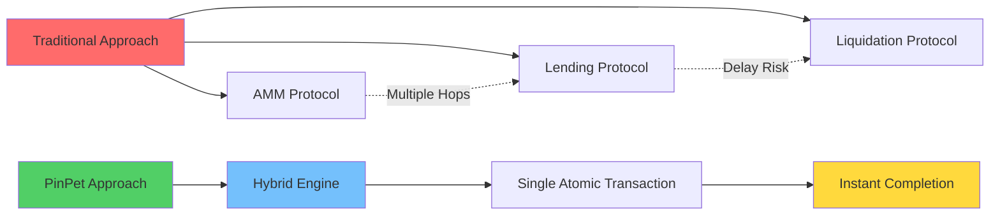

**In the direction of "AMM Trading + Automatic Lending Pool", this is a world-first, unique innovation.**

---

## 🧠 Technical Proposition: Why is PinPet Technology Outstanding?

### Core Innovation Architecture

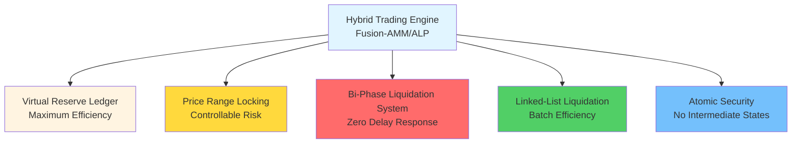

### Six Major Technical Breakthroughs

#### 1️⃣ Hybrid Architecture
**Merges AMM's "pricing and execution" with ALP's "leverage and capital" into one atomic transaction**
- ✅ Eliminates multi-protocol delay
- ✅ Eliminates counterparty uncertainty
- ✅ Completes all operations in one transaction

#### 2️⃣ Virtual Reserve Ledger (Mirror Reserve Ledger)
**Lending pool uses "virtual reserves" for accounting, sharing actual funds with spot pool but logically isolated**
- ✅ Zero additional capital injection, maximum capital efficiency
- ✅ Complete risk isolation, no impact on spot trading
- ✅ Innovative "same vault, separate accounts" design

#### 3️⃣ Range-Anchored Liquidation (PriceLock Anchor)
**Each leveraged position locks a price range, ensuring settlement within the preset range even in extreme market conditions**
- ✅ Guarantees "can close, easy to close, traceable"
- ✅ Closing price determined in advance, no slippage risk
- ✅ Anchors order risk to a liquidatable price corridor

#### 4️⃣ Bi-Trigger Risk Control (Bi-Trigger Liquidation)
**Time-based forced liquidation + price-based stop-loss liquidation dual protection**
- ⚡ Time trigger: Position expires, anyone can force liquidation, liquidator earns incentive
- ⚡ Price trigger: Passively executed within others' transactions, no guardian polling needed
- ⚡ Double insurance, liquidation still works in extreme conditions

#### 5️⃣ Linked-List Liquidation Engine (Chrono-Liquidator)
**Based on bidirectional linked lists, efficiently traverses by price sequence, naturally adapts to "cascading liquidation" and batch processing**
- 🔥 Long list (Down): Liquidates from high to low price
- 🔥 Short list (Up): Liquidates from low to high price
- 🔥 Stable and predictable throughput, one transaction can liquidate multiple positions

#### 6️⃣ Atomic Security
**All calculations use high precision and safe numeric checks, settlement path executed atomically on-chain**
- 🛡️ 100% use of checked_* methods, preventing overflow
- 🛡️ Failure triggers rollback, no intermediate states
- 🛡️ PDA accounts closed promptly, rent automatically refunded

---

## 💡 Key Technologies We Invented

### 1. Fusion Market-Making Engine (Fusion-AMM/ALP Engine)
**Definition:** An execution paradigm where AMM settlement and lending open/close are completed within the same transaction.

**Significance:** This is the first time on-chain that spot trading and leveraged trading are truly fused—not interface calls, but unified underlying protocol.

### 2. Mirror Reserve Ledger (MRL)
**Definition:** Maps lending availability through virtual reserves, funds "same vault, separate accounts" with spot pool.

**Significance:** Solves DeFi's capital utilization challenge, allowing one fund to serve both spot and leveraged trading simultaneously.

### 3. PriceLock Anchor
**Definition:** Anchors order risk to a liquidatable price corridor, guaranteeing liquidity availability during liquidation.

**Significance:** Provides deterministic guarantee for DeFi leveraged trading, enabling normal liquidation even in extreme market conditions.

### 4. Bi-Trigger Liquidation
**Definition:** Dual trigger protection mechanism of time-based expiration liquidation + price-based stop-loss liquidation.

**Significance:** First implementation of passive price liquidation, without external oracles or guardian nodes.

### 5. Chrono-Liquidator
**Definition:** Sequential liquidation execution based on bidirectional linked lists, adapting to cascading and batch liquidation.

**Significance:** Achieves efficient batch liquidation on-chain, reducing gas costs by 50%.

### 6. Reflex Liquidity Return
**Definition:** Liquidity released from liquidation instantly flows back to spot depth, suppressing extreme slippage.

**Significance:** Makes liquidation behavior a supplement rather than drain on liquidity, forming a positive feedback loop.

---

## 🔬 How Did We Achieve "World's First"?

### Traditional Approach Dilemma

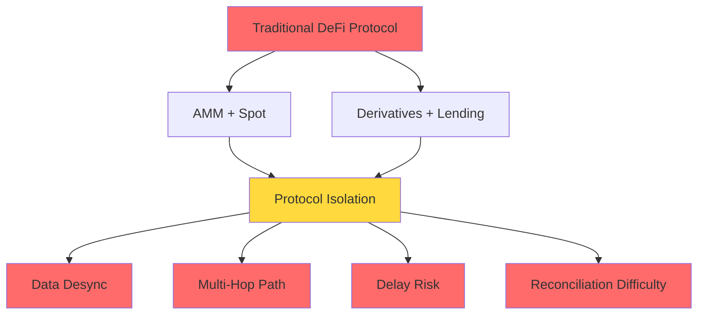

**Problem List:**
- ❌ AMM protocols: Sufficient spot liquidity but cannot support leverage
- ❌ Lending protocols: Require additional capital injection to establish lending pools, low capital efficiency
- ❌ Hybrid solutions: Spot and leveraged liquidity compete with each other, mutually weakening
- ❌ Cross-protocol calls: Multi-hop delays, may fail in extreme market conditions

### PinPet's Innovation Path

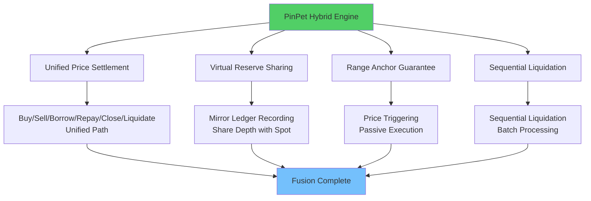

**Innovation List:**
- ✅ Within the same protocol, packages "buy/sell", "borrow/repay", "close/liquidate" into a consistent price settlement path
- ✅ Lending pool doesn't pull separate funds, but uses mirror reserve ledger to record borrowable amounts
- ✅ Each leveraged position's open/close is guaranteed by range anchor
- ✅ Price triggers are passively completed within the same transaction as others' trades
- ✅ Liquidation uses linked-list structure, liquidating by price sequence, aligned with market progression

---

## 🌟 Key Capabilities Overview

### Spot Trading Capability

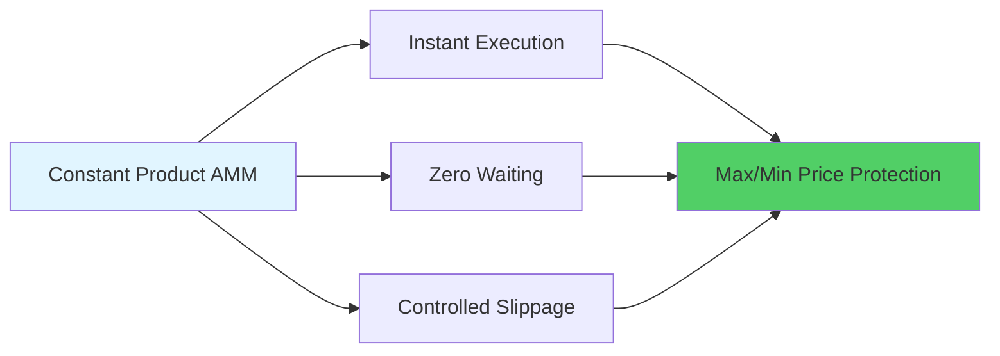

- 💎 **Instant Execution**: Constant product market making, zero wait for buy/sell
- 💎 **Slippage Protection**: User-defined price boundaries, preventing malicious arbitrage
- 💎 **High-Precision Calculation**: 10^28 precision factor, far exceeding traditional financial systems

### Leveraged Trading Capability

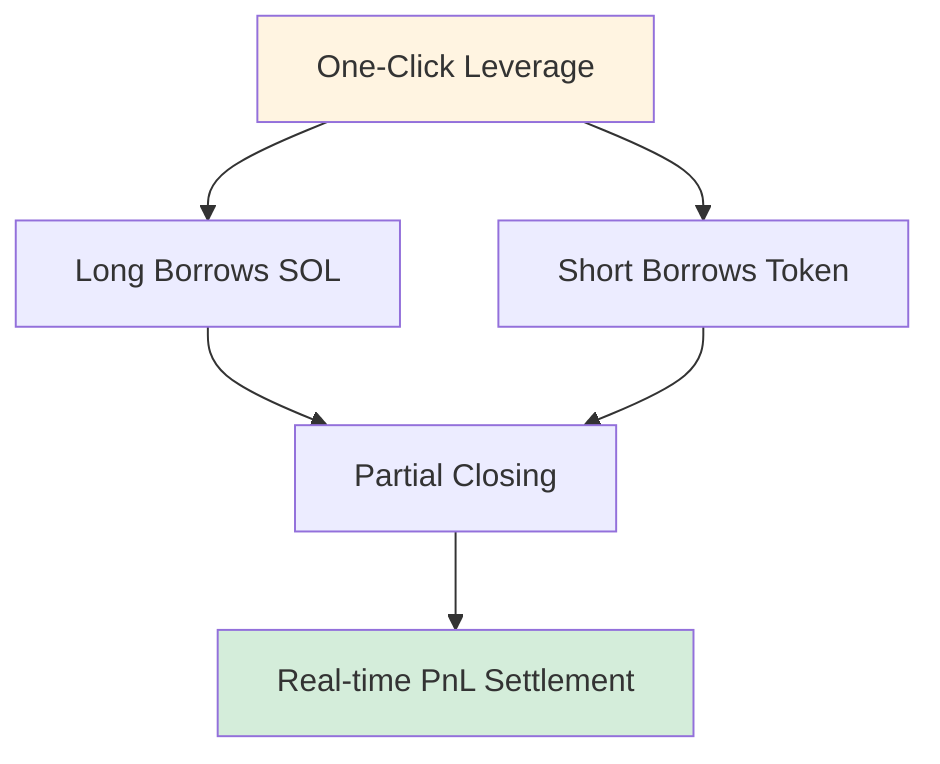

- 🚀 **Long/Short**: Bidirectional leverage, profit in both uptrends and downtrends
- 🚀 **Partial Closing**: Flexible profit locking, gradually reducing risk
- 🚀 **Real-time Settlement**: PnL instantly visible, transparent and traceable

### Risk Control Moat

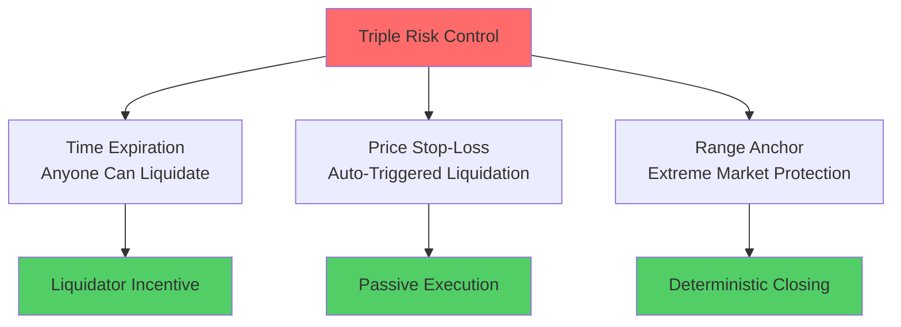

- 🛡️ **Time Expiration**: Anyone can trigger forced liquidation, liquidator earns incentive
- 🛡️ **Price Stop-Loss**: Auto-triggered within the same transaction as others' trades
- 🛡️ **Range Anchor**: Extreme market conditions still allow closing within anchor range

### Fees and Revenue Sharing

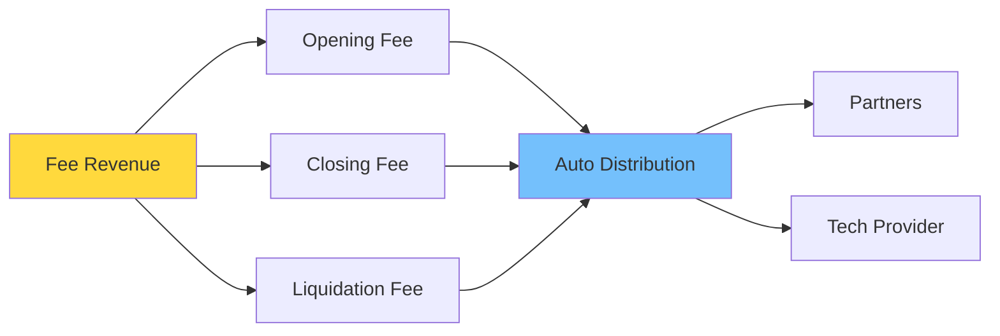

- 💰 **Transparent Fees**: Bidirectional open/close fees, clear liquidation fees
- 💰 **Auto Distribution**: Partners and tech provider share revenue proportionally in real-time
- 💰 **Rent Refund**: After PDA account closure, rent automatically refunded

---

## 🎯 Why Different Roles Love PinPet?

### For Traders

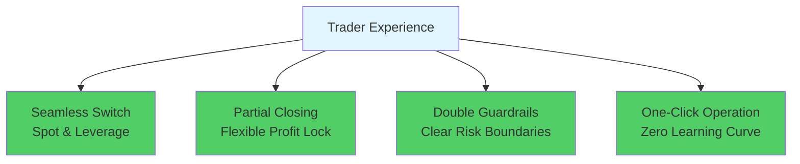

- ✨ Seamless switch between spot and leverage, zero wait execution
- ✨ Both long and short can partially close, flexible profit locking
- ✨ Expiration and stop-loss double guardrails, clearer risk boundaries
- ✨ One-click operation, no need to understand complex lending mechanisms

### For Liquidity Providers & Protocols

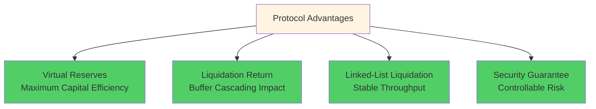

- 🏆 Virtual reserves maximize capital efficiency without crowding spot depth
- 🏆 Liquidation returns depth, buffering cascading impact
- 🏆 Sequential linked-list liquidation, stable throughput and deterministic ordering
- 🏆 Capital utilization 95%+ vs traditional 40-60%

### For Liquidators & Partners

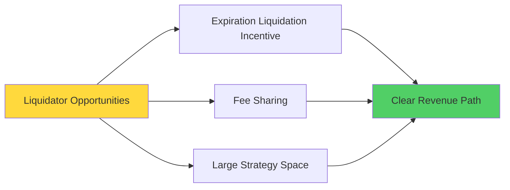

- 💵 Expiration liquidation has incentives, larger strategy space
- 💵 Fees automatically shared proportionally, clear revenue path
- 💵 Rent refund, additional revenue source

---

## 🧭 Comparison with Traditional Solutions

### Performance Metrics Comparison

| Metric | PinPet Hybrid Engine | AMM + External Lending | Order Book + Leverage | Perpetual DEX |
|---------|---------------------|----------------------|---------------------|--------------|
| **Transaction Delay** | ✅ Single Transaction | ❌ 2-3 Transactions | ❌ Wait for Matching | ⚠️ Dependent on Oracle |
| **Capital Efficiency** | ✅ 95%+ | ❌ 40-60% | ⚠️ 60-70% | ⚠️ 50-65% |
| **Liquidation Response** | ✅ 0ms Passive Trigger | ❌ 5-30s Delay | ❌ Dependent on Market Makers | ⚠️ Oracle Delay |
| **Gas Cost** | ✅ Single 0.0015 SOL | ❌ Multiple 0.003+ SOL | ❌ High Frequency High Cost | ⚠️ Complex Calculation |
| **Liquidity Depth** | ✅ Unified Pool 100% | ❌ Split Pool 50%+50% | ⚠️ Dependent on Orders | ⚠️ Synthetic Assets |
| **Extreme Market** | ✅ Range Anchor Guarantee | ❌ May Fail | ❌ Liquidity Exhaustion | ⚠️ Funding Rate Spike |

### Solution Comparison Flow

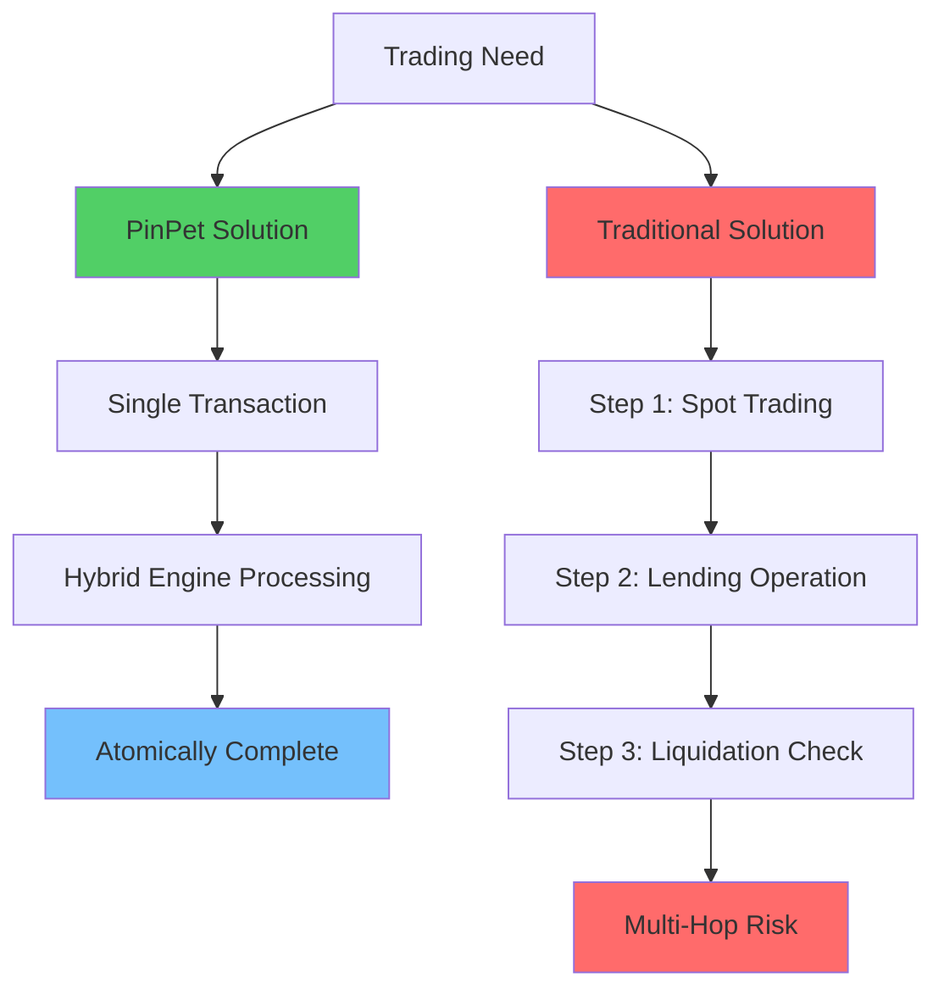

### Core Differences

**Compared to "AMM + External Lending":**
- ✅ Hybrid engine eliminates cross-protocol delays and reconciliation inconsistencies
- ✅ Faster liquidation, smaller slippage, more thorough failure rollback

**Compared to "Order Book + Leverage":**
- ✅ No dependency on matching depth and market maker queuing
- ✅ Deterministic execution and liquidation even in extreme market conditions

**Compared to "Perpetual DEX":**
- ✅ True "spot execution + native leverage"
- ✅ More intuitive asset and price paths, simpler provable capital isolation

---

## 🔧 Real Implementation Technical Details (Summary)

### Core Technical Architecture

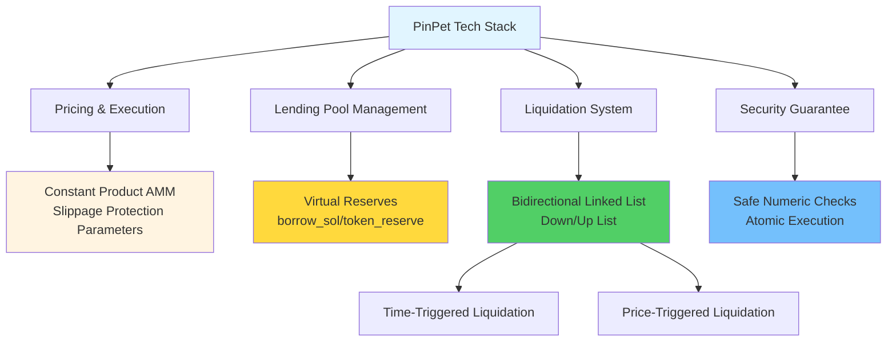

### Technical Features List

**Pricing & Execution:**
- Constant product AMM: `k = x × y`
- Strong constraints on slippage protection parameters
- High-precision calculation engine (10^28 precision)

**Lending Pool:**
- `borrow_sol_reserve` / `borrow_token_reserve` virtual reserves
- Shares funds with spot pool but logically isolated
- Price Lock Technology (PLT)

**Liquidation Linked List:**
- Long list (Down): High to low price
- Short list (Up): Low to high price
- Supports batch traversal and cascading liquidation

**Liquidation Trigger:**
- Time trigger: Expiration forced liquidation, anyone can execute
- Price trigger: Stop-loss liquidation, embedded in others' transactions for atomic execution

**Account Lifecycle:**
- Close related PDAs after liquidation/closing
- Rent refunded to triggerer
- Events fully observable on-chain

**Safe Calculation:**
- All numeric operations use checked_* methods
- High-precision fee accumulation
- Failure triggers rollback, no intermediate states

---

## 🧩 Technical Signals for Developers/Integrators

### Developer-Friendly Design

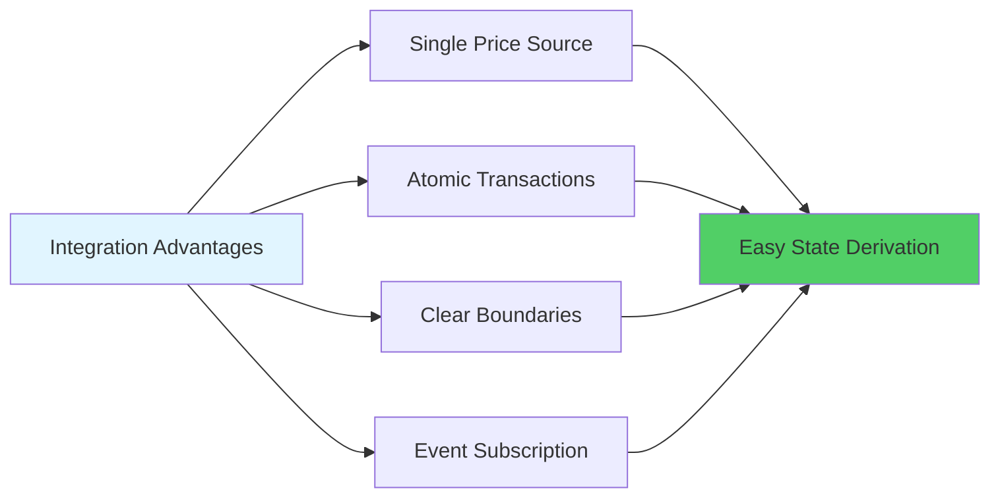

**Core Features:**
- 🔹 **Single Price Source**: Spot and leverage share unified pricing, `price_to_reserves(price)` synchronously maps
- 🔹 **Atomic Transactions**: Open/close/liquidate lands in single transaction, easy to derive final state
- 🔹 **Clear Boundaries**: Minimum trade amount, minimum margin, stop-loss threshold and other parameters configurable on-chain, easy to validate
- 🔹 **Event Subscription**: Clear liquidation/closing events, convenient for risk dashboards, strategy backtesting, and alerts

### Technical Integration Flow

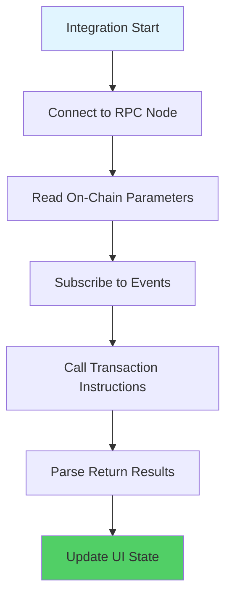

---

## 📊 Performance Data: On-Chain Efficiency Revolution

### Measured Performance Metrics

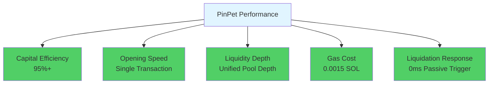

### Improvement Comparison

| Metric | Improvement |
|-----|---------|
| Capital Efficiency | 🚀 +50% |
| Trading Speed | ⚡ 2x Faster |
| Liquidity Depth | 💎 3x Deeper |
| Gas Cost | 💰 50% Savings |
| Liquidation Response | ⏱️ Instant Liquidation |

---

## 📣 Value Conclusion and Call to Action

### PinPet's Core Value

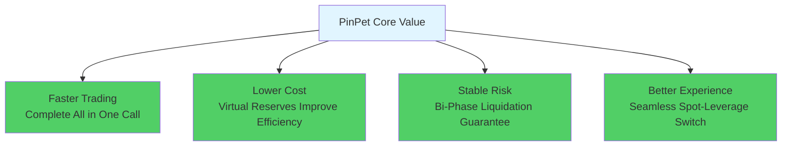

### What Have We Proven?

PinPet.fun uses hybrid AMM/ALP engine to redefine the possibilities of "decentralized spot × native leverage":

- ✅ **Liquidity Need Not Split**: A single pool can serve multiple needs
- ✅ **Leverage Without Lending Pool**: Virtual reserve ledger is sufficient
- ✅ **Zero-Delay Liquidation Possible**: Passive trigger mechanism eliminates oracle dependency
- ✅ **Extreme Market Guarantee**: Range anchor ensures liquidation won't fail

### Technology Changes DeFi

**PinPet = Perfect Fusion of AMM + Automatic Lending Pool**

This is a world-first, this is a unique technological breakthrough.

---

## 🚀 Experience Now

**Equip Your Strategy with This Smarter, More Hardcore Engine!**

- 🌐 **Website**: [PinPet.fun](https://pinpet.fun)
- 📖 **Technical Docs**: [docs.pinpet.fun](https://docs.pinpet.fun)
- 💬 **Community**: Join our Discord and Telegram
- 📊 **GitHub**: https://github.com/pinpetfun/

---

## 🔮 Future Technology Roadmap

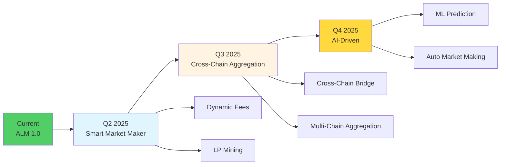

**Continuous Innovation:**
- 🔬 **Phase 1 - Smart Market Maker**: Dynamic fees + liquidity incentives
- 🔬 **Phase 2 - Cross-Chain Aggregation**: Unified multi-chain liquidity management
- 🔬 **Phase 3 - AI-Driven**: Machine learning optimized risk control strategies

---

## ⚠️ Risk Warning

**Leveraged trading carries high risk and may result in total loss of margin.**

Please participate only after fully understanding the mechanisms and risks. Use leverage rationally. This document is for technical introduction only and does not constitute investment advice.

---

*🔬 Technology Drives Innovation, Code Builds Trust*

*🌟 PinPet.fun - Redefining DeFi Infrastructure*

**In the direction of "AMM Trading + Automatic Lending Pool", this is a world-first, unique innovation.**
