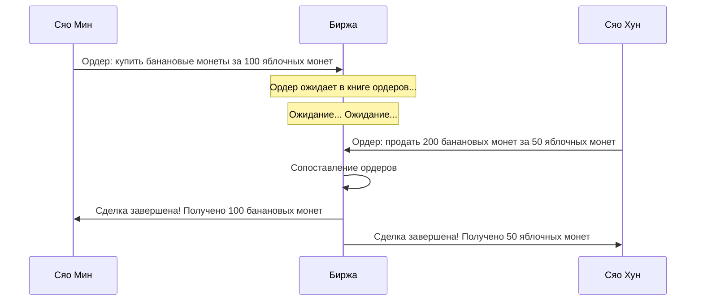
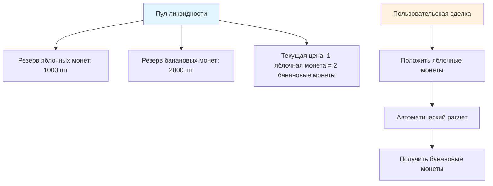
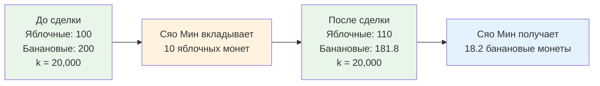
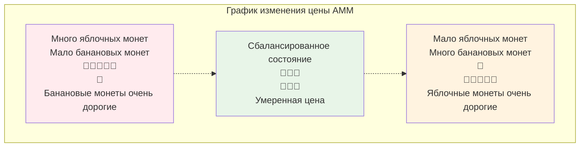
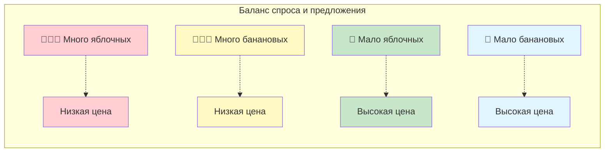
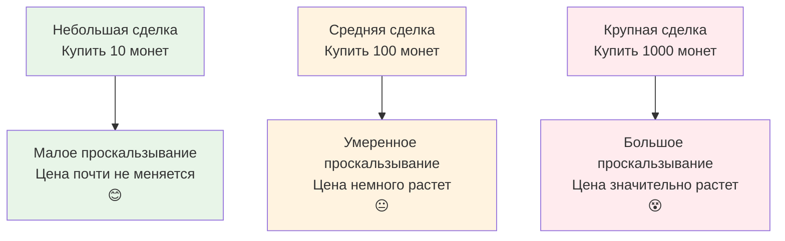
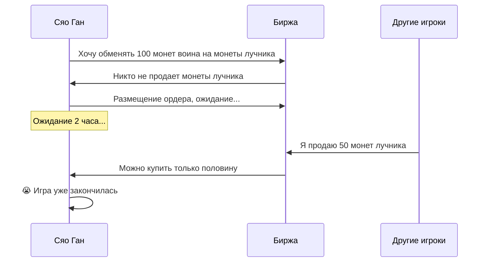
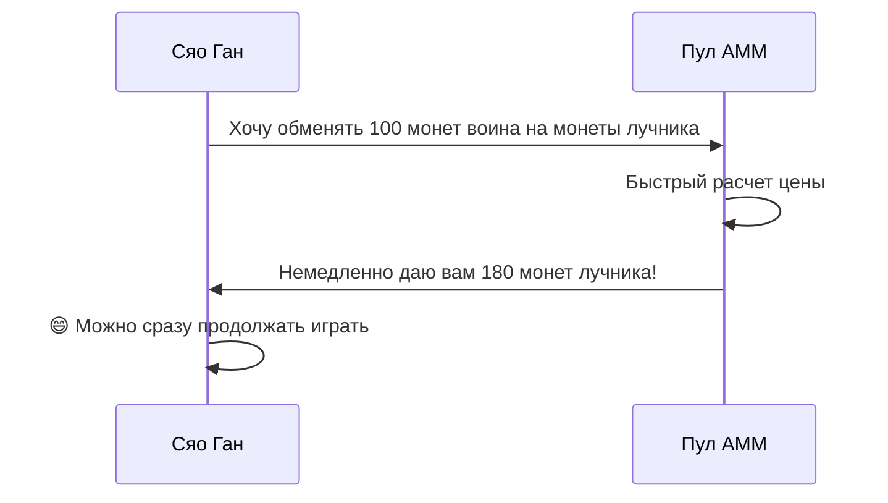
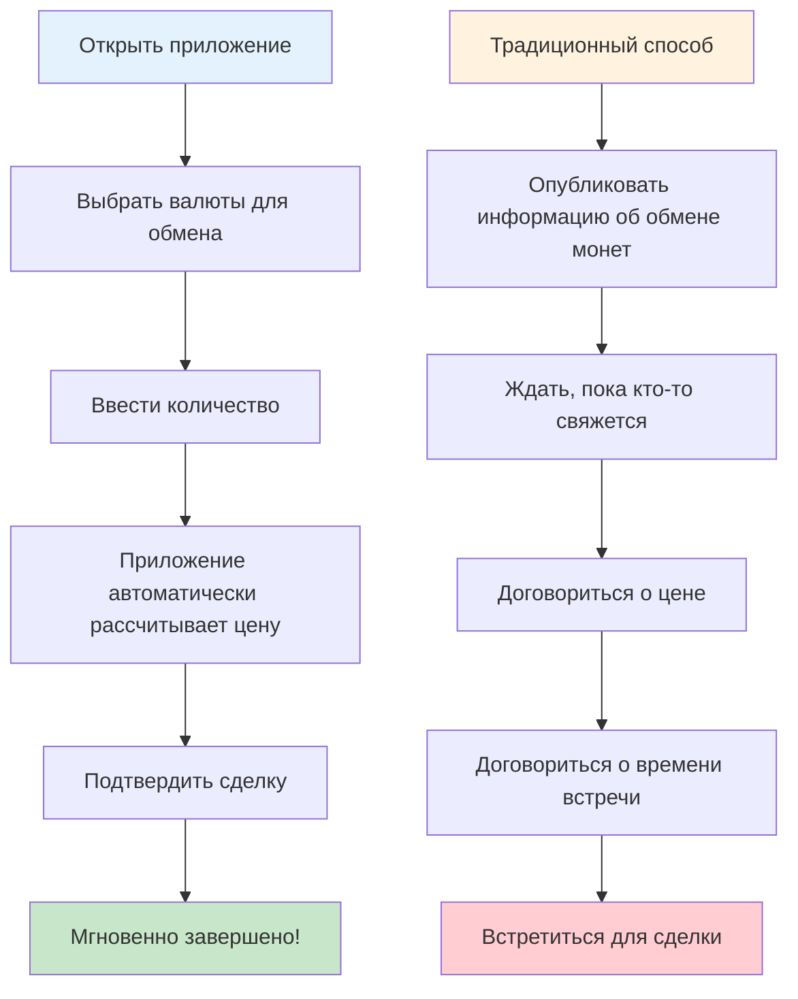

# Руководство по механизму AMM - понимание автоматического маркет-мейкера с нуля

## Содержание
1. [Что такое AMM?](#что-такое-amm)
2. [История традиционных бирж](#история-традиционных-бирж)
3. [Волшебный мир AMM](#волшебный-мир-amm)
4. [Упрощенная версия математических принципов](#упрощенная-версия-математических-принципов)
5. [Визуализация принципа работы AMM](#визуализация-принципа-работы-amm)
6. [Что такое проскальзывание?](#что-такое-проскальзывание)
7. [Зачем использовать AMM?](#зачем-использовать-amm)
8. [Анализ практических случаев](#анализ-практических-случаев)
9. [Заключение](#заключение)

---

## Что такое AMM?

Представьте, что вы хотите обменять яблоки на бананы, но не можете найти человека, которому нужны именно яблоки. Теперь, если существует «волшебная соковыжималка», вы кладете в нее яблоки, и она автоматически дает вам соответствующее количество бананов - это и есть базовая концепция AMM (автоматического маркет-мейкера)!

**AMM = Automated Market Maker (автоматический маркет-мейкер)**

Проще говоря, AMM - это умный, никогда не отдыхающий «торговый робот», который позволяет вам в любое время и в любом месте обменивать различные токены, не дожидаясь, пока кто-то другой захочет торговать с вами.

---

## История традиционных бирж

### 📖 Торговые проблемы Сяо Мина

Сяо Мин хочет обменять свои 100 яблочных монет на несколько банановых монет. На традиционной бирже:

1. **Размещение ордера и ожидание**: Сяо Мин размещает ордер «Я хочу купить банановые монеты за 100 яблочных монет по цене 1:2»
2. **Ожидание покупателя**: Сяо Мин должен дождаться, пока кто-то захочет продать банановые монеты по подходящей цене
3. **Возможно долгое ожидание**: Если никто не захочет продавать, Сяо Мин может ждать несколько часов или даже дней
4. **Колебания цен**: Во время ожидания цена может измениться, Сяо Мин может упустить лучший момент

### Проблемы традиционных бирж:
- ⏰ **Необходимость ожидания**: Нужно ждать, пока кто-то согласится торговать
- 📊 **Недостаточная ликвидность**: Непопулярные токены сложно торговать
- 💰 **Нестабильность цен**: Крупные ордера легко вызывают резкие колебания цен
- 🌙 **Временные ограничения**: У бирж есть часы работы

---

## Волшебный мир AMM

### 🏪 Волшебный автоматический магазин

Теперь представьте, что есть волшебный автоматический магазин (AMM), который работает следующим образом:

1. **Работает круглосуточно**: Работает 24 часа, никогда не закрывается
2. **Мгновенные сделки**: Что бы вы ни хотели, вы можете купить это немедленно
3. **Автоматическое ценообразование**: Цены автоматически корректируются в зависимости от запасов
4. **Без ожидания**: Не нужно ждать других покупателей

### 🏦 Пул ликвидности = Супер склад

Ядром AMM является «пул ликвидности», похожий на огромный двухсекционный склад:

### 🤖 Робот автоматического ценообразования

У AMM есть супер умный робот ценообразования, который следует простому правилу:

**🔢 Волшебная формула: Количество яблочных монет × Количество банановых монет = Постоянное значение (k)**

Эта формула гарантирует:
- Чем больше людей покупают, тем выше цена
- Чем больше людей продают, тем ниже цена
- Всегда есть запасы для покупки и цена для продажи

---

## Упрощенная версия математических принципов

### 🧮 Формула постоянного произведения

Не пугайтесь «математики» - это действительно просто!

Предположим, что в нашем волшебном складе есть:
- Яблочных монет: 100 шт
- Банановых монет: 200 шт
- Волшебное число k = 100 × 200 = 20,000

**Правило: Независимо от торговли, значение k должно оставаться неизменным - 20,000!**

### 📊 Пример сделки

**Сяо Мин хочет обменять 10 яблочных монет на банановые монеты:**

1. **До сделки**:
   - Яблочных монет: 100 шт
   - Банановых монет: 200 шт
   - k = 100 × 200 = 20,000

2. **Сяо Мин вкладывает 10 яблочных монет**:
   - Новое количество яблочных монет: 100 + 10 = 110 шт
   - Необходимо сохранить k = 20,000
   - Итак: 110 × Новое количество банановых монет = 20,000
   - Новое количество банановых монет = 20,000 ÷ 110 = 181.8 шт

3. **Сяо Мин получает**:
   - Банановых монет: 200 - 181.8 = 18.2 шт
   - Обменял 10 яблочных монет на 18.2 банановые монеты

---

## Визуализация принципа работы AMM

### 🎢 График ценовой кривой

Изменение цены AMM похоже на американские горки, следующее специальной кривой:

### 📈 График спроса и предложения

Представьте две стороны весов:

---

## Что такое проскальзывание?

### 🛒 Аналогия с покупками в супермаркете

Представьте, что вы идете в супермаркет покупать яблоки:

**Традиционный супермаркет (централизованная биржа):**
- Цена: 5 юаней/цзинь
- Купить 1 цзинь: 5 юаней
- Купить 100 цзинь: все еще 5 юаней/цзинь
- Но может не хватить запасов!

**Волшебный супермаркет (AMM):**
- 1-й цзинь: 5 юаней
- 2-й цзинь: 5.1 юаней (запасы уменьшаются, цена растет)
- 3-й цзинь: 5.2 юаней
- Чем больше покупаете, тем быстрее растет цена!

### 📊 График влияния проскальзывания

### 🎯 Пример расчета проскальзывания

Предположим, в пуле есть 1000 яблочных монет и 2000 банановых монет:

1. **Купить 10 банановых монет**: проскальзывание около 0.25%
2. **Купить 100 банановых монет**: проскальзывание около 2.5%
3. **Купить 500 банановых монет**: проскальзывание около 14%

**Вывод: Чем больше покупаете, тем выше средняя цена за монету!**

---

## Зачем использовать AMM?

### 🌟 Супер преимущества AMM

#### 1. 🚀 Мгновенные сделки
- **Традиционный способ**: Можно ждать несколько часов, чтобы найти контрагента
- **Способ AMM**: Сделка завершается за несколько секунд

#### 2. 🌍 Круглосуточно 24/7
- **Традиционная биржа**: Имеет часы работы, закрыта в праздничные дни
- **AMM**: Никогда не закрывается, можно торговать в любое время

#### 3. 🎯 Без необходимости сопоставления
- **Традиционный способ**: Требуется совпадение цен между покупателем и продавцом
- **AMM**: Можно торговать, пока в пуле есть монеты

#### 4. 💎 Поддержка нишевых токенов
- **Традиционная биржа**: Непопулярные монеты могут не иметь трейдеров
- **AMM**: Можно торговать, если создан пул

### 📊 Сравнительная таблица

| Характеристика | Традиционная биржа | AMM |
|------|-----------|-----|
| Скорость сделки | Требуется ожидание сопоставления ⏳ | Мгновенно ⚡ |
| Часы работы | Ограничены 🕐 | 24/7 🌍 |
| Ликвидность | Зависит от ордеров пользователей 👥 | Гарантируется алгоритмом 🤖 |
| Обнаружение цены | Книга ордеров 📋 | Математическая формула 🧮 |
| Проскальзывание | Зависит от глубины ордеров 📊 | Зависит от объема сделки 📈 |

---

## Анализ практических случаев

### 🎮 История обмена игровых токенов

#### Настройка сюжета
Сяо Ган в блокчейн-игре хочет обменять игровые токены:
- 🗡️ Монеты воина (для покупки оружия)
- 🏹 Монеты лучника (для покупки луков)

#### Сценарий первый: Традиционная биржа

#### Сценарий второй: AMM

### 🍕 Аналогия с пиццерией

**Традиционный режим (обмен монет с друзьями):**
- Вы хотите биткоин, нужно найти человека, который как раз хочет ваш эфириум
- Возможно, придется кричать в группе: Кто-нибудь хочет обменять биткоин на эфириум?
- Можно ждать полдня без ответа

**Режим AMM (торговый автомат):**
- Как супер умный торговый автомат
- Вкладываете эфириум, сразу получаете биткоин
- Цена рассчитывается автоматически, не нужно торговаться

### 📱 Аналогия с мобильным приложением

Представьте волшебное приложение для обмена монет:

---

## Заключение

### 🎯 Обзор ключевых моментов

1. **AMM похож на волшебный торговый автомат**
   - Вкладываете одну монету, немедленно получаете другую
   - Работает 24 часа, никогда не отдыхает

2. **Формула постоянного произведения - это ядро**
   - x × y = k (никогда не изменяющееся волшебное число)
   - Эта формула позволяет ценам автоматически корректироваться

3. **Проскальзывание - это нормальное явление**
   - Чем больше покупаете, тем больше растет цена
   - Как покупка в супермаркете - чем больше, тем дороже

4. **AMM удобнее традиционных бирж**
   - Не нужно ждать людей, мгновенные сделки
   - Поддерживает все валюты
   - Всегда есть ликвидность

### 🌈 Перспективы на будущее

Технология AMM продолжает развиваться:
- Более умные алгоритмы ценообразования
- Меньшее проскальзывание
- Больше инновационных функций

### 🎓 Советы новичкам

1. **Начните с малых сумм**: Сначала практикуйтесь с небольшим капиталом
2. **Понимайте проскальзывание**: Обращайте внимание на проскальзывание при крупных сделках
3. **Сравнивайте**: Разные AMM могут иметь разные цены
4. **Постоянное обучение**: Мир DeFi быстро меняется

---

## Приложение: Часто задаваемые вопросы

### ❓ FAQ

**В1: Могут ли монеты в AMM закончиться?**
О1: Теоретически нет! Пока в пуле есть монеты, можно торговать. Но цена может быть очень высокой.

**В2: Почему иногда цена сильно отличается?**
О2: Из-за разного размера пула. Маленькие пулы имеют большие колебания цен, большие пулы относительно стабильны.

**В3: Безопасен ли AMM?**
О3: Код открыт, но важно выбирать проверенные платформы с аудитом.

**В4: Как рассчитывается комиссия?**
О4: Обычно 0.1-1% от суммы сделки, автоматически вычитается из результата сделки.

**В5: Можно ли отменить сделку?**
О5: Можно отменить до подтверждения в блокчейне, но придется заплатить комиссию за отмену.

Помните: Инвестиции рискованны, торгуйте осторожно! Сначала учитесь, затем практикуйтесь, начинайте с малого! 🚀
