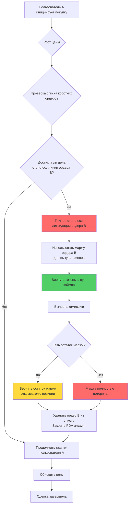
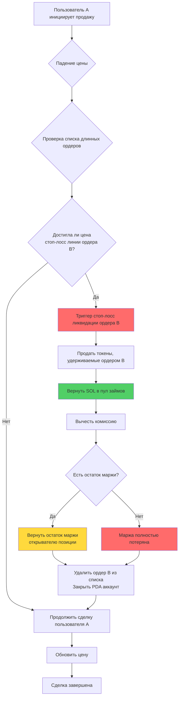
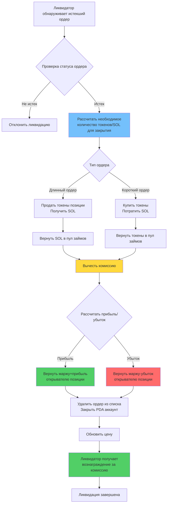
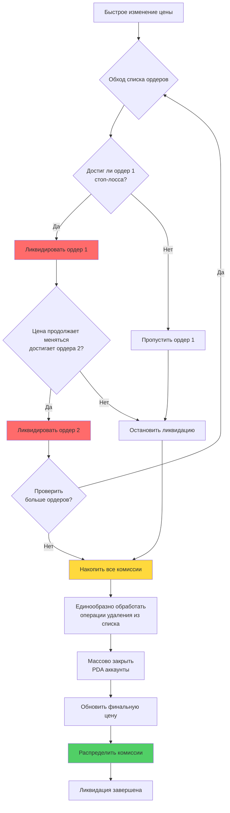

# ⚡ Описание функции принудительной ликвидации (ликвидации) PinPet

## 📋 Обзор функциональности

Принудительная ликвидация — это основной механизм управления рисками в протоколе PinPet, защищающий стабильность системы. Система предоставляет два способа запуска принудительной ликвидации:

1. **⏰ Временной триггер**: Когда ордер с кредитным плечом превышает установленное время удержания позиции, любой человек может инициировать принудительную ликвидацию
2. **🎯 Ценовой триггер**: Когда рыночная цена достигает стоп-лосс линии ордера, автоматически запускается стоп-лосс ликвидация

Этот двойной механизм защиты обеспечивает ликвидность протокола и безопасность средств, одновременно защищая открывателей позиций от чрезмерных убытков.

## ⚙️ Основные характеристики

### 1. 🔄 Двойной механизм триггера

#### ⏰ Временной триггер
- **✅ Нормальное закрытие**: В течение периода удержания ордера только сам открыватель позиции может активно закрыть позицию
- **⏱️ Ликвидация при истечении**: После истечения срока ордера любой человек может выполнить принудительную ликвидацию
- **🔍 Проверка времени**: Система автоматически определяет истечение срока ордера через временную метку в блокчейне

#### 🎯 Ценовой триггер (стоп-лосс ликвидация)
- **📉 Стоп-лосс для длинных позиций**: Когда цена падает и достигает стоп-лосс линии длинной позиции, происходит автоматическое закрытие
- **📈 Стоп-лосс для коротких позиций**: Когда цена растет и достигает стоп-лосс линии короткой позиции, происходит автоматическое закрытие
- **🔄 Пассивный триггер**: Стоп-лосс ликвидация, запущенная ценой, автоматически выполняется при торговле других пользователей
- **⚠️ Исчерпание маржи**: При стоп-лоссе маржа используется для возврата займа, открыватель позиции обычно не получает прибыли или теряет всю маржу

### 2. 📊 Поддержка типов ордеров

| Тип ордера | Условие ценового триггера | Условие временного триггера | Направление списка | Обработка активов |
|---------|------------|------------|---------|---------|
| 📈 Длинный ордер | Цена падает до стоп-лосс линии | Истечение ордера | Down | Возврат заимствованного SOL |
| 📉 Короткий ордер | Цена растет до стоп-лосс линии | Истечение ордера | Up | Возврат заимствованных токенов |

### 3. 👥 Роли участников

- **👤 Открыватель позиции**: Пользователь, создавший ордер с кредитным плечом, имеет эксклюзивное право закрытия до истечения срока ордера
- **🔨 Ликвидатор**: Любой третий пользователь, может выполнить активную ликвидацию после истечения срока ордера
- **💼 Трейдер**: Сделки покупки/продажи других пользователей могут вызвать ценовую стоп-лосс ликвидацию
- **🤖 Протокол**: Автоматически управляет средствами пула займов, обеспечивая нормальный оборот средств

## 🔄 Рабочий процесс

### 📊 Таблица сравнения процессов

| Этап процесса | ⏰ Временная ликвидация | 🎯 Ценовой стоп-лосс |
|---------|------------|------------|
| Условие триггера | Истечение ордера | Цена достигает стоп-лосс линии |
| Момент триггера | Активная инициация ликвидатором | Пассивный триггер при торговле |
| Проверка прав | Может выполнить любой | Автоматическое выполнение (без прав) |
| Расчет прибыли/убытков | Может быть прибыль или убыток | Обычно потеря всей маржи |
| Обработка маржи | Возврат остатка маржи | Используется для возврата займа |

### 📉 Процесс стоп-лосс ликвидации короткого ордера (ценовой триггер)



### 📈 Процесс стоп-лосс ликвидации длинного ордера (ценовой триггер)



### ⏰ Процесс ликвидации истекшего ордера (временной триггер)



### 💥 Процесс массовой цепной ликвидации



## 💰 Механизм комиссий

### 💵 Состав комиссий

| Тип комиссии | Объект взимания | Ставка | Назначение |
|---------|---------|------|------|
| Торговая комиссия | Открыватель позиции | По ставке ордера | Компенсация поставщикам ликвидности |
| Комиссия за ликвидацию | Открыватель позиции | По ставке ордера | Вознаграждение исполнителю ликвидации |

### 🤝 Распределение комиссий

Все комиссии распределяются между двумя сторонами в соответствии с настроенным в протоколе коэффициентом распределения (fee_split):

- **🤝 Партнер**: Получает определенную долю комиссии
- **🔧 Технический провайдер**: Получает оставшуюся комиссию

Коэффициент распределения устанавливается администратором при создании пула ликвидности, диапазон значений 0-100.

## 💸 Правила расчета средств

### ⏰ Временная ликвидация (истечение ордера)

#### ✅ Случай прибыли
Когда ордер имеет прибыль:
- Открыватель позиции получает обратно маржу + часть прибыли
- Вычитается торговая комиссия и комиссия за ликвидацию
- Адрес расчета должен быть адресом открывателя позиции

#### ❌ Случай убытка
Когда ордер имеет убыток:
- Убыток вычитается из маржи
- Остаток маржи возвращается открывателю позиции
- Вычитается торговая комиссия и комиссия за ликвидацию

#### 🧮 Формулы расчета
**📈 Прибыль/убыток длинного ордера**:
```
Прибыль = Полученный SOL от продажи + Маржа - Заимствованный SOL - Комиссия
```

**📉 Прибыль/убыток короткого ордера**:
```
Прибыль = Зафиксированный SOL - Потраченный SOL на выкуп - Комиссия
```

### 🎯 Ценовой стоп-лосс (автоматическая ликвидация)

#### 🛡️ Обработка маржи
- Маржа в первую очередь используется для возврата в пул займов
- После вычета торговой комиссии весь остаток используется для закрытия позиции
- Обычно открыватель позиции не получает прибыли или теряет всю маржу

#### 🧮 Формулы расчета
**📈 Стоп-лосс длинного ордера**:
```
Остаток маржи = Маржа - Возврат заимствованного SOL - Комиссия
Если остаток маржи > 0, вернуть открывателю позиции
Если остаток маржи ≤ 0, маржа полностью потеряна
```

**📉 Стоп-лосс короткого ордера**:
```
Стоимость выкупа = Потраченный SOL на выкуп токенов + Комиссия
Остаток маржи = Маржа - Стоимость выкупа
Если остаток маржи > 0, вернуть открывателю позиции
Если остаток маржи ≤ 0, маржа полностью потеряна
```

### 📊 Сравнение сценариев расчета

| Тип сценария | Момент расчета | Возможность прибыли | Возврат маржи | Источник комиссии |
|---------|---------|----------|----------|----------|
| ✅ Активное закрытие | Операция открывателя позиции | Может быть прибыль или убыток | Основная сумма+прибыль или вычет убытка | Платит открыватель позиции |
| ⏰ Ликвидация при истечении | Истечение ордера | Может быть прибыль или убыток | Основная сумма+прибыль или вычет убытка | Платит открыватель позиции |
| 🎯 Стоп-лосс ликвидация | Ценовой триггер | Обычно убыток | Остаток после вычета маржи | Вычитается из маржи |

## 🔗 Управление списками

### 📋 Структура списка ордеров

Система использует двусвязный список для управления ордерами, ожидающими закрытия:

- **📈 Список длинных ордеров (Down)**: Упорядочен от высокой к низкой цене
- **📉 Список коротких ордеров (Up)**: Упорядочен от низкой к высокой цене

### 🔧 Операции со списком

```
Проверка головного узла → Подтверждение позиции ордера
    ↓
Проверка связи между предыдущим и следующим узлами
    ↓
Удаление текущего узла → Обновление указателей предыдущего и следующего узлов
    ↓
Обновление указателя головы списка
```

### 💥 Массовая ликвидация

Когда одна сделка запускает стоп-лосс нескольких ордеров:
1. Последовательный обход списка ордеров
2. Поочередное выполнение закрытия каждого истекшего ордера
3. Накопление всех комиссий за закрытие
4. Единообразное проведение расчета средств

## 🛡️ Механизмы безопасности

### 🔐 Проверка прав

| Проверяемый элемент | Временное условие | Требование к правам |
|-------|---------|---------|
| Активное закрытие | Ордер не истек | Должен быть сам открыватель позиции |
| Принудительное закрытие | Ордер истек | Может выполнить любой |
| Адрес расчета | В любое время | Должен быть адрес открывателя позиции |

### 🔢 Числовая безопасность

- Все вычисления используют безопасные методы checked_*, предотвращая переполнение
- Расчет комиссий использует высокоточные алгоритмы, обеспечивая точность
- Проверка целостности списка ордеров, предотвращение повреждения данных

### 💎 Безопасность средств

- Автоматическая проверка возврата средств пула займов
- Проверка достаточности средств пула
- Защита от повторного закрытия

## 🎬 Практические сценарии применения

### 🎯 Сценарий 1: Нормальная ликвидация при истечении (временной триггер)

1. Пользователь A открыл длинную позицию с плечом 5x по цене 100, маржа 1 SOL, время удержания 24 часа
2. Через 24 часа цена выросла до 120, ордер принес прибыль примерно 1 SOL
3. Пользователь B обнаружил истекший ордер и выполнил принудительное закрытие
4. Система автоматически продала токены, вернула займ, вычла комиссию 0.1 SOL
5. Пользователь A получил основную сумму 1 SOL + прибыль 1 SOL - комиссия 0.1 SOL = 1.9 SOL

### 🚨 Сценарий 2: Ценовая стоп-лосс ликвидация

1. Пользователь C открыл короткую позицию с плечом 3x по цене 100, маржа 2 SOL
2. Линия стоп-лосса установлена на 130 (автоматически рассчитывается при открытии)
3. Пользователь D купил большое количество токенов, цена быстро выросла до 135
4. Цена достигла стоп-лосс линии пользователя C, система автоматически ликвидировала ордер C
5. Использовала маржу 2 SOL для выкупа токенов и возврата в пул займов
6. Вычла комиссию 0.1 SOL, остаток 0.2 SOL вернула пользователю C
7. Пользователь C потерял 1.8 SOL, покупка пользователя D продолжила выполнение

### 💥 Сценарий 3: Цепная стоп-лосс ликвидация

1. Цена быстро растет, запуская стоп-лосс линии нескольких коротких ордеров
2. Пользователь E отправил сделку покупки, цена выросла с 100 до 150
3. Система обнаружила необходимость ликвидировать 5 коротких ордеров
4. Поочередно выполнила стоп-лосс закрытие позиций в порядке цен
5. Каждый ордер использовал маржу для выкупа токенов и возврата займа
6. В конце единообразно вычла накопленные комиссии и вернула остаток маржи
7. Покупка пользователя E в итоге завершилась

### 📊 Сценарий 4: Стоп-лосс ликвидация после частичного закрытия

1. Пользователь F открыл длинную позицию на 1000 токенов, маржа 5 SOL
2. Активно закрыл 500 токенов с прибылью 2 SOL, осталось 500 токенов позиции
3. Цена продолжила падать, достигнув стоп-лосс линии оставшейся позиции
4. Система автоматически выполнила стоп-лосс ликвидацию оставшихся 500 токенов
5. После вычета займа и комиссии пользователь F получил общую прибыль 0.5 SOL

## ❓ Часто задаваемые вопросы

### Q1: ⏰ В чем разница между временным и 🎯 ценовым триггером?

A:
- **⏰ Временной триггер**: После истечения срока ордера ликвидатор должен активно инициировать сделку для выполнения закрытия, открыватель позиции может получить прибыль или убыток
- **🎯 Ценовой триггер**: Когда цена достигает стоп-лосс линии, автоматически выполняется в процессе торговли других пользователей, открыватель позиции обычно теряет маржу

Оба механизма независимы, ордер может сначала запустить ценовой стоп-лосс, а может сначала быть ликвидирован при истечении.

### Q2: 🎯 Как определяется линия стоп-лосса?

A: Линия стоп-лосса автоматически рассчитывается при открытии позиции на основе кредитного плеча и маржи:
- **📈 Длинный ордер**: Цена стоп-лосса = Цена открытия × (1 - 1/кредитное плечо)
- **📉 Короткий ордер**: Цена стоп-лосса = Цена открытия × (1 + 1/кредитное плечо)

Например: 5x длинная позиция, цена открытия 100, стоп-лосс около 80; 3x короткая позиция, цена открытия 100, стоп-лосс около 133.

### Q3: 🔔 Получу ли я уведомление при ценовом стоп-лоссе?

A: ❌ Нет. Стоп-лосс ликвидация пассивно запускается при торговле других пользователей, система не уведомляет заранее. Рекомендуется:
- 🔍 Отслеживать статус своих ордеров через события в блокчейне
- 📊 Использовать сторонние инструменты для мониторинга рисков позиции
- ⚠️ Разумно устанавливать кредитное плечо, избегать легкого запуска стоп-лосса

### Q4: ⏰ Как быстро после истечения ордера он будет принудительно закрыт?

A: После истечения срока ордера он может быть принудительно закрыт любым человеком немедленно, без дополнительного льготного периода. Но требуется, чтобы ликвидатор активно инициировал сделку. Рекомендуется активно закрывать позицию до истечения срока ордера, чтобы сохранить больше инициативы.

### Q5: 💰 Взимается ли дополнительная плата за принудительное закрытие?

A: ✅ Нет. Независимо от того, запущено ли временным или ценовым триггером, комиссия взимается по ставке, установленной при открытии ордера, так же, как и при нормальном закрытии.

### Q6: ⚠️ Будет ли маржа полностью потеряна при стоп-лосс ликвидации?

A: Необязательно. Хотя обычно при стоп-лосс ликвидации маржа в основном теряется, но если:
- ✅ Цена при запуске стоп-лосса только достигла стоп-лосс линии
- 📊 Волатильность рынка невелика, стоимость ликвидации низкая
- 💵 Комиссия низкая

то может быть небольшой остаток маржи, возвращаемый открывателю позиции. Но в большинстве случаев стоп-лосс ликвидация означает значительные убытки.

### Q7: 🔢 Сколько ордеров может быть ликвидировано в одной сделке?

A: Теоретически одна сделка может ликвидировать максимум 6 ордеров (максимальная длина массива ордеров в системе). Фактическое количество ликвидаций зависит от:
- **🎯 Ценовой триггер**: Зависит от того, сколько ордеров достигли стоп-лосс линии в диапазоне изменения цены
- **⏰ Временной триггер**: Зависит от того, сколько истекших ордеров ликвидатор решил ликвидировать

### Q8: 🔀 Как определяется порядок ликвидации?

A: Порядок ликвидации определяется структурой списка ордеров:
- **📈 Длинные ордера**: Ликвидация последовательно от высокой к низкой цене (при падении цены)
- **📉 Короткие ордера**: Ликвидация последовательно от низкой к высокой цене (при росте цены)

Этот порядок обеспечивает, что ордера, первыми достигшие стоп-лосс линии, ликвидируются первыми, соответствуя естественному порядку изменения цены.

### Q9: 🛡️ Как избежать стоп-лосс ликвидации?

A: Рекомендуется принять следующие меры:
- **⚙️ Разумное плечо**: Использовать более низкое кредитное плечо (2-3x), оставляя больше пространства для колебаний цены
- **💰 Своевременный тейк-профит**: При получении прибыли по ордеру вовремя активно закрывать позицию, фиксируя доход
- **👀 Следить за рынком**: Внимательно отслеживать изменения цены, активно закрывать позицию перед приближением к стоп-лосс линии
- **📊 Поэтапное открытие**: Не открывать полную позицию сразу, сохранять пространство для корректировки

### Q10: ❓ Что произойдет, если средств недостаточно при ликвидации?

A: Система проверит достаточность средств пула перед ликвидацией. Если средств недостаточно, сделка завершится неудачей и откатится, никакая операция не будет выполнена. Такая ситуация крайне редка, так как дизайн протокола обеспечивает баланс средств.

### Q11: 🔓 Будет ли PDA аккаунт закрыт после принудительного закрытия?

A: ✅ Да, после завершения принудительного закрытия соответствующий PDA аккаунт автоматически закроется, аренда будет возвращена плательщику. Для:
- **⏰ Временной триггер**: Аренда возвращается исполнителю ликвидации
- **🎯 Ценовой триггер**: Аренда возвращается пользователю, запустившему сделку

### Q12: 🔄 Изменится ли цена стоп-лосса ордера после частичного закрытия?

A: Да. После частичного закрытия цена стоп-лосса ордера будет пересчитана на основе оставшейся позиции. Из-за уменьшения позиции цена стоп-лосса станет ближе к текущей цене, риск относительно возрастет.

### Q13: 💥 Может ли произойти цепная ликвидация при сильной волатильности цены?

A: ⚠️ Да. При быстрой волатильности цены может произойти цепная стоп-лосс ликвидация:
1. Цена пробивает определенную стоп-лосс линию
2. Запускается ликвидация первой партии ордеров
3. Сама ликвидация продолжает двигать цену
4. Запускается ликвидация следующей партии ордеров

Такая ситуация легче происходит в областях с высоким кредитным плечом и плотными ордерами, поэтому рекомендуется осторожно использовать высокое плечо.

### Q14: ❌ Каковы последствия неудачной ликвидации?

A: Если сделка ликвидации не удалась по какой-либо причине (например, ошибка параметров, недостаточность средств и т.д.), сделка откатится, не окажет никакого влияния на систему. Ордер открывателя позиции останется в прежнем состоянии, он может:
- ⏳ Ждать следующей попытки ликвидации
- ✅ Самостоятельно активно закрыть позицию
- 🎯 Ждать, пока другая сделка запустит ценовой стоп-лосс

### Q15: 🚫 Можно ли отменить уже запущенную стоп-лосс ликвидацию?

A: ❌ Нельзя. Стоп-лосс ликвидация автоматически выполняется в сделке других пользователей, как только цена достигает стоп-лосс линии, процесс ликвидации начинается немедленно, его невозможно прервать или отменить. Это сделано для защиты определенности протокола и предотвращения системных рисков.
