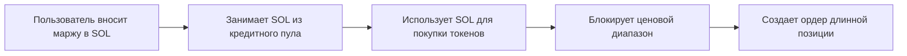
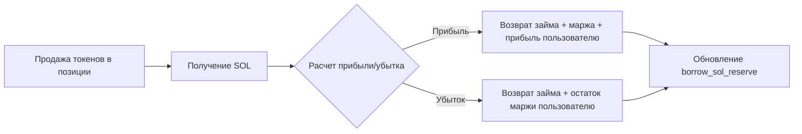
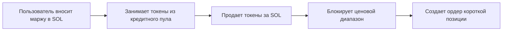
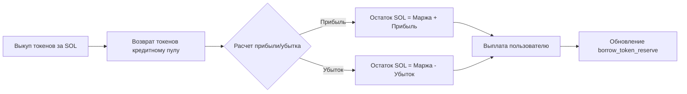
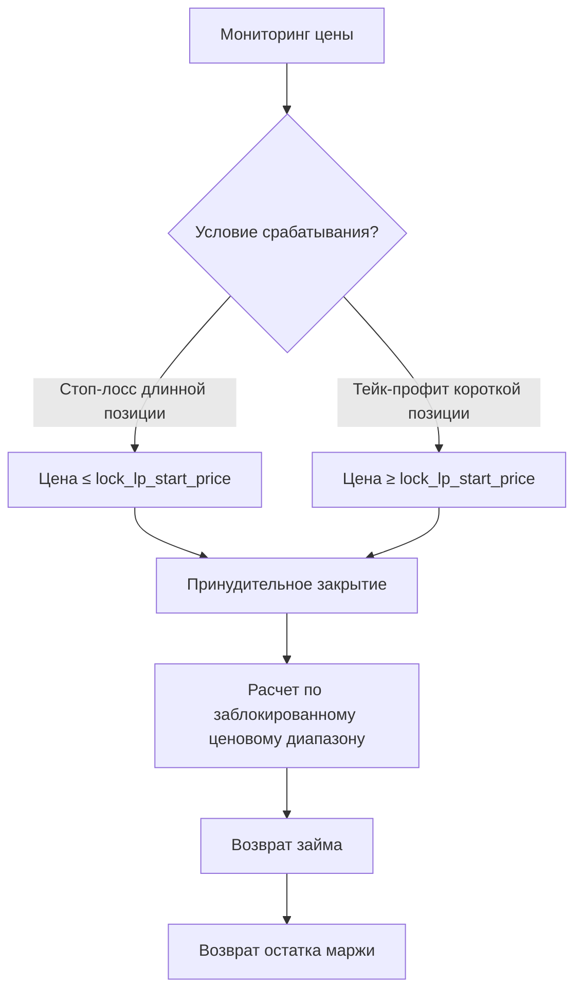
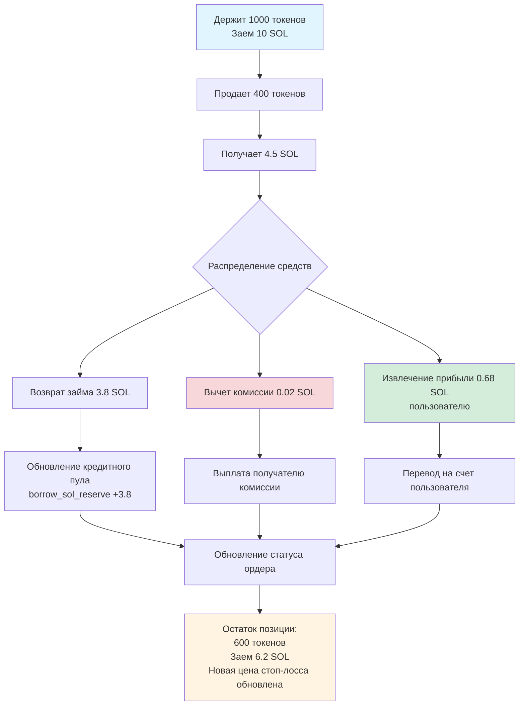
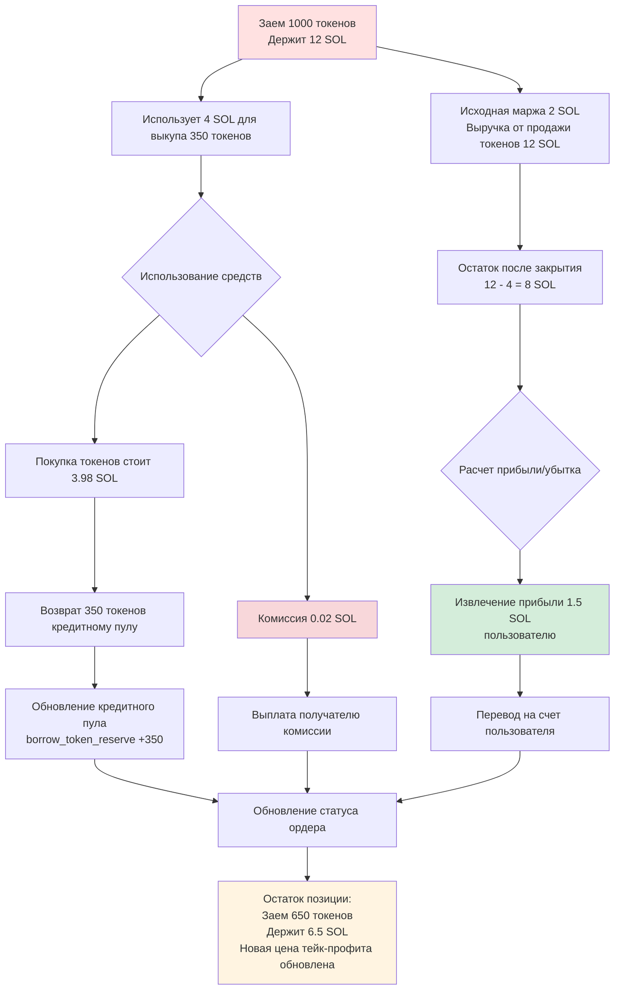

# 🏦 Введение в функциональность кредитного пула

## I. 📋 Обзор

Кредитный пул PinPet является основным модулем, поддерживающим маржинальную торговлю, предоставляя пользователям услуги кредитования SOL и токенов для реализации функций длинных и коротких позиций. Кредитный пул использует механизм **виртуального резервного пула**, независимый от пула ликвидности спотовой торговли, обеспечивая, что маржинальная торговля не влияет на нормальную работу спотового рынка.

## II. 🎭 Двойная роль кредитного пула

### 2.1 💰 Как пул капитала
- **Кредитный пул SOL**: Предоставляет займы SOL трейдерам для длинных позиций
- **Кредитный пул токенов**: Предоставляет займы токенов трейдерам для коротких позиций

### 2.2 📦 Управление резервами
Кредитный пул поддерживает два независимых виртуальных резерва:

| Тип резерва | Описание | Назначение |
|---------|------|------|
| `borrow_sol_reserve` | Виртуальный резерв SOL | Для заимствования трейдерами длинных позиций |
| `borrow_token_reserve` | Виртуальный резерв токенов | Для заимствования трейдерами коротких позиций |

Эти резервы представляют собой **виртуальную бухгалтерскую книгу**, фактические средства хранятся в пуле ликвидности спотового рынка, изоляция достигается через механизм блокировки ценовых диапазонов.

## III. 🔄 Процесс кредитования при маржинальной торговле

### 3.1 📈 Длинная позиция (Long) - Заем SOL для покупки токенов

#### ⬆️ Этап открытия позиции


**Подробный процесс**:
1. **Вклад пользователя**: Внесение маржи (например, 0.5 SOL) 💵
2. **Выдача кредитного пула**: Заем SOL из `borrow_sol_reserve` (например, 4.5 SOL) 💸
3. **Выполнение сделки**: Покупка токенов на AMM на общую сумму 5 SOL ⚙️
4. **Блокировка ценового диапазона**: Запись ценового диапазона на момент покупки для расчета при закрытии позиции 🔒
5. **Запись ордера**: Создание `MarginOrder`, запись суммы займа, маржи, количества токенов в позиции 📝


#### ⬇️ Этап закрытия позиции


**Расчет средств**:
- Общая сумма SOL от продажи токенов = `output_sol` 💰
- Вычет торговой комиссии 💸
- Возврат кредитному пулу: `borrow_amount` возвращается в `borrow_sol_reserve` ⬅️
- Доход пользователя = Общая сумма - Заем - Маржа ✅

### 3.2 📉 Короткая позиция (Short) - Заем токенов для продажи за SOL

#### ⬆️ Этап открытия позиции


**Подробный процесс**:
1. **Вклад пользователя**: Внесение маржи в SOL 💵
2. **Выдача кредитного пула**: Заем токенов из `borrow_token_reserve` 💎
3. **Выполнение сделки**: Продажа токенов за SOL, депонирование в пул средств ⚙️
4. **Блокировка ценового диапазона**: Запись ценового диапазона на момент продажи 🔒
5. **Запись ордера**: Создание `MarginOrder`, запись количества заемных токенов, маржи, позиции в SOL 📝


#### ⬇️ Этап закрытия позиции


**Расчет средств**:
- Общая сумма SOL для выкупа токенов = `required_sol` + комиссия 💰
- Возврат кредитному пулу: `borrow_amount` (токены) возвращается в `borrow_token_reserve` ⬅️
- Доход пользователя = SOL от продажи токенов при открытии - SOL на покупку токенов при закрытии - Маржа ✅

## IV. 💸 Механизм возврата кредитного пула

### 4.1 ✅ Возврат при активном закрытии позиции
При активном закрытии позиции пользователем система автоматически выполняет возврат:

| Тип сделки | Возвращаемый актив | Источник возврата | Возвращаемый резерв |
|---------|---------|---------|---------|
| Закрытие длинной позиции | SOL | Выручка от продажи токенов | `borrow_sol_reserve` |
| Закрытие короткой позиции | Токены | Выкупленные токены | `borrow_token_reserve` |

**Приоритет возврата**:
1. Вычет торговой комиссии 💸
2. Возврат основной суммы займа ⬅️
3. Возврат маржи 💰
4. Распределение прибыли/обработка убытков 📊

### 4.2 ⚠️ Возврат при принудительной ликвидации
Когда цена достигает стоп-лосс/тейк-профит цены, система автоматически принудительно закрывает позицию:



**Защита при ликвидации** 🛡️:
- Благодаря блокировке ценового диапазона, даже при резких колебаниях рыночной цены можно закрыть позицию по предопределенной цене
- Конструкция маржи обеспечивает безопасность средств кредитного пула

### 4.3 ⏰ Ликвидация по истечении срока
После истечения срока ордера любой может инициировать закрытие позиции:

- Длинная позиция: Время истечения `end_time` = время открытия + `borrow_duration` ⏱️
- Короткая позиция: Аналогично
- После истечения срока принудительное закрытие по текущей рыночной цене, возврат займа ⚡

## V. 🛡️ Механизм защиты средств кредитного пула

### 5.1 💼 Требования к марже
- **Минимальная маржа**: `MIN_MARGIN_SOL_AMOUNT` (системный параметр) 💰
- **Коэффициент маржи**: Динамический расчет на основе кредитного плеча и диапазона колебаний цен 📊
- **Назначение маржи**: Покрытие убытков при неблагоприятном изменении цены 🔒

### 5.2 🔐 Блокировка ценового диапазона
Каждый ордер блокирует ликвидность в определенном ценовом диапазоне:

```
Блокировка для длинной позиции: [lock_lp_start_price, lock_lp_end_price] (диапазон снижения цены)
Блокировка для короткой позиции: [lock_lp_start_price, lock_lp_end_price] (диапазон роста цены)
```

Это обеспечивает достаточную ликвидность для возврата займа при закрытии позиции. ✅

### 5.3 ✔️ Проверка резервов
Перед открытием позиции система проверяет:

| Проверяемый пункт | Условие | Код ошибки |
|-------|------|-------|
| Резерв SOL | `required_borrow_sol ≤ borrow_sol_reserve` | `InsufficientBorrowingReserve` |
| Резерв токенов | `required_borrow_token ≤ borrow_token_reserve` | `InsufficientBorrowingReserve` |


## VI. 💸 Механизм комиссий

### 6.1 📊 Комиссия за маржинальную торговлю
- **Ставка комиссии**: `borrow_fee` (например, 0.5% = 50 базисных пунктов) 💰
- **Время взимания**: При открытии и закрытии позиции ⏰
- **Распределение комиссии**:
  - Партнер: пропорция `fee_split` (например, 80%) 🤝
  - Технический поставщик: 100% - `fee_split` (например, 20%) ⚙️

### 6.2 ⚡ Комиссия за принудительную ликвидацию
- При инициировании ликвидации дополнительно взимается `borrow_fee` в качестве платы за ликвидацию 💸
- Используется для стимулирования третьих лиц к выполнению ликвидации по истечении срока 🎯

## VII. 🎯 Функция частичного закрытия позиции

Пользователи могут частично закрывать позиции для гибкого управления рисками: ⚙️

### 7.1 📈 Частичное закрытие длинной позиции



**Детали обновления ордера**:

| Поле | До закрытия | После закрытия | Описание |
|-----|-------|-------|------|
| `position_asset_amount` | 1000 токенов | 600 токенов | Остаток позиции |
| `borrow_amount` | 10 SOL | 6.2 SOL | Остаток займа |
| `lock_lp_start_price` | Старая цена стоп-лосса | Новая цена стоп-лосса | Пересчет по новой позиции |
| `realized_sol_amount` | 0 SOL | 0.68 SOL | Накопленная реализованная прибыль |

### 7.2 📉 Частичное закрытие короткой позиции



**Детали обновления ордера**:

| Поле | До закрытия | После закрытия | Описание |
|-----|-------|-------|------|
| `borrow_amount` | 1000 токенов | 650 токенов | Остаток займа (токены) |
| `position_asset_amount` | 12 SOL | 6.5 SOL | Остаток в SOL |
| `lock_lp_start_price` | Старая цена тейк-профита | Новая цена тейк-профита | Пересчет по новой позиции |
| `realized_sol_amount` | 0 SOL | 1.5 SOL | Накопленная реализованная прибыль |

### 7.3 ⚠️ Ограничение минимальной позиции
Остаток позиции после частичного закрытия должен быть ≥ `MIN_TRADE_TOKEN_AMOUNT * 2`, чтобы предотвратить создание микропозиций, которые невозможно ликвидировать.

## VIII. 🔗 Взаимосвязь кредитного пула и пула ликвидности

### 8.1 🔒 Изоляция средств
- **Пул ликвидности спотового рынка**: `lp_sol_reserve` + `lp_token_reserve`
- **Виртуальный кредитный пул**: `borrow_sol_reserve` + `borrow_token_reserve`

Хотя фактические средства находятся в одних и тех же `pool_sol_account` и `pool_token_account`, логическая изоляция достигается через механизм блокировки ценовых диапазонов. 🛡️

### 8.2 🔄 Синхронизация цен
- Спотовая торговля и маржинальная торговля используют одну и ту же `price` (текущая рыночная цена) 💹
- После обновления цены система пересчитывает резервы ликвидности: `price_to_reserves(price)` ⚙️

### 8.3 🤝 Взаимодополняющая ликвидность
- Ценовые диапазоны, заблокированные маржинальной торговлей, не участвуют в спотовой торговле 🔐
- Спотовая торговля может инициировать принудительное закрытие маржинальных ордеров, высвобождая ликвидность ⚡

## IX. ✨ Ключевые преимущества

| Характеристика | Описание | Преимущество |
|-----|------|------|
| Виртуальные резервы | Кредитный пул — это бухгалтерская запись, а не фактический пул средств | Высокая эффективность капитала, не требует дополнительного финансирования |
| Блокировка ценового диапазона | Предсказуемая цена закрытия позиции | Снижение риска ликвидации, защита кредитного пула |
| Двунаправленное кредитование | Поддержка двунаправленного кредитования SOL и токенов | Полная функциональность длинных и коротких позиций |
| Частичное закрытие | Гибкая корректировка позиций | Хороший пользовательский опыт, контролируемый риск |
| Ликвидация по истечению | Временное ограничение + стимулирование третьих лиц | Обеспечение своевременного возврата средств |


