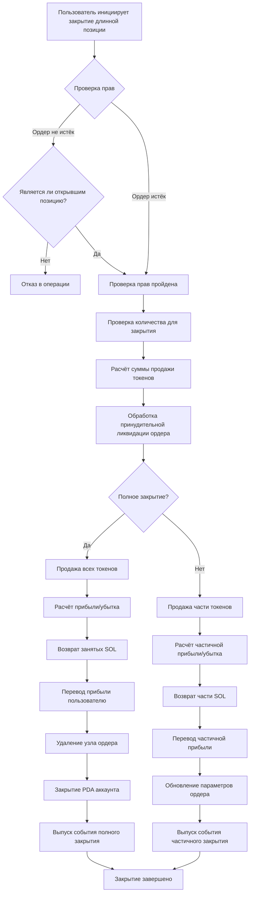
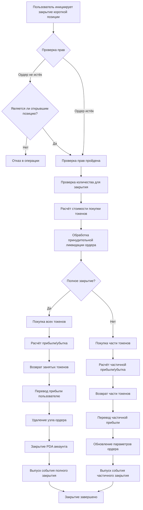

# 💼 PinPet Описание функции закрытия позиций с кредитным плечом

## 1. 📋 Обзор функционала

### 🤔 Что такое закрытие позиции?

Закрытие позиции — это операция, при которой пользователь закрывает удерживаемую им позицию с кредитным плечом. На платформе PinPet после открытия позиции создается маржинальный ордер, который записывает информацию о займе и позиции. Операция закрытия позиции рассчитывает этот ордер, возвращает заём и переводит прибыль или убыток пользователю.

### 💡 Зачем нужно закрытие позиции?

| Причина закрытия | Описание |
|---------|------|
| **🎯 Фиксация прибыли/ограничение убытков** | Пользователь активно закрывает позицию для фиксации прибыли или ограничения потерь |
| **⏰ Истечение срока ордера** | После истечения срока любой может инициировать закрытие для возврата заёмных ресурсов |
| **💰 Управление капиталом** | Освобождение маржи для гибкой корректировки торговой стратегии |
| **🛡️ Контроль рисков** | Избежание больших потерь из-за волатильности рынка |

### 📊 Типы закрытия позиций

- **🔚 Полное закрытие**: Единовременное закрытие всей позиции с расчетом всей прибыли/убытка
- **✂️ Частичное закрытие**: Постепенное закрытие позиции для частичной реализации прибыли с сохранением оставшейся позиции

## 2. 📈 Функция закрытия длинной позиции (Close Long)

### 📝 Описание функции

Закрытие длинной позиции — это по сути операция **продажи токенов**. Пользователь ранее при открытии длинной позиции занял SOL для покупки токенов, при закрытии нужно продать токены и получить SOL для возврата займа.

### 🔄 Схема операционного процесса



### ⚙️ Описание ключевых параметров

| Название параметра | Назначение | Пример значения |
|---------|---------|--------|
| `sell_token_amount` | Желаемое количество токенов для продажи (неточное значение, возможны небольшие отклонения) | 1000000 (1 токен) |
| `min_sol_output` | Минимальное количество SOL, ожидаемое после продажи (защита от проскальзывания) | 50000000 (0.05 SOL) |
| `prev_order_id` | Индекс предыдущего ордера в связном списке | 2 |
| `close_order_id` | Индекс закрываемого ордера в массиве ордеров | 5 |
| `next_order_id` | Индекс следующего ордера в связном списке | 7 |
| `close_order_address` | Адрес закрываемого ордера (для проверки безопасности) | "Abc123..." |

### 🧮 Описание расчёта прибыли/убытка

#### 🔚 Сценарий полного закрытия

**Формула расчёта**:

```
Прибыль в SOL = (полученные SOL от продажи) + (маржа в SOL) - (занятые SOL)
```

**Шаги расчёта**:
1. Продать все удерживаемые токены, получить SOL (за вычетом комиссии)
2. Добавить внесённую при открытии маржу
3. Вычесть занятые при открытии SOL
4. Положительное значение — прибыль, отрицательное — убыток

#### ✂️ Сценарий частичного закрытия

**Формула расчёта**:

```
Текущая прибыль = (текущая продажа в SOL) + (общая маржа) + (будущая продажа оставшихся токенов в SOL) - (общий займ в SOL)
```

**Шаги расчёта**:
1. Рассчитать SOL, полученные от продажи токенов в этот раз
2. Рассчитать SOL от продажи оставшихся токенов по новой цене стоп-лосса (после вычета комиссии)
3. Общие активы = текущие поступления + маржа + оставшиеся поступления
4. Вычесть общий займ, получить частичную прибыль
5. Вернуть часть займа, оставшаяся маржа продолжает удерживать позицию

### 💹 Сравнение сценариев прибыли/убытка

| Сценарий | Цена открытия | Цена закрытия | Удерживаемые токены | Занятые SOL | Маржа | Полученные SOL от продажи | Результат прибыли/убытка |
|------|---------|---------|---------|---------|--------|-------------|---------|
| **🟢 Сценарий прибыли** | 0.05 SOL | 0.08 SOL | 100 Token | 5 SOL | 0.5 SOL | 8 SOL | +2.5 SOL |
| **🔴 Сценарий убытка** | 0.05 SOL | 0.03 SOL | 100 Token | 5 SOL | 0.5 SOL | 3 SOL | -1.5 SOL |
| **⚖️ Сценарий безубыточности** | 0.05 SOL | 0.055 SOL | 100 Token | 5 SOL | 0.5 SOL | 5.5 SOL | 0 SOL |

## 3. 📉 Функция закрытия короткой позиции (Close Short)

### 📝 Описание функции

Закрытие короткой позиции — это по сути операция **покупки токенов**. Пользователь ранее при открытии короткой позиции занял токены и продал их, получив SOL, при закрытии нужно выкупить токены за SOL для возврата займа.

### 🔄 Схема операционного процесса



### ⚙️ Описание ключевых параметров

| Название параметра | Назначение | Пример значения |
|---------|---------|--------|
| `buy_token_amount` | Желаемое количество токенов для покупки | 1000000 (1 токен) |
| `max_sol_amount` | Максимальное количество SOL, которое готовы заплатить (защита от проскальзывания) | 60000000 (0.06 SOL) |
| `prev_order_id` | Индекс предыдущего ордера в связном списке | 1 |
| `close_order_id` | Индекс закрываемого ордера в массиве ордеров | 3 |
| `next_order_id` | Индекс следующего ордера в связном списке | 6 |
| `close_order_address` | Адрес закрываемого ордера (для проверки безопасности) | "Def456..." |

### 🧮 Описание расчёта прибыли/убытка

#### 🔚 Сценарий полного закрытия

**Формула расчёта**:

```
Прибыль в SOL = (полученные SOL от продажи токенов при открытии с комиссией) - (затраты SOL на выкуп токенов при закрытии) - (комиссия)
```

**Шаги расчёта**:
1. Выкупить за SOL все занятые токены
2. Вернуть занятые токены в пул займов
3. Рассчитать: поступления от продажи при открытии - стоимость покупки при закрытии - комиссия
4. Положительное значение — прибыль, отрицательное — убыток

#### ✂️ Сценарий частичного закрытия

**Формула расчёта**:

```
Текущая прибыль = (интервал текущего выкупа с комиссией) - (фактические затраты SOL на выкуп) - (комиссия выкупа)
```

**Шаги расчёта**:
1. Рассчитать стоимость выкупа части токенов в этот раз (включая комиссию)
2. Рассчитать стоимость будущего выкупа оставшихся токенов (включая комиссию)
3. Текущая прибыль = должны заплатить за этот раз - фактически потрачено
4. Вернуть часть токенов, обновить параметры ордера
5. Оставшаяся маржа продолжает удерживать позицию

### 💹 Сравнение сценариев прибыли/убытка

| Сценарий | Цена открытия | Цена закрытия | Занятые токены | Полученные SOL от продажи | Маржа | Стоимость выкупа в SOL | Результат прибыли/убытка |
|------|---------|---------|---------|-------------|--------|-------------|---------|
| **🟢 Сценарий прибыли** | 0.08 SOL | 0.05 SOL | 100 Token | 8 SOL | 0.5 SOL | 5 SOL | +2.5 SOL |
| **🔴 Сценарий убытка** | 0.05 SOL | 0.08 SOL | 100 Token | 5 SOL | 0.5 SOL | 8 SOL | -2.5 SOL |
| **⚖️ Сценарий безубыточности** | 0.06 SOL | 0.06 SOL | 100 Token | 6 SOL | 0.5 SOL | 6 SOL | -0.06 SOL (комиссия) |

## 4. ⏰ Время и стратегии закрытия позиций

### 🎯 Время активного закрытия позиций

| Тип времени | Применимый сценарий | Рекомендуемая стратегия |
|---------|---------|---------|
| **📈 Закрытие с фиксацией прибыли** | Цена достигла целевого уровня | Частично закрыть для фиксации прибыли, оставшуюся позицию продолжать удерживать |
| **🛑 Закрытие со стоп-лоссом** | Цена пробила уровень стоп-лосса | Своевременно полностью закрыть, контролировать потери |
| **🔧 Корректировка позиции** | Изменение рыночного тренда | Уменьшить или увеличить, оптимизировать структуру позиции |
| **⏳ Закрытие перед истечением** | Приближается время истечения ордера | Активно закрыть, чтобы избежать принудительной ликвидации |

### ⚡ Пассивное закрытие (принудительная ликвидация)

**Условия срабатывания**:
- ⏰ Время истечения ордера прошло
- 👥 Любой пользователь может инициировать ликвидацию
- 💵 Ликвидатор может получить определённое вознаграждение в виде комиссии

**⚠️ Предупреждение о рисках**:
- 📉 После истечения может быть принудительно закрыто по невыгодной цене
- 💡 Рекомендуется активно управлять позициями до истечения

## 5. 📖 Примеры использования

### 🟢 Сценарий первый: Закрытие длинной позиции с прибылью

**Предыстория**:
- Пользователь открыл длинную позицию по цене 0.05 SOL, купил 100 токенов
- Занял 4.5 SOL, внёс маржу 0.5 SOL
- Текущая цена выросла до 0.08 SOL

**Операция**:
1. Пользователь решает полностью закрыть позицию для фиксации прибыли
2. Продаёт 100 токенов, получает около 8 SOL (после вычета комиссии)
3. Возвращает займ 4.5 SOL
4. Возвращает маржу 0.5 SOL
5. Чистая прибыль: 8 - 4.5 + 0.5 (маржа уже учтена при открытии) = около 3 SOL

**✅ Результат**: Успешно достигнута доходность 60%

### 🔴 Сценарий второй: Закрытие короткой позиции со стоп-лоссом

**Предыстория**:
- Пользователь открыл короткую позицию по цене 0.05 SOL, занял и продал 100 токенов, получил 5 SOL
- Внёс маржу 0.5 SOL
- Цена выросла до 0.08 SOL, достигла уровня стоп-лосса

**Операция**:
1. Пользователь экстренно закрывает позицию со стоп-лоссом
2. Выкупает 100 токенов за 8 SOL (включая комиссию)
3. Возвращает 100 токенов в пул займов
4. Маржа 0.5 SOL + поступления при открытии 5 SOL = 5.5 SOL доступных средств
5. Чистый убыток: 5.5 - 8 = -2.5 SOL

**✅ Результат**: Своевременный стоп-лосс, избежание больших потерь

### ✂️ Сценарий третий: Частичное закрытие для корректировки позиции

**Предыстория**:
- Пользователь удерживает длинную позицию на 200 токенов
- Цена уже выросла на 30%
- Пользователь хочет зафиксировать часть прибыли, но продолжать удерживать позицию в расчёте на рост

**Операция**:
1. Частично закрыть 100 токенов
2. Вернуть часть займа в SOL
3. Получить часть прибыли на счёт
4. Оставшиеся 100 токенов продолжать удерживать
5. Обновить параметры ордера, скорректировать уровень стоп-лосса

**✅ Результат**: Реализована гибкая стратегия управления позицией

## 6. ⚠️ Предупреждения и ограничения

### 🚫 Операционные ограничения

| Тип ограничения | Конкретное требование | Описание |
|---------|---------|------|
| **🔐 Проверка прав** | До истечения ордера только открывший позицию может закрыть её | Защита активов пользователя |
| **💳 Адрес расчёта** | Должен быть адресом кошелька открывшего позицию | Средства могут вернуться только на исходный адрес |
| **📏 Минимальный объём сделки** | При частичном закрытии не менее 2-кратного минимального объёма сделки | Избежание пылевых ордеров |
| **📊 Остаточное количество** | После частичного закрытия остаток не менее минимального объёма сделки | Обеспечение действительности ордера |

### ⚠️ Предупреждения о рисках

#### 📉 Риск проскальзывания
- При закрытии позиции фактическая цена исполнения может отличаться от ожидаемой
- Рекомендуется устанавливать разумные параметры защиты от проскальзывания
- При крупных закрытиях влияние проскальзывания более значительно

#### 💸 Стоимость комиссий
- При каждом закрытии необходимо платить торговую комиссию
- Частое закрытие увеличивает затраты
- Частичное закрытие требует двойной комиссии (текущая + будущее полное закрытие)

#### ⏰ Временной риск
- После истечения любой может инициировать закрытие позиции
- Возможна ликвидация по невыгодной цене
- Рекомендуется заранее управлять ордерами, срок которых истекает

#### 🌊 Рыночный риск
- Быстрая волатильность цен может привести к неудачному времени закрытия
- В экстремальных рыночных условиях возможна ликвидация
- Рекомендуется устанавливать разумные уровни стоп-лосса

### 💡 Рекомендации по лучшим практикам

1. **🛡️ Установка разумного стоп-лосса**: Планируйте уровень стоп-лосса при открытии позиции, строго придерживайтесь его
2. **✂️ Постепенное закрытие**: Для крупных позиций рекомендуется закрывать постепенно, снижая рыночное воздействие
3. **⏰ Отслеживание времени истечения**: Активно управляйте ордерами за 1-2 дня до истечения
4. **💰 Контроль комиссий**: Избегайте слишком частых операций частичного закрытия
5. **📊 Мониторинг глубины рынка**: Перед крупным закрытием проверяйте рыночную ликвидность

### 🔒 Технические гарантии безопасности

- **✅ Проверка адреса**: При закрытии проверяется адрес ордера, предотвращая операции с неправильным ордером
- **🔐 Проверка прав**: Множественная проверка прав, обеспечивающая операции только авторизованными пользователями
- **🛡️ Защита от переполнения**: Все числовые вычисления используют безопасный метод checked
- **⚛️ Атомарные операции**: Все шаги процесса закрытия выполняются атомарно, предотвращая несогласованность состояния

---

## 📚 Приложение: Объяснение терминов

| Термин | Объяснение |
|------|------|
| **PDA** | Program Derived Address, адрес, производный от программы, используется для хранения данных ордеров |
| **Маржа** | SOL, внесённый пользователем при открытии позиции в качестве гарантии риска |
| **Пул займов** | Виртуальный пул, предоставляющий средства для кредитного плеча |
| **Цена стоп-лосса** | Пороговая цена, при которой ордер принудительно закрывается |
| **Скидка на комиссию** | Льготная комиссия при выполнении условий |
| **Принудительная ликвидация** | Механизм автоматического закрытия ордера после истечения срока |
| **Узел связного списка** | Позиция ордера в связном списке, используется для эффективного управления несколькими ордерами |

---

*Этот документ является описанием функционала продукта и не включает технические детали реализации. Для ознакомления с технической реализацией обратитесь к коду проекта и технической документации.*
