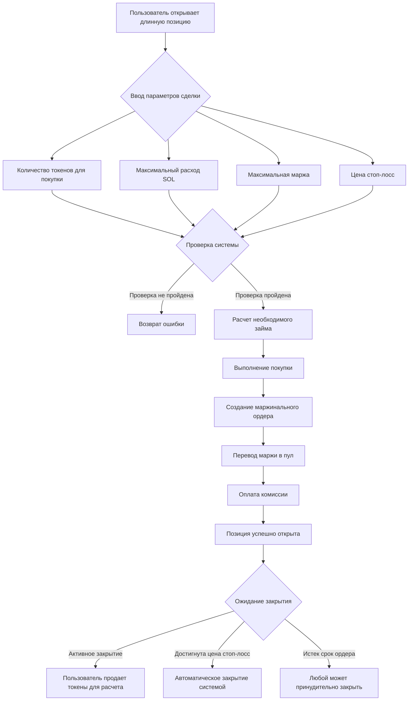
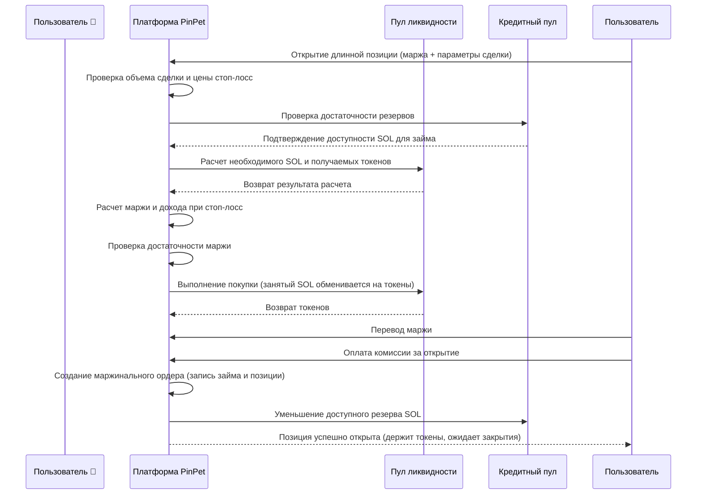
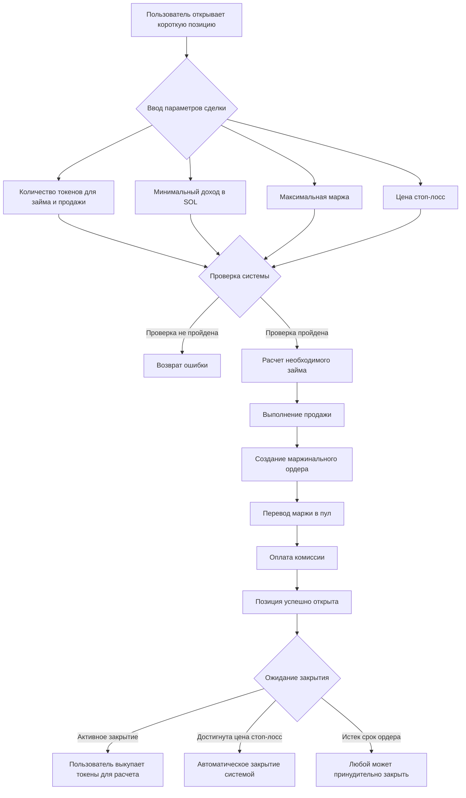
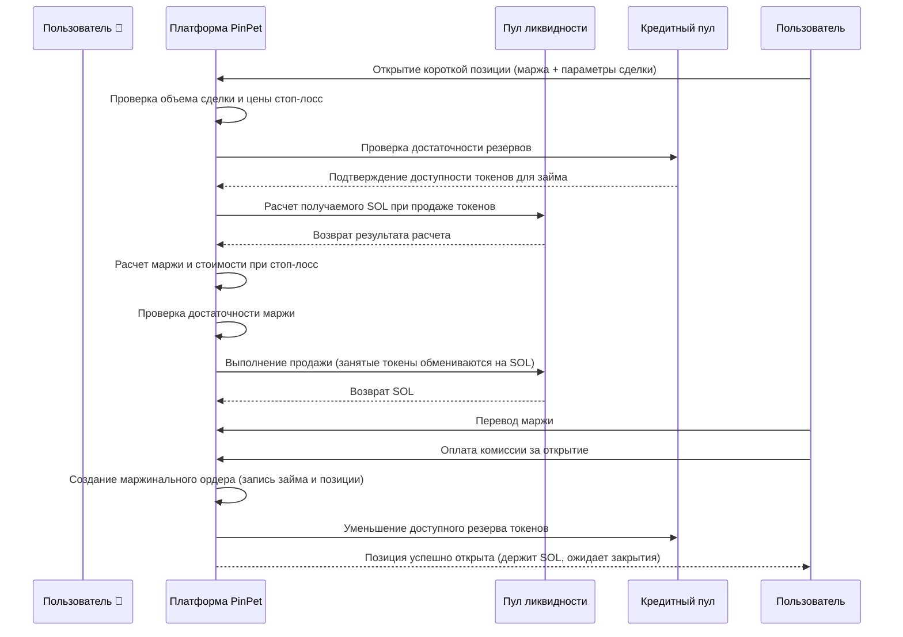
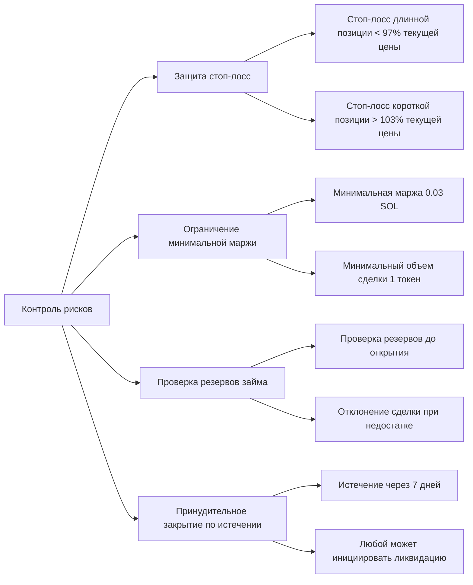

# 📊 Введение в функционал кредитного плеча PinPet

## 1. Обзор функционала 🎯

### Что такое торговля с кредитным плечом 💹

Торговля с кредитным плечом — это финансовый инструмент, использующий заемные средства для увеличения объема торговли, позволяющий пользователям контролировать активы большей стоимости с меньшей маржой. Платформа PinPet предоставляет два вида торговли с кредитным плечом — длинные и короткие позиции, позволяя пользователям получать прибыль как при росте, так и при падении цены токена.

### Ключевые концепции 💡

- **Маржа (Margin)** 💰: SOL-средства, вносимые самим пользователем в качестве гарантии сделки
- **Заем (Borrow)** 💵: Активы, заимствованные с платформы (при длинной позиции занимают SOL, при короткой — токены)
- **Цена стоп-лосс (Stop Loss Price)** 🛡️: Когда цена достигает этого уровня, система автоматически закрывает позицию для контроля рисков
- **Закрытие позиции (Close Position)** 🔄: Операция возврата займа и расчета прибыли/убытков

### Типы кредитного плеча 📈📉

| Тип сделки | Прогноз рынка | Заемный актив | Удерживаемый актив | Условие прибыли |
|---------|---------|---------|---------|---------|
| Длинная позиция (Long) 🟢 | Рост ⬆️ | Занять SOL | Держать токены | Рост цены токена |
| Короткая позиция (Short) 🔴 | Падение ⬇️ | Занять токены | Держать SOL | Падение цены токена |

---

## 2. Длинная позиция (Long) 🟢📈

### Описание функции ✨

Длинная позиция означает, что пользователь ожидает роста цены токена в будущем, занимая SOL с платформы для покупки большего количества токенов, а затем продавая токены после роста цены для возврата займа и получения прибыли.

### Процесс пользовательской операции 🔄



### Блок-схема длинной позиции 📋



### Описание ключевых параметров 📝

| Название параметра | Описание | Пример значения | Ограничения |
|---------|------|--------|---------|
| buy_token_amount | Желаемое количество токенов для покупки | 1,000,000 (1 токен) | Не менее минимального объема (1 токен) |
| max_sol_amount | Максимальное количество SOL для оплаты | 100,000,000 (0.1 SOL) | Фактически может быть меньше (защита от проскальзывания) |
| margin_sol_max | Максимальная маржа, которую пользователь готов внести | 50,000,000 (0.05 SOL) | Не менее 0.03 SOL |
| close_price | Цена стоп-лосс (цена автоматического закрытия) | 95% текущей цены | Должна быть ниже 97% текущей цены |
| borrow_amount | Фактический размер займа, рассчитанный системой | 50,000,000 (0.05 SOL) | Не более резервов кредитного пула |
| position_asset_amount | Количество токенов в позиции | 1,000,000 (1 токен) | Равно количеству купленных токенов |

### Логика расчета маржи 🧮

Маржа служит для обеспечения возможности возврата займа при закрытии по стоп-лосс. Формула расчета:

```
Фактическая маржа = Общие затраты на покупку - Доход при закрытии по стоп-лосс (после вычета комиссий)
```

**Пример:**

Предположим, текущая цена токена 0.1 SOL/Token:

1. Пользователь хочет купить 1 токен, требуется около 0.1 SOL
2. Пользователь вносит маржу 0.05 SOL, занимает 0.05 SOL
3. Устанавливает цену стоп-лосс 0.095 SOL/Token (95% от текущей цены)
4. Система рассчитывает: если продать 1 токен по цене 0.095, после вычета комиссии получится около 0.0945 SOL
5. Расчет маржи: 0.1 - 0.0945 = 0.0055 SOL (необходимая фактическая маржа)
6. Предоставленные пользователем 0.05 SOL больше 0.0055 SOL, условие открытия выполнено

### Предупреждения о рисках ⚠️

- **Срабатывание стоп-лосс** 🛑: Когда цена токена падает до уровня стоп-лосс, система автоматически продает токены для возврата займа, пользователь теряет маржу
- **Истечение срока ордера** ⏰: Если позиция не закрыта более 7 дней (срок по умолчанию), любой может принудительно закрыть позицию, пользователю следует активно закрыть позицию как можно скорее
- **Стоимость займа** 💸: За открытие и закрытие взимается комиссия (по умолчанию 0.25%)

---

## 3. Короткая позиция (Short) 🔴📉

### Описание функции ✨

Короткая позиция означает, что пользователь ожидает падения цены токена в будущем, занимая токены с платформы для немедленной продажи в обмен на SOL, а затем выкупая токены после падения цены для возврата займа и получения прибыли.

### Процесс пользовательской операции 🔄



### Блок-схема короткой позиции 📋



### Описание ключевых параметров 📝

| Название параметра | Описание | Пример значения | Ограничения |
|---------|------|--------|---------|
| borrow_sell_token_amount | Желаемое количество токенов для займа и продажи | 1,000,000 (1 токен) | Не менее минимального объема (1 токен) |
| min_sol_output | Ожидаемый минимум SOL после продажи | 90,000,000 (0.09 SOL) | Фактически может быть больше (защита от проскальзывания) |
| margin_sol_max | Максимальная маржа, которую пользователь готов внести | 50,000,000 (0.05 SOL) | Не менее 0.03 SOL |
| close_price | Цена стоп-лосс (цена автоматического закрытия) | 105% текущей цены | Должна быть выше 103% текущей цены |
| borrow_amount | Фактический размер займа, рассчитанный системой | 1,000,000 (1 токен) | Не более резервов кредитного пула |
| position_asset_amount | Количество SOL в позиции | 95,000,000 (0.095 SOL) | Равно полученному SOL после продажи (за вычетом комиссии) |

### Логика расчета маржи 🧮

Маржа при короткой позиции используется для обеспечения возможности выкупа токенов для возврата займа при закрытии по стоп-лосс. Формула расчета:

```
Фактическая маржа = Стоимость выкупа при закрытии по стоп-лосс (с комиссией) - Доход при продаже (за вычетом комиссии)
```

**Пример:**

Предположим, текущая цена токена 0.1 SOL/Token:

1. Пользователь занимает 1 токен и продает его, после вычета комиссии получает около 0.0975 SOL
2. Устанавливает цену стоп-лосс 0.105 SOL/Token (105% от текущей цены)
3. Система рассчитывает: если выкупить 1 токен по цене 0.105, с комиссией потребуется около 0.1053 SOL
4. Расчет маржи: 0.1053 - 0.0975 = 0.0078 SOL (необходимая фактическая маржа)
5. Пользователь должен внести как минимум 0.0078 SOL в качестве маржи
6. Пользователь предоставляет маржу 0.05 SOL, что больше 0.0078 SOL, условие открытия выполнено

### Предупреждения о рисках ⚠️

- **Срабатывание стоп-лосс** 🛑: Когда цена токена поднимается до уровня стоп-лосс, система автоматически выкупает токены для возврата займа, пользователь теряет маржу
- **Неограниченный риск** ⛔: Теоретически цена токена может расти бесконечно, риск короткой позиции выше, чем длинной
- **Истечение срока ордера** ⏰: Если позиция не закрыта более 7 дней (срок по умолчанию), любой может принудительно закрыть позицию
- **Стоимость займа** 💸: За открытие и закрытие взимается комиссия (по умолчанию 0.25%)

---

## 4. Риски и доходность торговли с кредитным плечом 📊💰

### Эффект усиления доходности 📈💎

Ключевое преимущество торговли с кредитным плечом заключается в возможности контролировать больший объем активов с меньшим капиталом, усиливая доходность.

**Пример доходности длинной позиции:**

Предположим, пользователь вносит маржу 0.05 SOL для открытия длинной позиции на 1 токен:

| Сценарий | Цена открытия | Цена закрытия | Стоимость позиции | Сумма возврата | Чистая прибыль | Доходность |
|------|--------|--------|----------|----------|--------|--------|
| Небольшой рост | 0.1 | 0.11 | 0.11 SOL | 0.05 SOL | 0.06 SOL | +120% |
| Значительный рост | 0.1 | 0.15 | 0.15 SOL | 0.05 SOL | 0.10 SOL | +200% |
| Небольшое падение | 0.1 | 0.095 | 0.095 SOL | 0.05 SOL | 0.045 SOL | -10% |
| Срабатывание стоп-лосс | 0.1 | 0.095 | 0.095 SOL | 0.05 SOL | 0.045 SOL | -10% |

**Пример доходности короткой позиции:**

Предположим, пользователь вносит маржу 0.05 SOL для открытия короткой позиции на 1 токен:

| Сценарий | Цена открытия | Цена закрытия | Стоимость позиции | Стоимость выкупа | Чистая прибыль | Доходность |
|------|--------|--------|----------|----------|--------|--------|
| Небольшое падение | 0.1 | 0.09 | 0.0975 SOL | 0.09 SOL | 0.0075 SOL | +15% |
| Значительное падение | 0.1 | 0.05 | 0.0975 SOL | 0.05 SOL | 0.0475 SOL | +95% |
| Небольшой рост | 0.1 | 0.105 | 0.0975 SOL | 0.105 SOL | -0.0075 SOL | -15% |
| Срабатывание стоп-лосс | 0.1 | 0.105 | 0.0975 SOL | 0.1053 SOL | -0.0078 SOL | -16% |

### Факторы риска ⚠️

#### 1. Риск ценовых колебаний 📉📈

- **Риск длинной позиции** 🟢: Падение цены токена ниже стоп-лосс приводит к потере всей маржи
- **Риск короткой позиции** 🔴: Рост цены токена выше стоп-лосс приводит к потере всей маржи
- **Резкие колебания** ⚡: Значительные колебания цены за короткий период могут привести к быстрому срабатыванию стоп-лосс

#### 2. Риск ликвидности 💧

- **Истощение кредитного пула** 📛: Если резервы кредитного пула недостаточны, открытие позиции невозможно
- **Проскальзывание** 📊: Слишком большой объем сделки может привести к отклонению фактической цены исполнения от ожидаемой

#### 3. Временной риск ⏰

- **Истечение срока ордера** 🔔: Если позиция не закрыта более 7 дней, любой может принудительно закрыть позицию, что может привести к ликвидации по невыгодной цене
- **Стоимость удержания позиции** 💸: Долгосрочное удержание позиции несет временные издержки и рыночную неопределенность

#### 4. Системный риск 🔧

- **Расчет цены** 🧮: Основан на алгоритме постоянного произведения, крупные сделки могут столкнуться с большим проскальзыванием
- **Накопление комиссий** 💰: Многократные открытия и закрытия позиций приводят к накоплению комиссий, уменьшающих прибыль

### Меры контроля рисков 🛡️

Платформа PinPet предоставляет многоуровневые механизмы контроля рисков:



---

## 5. Примеры сценариев использования 💼

### Сценарий первый: Длинная позиция при ожидании роста 🟢⬆️

**Предыстория** 📖: Сяо Мин видит тенденцию роста мем-токена, текущая цена 0.1 SOL

**Шаги операции** 🎯:
1. Сяо Мин вносит маржу 0.1 SOL
2. Занимает 0.1 SOL (платформа предоставляет Сяо Мину)
3. Использует в общей сложности 0.2 SOL для покупки 2 токенов
4. Устанавливает цену стоп-лосс 0.095 SOL (автоматическая остановка при пробое)

**Сценарий прибыли** 💰📈: Токен вырос до 0.15 SOL
- Продажа 2 токенов дает 0.3 SOL (после вычета комиссии около 0.2985 SOL)
- Возврат займа 0.1 SOL, остается 0.1985 SOL
- За вычетом маржи 0.1 SOL, чистая прибыль 0.0985 SOL (около +98.5%)

**Сценарий стоп-лосс** 🛑📉: Токен упал до 0.095 SOL (срабатывание стоп-лосс)
- Автоматическая продажа 2 токенов дает 0.19 SOL (после вычета комиссии около 0.1895 SOL)
- Возврат займа 0.1 SOL, остается 0.0895 SOL
- Убыток маржи 0.1 - 0.0895 = 0.0105 SOL (около -10.5%)

### Сценарий второй: Короткая позиция при ожидании падения 🔴⬇️

**Предыстория** 📖: Сяо Хун считает, что цена определенного токена завышена, текущая цена 0.2 SOL, готовится к короткой позиции

**Шаги операции** 🎯:
1. Сяо Хун вносит маржу 0.15 SOL
2. Занимает 1 токен (платформа предоставляет Сяо Хун)
3. Немедленно продает 1 токен, получая 0.2 SOL (после вычета комиссии около 0.195 SOL)
4. Устанавливает цену стоп-лосс 0.21 SOL (автоматическая остановка при пробое)

**Сценарий прибыли** 💰📉: Токен упал до 0.15 SOL
- Выкуп 1 токена за 0.15 SOL (с комиссией около 0.1504 SOL)
- Возврат займа 1 токен
- Остается 0.195 - 0.1504 = 0.0446 SOL
- Плюс маржа 0.15 SOL, итого 0.1946 SOL (чистая прибыль 0.0446 SOL, около +29.7%)

**Сценарий стоп-лосс** 🛑📈: Токен вырос до 0.21 SOL (срабатывание стоп-лосс)
- Автоматический выкуп 1 токена за 0.21 SOL (с комиссией около 0.2105 SOL)
- Возврат займа 1 токен
- Расход 0.2105 SOL, но при продаже получено только 0.195 SOL
- Убыток 0.0155 SOL, за вычетом маржи (около -10.3%)

### Сценарий третий: Торговля в диапазоне 🔄📊

**Предыстория** 📖: Сяо Ган специализируется на краткосрочной торговле, цена токена колеблется в диапазоне 0.08 - 0.12 SOL

**Стратегия** 🎯:
- Открывать длинную позицию при приближении цены к 0.08 SOL, стоп-лосс 0.075 SOL
- Открывать короткую позицию при приближении цены к 0.12 SOL, стоп-лосс 0.125 SOL
- Активно закрывать позицию при достижении прибыли 5-10%

**Преимущества** ✅: Использование кредитного плеча для усиления прибыли от колебаний в диапазоне

**Риски** ⚠️: При пробое диапазона возможен стоп-лосс, требуется строгое соблюдение дисциплины

---

## 6. Важные замечания и ограничения 📌

### Торговые ограничения 🔒

| Ограничение | Значение | Пояснение |
|---------|------|------|
| Минимальный объем токенов | 1 Token (1,000,000 минимальных единиц) | Предотвращение слишком малых объемов |
| Минимальная маржа | 0.03 SOL (30,000,000 lamports) | Обеспечение значимого масштаба сделки |
| Стоп-лосс длинной позиции | Ниже 97% текущей цены | Минимум 3% пространство для стоп-лосс |
| Стоп-лосс короткой позиции | Выше 103% текущей цены | Минимум 3% пространство для стоп-лосс |
| Максимальный срок займа | 7 дней (604,800 секунд) | При превышении срока возможно принудительное закрытие |
| Лимит кредитного пула | Динамическая корректировка на основе размера пула ликвидности | Отклонение сделки при недостатке резервов |

### Информация о комиссиях 💸

**Типы комиссий** 📊:
- Комиссия за открытие: по умолчанию 0.25% (borrow_fee)
- Комиссия за закрытие: по умолчанию 0.25% (borrow_fee)
- Распределение комиссий: пропорциональное распределение между партнерами и технологическим провайдером

**Расчет комиссий** 🧮:
- Открытие длинной позиции: комиссия взимается с суммы покупки в SOL
- Открытие короткой позиции: комиссия взимается с суммы продажи в SOL
- Закрытие: комиссия взимается с объема сделки

### Рекомендации по лучшим практикам 💡

#### 1. Разумная установка стоп-лосс 🛡️

- **Не будьте чрезмерно жадными**: Цену стоп-лосс не следует устанавливать слишком близко (около 3% нижнего предела)
- **Оставляйте буферное пространство**: Учитывайте краткосрочные колебания, 5-10% пространство для стоп-лосс безопаснее
- **Своевременная фиксация прибыли**: Активно закрывайте позицию при достижении ожидаемой прибыли, не ждите принудительного закрытия

#### 2. Контроль размера позиции 📊

- **Диверсификация инвестиций** 🎯: Не вкладывайте все средства в один ордер
- **Постепенное наращивание позиции** ➡️: Можно открывать несколько небольших позиций, снижая риск отдельной сделки
- **Резервирование средств** 💰: Сохраняйте часть средств для возможного пополнения маржи (будущая функция)

#### 3. Выбор подходящего времени ⏰

- **Достаточная ликвидность** 💧: Открывайте позиции при достаточных резервах кредитного пула
- **Избегайте резких колебаний** ⚡: При значительных ценовых колебаниях легко срабатывает стоп-лосс
- **Следите за сроком истечения** 🔔: Планируемое время удержания позиции не должно приближаться к 7-дневному лимиту

#### 4. Мониторинг состояния ордеров 👀

- **Регулярная проверка** 🔍: Проверяйте состояние ордеров как минимум раз в день
- **Предупреждение о цене** 🚨: При приближении цены к стоп-лосс своевременно принимайте решения
- **Активное закрытие** ✅: Не ждите автоматического стоп-лосс системы, активное закрытие позволяет избежать проскальзывания

### Часто задаваемые вопросы ❓

**Q1: Будет ли возвращена маржа?**

A: Да. При активном закрытии позиции, если есть прибыль, маржа вместе с прибылью возвращается; при срабатывании стоп-лосс возвращается остаток маржи (может быть равен нулю).

**Q2: Можно ли закрыть позицию досрочно?**

A: Да. До истечения срока ордера пользователь может активно закрыть позицию в любое время без дополнительных штрафов.

**Q3: Что произойдет после истечения срока ордера?**

A: После истечения срока ордера любой может инициировать принудительное закрытие. Рекомендуется активно закрыть позицию до истечения срока, чтобы избежать ликвидации по невыгодной цене.

**Q4: Что делать, если резервы кредитного пула недостаточны?**

A: Если резервы кредитного пула недостаточны, система откажет в открытии позиции. Рекомендуется подождать, пока другие пользователи закроют позиции и освободят резервы, или выбрать другую торговую пару.

**Q5: Как рассчитываются комиссии?**

A: Комиссии взимаются как определенный процент от суммы сделки (по умолчанию 0.25%). За открытие и закрытие взимается по одному разу, в общей сложности около 0.5% издержек.

**Q6: Можно ли изменить цену стоп-лосс?**

A: Текущая версия не поддерживает изменение цены стоп-лосс. Рекомендуется тщательно устанавливать цену стоп-лосс при открытии позиции.

---

## 7. Заключение 📝

Функция кредитного плеча PinPet предоставляет пользователям гибкие инструменты для открытия длинных и коротких позиций, позволяя получать прибыль как при росте, так и при падении токена. Разумное использование маржи и механизма стоп-лосс позволяет пользователям усиливать доходность при контроле рисков.

**Основные преимущества** ✨:
- **Двусторонняя торговля** 🔄: Прибыль возможна как от длинных, так и от коротких позиций
- **Усиление кредитным плечом** 📈: Небольшой капитал приносит большую прибыль
- **Автоматический стоп-лосс** 🛡️: Механизм защиты цены снижает риски
- **Гибкое закрытие** ✅: Расчет в любое время по желанию

**Предупреждение о рисках** ⚠️:
- ⛔ Торговля с кредитным плечом сопряжена с высоким риском, возможна потеря всей маржи
- 📚 Пожалуйста, полностью изучите торговые механизмы перед началом операций
- 💡 Рекомендуется начинать с небольших сумм, постепенно накапливая опыт
- 🚫 Не вкладывайте средства, превышающие ваши возможности

Желаем вам успешной торговли! 🎉
