# 🚀 PinPet.fun | Гибридный торговый движок: переосмысление инфраструктуры DeFi

## Первая в мире система · Идеальное слияние AMM × автоматического пула кредитования

---

## 💎 Что мы создали?

**PinPet.fun глубоко интегрирует спотовый AMM с автоматическим пулом кредитования (ALP), завершая замкнутый цикл "покупки/продажи, открытия/закрытия с кредитным плечом, автоматической ликвидации и возврата средств" в рамках одной транзакции.**

Это не просто наслоение функций, а реконструкция архитектуры базового протокола:

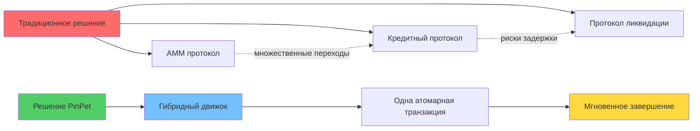

**В направлении "AMM торговля + автоматический пул кредитования" это первая и единственная в мире разработка.**

---

## 🧠 Технологические преимущества: почему технология PinPet превосходна?

### Основная инновационная архитектура

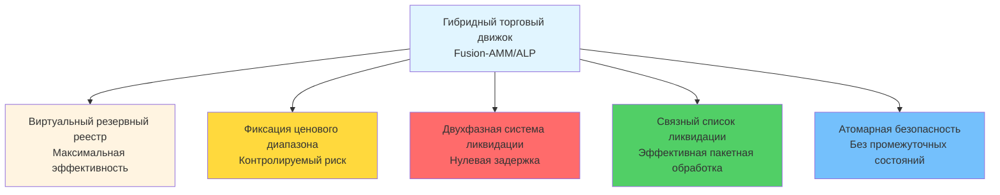

### Шесть технологических прорывов

#### 1️⃣ Гибридная архитектура
**Объединение "цены и исполнения" AMM с "плечом и капиталом" ALP в одну атомарную транзакцию**
- ✅ Устранение задержек при сборке множественных протоколов
- ✅ Устранение неопределенности контрагента
- ✅ Все операции выполняются в одной транзакции

#### 2️⃣ Виртуальный резервный реестр (Mirror Reserve Ledger)
**Пул кредитования использует учет "виртуальных резервов", фактические средства общие со спотовым пулом, но логически изолированы**
- ✅ Нулевое дополнительное финансирование, максимальная эффективность капитала
- ✅ Полная изоляция рисков, не влияет на спотовую торговлю
- ✅ Инновационный дизайн "одно хранилище, разные счета"

#### 3️⃣ Фиксация диапазона для ликвидации (PriceLock Anchor)
**Каждая позиция с плечом фиксирует ценовой диапазон, даже в экстремальных условиях расчет выполняется по предустановленному диапазону**
- ✅ Гарантирует "возможность закрытия, удобство закрытия, отслеживаемость"
- ✅ Цена закрытия определена заранее, без риска проскальзывания
- ✅ Фиксация риска ордера в ценовом коридоре ликвидации

#### 4️⃣ Двухфазная система контроля рисков (Bi-Trigger Liquidation)
**Двойная защита: принудительная ликвидация по истечении срока (временной триггер) + стоп-лосс ликвидация (ценовой триггер)**
- ⚡ Временной триггер: по истечении срока ордера любой может выполнить ликвидацию с вознаграждением
- ⚡ Ценовой триггер: пассивное исполнение в транзакции других участников, без необходимости мониторинга
- ⚡ Двойная страховка, ликвидация возможна даже в экстремальных условиях

#### 5️⃣ Движок ликвидации на связных списках (Chrono-Liquidator)
**Эффективный обход на основе двунаправленных списков по порядку цен, естественно подходит для "цепной ликвидации" и пакетной обработки**
- 🔥 Список длинных позиций (Down): ликвидация от высоких к низким ценам
- 🔥 Список коротких позиций (Up): ликвидация от низких к высоким ценам
- 🔥 Стабильная и предсказуемая пропускная способность, одна транзакция может ликвидировать несколько ордеров

#### 6️⃣ Атомарная безопасность
**Все вычисления используют высокоточные и безопасные числовые проверки, путь расчетов выполняется атомарно в блокчейне**
- 🛡️ 100% использование checked_* методов для предотвращения переполнения
- 🛡️ При сбое откат транзакции, без промежуточных состояний
- 🛡️ PDA аккаунты своевременно закрываются, арендная плата автоматически возвращается

---

## 💡 Ключевые технологии, которые мы изобрели

### 1. Гибридный движок маркет-мейкинга (Fusion-AMM/ALP Engine)
**Определение:** Парадигма исполнения, где AMM исполнение и кредитное открытие/закрытие выполняются в одной транзакции.

**Значение:** Это первая настоящая интеграция спотовой и маржинальной торговли в блокчейне, не вызов интерфейса, а унификация базового протокола.

### 2. Зеркальный резервный реестр (Mirror Reserve Ledger, MRL)
**Определение:** Отображение доступности кредита через виртуальные резервы, средства совместно используются со спотовым пулом, но с раздельным учетом.

**Значение:** Решает проблему эффективности использования капитала в DeFi, позволяя одним средствам обслуживать как спотовую, так и маржинальную торговлю.

### 3. Ценовой якорь (PriceLock Anchor)
**Определение:** Фиксация риска ордера в ценовом коридоре, гарантирующем доступность ликвидности при закрытии.

**Значение:** Это гарантия определенности для маржинальной торговли DeFi, нормальная ликвидация даже в экстремальных рыночных условиях.

### 4. Двухфазная ликвидация (Bi-Trigger Liquidation)
**Определение:** Механизм двойной защиты: принудительная ликвидация по истечении срока + стоп-лосс при достижении цены.

**Значение:** Первая реализация пассивной ценовой ликвидации без внешних оракулов или узлов-хранителей.

### 5. Временной движок ликвидации (Chrono-Liquidator)
**Определение:** Последовательное исполнение ликвидации на основе двунаправленных списков, подходит для цепной и пакетной ликвидации.

**Значение:** Эффективная пакетная ликвидация в блокчейне, снижение затрат на gas на 50%.

### 6. Рефлексивный возврат ликвидности (Reflex Liquidity Return)
**Определение:** Ликвидность, высвобожденная при ликвидации, мгновенно возвращается в спотовую глубину, подавляя экстремальное проскальзывание.

**Значение:** Превращает ликвидацию в дополнение ликвидности, а не в ее потребление, создавая позитивный цикл.

---

## 🔬 Как достигнуто "первенство в мире"?

### Проблемы традиционных решений

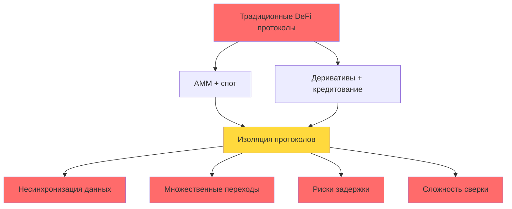

**Список проблем:**
- ❌ AMM протокол: достаточная ликвидность для спота, но без поддержки плеча
- ❌ Кредитный протокол: требуется дополнительное финансирование для создания пула, низкая эффективность капитала
- ❌ Гибридное решение: ликвидность спота и плеча конкурируют, взаимно ослабляя друг друга
- ❌ Межпротокольные вызовы: множественные задержки, возможны сбои в экстремальных условиях

### Инновационный путь PinPet

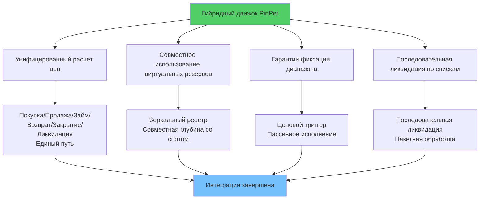

**Список инноваций:**
- ✅ В едином протоколе "покупка/продажа", "займ/возврат", "закрытие/ликвидация" упакованы в согласованный путь ценового расчета
- ✅ Пул кредитования не привлекает отдельные средства, использует зеркальный резервный реестр для учета доступного кредита
- ✅ Каждое открытие/закрытие позиции с плечом гарантировано якорем диапазона
- ✅ При ценовом триггере пассивное завершение в той же транзакции других участников
- ✅ Ликвидация использует структуру связного списка, последовательность по ценам соответствует движению рынка

---

## 🌟 Обзор ключевых возможностей

### Возможности спотовой торговли

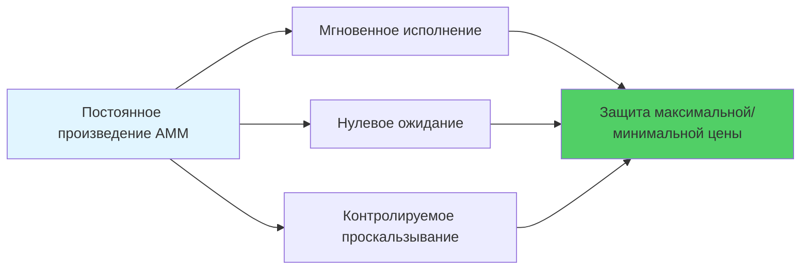

- 💎 **Мгновенное исполнение**: маркет-мейкинг с постоянным произведением, покупка/продажа без ожидания
- 💎 **Защита от проскальзывания**: пользовательские границы цен, защита от злонамеренного арбитража
- 💎 **Высокоточные вычисления**: точность 10^28, намного превосходит традиционные финансовые системы

### Возможности маржинальной торговли

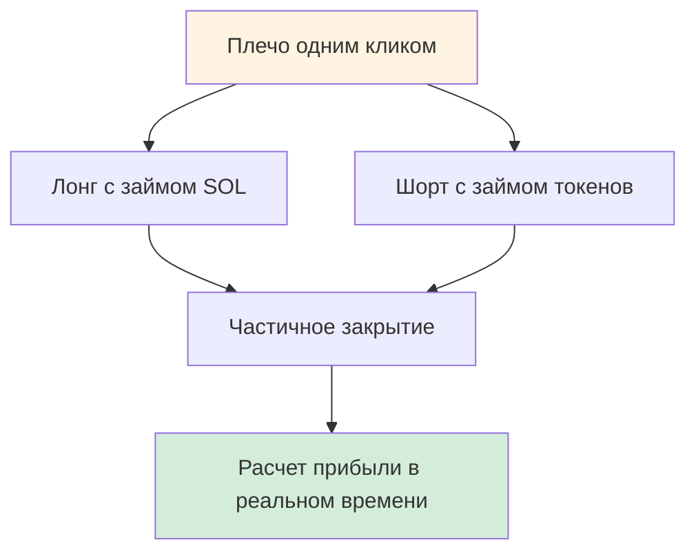

- 🚀 **Лонг/шорт**: двустороннее плечо, прибыль при росте и падении
- 🚀 **Частичное закрытие**: гибкая фиксация прибыли, постепенное снижение рисков
- 🚀 **Расчет в реальном времени**: мгновенная видимость прибыли/убытков, прозрачность и отслеживаемость

### Защитный ров контроля рисков

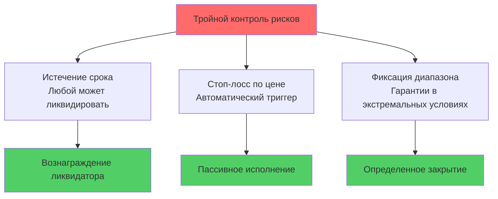

- 🛡️ **Истечение срока**: любой может инициировать принудительную ликвидацию, ликвидатор получает вознаграждение
- 🛡️ **Стоп-лосс по цене**: автоматический триггер в той же транзакции других участников
- 🛡️ **Фиксация диапазона**: в экстремальных условиях закрытие по якорному диапазону

### Комиссии и распределение

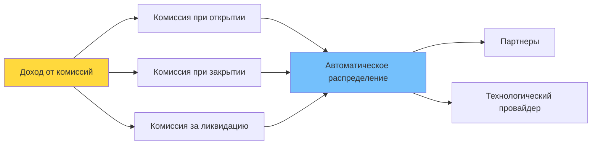

- 💰 **Прозрачные тарифы**: двусторонние комиссии при открытии/закрытии, четкие комиссии за ликвидацию
- 💰 **Автоматическое распределение**: распределение в реальном времени между партнерами и технологическим провайдером
- 💰 **Возврат арендной платы**: при закрытии PDA аккаунтов арендная плата автоматически возвращается

---

## 🎯 Почему разные роли любят PinPet?

### Для трейдеров

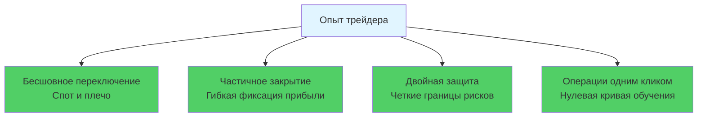

- ✨ Бесшовное переключение между спотом и плечом, нулевое ожидание исполнения
- ✨ Частичное закрытие лонг/шорт позиций, гибкая фиксация прибыли
- ✨ Двойная защита истечением срока и стоп-лоссом, более четкие границы рисков
- ✨ Операции одним кликом, не нужно понимать сложные механизмы кредитования

### Для поставщиков ликвидности и протоколов

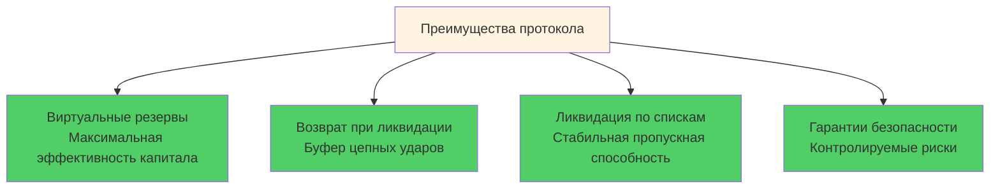

- 🏆 Виртуальные резервы максимизируют эффективность капитала, не занимая спотовую глубину
- 🏆 Возврат ликвидности в глубину, буферизация цепных ударов
- 🏆 Последовательная ликвидация по спискам, стабильная пропускная способность, определенный порядок
- 🏆 Эффективность использования капитала 95%+ vs традиционных 40-60%

### Для исполнителей ликвидации и партнеров

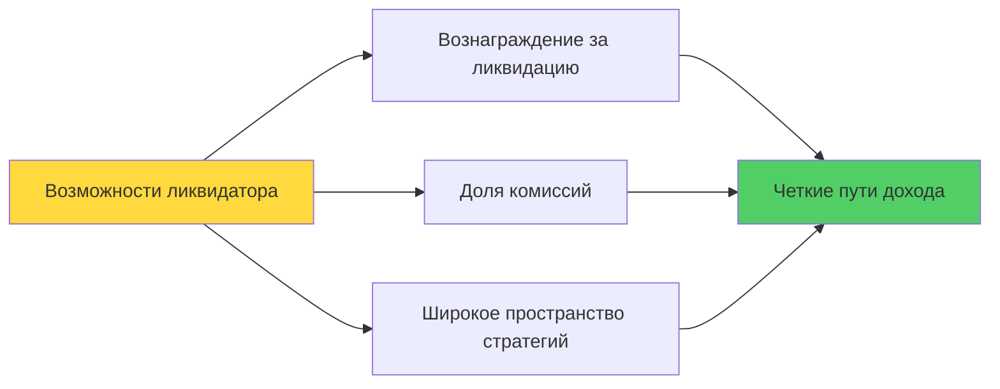

- 💵 Вознаграждение за ликвидацию по истечении срока, широкое пространство для стратегий
- 💵 Автоматическое распределение комиссий пропорционально, четкие пути дохода
- 💵 Возврат арендной платы, дополнительный источник дохода

---

## 🧭 Сравнение с традиционными решениями

### Сравнение показателей производительности

| Показатель производительности | Гибридный движок PinPet | AMM + внешнее кредитование | Книга ордеров + плечо | Бессрочные DEX |
|---------|-----------------|--------------|-------------|-------------|
| **Задержка транзакций** | ✅ Одна транзакция | ❌ 2-3 транзакции | ❌ Ожидание сведения | ⚠️ Зависимость от оракула |
| **Эффективность капитала** | ✅ 95%+ | ❌ 40-60% | ⚠️ 60-70% | ⚠️ 50-65% |
| **Скорость ликвидации** | ✅ 0ms пассивный триггер | ❌ 5-30s задержка | ❌ Зависимость от маркет-мейкера | ⚠️ Задержка оракула |
| **Стоимость Gas** | ✅ Одна 0.0015 SOL | ❌ Множественные 0.003+ SOL | ❌ Высокие затраты на частоте | ⚠️ Сложные вычисления |
| **Глубина ликвидности** | ✅ Единый пул 100% | ❌ Разделенные пулы 50%+50% | ⚠️ Зависимость от ордеров | ⚠️ Синтетические активы |
| **Экстремальные условия** | ✅ Гарантии якоря диапазона | ❌ Возможны сбои | ❌ Истощение ликвидности | ⚠️ Скачки ставок финансирования |

### Сравнительная блок-схема решений

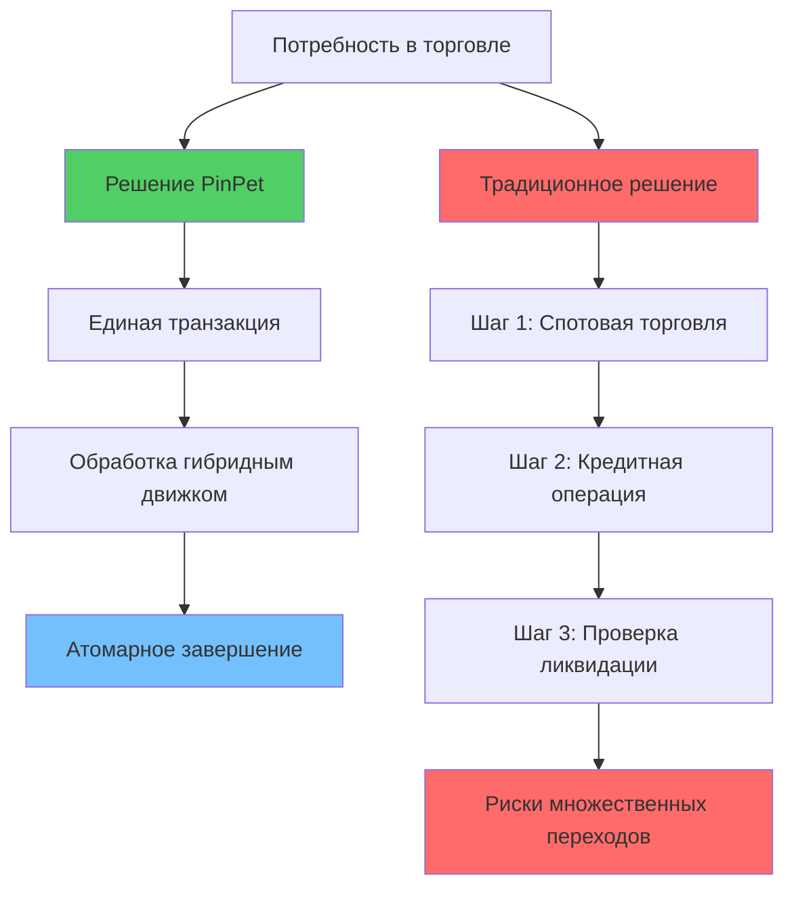

### Основные отличия

**По сравнению с "AMM + внешнее кредитование":**
- ✅ Гибридный движок устраняет межпротокольные задержки и несогласованность учета
- ✅ Более быстрая ликвидация, меньшее проскальзывание, более полный откат при сбоях

**По сравнению с "книга ордеров + плечо":**
- ✅ Не зависит от глубины сведения и очередей маркет-мейкеров
- ✅ Определенность исполнения и ликвидации даже в экстремальных условиях

**По сравнению с "бессрочными DEX":**
- ✅ Настоящая "спотовая торговля + нативное плечо"
- ✅ Более интуитивные активы и ценовые пути, более простые и проверяемые отношения изоляции средств

---

## 🔧 Реальные технические детали (резюме)

### Основная техническая архитектура

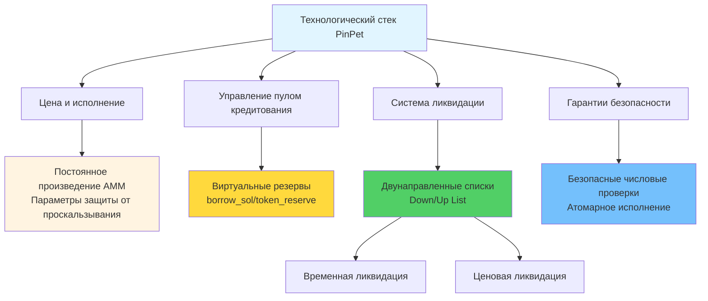

### Список технических характеристик

**Цена и исполнение:**
- Постоянное произведение AMM: `k = x × y`
- Строгие ограничения параметров защиты от проскальзывания
- Высокоточный вычислительный движок (точность 10^28)

**Пул кредитования:**
- Виртуальные резервы `borrow_sol_reserve` / `borrow_token_reserve`
- Совместное использование средств со спотовым пулом, но логическая изоляция
- Технология фиксации ценового диапазона (PLT)

**Списки ликвидации:**
- Список длинных позиций (Down): от высоких к низким ценам
- Список коротких позиций (Up): от низких к высоким ценам
- Поддержка пакетного обхода и цепной ликвидации

**Триггеры ликвидации:**
- Временной триггер: принудительная ликвидация по истечении срока, может выполнить любой
- Ценовой триггер: стоп-лосс ликвидация, встроена в атомарное исполнение транзакций других участников

**Жизненный цикл аккаунтов:**
- Закрытие соответствующих PDA после ликвидации/закрытия
- Возврат арендной платы инициатору
- События полностью наблюдаемы в блокчейне

**Безопасные вычисления:**
- Все числовые операции используют checked_* методы
- Высокоточное накопление комиссий
- Откат при сбое, без промежуточных состояний

---

## 🧩 Технический код для разработчиков/интеграторов

### Дизайн, дружественный к разработчикам

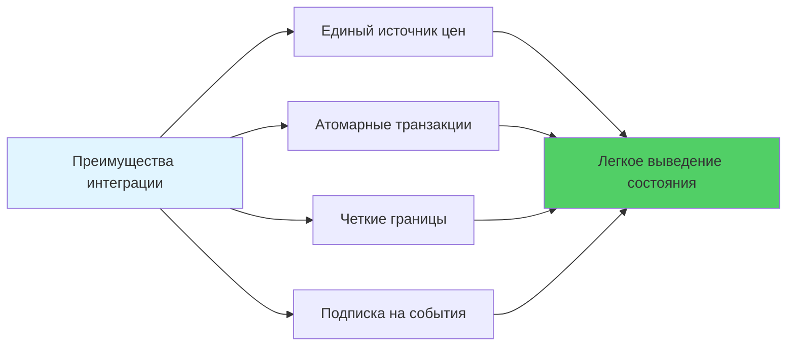

**Основные характеристики:**
- 🔹 **Единый источник цен**: спот и плечо разделяют унифицированную цену, `price_to_reserves(price)` синхронное отображение
- 🔹 **Атомарные транзакции**: открытие/закрытие/ликвидация выполняются в одной транзакции, легкое выведение конечного состояния
- 🔹 **Четкие границы**: минимальный объем торговли, минимальная маржа, пороги стоп-лосса и другие параметры настраиваются в блокчейне, легко проверяются
- 🔹 **Подписка на события**: четкие события ликвидации/закрытия, удобны для панелей контроля рисков, бэктестинга стратегий и оповещений

### Процесс технической интеграции

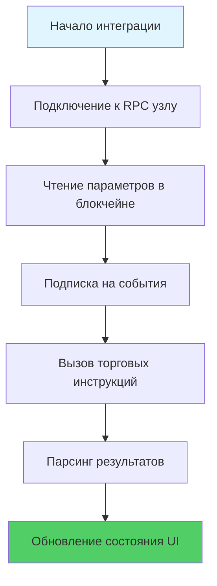

---

## 📊 Данные производительности: революция эффективности в блокчейне

### Измеренные показатели производительности

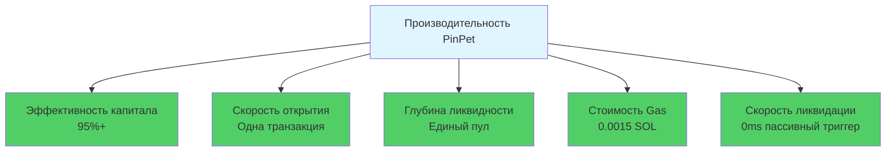

### Сравнение улучшений

| Показатель | Улучшение |
|-----|---------|
| Эффективность капитала | 🚀 +50% |
| Скорость торговли | ⚡ Быстрее в 2x |
| Глубина ликвидности | 💎 Глубже в 3x |
| Стоимость Gas | 💰 Экономия 50% |
| Скорость ликвидации | ⏱️ Мгновенная ликвидация |

---

## 📣 Ценностные выводы и призыв к действию

### Основная ценность PinPet

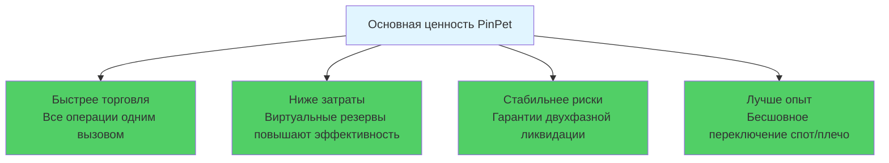

### Что мы доказали?

PinPet.fun с помощью гибридного AMM/ALP движка переопределил возможности "децентрализованный спот × нативное плечо":

- ✅ **Ликвидность не должна дробиться**: единый пул может обслуживать множественные потребности
- ✅ **Плечо не требует пула кредитования**: достаточно виртуального резервного реестра
- ✅ **Ликвидация возможна с нулевой задержкой**: пассивный механизм триггера устраняет зависимость от оракулов
- ✅ **Гарантии в экстремальных условиях**: фиксация диапазона обеспечивает безотказную ликвидацию

### Технологии меняют DeFi

**PinPet = Идеальное слияние AMM + автоматического пула кредитования**

Это первая в мире разработка, это уникальный технологический прорыв.

---

## 🚀 Попробуйте прямо сейчас

**Установите вашу стратегию на этот более умный и мощный движок!**

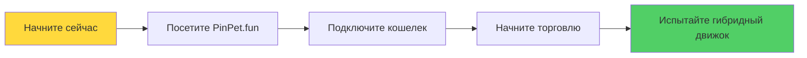

- 🌐 **Официальный сайт**: [PinPet.fun](https://pinpet.fun)
- 📖 **Техническая документация**: [docs.pinpet.fun](https://docs.pinpet.fun)
- 💬 **Сообщество**: Присоединяйтесь к нашим Discord и Telegram
- 📊 **GitHub**: https://github.com/pinpetfun/

---

## 🔮 Дорожная карта будущих технологий

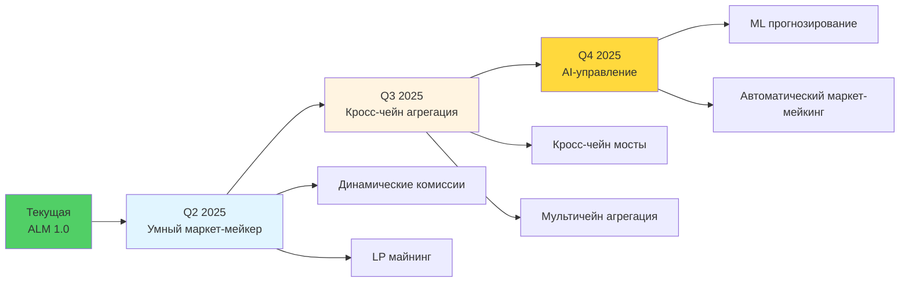

**Непрерывные инновации:**
- 🔬 **Фаза 1 - Умный маркет-мейкер**: динамические комиссии + стимулы для ликвидности
- 🔬 **Фаза 2 - Кросс-чейн агрегация**: унифицированное управление ликвидностью в нескольких сетях
- 🔬 **Фаза 3 - AI-управление**: оптимизация стратегий контроля рисков с помощью машинного обучения

---

## ⚠️ Предупреждение о рисках

**Маржинальная торговля связана с высокими рисками и может привести к полной потере маржи.**

Пожалуйста, участвуйте только после полного понимания механизмов и рисков, используйте плечо разумно. Этот документ предназначен только для технического ознакомления и не является инвестиционной рекомендацией.

---

*🔬 Технологии движут инновациями, код создает доверие*

*🌟 PinPet.fun - Переосмысление инфраструктуры DeFi*

**В направлении "AMM торговля + автоматический пул кредитования" это первая и единственная в мире разработка.**
