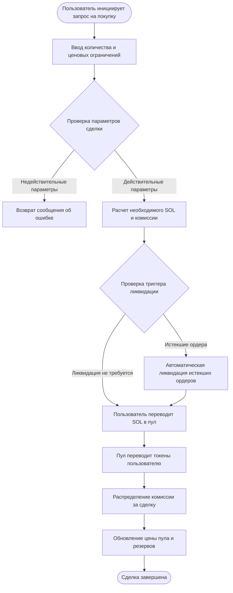
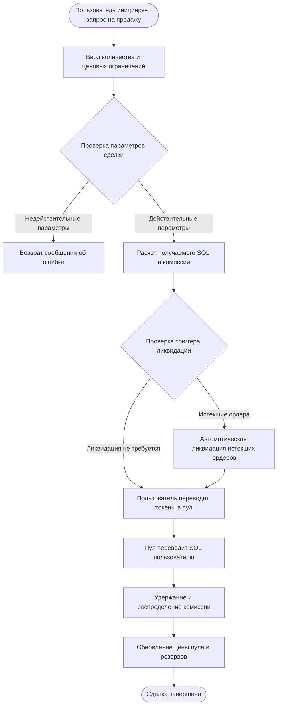

# 💱 Введение в функционал спотовой торговли PinPet

## 📊 Обзор функционала

Спотовая торговля является одной из ключевых функций платформы PinPet, позволяя пользователям напрямую покупать и продавать токены в децентрализованных пулах ликвидности. В отличие от традиционной модели книги заявок, PinPet использует механизм автоматического маркет-мейкера (AMM), основанный на алгоритме постоянного произведения (x × y = k) для автоматического определения цен торговли.

**✨ Основные особенности:**
- **⚡ Мгновенное исполнение**: Нет необходимости ждать сопоставления покупателей и продавцов, сделки завершаются немедленно
- **🔍 Прозрачное ценообразование**: Цены рассчитываются автоматически алгоритмом, открыто и прозрачно
- **🌊 Непрерывная ликвидность**: Торговля доступна в любое время при наличии достаточных активов в пуле
- **🛡️ Защита от проскальзывания**: Пользователи могут установить максимальные/минимальные ценовые ограничения для предотвращения аномальных колебаний цен

---

## 🛒 Процесс покупки (Buy)

### 👤 Шаги пользователя

Сделка покупки позволяет пользователям приобретать токены проекта, используя SOL (нативный токен Solana).

### 🔑 Описание ключевых параметров

| Название параметра | Назначение | Пример значения | Примечание |
|---------|---------|--------|------|
| buy_token_amount | Желаемое количество токенов для покупки | 1000000 (1 токен) | Минимальное значение: 1000000 (1 токен) |
| max_sol_amount | Максимальное количество SOL для оплаты | 50000000 (0.05 SOL) | Используется для предотвращения чрезмерного проскальзывания |
| lp_pairs | Снимок состояния пула ликвидности | [{sol: 30, token: 1000000}] | Автоматически предоставляется фронтендом |

### ⚙️ Логика выполнения сделки

1. **Проверка параметров**
   - Проверка достижения минимального объема сделки (1 токен)
   - Проверка соответствия состояния пула ликвидности с он-чейн данными

2. **Расчет цены**
   - На основе текущих резервов пула, использование формулы постоянного произведения для расчета необходимого SOL
   - Расчет фактической суммы платежа, включая комиссию
   - Проверка, не превышает ли фактическая цена исполнения установленное пользователем максимальное значение

3. **Механизм автоматической ликвидации**
   - Если сделка приведет к пересечению цены с ценой ликвидации некоторых ордеров с плечом, система автоматически ликвидирует эти ордера
   - Комиссия от ликвидации распределяется между платформой и партнерами

4. **Перевод средств**
   - Счет пользователя → Пул ликвидности: Перевод SOL (включая комиссию)
   - Пул ликвидности → Счет пользователя: Перевод токенов

5. **Распределение комиссии**
   - Распределение по заданным пропорциям между партнерами и техническим провайдером
   - Ставка комиссии по умолчанию может быть настроена администратором

6. **Обновление состояния**
   - Обновление текущей цены пула ликвидности
   - Пересчет резервов SOL и токенов в пуле
   - Проверка срабатывания скидки на комиссию

---

## 💸 Процесс продажи (Sell)

### 👤 Шаги пользователя

Сделка продажи позволяет пользователям продавать свои токены и получать SOL.

### 🔑 Описание ключевых параметров

| Название параметра | Назначение | Пример значения | Примечание |
|---------|---------|--------|------|
| sell_token_amount | Желаемое количество токенов для продажи | 1000000 (1 токен) | Минимальное значение: 1000000 (1 токен) |
| min_sol_output | Ожидаемое минимальное количество SOL | 20000000 (0.02 SOL) | Используется для предотвращения чрезмерного проскальзывания |
| lp_pairs | Снимок состояния пула ликвидности | [{sol: 30, token: 1000000}] | Автоматически предоставляется фронтендом |

### ⚙️ Логика выполнения сделки

1. **Проверка параметров**
   - Проверка достижения минимального объема сделки (1 токен)
   - Проверка достаточности баланса токенового счета пользователя
   - Подтверждение действительности состояния пула ликвидности

2. **Расчет цены**
   - На основе текущих резервов пула, использование формулы постоянного произведения для расчета получаемого SOL
   - Расчет фактической суммы к получению после вычета комиссии
   - Проверка, не ниже ли фактическая цена исполнения установленного пользователем минимального значения

3. **Механизм автоматической ликвидации**
   - Если сделка приведет к пересечению цены с ценой ликвидации некоторых ордеров с плечом, система автоматически ликвидирует эти ордера
   - Распределение комиссии от ликвидации и вознаграждения за ликвидацию

4. **Перевод средств**
   - Счет пользователя → Пул ликвидности: Перевод токенов
   - Пул ликвидности → Счет пользователя: Перевод SOL (после вычета комиссии)

5. **Обработка комиссии**
   - Удержание комиссии из причитающегося SOL
   - Распределение пропорционально между партнерами и техническим провайдером

6. **Обновление состояния**
   - Обновление текущей цены пула ликвидности (снижение цены)
   - Пересчет резервов SOL и токенов в пуле
   - Проверка срабатывания скидки на комиссию

---

## 💡 Примеры использования

### 📈 Сценарий 1: Обычная покупка

**Контекст:**
- Текущая цена: 1 токен = 0.03 SOL
- Пользователь хочет купить 10 токенов
- Ставка комиссии: 1%

**Процесс операции:**
1. Пользователь устанавливает количество покупки: 10,000,000 (10 токенов)
2. Пользователь устанавливает максимальный платеж: 0.35 SOL (350,000,000)
3. Система рассчитывает фактическую необходимость: 0.303 SOL (включая комиссию)
4. Проверка цены пройдена (не превышает максимальный лимит)
5. Выполнение сделки:
   - Пользователь платит 0.303 SOL
   - Получает 10 токенов
   - Комиссия 0.003 SOL распределяется платформе
6. Цена после сделки повышается до: 0.0303 SOL/токен

---

### 📉 Сценарий 2: Продажа с триггером автоматической ликвидации

**Контекст:**
- Текущая цена: 1 токен = 0.05 SOL
- Существует длинный ордер с ценой ликвидации 0.048 SOL
- Пользователь хочет продать 50 токенов

**Процесс операции:**
1. Пользователь устанавливает количество продажи: 50,000,000 (50 токенов)
2. Пользователь устанавливает минимальный доход: 2.3 SOL
3. Система обнаруживает, что продажа приведет к падению цены ниже 0.048 SOL
4. Система автоматически ликвидирует длинный ордер:
   - Расчет прибыли/убытка ордера
   - Взимание комиссии за ликвидацию
   - Закрытие счета ордера, возврат аренды
5. Продолжение выполнения сделки продажи:
   - Пользователь переводит 50 токенов
   - Получает 2.4 SOL (после вычета комиссии)
6. Цена после сделки снижается до: 0.047 SOL/токен

---

### 🛡️ Сценарий 3: Срабатывание защиты от проскальзывания

**Контекст:**
- Текущая цена: 1 токен = 0.02 SOL
- Пользователь хочет купить 1000 токенов
- Пул ликвидности небольшой, крупная сделка вызовет значительное проскальзывание

**Процесс операции:**
1. Пользователь устанавливает количество покупки: 1,000,000,000 (1000 токенов)
2. Пользователь устанавливает максимальный платеж: 21 SOL
3. Система рассчитывает фактическую необходимость: 22.5 SOL (включая комиссию)
4. Проверка цены не пройдена (превышает максимальный лимит пользователя)
5. Сделка отклонена, возвращено сообщение об ошибке
6. Пользователь может выбрать:
   - Повысить максимальный лимит платежа
   - Уменьшить количество покупки
   - Покупать частями

---

## ⚠️ Важные замечания и ограничения

### 🚫 Ограничения сделок

| Пункт ограничения | Конкретные требования | Объяснение причины |
|---------|---------|---------|
| Минимальный объем сделки | 1,000,000 (1 токен) | Предотвращение влияния слишком мелких сделок на эффективность системы |
| Максимальная ставка комиссии | 10% | Защита пользователей от чрезмерных комиссий |
| Проверка ликвидности | Необходимо предоставить снимок текущего состояния пула | Обеспечение согласованности он-чейн и офф-чейн состояний |
| Защита от проскальзывания | Обязательное заполнение max_sol_amount / min_sol_output | Предотвращение убытков от аномальных колебаний цен |

### ⚠️ Предупреждения о рисках

1. **📊 Риск колебаний цен**
   - Крупные сделки вызовут значительное проскальзывание цены
   - Рекомендуется разделять крупные сделки на части для снижения ценового воздействия
   - Устанавливайте разумную толерантность к проскальзыванию

2. **💰 Стоимость комиссий**
   - Каждая сделка влечет комиссию
   - Частые мелкие сделки накапливают высокую стоимость комиссий
   - Рекомендуется объединять сделки для снижения затрат

3. **💧 Риск ликвидности**
   - При недостаточной ликвидности крупные сделки могут не завершиться
   - Резервы пула влияют на цену исполнения
   - Следите за запасами SOL и токенов в пуле

4. **🔄 Влияние автоматической ликвидации**
   - Сделка может вызвать автоматическую ликвидацию ордеров с плечом
   - Ликвидация потребляет часть ликвидности
   - Может повлиять на финальную цену исполнения

### 🔧 Технические требования

**👛 Требования к пользователям:**
- Наличие кошелька Solana (например, Phantom, Solflare)
- Достаточное количество SOL на счете для торговли и оплаты комиссий за транзакции
- Перед торговлей токенами необходимо создать соответствующий токеновый счет (обычно обрабатывается автоматически фронтендом)

**💵 Структура комиссий за сделки:**
- Комиссия сети Solana: около 0.000005 SOL (плата за подпись транзакции)
- Комиссия за сделку: взимается в процентах от суммы сделки (настраивается администратором)
- Аренда счета: единовременный платеж при создании нового счета (возвратный)

### ❓ Часто задаваемые вопросы

**Вопрос: Потеряю ли я комиссию, если сделка не удалась?**
Ответ: ✅ Нет. Если сделка отклонена из-за неудачной проверки параметров, никакая комиссия не удерживается, будет потрачена только небольшая комиссия сети Solana (около 0.000005 SOL).

**Вопрос: Как получить оптимальную цену исполнения?**
Ответ: 💡 Торгуйте в периоды достаточной ликвидности, избегайте слишком больших объемов в одной сделке, следите за соотношением SOL/Token в пуле, выбирайте подходящий момент для торговли.

**Вопрос: Повлияет ли автоматическая ликвидация на мою сделку?**
Ответ: ⚠️ Возможно. Если ваша сделка вызовет ликвидацию ордеров с плечом других пользователей, это потребляет часть ликвидности и может привести к небольшому отклонению фактической цены от ожидаемой, но всё еще в пределах установленного вами диапазона проскальзывания.

**Вопрос: Распространенные причины отклонения сделки?**
Ответ: ❌ Распространенные причины включают:
- Количество покупки или продажи ниже минимального объема сделки (1 токен)
- Фактическая цена исполнения превышает установленный вами диапазон защиты от проскальзывания
- Недостаточный баланс счета (SOL или токены)
- Истекший снимок состояния пула ликвидности (фронтенд должен получить новый)

**Вопрос: Как рассчитывается и распределяется комиссия?**
Ответ: 💰 Комиссия взимается в определенном проценте от суммы сделки (по умолчанию 1%, может быть скорректирована администратором), после взимания распределяется по заданным пропорциям между партнерами и техническим провайдером. В некоторых случаях может действовать скидка на комиссию.

---

## 🔗 Связанные функции

- **📊 Торговля с плечом**: Использование механизма займа для длинных/коротких позиций
- **💧 Управление ликвидностью**: Просмотр и управление состоянием пулов ликвидности
- **🪙 Создание токенов**: Создание новых торговых пар токенов
- **📋 Управление ордерами**: Просмотр и управление ордерами с плечом

---

*📝 Примечание: Данный документ является описанием функционала продукта и не включает технические детали реализации. Для получения информации о разработке обратитесь к технической документации проекта.*
