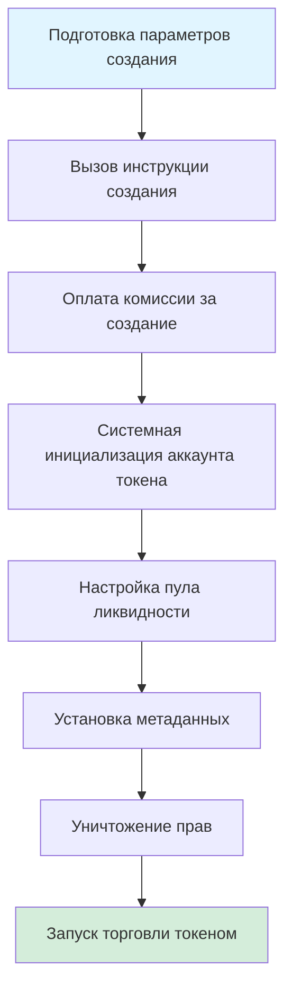
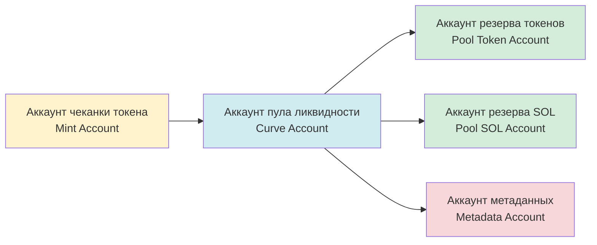
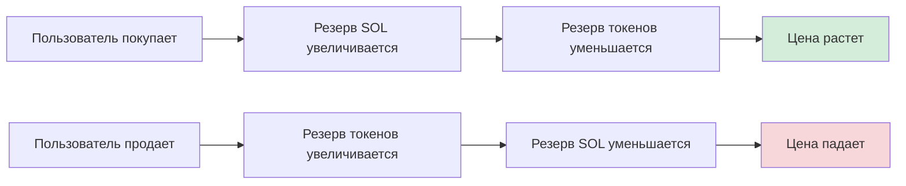

# 🪙 Введение в функцию создания токенов PinPet

## Часть I: 📋 Обзор функционала

### 💎 Что такое создание токенов

Создание токенов — это одна из основных функций платформы PinPet, позволяющая пользователям выпускать новые SPL-токены (стандартные токены блокчейна Solana) в один клик с автоматической настройкой торговой площадки. С помощью этой функции пользователи могут быстро создавать токены с полными метаданными, автоматической поддержкой ликвидности и мгновенной торговой способностью без глубокого понимания сложных технологий блокчейна.

### ❓ Зачем нужно создавать токены

**⚠️ Болевые точки традиционного выпуска токенов:**
- Требуются профессиональные технические знания (программирование Solana, стандарт SPL Token)
- Ручная настройка прав чеканки, пулов ликвидности, метаданных и других этапов
- Отсутствие немедленной ликвидности и торговой площадки
- Сложная настройка безопасности (уничтожение прав, защита от дополнительной эмиссии и т.д.)

**✅ Преимущества создания токенов PinPet:**
- **⚡ Выпуск в один клик**: требуется только три базовых параметра — название токена, символ и иконка
- **🚀 Мгновенный запуск**: торговля возможна сразу после создания без ожидания накопления ликвидности
- **🔒 Автоматическая настройка безопасности**: автоматическое уничтожение прав чеканки и заморозки для предотвращения злонамеренной дополнительной эмиссии
- **🏦 Встроенная торговая площадка**: основана на алгоритме AMM с постоянным произведением, поддерживает спотовую и маржинальную торговлю
- **✔️ Соответствующие метаданные**: соответствуют стандарту Metaplex, автоматически распознаются кошельками и биржами

### ⭐ Основные характеристики

| Характеристика | Описание |
|------|------|
| Стандарт токена | SPL Token (официальный стандарт Solana) |
| Точность | 6 десятичных знаков (1 токен = 1 000 000 минимальных единиц) |
| Общее предложение | 1 609 500 000 000 000 единиц (фиксированное предложение, дополнительная эмиссия невозможна) |
| Стандарт метаданных | Metaplex Token Metadata |
| Начальная цена | Примерно 0.0000000000279589934762 SOL/токен |
| Модель ликвидности | AMM с постоянным произведением (x × y = k) |

---

## Часть II: 🔄 Процесс создания токена

### 👤 Шаги действий пользователя



### 📊 Подробное описание процесса

#### 📝 Этап первый: Подготовка параметров
Пользователь должен предоставить три базовых параметра:

| Параметр | Тип | Описание | Пример |
|------|------|------|------|
| name | Строка | Полное название токена | "PinPet Token" |
| symbol | Строка | Символ токена (3-10 символов) | "PINPET" |
| uri | Строка | Ссылка на JSON-файл метаданных | "https://example.com/metadata.json" |

#### 🔧 Этап второй: Инициализация аккаунтов
Система автоматически создает и настраивает следующие аккаунты:



#### 💧 Этап третий: Инициализация пула ликвидности
Система автоматически настраивает два пула средств:

**1. Спотовый пул ликвидности (LP Pool)**
- Резерв токенов: 1 073 000 000 000 000 единиц
- Резерв SOL: 30 SOL (виртуальный баланс)
- Реальный SOL: 10 000 lamports (для предотвращения нехватки баланса)
- Назначение: поддержка спотовой торговли (покупка/продажа)

**2. Пул маржинального кредитования (Borrow Pool)**
- Резерв токенов: 536 500 000 000 000 единиц
- Резерв SOL: 10 000 000 SOL (виртуальный баланс)
- Назначение: поддержка маржинальной торговли (лонг/шорт)

**📊 Диаграмма распределения средств:**
```
💰 Общее предложение: 1 609 500 000 000 000 единиц
├── Спотовый пул ликвидности: 1 073 000 000 000 000 (66,67%)
└── Пул маржинального кредитования: 536 500 000 000 000 (33,33%)
```

#### 📄 Этап четвертый: Создание метаданных
Система вызывает программу Metaplex Token Metadata для создания метаданных токена:

| Поле метаданных | Содержание | Описание |
|-----------|------|------|
| name | Название, предоставленное пользователем | Название токена, отображаемое в кошельке |
| symbol | Символ, предоставленный пользователем | Краткое обозначение токена |
| uri | Ссылка, предоставленная пользователем | Указывает на JSON с иконкой, описанием и другой информацией |
| creators | Адрес создателя | Отмечает создателя токена, неверифицированный статус |
| seller_fee_basis_points | 0 | Ставка роялти (установлена на 0) |
| is_mutable | true | Разрешает обновление метаданных |

**📋 Пример стандартного формата JSON метаданных:**
```json
{
  "name": "PinPet Token",
  "symbol": "PINPET",
  "description": "Токен, выпущенный на платформе PinPet",
  "image": "https://example.com/logo.png",
  "attributes": [],
  "properties": {
    "files": [
      {
        "uri": "https://example.com/logo.png",
        "type": "image/png"
      }
    ]
  }
}
```

#### 🔒 Этап пятый: Уничтожение прав
Для обеспечения безопасности и неизменности токена система автоматически выполняет:

| Операция | Цель | Эффект |
|------|------|------|
| Уничтожение прав чеканки | Предотвращение дополнительной эмиссии | Общее предложение заблокировано навсегда |
| Уничтожение прав заморозки | Предотвращение заморозки аккаунтов пользователей | Токен навсегда остается в обращении |

#### 💵 Этап шестой: Настройка комиссий
Система считывает настройки комиссий из аккаунта параметров партнера:

| Тип комиссии | Значение по умолчанию | Описание |
|---------|--------|------|
| Комиссия спотовой торговли | 1% | Взимается при покупке/продаже |
| Комиссия маржинальной торговли | 0,25% | Взимается при маржинальной торговле |
| Флаг скидки на комиссию | 0 (полная цена) | Может автоматически корректироваться в зависимости от объема торговли |
| Соотношение распределения комиссии | 20%/80% | Соотношение распределения между техническим провайдером/партнером |

---

## Часть III: 💧 Механизм пула ликвидности

### 🔢 Формула постоянного произведения

PinPet использует модель автоматического маркетмейкера (AMM), основная формула:

```
x × y = k
```

Где:
- **x**: резерв SOL
- **y**: резерв токенов
- **k**: постоянное произведение (начальное значение = 30 × 1 073 000 000 = 32 190 000 000)

### 💰 Расчет начальной цены

```
Начальная цена = Резерв SOL ÷ Резерв токенов
         = 30 ÷ 1 073 000 000
         ≈ 0.0000000279589934762 SOL/токен
```

### 📈 Механизм изменения цены



### 🛡️ Защита от проскальзывания цены

Для защиты пула ликвидности система использует множественные механизмы безопасности:

| Защитная мера | Описание |
|---------|------|
| Фактор точности | Цена использует фактор точности 10^26 для избежания ошибок округления |
| Проверка переполнения | Все вычисления используют методы `checked_*` для предотвращения переполнения |
| Верхний лимит цены | Максимальная цена ограничена 50 000 000 000 000 000 000 000 000 000 |
| Нижний лимит цены | Минимальная цена ограничена 0.000000001 (для предотвращения деления на ноль) |

---

## Часть IV: 📝 Описание метаданных токена

### ✅ Стандарт Metaplex

PinPet использует стандарт Metaplex Token Metadata v5.1.1 для обеспечения совместимости токена в экосистеме Solana:

**✨ Преимущества стандарта:**
- 💳 Автоматическое распознавание популярными кошельками (Phantom, Solflare)
- 🔄 Автоматический сбор информации DEX-платформами (Jupiter, Raydium)
- 🎨 Автоматическая индексация NFT-маркетплейсами и агрегаторами
- 🔍 Полное отображение в блокчейн-обозревателях (Solscan, Solana Explorer)

### 🗂️ Структура аккаунта метаданных

```
Адрес аккаунта метаданных (PDA)
├── Сид деривации: ["metadata", Metaplex Program ID, Mint Address]
├── Хранимое содержимое:
│   ├── Название токена
│   ├── Символ токена
│   ├── URI (ссылка на JSON метаданных)
│   ├── Информация о создателе
│   ├── Настройки роялти
│   └── Информация о коллекции (опционально)
└── Права:
    ├── Право на обновление: аккаунт пула ликвидности (PDA)
    └── Изменяемость: true (разрешено обновление)
```

### 🌐 Рекомендации по хостингу URI

| Способ хостинга | Преимущества | Недостатки | Применимость |
|---------|------|------|---------|
| IPFS | Децентрализация, постоянное хранение | Относительно медленный доступ | Долгосрочные проекты |
| Arweave | Постоянное хранение, быстрая скорость | Платная услуга | Ценные токены |
| Облачное хранилище (AWS S3/CDN) | Быстро, дешево | Централизованное, возможен отказ | Тестовые или краткосрочные проекты |

---

## Часть V: 🎯 Примеры сценариев использования

### 🚀 Сценарий 1: Стартап выпускает проектный токен

**Потребность:**
Web3-стартап хочет выпустить токен управления для своего DeFi-проекта

**Процесс работы:**
1. Разработка иконки токена и описательной документации
2. Загрузка JSON метаданных на IPFS
3. Подготовка параметров:
   - name: "SuperDeFi Governance Token"
   - symbol: "SDEFI"
   - uri: "https://ipfs.io/ipfs/QmXXX..."
4. Вызов инструкции создания PinPet, оплата небольшой комиссии за создание
5. Токен запускается мгновенно, члены команды и сообщество могут торговать немедленно

**✅ Преимущества:**
- ⚡ Не требуется написание смарт-контрактов
- 💧 Встроенный рынок ликвидности
- 🔒 Безопасность обеспечивается протоколом

---

### 🎉 Сценарий 2: Выпуск мем-токена сообщества

**Потребность:**
Сообщество хочет выпустить тематический мем-токен для развлечения и торговли

**Процесс работы:**
1. Голосование сообщества для определения названия токена и иконки
2. Использование бесплатного хостинга изображений для размещения картинки
3. Подготовка параметров:
   - name: "Doge to the Moon"
   - symbol: "DMOON"
   - uri: "https://cloudinary.com/dmoon.json"
4. Любой член сообщества инициирует создание
5. Члены сообщества немедленно начинают торговать

**✅ Преимущества:**
- 💰 Быстрый выпуск с низкими затратами
- 👥 Не требуется техническая подготовка
- 🔒 Автоматический механизм защиты от дополнительной эмиссии

---

### 🎨 Сценарий 3: NFT-проект выпускает утилитарный токен

**Потребность:**
Создатели NFT-проекта хотят выпустить сопутствующий утилитарный токен для стимулирования экосистемы

**Процесс работы:**
1. Разработка образа токена, соответствующего стилю NFT
2. Подготовка подробного вайтпейпера токена
3. Использование Arweave для постоянного хранения метаданных
4. Подготовка параметров:
   - name: "CryptoArt Utility Token"
   - symbol: "CART"
   - uri: "ar://abc123..."
5. Создание токена и настройка аккаунта получения комиссий
6. Держатели NFT могут стейкать для получения вознаграждений в токенах

**✅ Преимущества:**
- 💾 Постоянное хранение метаданных
- 🔗 Бесшовная интеграция с NFT-экосистемой
- 📊 Поддержка сложных экономических моделей

---

## Часть VI: ⚠️ Важные моменты и ограничения

### 📝 Подготовительная работа перед созданием

| Пункт проверки | Описание |
|--------|------|
| Баланс кошелька | Убедитесь, что достаточно SOL для оплаты комиссии за создание (примерно 0,01-0,05 SOL) |
| Подготовка метаданных | JSON-файл загружен и доступен |
| Информация о токене | Название и символ соответствуют стандартам, без двусмысленности |
| Аккаунт партнера | Создан аккаунт параметров партнера (требуется создание при первом использовании) |

### 🚫 Ограничения создания токена

**⚙️ Технические ограничения:**
- Точность токена фиксирована на 6 десятичных знаках, не может быть изменена после создания
- Общее предложение фиксировано, дополнительная эмиссия невозможна после уничтожения прав чеканки
- Начальная конфигурация ликвидности фиксирована, настройка невозможна

**🔒 Ограничения безопасности:**
- Верхний лимит комиссии 10%, создание не удастся при превышении
- Право на обновление метаданных принадлежит аккаунту пула ликвидности
- Права заморозки уничтожены, заморозка аккаунтов пользователей невозможна

**💰 Экономические ограничения:**
- Начальная цена рассчитывается алгоритмом, настройка невозможна
- Соотношение распределения ликвидности фиксировано (спотовая 66,67%, маржинальная 33,33%)
- Резерв SOL является виртуальным балансом, прямое изъятие невозможно

### ❓ Часто задаваемые вопросы

**💵 В1: Сколько стоит создание токена?**
О: Основные расходы включают арендную плату за аккаунт (около 0,01-0,03 SOL) и комиссию за транзакцию (около 0,00001 SOL), в общей сложности около 0,01-0,05 SOL.

**✏️ В2: Можно ли изменить название или символ токена после создания?**
О: Можно изменить содержимое JSON-файла, на который указывает URI метаданных, но записанные в блокчейне name и symbol неизменны.

**🔒 В3: Как обеспечить безопасность токена?**
О: Система автоматически уничтожает права чеканки и заморозки, обеспечивая фиксированное и неизменное предложение. Рекомендуется использовать децентрализованное хранилище (IPFS/Arweave) для хостинга метаданных.

**❗ В4: Что делать при неудаче создания?**
О: Проверьте баланс кошелька, формат параметров, статус аккаунта партнера. Распространенные ошибки включают превышение лимита комиссии, недействительный URI и т.д.

**🗑️ В5: Можно ли уничтожить токен?**
О: Сам аккаунт токена уничтожить нельзя, но можно навсегда заблокировать токены, отправив их на адрес сжигания (0x000...).

### 💡 Рекомендации по лучшим практикам

1. **Хостинг метаданных**: приоритетно используйте децентрализованное хранилище, такое как IPFS или Arweave, чтобы избежать недействительности ссылок
2. **Название токена**: краткое и понятное, избегайте путаницы с известными проектами, предотвращайте нарушение авторских прав
3. **Дизайн иконки**: используйте высококачественные изображения (рекомендуется 512x512 пикселей), соответствующие позиционированию токена
4. **Подготовка вайтпейпера**: включите подробное описание проекта и дорожную карту в JSON, на который указывает URI
5. **Построение сообщества**: своевременно создайте аккаунты в социальных сетях после создания для повышения известности токена
6. **Соответствие нормам**: убедитесь, что использование токена законно, избегайте нарушения местных законов и правил

---

## Часть VII: 🔧 Техническая поддержка

### 📍 Адреса связанных аккаунтов

| Тип аккаунта | Правило деривации | Описание |
|---------|---------|------|
| Аккаунт пула ликвидности | `["borrowing_curve", mint_address]` | Управляет параметрами ликвидности и торговли |
| Аккаунт резерва токенов | `["pool_token", mint_address]` | Хранит токены в пуле ликвидности |
| Аккаунт резерва SOL | `["pool_sol", mint_address]` | Хранит SOL в пуле ликвидности |
| Аккаунт метаданных | Стандартный PDA Metaplex | Хранит метаданные токена |

### 🖥️ Интерфейс программы

**✨ Инструкция создания:**
```
Название функции: create
Параметры:
  - name: String (название токена)
  - symbol: String (символ токена)
  - uri: String (URI метаданных)
```

**📡 Мониторинг событий:**
После успешного создания выдается событие `TokenCreatedEvent`, содержащее следующую информацию:
- Адрес аккаунта чеканки
- Адрес аккаунта пула ликвидности
- Настройки комиссий
- Название токена, символ, URI

---

## 🎯 Заключение

Функция создания токенов PinPet предоставляет пользователям 🔒 безопасное, ⚡ удобное и 💰 недорогое решение для выпуска токенов. Благодаря автоматической настройке ликвидности и стандартизированному управлению метаданными пользователи могут завершить создание токена за несколько минут и немедленно запустить торговлю без беспокойства о технических деталях и проблемах безопасности.

Будь то 🚀 стартап, выпускающий проектный токен, 🎉 сообщество, создающее мем-токен, или 🎨 NFT-проект с сопутствующим утилитарным токеном — PinPet может предоставить полную поддержку, делая выпуск токенов простым и эффективным.
