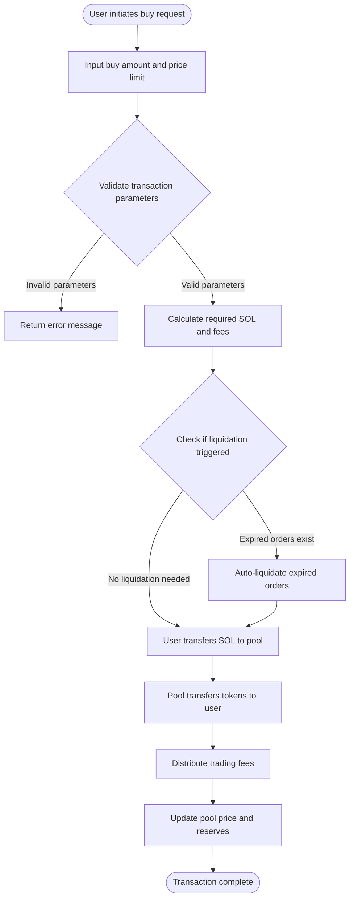
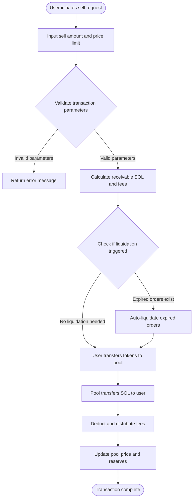

# 💱 PinPet Spot Trading Features

## 📊 Feature Overview

Spot trading is one of the core features of the PinPet platform, allowing users to directly buy and sell tokens in decentralized liquidity pools. Unlike traditional order book models, PinPet uses an Automated Market Maker (AMM) mechanism based on the constant product algorithm (x × y = k) to automatically determine trading prices.

**✨ Key Features:**
- **⚡ Instant Execution**: No need to wait for buyer-seller matching; trades complete immediately
- **🔍 Transparent Pricing**: Prices are automatically calculated by algorithms, openly transparent
- **🌊 Continuous Liquidity**: Trading is available anytime as long as there are sufficient assets in the pool
- **🛡️ Slippage Protection**: Users can set maximum/minimum price limits to prevent abnormal price volatility

---

## 🛒 Buy Transaction Process

### 👤 User Operation Steps

Buy transactions allow users to purchase project tokens using SOL (Solana native token).

### 🔑 Key Parameter Descriptions

| Parameter Name | Description | Example Value | Notes |
|---------|---------|--------|------|
| buy_token_amount | Desired token amount to purchase | 1000000 (1 token) | Minimum: 1000000 (1 token) |
| max_sol_amount | Maximum SOL amount willing to pay | 50000000 (0.05 SOL) | Used to prevent excessive price slippage |
| lp_pairs | Liquidity pool state snapshot | [{sol: 30, token: 1000000}] | Automatically provided by frontend |

### ⚙️ Transaction Execution Logic

1. **Parameter Validation**
   - Check if buy amount meets minimum trading volume (1 token)
   - Verify liquidity pool state matches on-chain data

2. **Price Calculation**
   - Calculate required SOL based on current pool reserves using constant product formula
   - Calculate actual payment amount including fees
   - Check if actual price exceeds user-set maximum

3. **Auto-Liquidation Mechanism**
   - If the trade causes price to cross liquidation prices of leveraged orders, system auto-liquidates those orders
   - Liquidation fees are distributed to platform and partners

4. **Fund Transfer**
   - User account → Liquidity pool: Transfer SOL (including fees)
   - Liquidity pool → User account: Transfer tokens

5. **Fee Distribution**
   - Distribute to partners and technology providers according to preset ratios
   - Default fee rate configurable by administrator

6. **State Update**
   - Update current price of liquidity pool
   - Recalculate SOL and token reserves in pool
   - Check if fee discount is triggered

---

## 💸 Sell Transaction Process

### 👤 User Operation Steps

Sell transactions allow users to sell their tokens for SOL.

### 🔑 Key Parameter Descriptions

| Parameter Name | Description | Example Value | Notes |
|---------|---------|--------|------|
| sell_token_amount | Desired token amount to sell | 1000000 (1 token) | Minimum: 1000000 (1 token) |
| min_sol_output | Expected minimum SOL amount | 20000000 (0.02 SOL) | Used to prevent excessive price slippage |
| lp_pairs | Liquidity pool state snapshot | [{sol: 30, token: 1000000}] | Automatically provided by frontend |

### ⚙️ Transaction Execution Logic

1. **Parameter Validation**
   - Check if sell amount meets minimum trading volume (1 token)
   - Verify user token account has sufficient balance
   - Confirm liquidity pool state is valid

2. **Price Calculation**
   - Calculate receivable SOL based on current pool reserves using constant product formula
   - Calculate actual amount after deducting fees
   - Check if actual price is below user-set minimum

3. **Auto-Liquidation Mechanism**
   - If the trade causes price to cross liquidation prices of leveraged orders, system auto-liquidates those orders
   - Distribute liquidation fees and liquidation rewards

4. **Fund Transfer**
   - User account → Liquidity pool: Transfer tokens
   - Liquidity pool → User account: Transfer SOL (after fee deduction)

5. **Fee Processing**
   - Deduct fees from receivable SOL
   - Distribute to partners and technology providers proportionally

6. **State Update**
   - Update liquidity pool current price (price decreases)
   - Recalculate SOL and token reserves in pool
   - Check if fee discount is triggered

---

## 💡 Usage Scenarios

### 📈 Scenario 1: Regular Buy Transaction

**Background:**
- Current price: 1 token = 0.03 SOL
- User wants to buy 10 tokens
- Fee rate: 1%

**Operation Flow:**
1. User sets buy amount: 10,000,000 (10 tokens)
2. User sets maximum payment: 0.35 SOL (350,000,000)
3. System calculates actual requirement: 0.303 SOL (including fees)
4. Price check passed (not exceeding maximum limit)
5. Transaction executes:
   - User pays 0.303 SOL
   - Receives 10 tokens
   - Fee of 0.003 SOL distributed to platform
6. Post-trade price rises to: 0.0303 SOL/token

---

### 📉 Scenario 2: Sell Triggering Auto-Liquidation

**Background:**
- Current price: 1 token = 0.05 SOL
- A long order exists with liquidation price of 0.048 SOL
- User wants to sell 50 tokens

**Operation Flow:**
1. User sets sell amount: 50,000,000 (50 tokens)
2. User sets minimum revenue: 2.3 SOL
3. System detects sell will cause price to drop below 0.048 SOL
4. System auto-liquidates long order:
   - Calculate order profit/loss
   - Collect liquidation fee
   - Close order account, refund rent
5. Continue executing sell transaction:
   - User transfers 50 tokens
   - Receives 2.4 SOL (after fee deduction)
6. Post-trade price drops to: 0.047 SOL/token

---

### 🛡️ Scenario 3: Slippage Protection Triggered

**Background:**
- Current price: 1 token = 0.02 SOL
- User wants to buy 1000 tokens
- Liquidity pool is small, large trade will cause significant slippage

**Operation Flow:**
1. User sets buy amount: 1,000,000,000 (1000 tokens)
2. User sets maximum payment: 21 SOL
3. System calculates actual requirement: 22.5 SOL (including fees)
4. Price check failed (exceeds user maximum limit)
5. Transaction rejected, error message returned
6. User can choose to:
   - Increase maximum payment limit
   - Reduce buy amount
   - Buy in batches

---

## ⚠️ Notes and Limitations

### 🚫 Trading Restrictions

| Restriction Item | Specific Requirement | Reason |
|---------|---------|---------|
| Minimum trading volume | 1,000,000 (1 token) | Prevent overly small trades from affecting system efficiency |
| Maximum fee rate | 10% | Protect users from excessive fees |
| Liquidity check | Must provide current pool state snapshot | Ensure on-chain and off-chain state consistency |
| Slippage protection | Must fill max_sol_amount / min_sol_output | Prevent losses from abnormal price volatility |

### ⚠️ Risk Warnings

1. **📊 Price Volatility Risk**
   - Large trades will cause significant price slippage
   - Recommend large trades be executed in batches to reduce impact cost
   - Set reasonable slippage tolerance

2. **💰 Fee Costs**
   - Every transaction incurs fees
   - Frequent small trades will accumulate high fee costs
   - Recommend consolidating trades to reduce costs

3. **💧 Liquidity Risk**
   - When liquidity is insufficient, large trades may fail to complete
   - Pool reserves will affect execution price
   - Monitor pool's SOL and token reserve levels

4. **🔄 Auto-Liquidation Impact**
   - Trades may trigger auto-liquidation of leveraged orders
   - Liquidation will consume part of liquidity
   - May affect final execution price

### 🔧 Technical Requirements

**👛 User Requirements:**
- Own a Solana wallet (e.g., Phantom, Solflare)
- Have sufficient SOL in account for trading and transaction fees
- Token account must be created before trading tokens (usually handled automatically by frontend)

**💵 Transaction Fee Structure:**
- Solana network fee: approximately 0.000005 SOL (transaction signature fee)
- Trading fee: charged as percentage of trade amount (configured by administrator)
- Account rent: one-time payment if new account creation needed (recoverable)

### ❓ Frequently Asked Questions

**Q: Will I lose fees if transaction fails?**
A: ✅ No. If transaction is rejected due to parameter check failure, no fees will be deducted, only minimal Solana network fee consumed (approximately 0.000005 SOL).

**Q: How to get the best execution price?**
A: 💡 Trade during times of sufficient liquidity, avoid excessively large single trades, monitor pool's SOL/Token ratio, and choose appropriate timing for trades.

**Q: Will auto-liquidation affect my trade?**
A: ⚠️ Possibly. If your trade triggers liquidation of others' leveraged orders, it will consume part of liquidity, potentially causing actual execution price to slightly deviate from expectation, but still within your set slippage range.

**Q: Common reasons for transaction rejection?**
A: ❌ Common reasons include:
- Buy or sell amount below minimum trading volume (1 token)
- Actual execution price exceeds your set slippage protection range
- Insufficient account balance (SOL or tokens)
- Liquidity pool state snapshot expired (frontend needs to refresh)

**Q: How are fees calculated and distributed?**
A: 💰 Fees are charged as a percentage of trade amount (default 1%, adjustable by administrator), then distributed to partners and technology providers according to preset ratios. Fee discounts may apply in certain circumstances.

---

## 🔗 Related Features

- **📊 Leverage Trading**: Use lending mechanism for long/short trading
- **💧 Liquidity Management**: View and manage liquidity pool status
- **🪙 Token Creation**: Create new trading token pairs
- **📋 Order Management**: View and manage leveraged trading orders

---

*📝 Note: This document is a product feature description and does not include technical implementation details. For development-related information, please refer to the project's technical documentation.*
