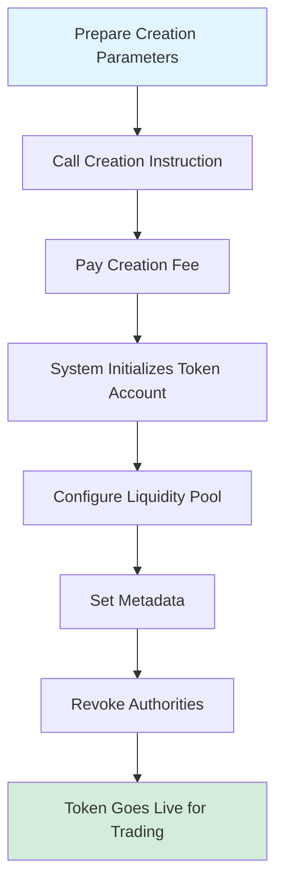
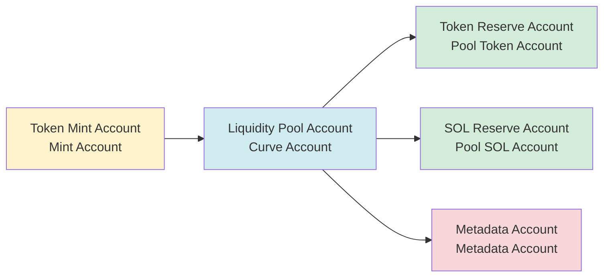
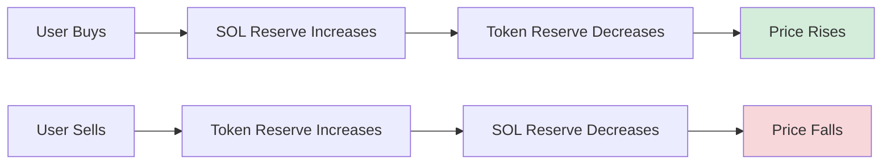

# 🪙 PinPet Token Creation Feature Introduction

## I. 📋 Feature Overview

### 💎 What is Token Creation

Token creation is one of the core features of the PinPet platform, allowing users to issue brand new SPL tokens (Solana blockchain standard tokens) with one click and automatically configure trading markets. Through this feature, users can quickly create tokens with complete metadata, automatic liquidity support, and instant trading capabilities without needing to deeply understand complex blockchain technology.

### ❓ Why Create Tokens

**⚠️ Pain Points of Traditional Token Issuance:**
- Requires professional technical knowledge (Solana programming, SPL Token standard)
- Manual configuration of minting authority, liquidity pools, metadata, and other multiple steps
- Lack of instant liquidity and trading markets
- Complex security settings (authority revocation, anti-inflation, etc.)

**✅ Advantages of PinPet Token Creation:**
- **⚡ One-Click Issuance**: Only requires three basic pieces of information: token name, symbol, and icon
- **🚀 Instant Launch**: Ready for trading immediately after creation, no need to wait for liquidity accumulation
- **🔒 Automatic Security Configuration**: Automatically revokes mint and freeze authorities to prevent malicious inflation
- **🏦 Built-in Trading Market**: Based on constant product AMM algorithm, supports spot and leveraged trading
- **✔️ Compliant Metadata**: Conforms to Metaplex standard, automatically recognized by wallets and exchanges

### ⭐ Core Features

| Feature | Description |
|------|------|
| Token Standard | SPL Token (Solana official standard) |
| Precision | 6 decimal places (1 Token = 1,000,000 smallest units) |
| Total Supply | 1,609,500,000,000,000 units (fixed supply, non-inflationary) |
| Metadata Standard | Metaplex Token Metadata |
| Initial Price | Approximately 0.0000000000279589934762 SOL/Token |
| Liquidity Model | Constant Product AMM (x × y = k) |

---

## II. 🔄 Token Creation Process

### 👤 User Operation Steps



### 📊 Detailed Process Description

#### 📝 Phase 1: Prepare Parameters
Users need to provide three basic parameters:

| Parameter | Type | Description | Example |
|------|------|------|------|
| name | String | Full token name | "PinPet Token" |
| symbol | String | Token symbol (3-10 characters) | "PINPET" |
| uri | String | Link to metadata JSON file | "https://example.com/metadata.json" |

#### 🔧 Phase 2: Account Initialization
The system automatically creates and configures the following accounts:



#### 💧 Phase 3: Liquidity Pool Initialization
The system automatically configures two funding pools:

**1. Spot Liquidity Pool (LP Pool)**
- Token Reserve: 1,073,000,000,000,000 units
- SOL Reserve: 30 SOL (virtual balance)
- Actual SOL: 10,000 lamports (to prevent insufficient balance)
- Purpose: Supports spot trading (buy/sell)

**2. Leverage Lending Pool (Borrow Pool)**
- Token Reserve: 536,500,000,000,000 units
- SOL Reserve: 10,000,000 SOL (virtual balance)
- Purpose: Supports margin trading (long/short)

**📊 Fund Distribution Chart:**
```
💰 Total Supply: 1,609,500,000,000,000 units
├── Spot Liquidity Pool: 1,073,000,000,000,000 (66.67%)
└── Leverage Lending Pool: 536,500,000,000,000 (33.33%)
```

#### 📄 Phase 4: Metadata Creation
The system calls the Metaplex Token Metadata program to create token metadata:

| Metadata Field | Content | Description |
|-----------|------|------|
| name | User-provided name | Token name displayed in wallets |
| symbol | User-provided symbol | Token abbreviation |
| uri | User-provided link | Points to JSON containing icon, description, etc. |
| creators | Creator address | Marks token creator, unverified status |
| seller_fee_basis_points | 0 | Royalty rate (set to 0) |
| is_mutable | true | Allows metadata updates |

**📋 Metadata JSON Standard Format Example:**
```json
{
  "name": "PinPet Token",
  "symbol": "PINPET",
  "description": "Token issued on the PinPet platform",
  "image": "https://example.com/logo.png",
  "attributes": [],
  "properties": {
    "files": [
      {
        "uri": "https://example.com/logo.png",
        "type": "image/png"
      }
    ]
  }
}
```

#### 🔒 Phase 5: Authority Revocation
To ensure token security and immutability, the system automatically executes:

| Operation | Purpose | Effect |
|------|------|------|
| Revoke Mint Authority | Prevent inflation | Total supply permanently locked |
| Revoke Freeze Authority | Prevent freezing user accounts | Token permanently tradable |

#### 💵 Phase 6: Fee Configuration
The system reads fee settings from the partner parameter account:

| Fee Type | Default Value | Description |
|---------|--------|------|
| Spot Trading Fee | 1% | Deducted during buy/sell transactions |
| Margin Trading Fee | 0.25% | Deducted during leveraged trading |
| Fee Discount Flag | 0 (original price) | Can be automatically adjusted based on trading volume |
| Fee Distribution Ratio | 20%/80% | Technology provider/partner split ratio |

---

## III. 💧 Liquidity Pool Mechanism

### 🔢 Constant Product Formula

PinPet uses an Automated Market Maker (AMM) model, with the core formula:

```
x × y = k
```

Where:
- **x**: SOL reserve amount
- **y**: Token reserve amount
- **k**: Constant product (initial value = 30 × 1,073,000,000 = 32,190,000,000)

### 💰 Initial Price Calculation

```
Initial Price = SOL Reserve ÷ Token Reserve
              = 30 ÷ 1,073,000,000
              ≈ 0.0000000279589934762 SOL/Token
```

### 📈 Price Movement Mechanism



### 🛡️ Price Slippage Protection

To protect the liquidity pool, the system employs multiple security mechanisms:

| Protection Measure | Description |
|---------|------|
| Precision Factor | Price uses 10^26 precision factor to avoid rounding errors |
| Overflow Check | All calculations use `checked_*` methods to prevent overflow |
| Price Ceiling | Maximum price limited to 50,000,000,000,000,000,000,000,000,000 |
| Price Floor | Minimum price limited to 0.000000001 (prevents division by zero) |

---

## IV. 📝 Token Metadata Description

### ✅ Metaplex Standard

PinPet uses the Metaplex Token Metadata v5.1.1 standard to ensure token compatibility within the Solana ecosystem:

**✨ Standard Advantages:**
- 💳 Automatically recognized by mainstream wallets (Phantom, Solflare)
- 🔄 Automatically indexed by DEX platforms (Jupiter, Raydium)
- 🎨 Automatically indexed by NFT marketplaces and aggregators
- 🔍 Fully displayed by blockchain explorers (Solscan, Solana Explorer)

### 🗂️ Metadata Account Structure

```
Metadata Account Address (PDA)
├── Derivation Seeds: ["metadata", Metaplex Program ID, Mint Address]
├── Stored Content:
│   ├── Token Name
│   ├── Token Symbol
│   ├── URI (Metadata JSON link)
│   ├── Creator Information
│   ├── Royalty Settings
│   └── Collection Information (optional)
└── Permissions:
    ├── Update Authority: Liquidity Pool Account (PDA)
    └── Mutability: true (allows updates)
```

### 🌐 URI Hosting Recommendations

| Hosting Method | Advantages | Disadvantages | Applicable Scenarios |
|---------|------|------|---------|
| IPFS | Decentralized, permanent storage | Slower access speed | Long-term projects |
| Arweave | Permanent storage, fast speed | Requires payment | High-value tokens |
| Cloud Storage (AWS S3/CDN) | Fast, cheap | Centralized, may fail | Testing or short-term projects |

---

## V. 🎯 Usage Scenario Examples

### 🚀 Scenario 1: Startup Team Issuing Project Token

**Requirements:**
A Web3 startup team wants to issue a governance token for their DeFi project

**Operation Process:**
1. Design token icon and description document
2. Upload metadata JSON to IPFS
3. Prepare parameters:
   - name: "SuperDeFi Governance Token"
   - symbol: "SDEFI"
   - uri: "https://ipfs.io/ipfs/QmXXX..."
4. Call PinPet creation instruction, pay a small creation fee
5. Token goes live instantly, team members and community can trade immediately

**✅ Advantages:**
- ⚡ No need to write smart contracts
- 💧 Built-in liquidity market
- 🔒 Security guaranteed by protocol

---

### 🎉 Scenario 2: Community Meme Token Issuance

**Requirements:**
Community wants to issue a themed Meme token for entertainment and trading

**Operation Process:**
1. Community votes to determine token name and icon
2. Use free image hosting service to host images
3. Prepare parameters:
   - name: "Doge to the Moon"
   - symbol: "DMOON"
   - uri: "https://cloudinary.com/dmoon.json"
4. Any community member initiates creation
5. Community members start trading immediately

**✅ Advantages:**
- 💰 Low-cost rapid issuance
- 👥 No technical background required
- 🔒 Automatic anti-inflation mechanism

---

### 🎨 Scenario 3: NFT Project Issuing Utility Token

**Requirements:**
NFT project team wants to issue a supporting utility token for ecosystem incentives

**Operation Process:**
1. Design token image that matches NFT style
2. Prepare detailed token whitepaper
3. Use Arweave to permanently store metadata
4. Prepare parameters:
   - name: "CryptoArt Utility Token"
   - symbol: "CART"
   - uri: "ar://abc123..."
5. Create token and set fee receiving account
6. NFT holders can stake to earn token rewards

**✅ Advantages:**
- 💾 Metadata permanently stored
- 🔗 Seamlessly integrated with NFT ecosystem
- 📊 Supports complex economic models

---

## VI. ⚠️ Notes and Limitations

### 📝 Preparation Before Creation

| Checklist Item | Description |
|--------|------|
| Wallet Balance | Ensure sufficient SOL to pay creation fee (approximately 0.01-0.05 SOL) |
| Metadata Preparation | JSON file uploaded and accessible |
| Token Information | Name and symbol meet specifications, unambiguous |
| Partner Account | Partner parameter account created (required for first time) |

### 🚫 Token Creation Limitations

**⚙️ Technical Limitations:**
- Token precision fixed at 6 decimal places, cannot be modified after creation
- Total supply fixed, cannot be increased after mint authority revoked
- Initial liquidity configuration fixed, cannot be customized

**🔒 Security Limitations:**
- Fee rate cap at 10%, creation will fail if exceeded
- Metadata update authority belongs to liquidity pool account
- Freeze authority revoked, cannot freeze user accounts

**💰 Economic Limitations:**
- Initial price calculated by algorithm, cannot be customized
- Liquidity distribution ratio fixed (spot 66.67%, leverage 33.33%)
- SOL reserve is virtual balance, cannot be directly withdrawn

### ❓ Frequently Asked Questions

**💵 Q1: How much does it cost to create a token?**
A: Main costs include account rent (approximately 0.01-0.03 SOL) and transaction fees (approximately 0.00001 SOL), totaling approximately 0.01-0.05 SOL.

**✏️ Q2: Can I modify the name or symbol after token creation?**
A: You can modify by updating the JSON file content pointed to by the metadata URI, but the on-chain recorded name and symbol are immutable.

**🔒 Q3: How to ensure token security?**
A: The system automatically revokes mint and freeze authorities, ensuring fixed supply and tamper-proof. It is recommended to use decentralized storage (IPFS/Arweave) to host metadata.

**❗ Q4: How to handle creation failure?**
A: Check wallet balance, parameter format, and partner account status. Common errors include fee rate exceeding limit, invalid URI, etc.

**🗑️ Q5: Can tokens be destroyed?**
A: Token accounts themselves cannot be destroyed, but tokens can be permanently locked by transferring to a burn address (0x000...).

### 💡 Best Practice Recommendations

1. **Metadata Hosting**: Prioritize decentralized storage like IPFS or Arweave to avoid link failure
2. **Token Naming**: Be concise and clear, avoid confusion with well-known projects, prevent infringement
3. **Icon Design**: Use high-quality images (recommended 512x512 pixels), aligned with token positioning
4. **Whitepaper Preparation**: Include detailed project descriptions and roadmaps in the JSON pointed to by URI
5. **Community Building**: Establish social media accounts promptly after creation to enhance token visibility
6. **Compliance**: Ensure token usage is legal, avoid violating local laws and regulations

---

## VII. 🔧 Technical Support

### 📍 Related Account Addresses

| Account Type | Derivation Rule | Description |
|---------|---------|------|
| Liquidity Pool Account | `["borrowing_curve", mint_address]` | Manages liquidity and trading parameters |
| Token Reserve Account | `["pool_token", mint_address]` | Stores tokens in liquidity pool |
| SOL Reserve Account | `["pool_sol", mint_address]` | Stores SOL in liquidity pool |
| Metadata Account | Metaplex standard PDA | Stores token metadata |

### 🖥️ Program Interface

**✨ Creation Instruction:**
```
Function Name: create
Parameters:
  - name: String (token name)
  - symbol: String (token symbol)
  - uri: String (metadata URI)
```

**📡 Event Listening:**
After successful creation, a `TokenCreatedEvent` event is emitted, containing the following information:
- Mint account address
- Liquidity pool account address
- Fee settings
- Token name, symbol, URI

---

## 🎯 Summary

PinPet's token creation feature provides users with a 🔒 secure, ⚡ convenient, and 💰 low-cost token issuance solution. Through automated liquidity configuration and standardized metadata management, users can complete token creation and go live for trading within minutes without worrying about technical details and security issues.

Whether it's 🚀 startup teams issuing project tokens, 🎉 communities creating Meme tokens, or 🎨 NFT projects issuing supporting utility tokens, PinPet provides comprehensive support, making token issuance simple and efficient.
