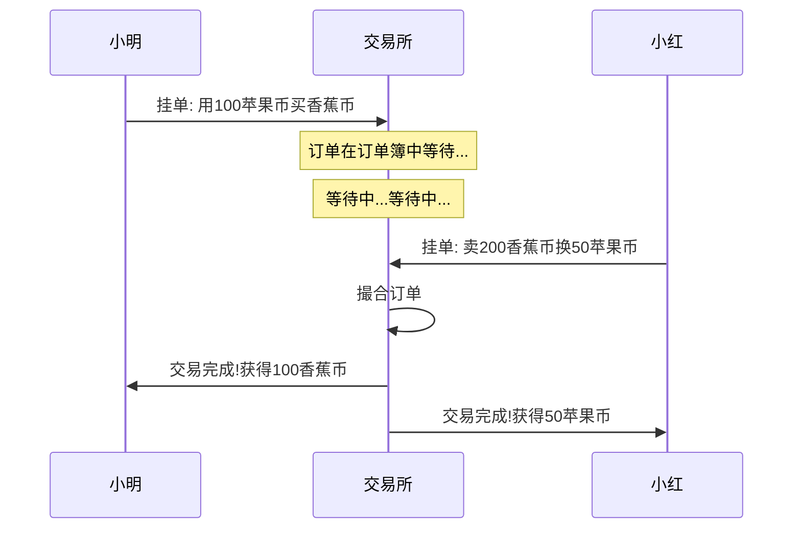
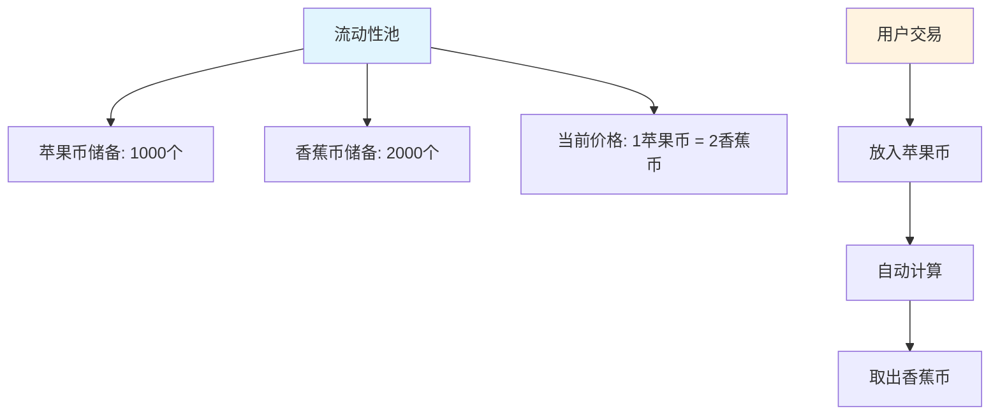
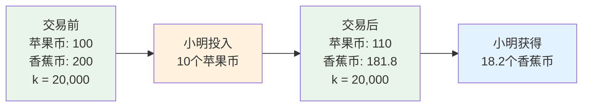
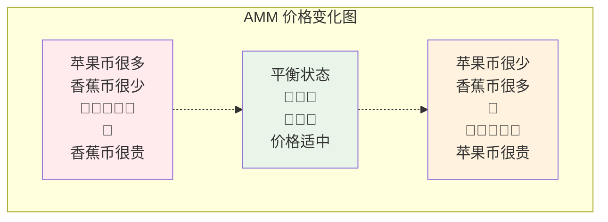
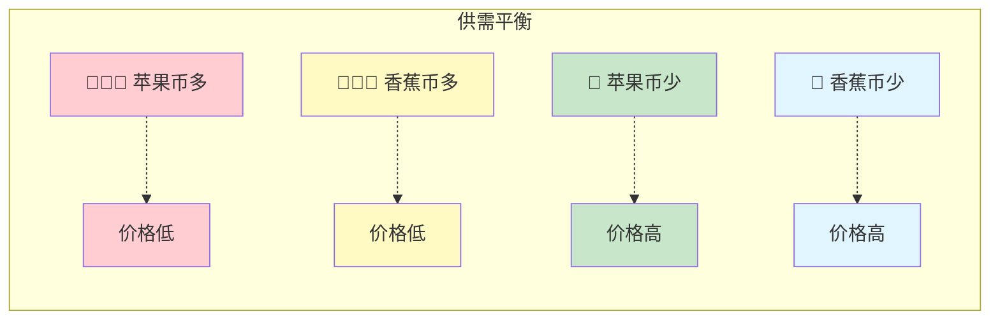
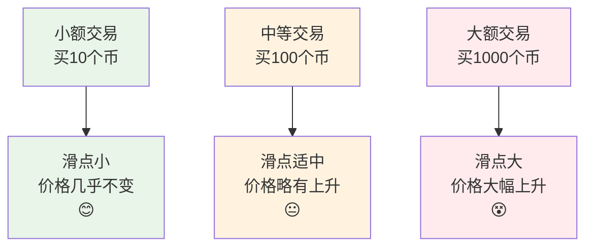
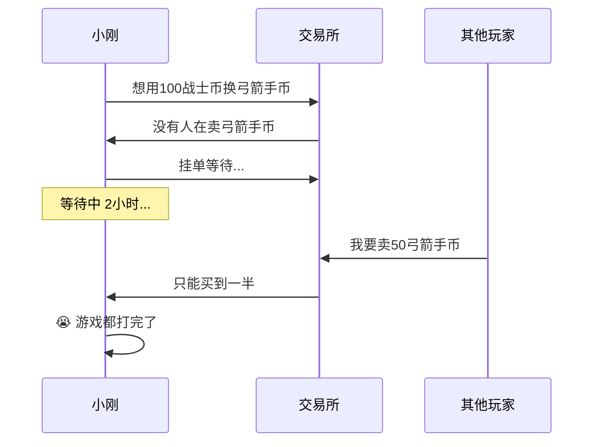
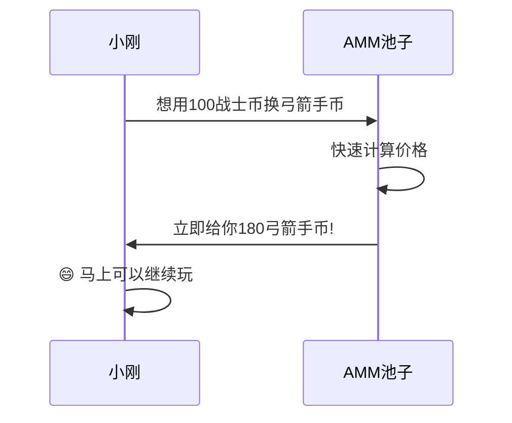
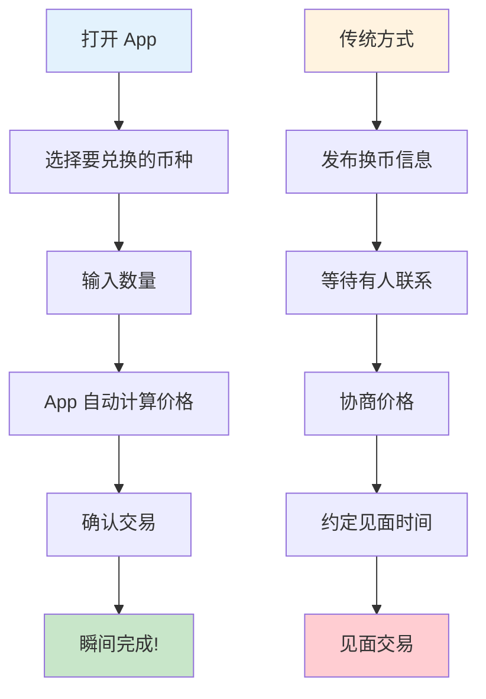

# AMM 做市机制指南 - 从零开始理解自动做市商

## 目录
1. [什么是 AMM?](#什么是-amm)
2. [传统交易所的故事](#传统交易所的故事)
3. [AMM 的神奇世界](#amm-的神奇世界)
4. [数学原理简化版](#数学原理简化版)
5. [图解 AMM 工作原理](#图解-amm-工作原理)
6. [什么是滑点?](#什么是滑点)
7. [为什么要用 AMM?](#为什么要用-amm)
8. [实际案例分析](#实际案例分析)
9. [总结](#总结)

---

## 什么是 AMM?

想象一下,你想用苹果换香蕉,但找不到一个正好想要苹果的人。现在,如果有一台"神奇的果汁机",你把苹果放进去,它会自动给你相应数量的香蕉,这就是 AMM(自动做市商)的基本概念!

**AMM = Automated Market Maker(自动做市商)**

简单来说,AMM 就是一个智能的、永不休息的"交易机器人",它能让你随时随地兑换不同的代币,而不需要等待其他人来和你交易。

---

## 传统交易所的故事

### 📖 小明的交易烦恼

小明想用他的 100 个苹果币换一些香蕉币。在传统交易所:

1. **挂单等待**: 小明挂单"我要用 100 个苹果币买香蕉币,价格 1:2"
2. **等待买家**: 小明必须等到有人想以合适的价格卖香蕉币
3. **可能等很久**: 如果没人想卖,小明可能要等几小时甚至几天
4. **价格波动**: 等待期间价格可能变化,小明可能错过最佳时机

### 传统交易所的问题:
- ⏰ **需要等待**: 必须等有人愿意交易
- 📊 **流动性不足**: 冷门代币难以交易
- 💰 **价格不稳定**: 大额订单容易造成价格剧烈波动
- 🌙 **时间限制**: 交易所有营业时间

---

## AMM 的神奇世界

### 🏪 神奇的自动商店

现在,想象有一个神奇的自动商店(AMM),它的工作方式是这样的:

1. **永远营业**: 24 小时运作,永不关闭
2. **即时交易**: 你想要什么,马上就能买到
3. **自动定价**: 价格根据库存自动调整
4. **无需等待**: 不需要等其他顾客

### 🏦 流动性池 = 超级仓库

AMM 的核心是"流动性池",就像一个巨大的双格仓库:

### 🤖 自动定价机器人

AMM 有一个超级智能的定价机器人,它遵循一个简单的规则:

**🔢 神奇公式: 苹果币数量 × 香蕉币数量 = 固定值(k)**

这个公式确保:
- 买的人越多,价格越高
- 卖的人越多,价格越低
- 永远有库存可以买,有价格可以卖

---

## 数学原理简化版

### 🧮 恒定乘积公式

不要被"数学"吓到——其实很简单!

假设我们的神奇仓库里有:
- 苹果币: 100 个
- 香蕉币: 200 个
- 神奇数字 k = 100 × 200 = 20,000

**规则: 无论怎么交易,k 值必须保持 20,000 不变!**

### 📊 交易示例

**小明想用 10 个苹果币换香蕉币:**

1. **交易前**:
   - 苹果币: 100 个
   - 香蕉币: 200 个
   - k = 100 × 200 = 20,000

2. **小明投入 10 个苹果币**:
   - 新的苹果币数量: 100 + 10 = 110 个
   - 必须保持 k = 20,000
   - 所以: 110 × 新香蕉币数量 = 20,000
   - 新香蕉币数量 = 20,000 ÷ 110 = 181.8 个

3. **小明获得**:
   - 香蕉币: 200 - 181.8 = 18.2 个
   - 用 10 个苹果币换到了 18.2 个香蕉币

---

## 图解 AMM 工作原理

### 🎢 价格曲线图

AMM 的价格变化就像过山车,遵循一条特殊的曲线:

### 📈 供需关系图

想象天平的两端:

---

## 什么是滑点?

### 🛒 超市购物类比

想象你去超市买苹果:

**传统超市(中心化交易所):**
- 标价: 5 元/斤
- 买 1 斤: 5 元
- 买 100 斤: 还是 5 元/斤
- 但可能没有那么多库存!

**神奇超市(AMM):**
- 第 1 斤: 5 元
- 第 2 斤: 5.1 元(库存减少,价格上涨)
- 第 3 斤: 5.2 元
- 买得越多,价格涨得越快!

### 📊 滑点影响图

### 🎯 滑点计算示例

假设池子里有 1000 个苹果币和 2000 个香蕉币:

1. **买 10 个香蕉币**: 滑点约 0.25%
2. **买 100 个香蕉币**: 滑点约 2.5%
3. **买 500 个香蕉币**: 滑点约 14%

**结论: 买得越多,每个币的平均价格越高!**

---

## 为什么要用 AMM?

### 🌟 AMM 的超级优势

#### 1. 🚀 即时交易
- **传统方式**: 可能等几小时才能找到交易对手
- **AMM 方式**: 几秒钟内完成交易

#### 2. 🌍 全天候 24/7
- **传统交易所**: 有营业时间,节假日关闭
- **AMM**: 永不关闭,随时可以交易

#### 3. 🎯 无需撮合
- **传统方式**: 需要买卖双方价格匹配
- **AMM**: 只要池子里有币就能交易

#### 4. 💎 支持小众代币
- **传统交易所**: 冷门币可能没有交易者
- **AMM**: 只要创建了池子就能交易

### 📊 对比表格

| 特性 | 传统交易所 | AMM |
|------|-----------|-----|
| 交易速度 | 需要等待撮合 ⏳ | 即时完成 ⚡ |
| 营业时间 | 有限制 🕐 | 24/7 🌍 |
| 流动性 | 取决于用户订单 👥 | 算法保证 🤖 |
| 价格发现 | 订单簿 📋 | 数学公式 🧮 |
| 滑点 | 取决于订单深度 📊 | 取决于交易量 📈 |

---

## 实际案例分析

### 🎮 游戏代币交易故事

#### 背景设定
小刚在一个区块链游戏中,想要兑换游戏代币:
- 🗡️ 战士币(用来买武器)
- 🏹 弓箭手币(用来买弓箭)

#### 场景一: 传统交易所

#### 场景二: AMM

### 🍕 披萨店类比

**传统模式(找朋友换币):**
- 你想要比特币,需要找到一个正好想要你以太坊的人
- 可能要在群里喊:有人要用比特币换以太坊吗?
- 可能等半天都没人响应

**AMM 模式(自动售货机):**
- 就像一台超级智能的自动售货机
- 投入以太坊,立即拿到比特币
- 价格自动计算,不用讨价还价

### 📱 手机 App 类比

想象一个神奇的换币 App:

---

## 总结

### 🎯 核心要点回顾

1. **AMM 就像一台神奇的自动售货机**
   - 投入一种币,立即得到另一种币
   - 24 小时工作,永不休息

2. **恒定乘积公式是核心**
   - x × y = k(永不改变的神奇数字)
   - 这个公式让价格自动调整

3. **滑点是正常现象**
   - 买得越多,价格涨得越多
   - 就像超市买东西越多越贵

4. **AMM 比传统交易所更方便**
   - 不用等人,即时交易
   - 支持所有币种
   - 永远有流动性

### 🌈 未来展望

AMM 技术还在不断发展:
- 更智能的定价算法
- 更低的滑点
- 更多创新功能

### 🎓 新手建议

1. **从小额开始**: 先用小资金练习
2. **理解滑点**: 大额交易要注意滑点
3. **多比较**: 不同 AMM 可能价格不同
4. **持续学习**: DeFi 世界变化很快

---

## 附录: 常见问题

### ❓ FAQ

**Q1: AMM 会不会币换完了?**
A1: 理论上不会! 只要池子里有币就能交易。但价格可能会很高。

**Q2: 为什么有时价格差很多?**
A2: 因为池子大小不同。小池子价格波动大,大池子相对稳定。

**Q3: AMM 安全吗?**
A3: 代码是开源的,但要注意选择经过审计的平台。

**Q4: 手续费怎么算?**
A4: 通常是交易金额的 0.1-1%,从交易结果中自动扣除。

**Q5: 可以取消交易吗?**
A5: 上链确认前可以取消,但要付取消费用。

记住: 投资有风险,交易需谨慎! 先学习,再实践,小额开始! 🚀
