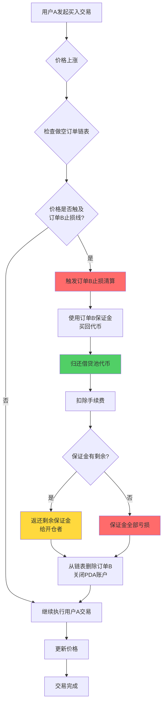
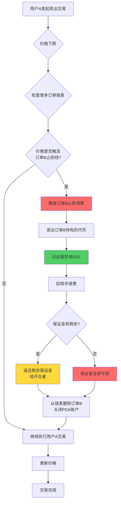
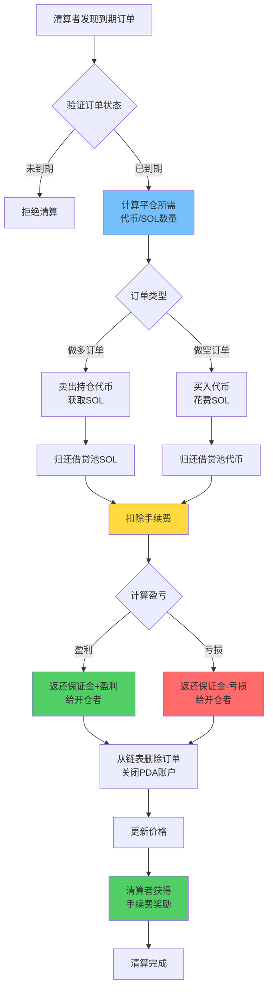
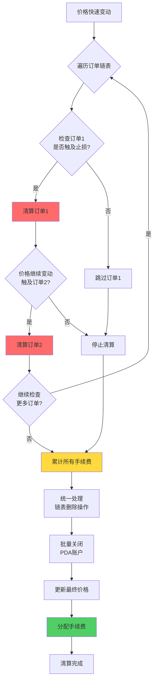

# ⚡ PinPet 强制平仓(爆仓)功能说明

## 📋 功能概述

强制平仓是 PinPet 协议中保护系统稳定性的核心风控机制。系统提供两种强制平仓触发方式:

1. **⏰ 时间触发**: 当杠杆交易订单超过规定持仓时间后,任何人都可以触发强制平仓
2. **🎯 价格触发**: 当市场价格触及订单止损价格线时,自动触发止损清算

这种双重保护机制确保了协议的流动性和资金安全,同时保护开仓者免受过度亏损。

## ⚙️ 核心特性

### 1. 🔄 双重触发机制

#### ⏰ 时间触发
- **✅ 正常平仓**: 订单持有期内,只有开仓者本人可以主动平仓
- **⏱️ 到期清算**: 订单到期后,任何人都可以对其进行强制平仓操作
- **🔍 时间验证**: 系统通过链上时间戳自动判断订单是否已到期

#### 🎯 价格触发(止损清算)
- **📉 做多止损**: 当价格下跌触及做多订单的止损价格线时,自动平仓
- **📈 做空止损**: 当价格上涨触及做空订单的止损价格线时,自动平仓
- **🔄 被动触发**: 价格触发的止损清算在其他用户交易时自动执行
- **⚠️ 保证金耗尽**: 止损时保证金用于归还借款,开仓者通常无盈利或亏损全部保证金

### 2. 📊 订单类型支持

| 订单类型 | 价格触发条件 | 时间触发条件 | 链表方向 | 资产处理 |
|---------|------------|------------|---------|---------|
| 📈 做多订单 | 价格下跌触及止损线 | 订单到期 | Down | 归还借入的 SOL |
| 📉 做空订单 | 价格上涨触及止损线 | 订单到期 | Up | 归还借入的代币 |

### 3. 👥 参与者角色

- **👤 开仓者**: 创建杠杆订单的用户,订单到期前拥有独占平仓权
- **🔨 清算者**: 任何第三方用户,可在订单到期后执行主动清算
- **💼 交易者**: 其他用户的买卖交易可能触发价格止损清算
- **🤖 协议**: 自动管理借贷池资金,确保资金流转正常

## 🔄 工作流程

### 📊 流程对比表

| 流程阶段 | ⏰ 时间触发平仓 | 🎯 价格触发止损 |
|---------|------------|------------|
| 触发条件 | 订单到期 | 价格触及止损线 |
| 触发时机 | 清算者主动发起 | 交易时被动触发 |
| 权限验证 | 任何人可执行 | 自动执行(无需权限) |
| 盈亏结算 | 可能盈利或亏损 | 通常亏损全部保证金 |
| 保证金处理 | 返还剩余保证金 | 用于归还借款 |

### 📉 做空订单止损清算流程(价格触发)



### 📈 做多订单止损清算流程(价格触发)



### ⏰ 订单到期清算流程(时间触发)



### 💥 批量连环清算流程



## 💰 费用机制

### 💵 手续费构成

| 费用类型 | 收取对象 | 费率 | 用途 |
|---------|---------|------|------|
| 交易手续费 | 开仓者 | 按订单费率 | 补偿流动性提供者 |
| 清算手续费 | 开仓者 | 按订单费率 | 奖励清算执行者 |

### 🤝 手续费分配

所有手续费按照协议配置的分成比例(fee_split)在两方之间分配:

- **🤝 合作伙伴**: 获得手续费的一定比例
- **🔧 技术提供方**: 获得剩余手续费

分配比例由管理员在创建流动性池时设置,取值范围 0-100。

## 💸 资金结算规则

### ⏰ 时间触发清算(订单到期)

#### ✅ 盈利情况
当订单有盈利时:
- 开仓者收回保证金 + 盈利部分
- 扣除交易手续费和清算手续费
- 结算地址必须是开仓者地址

#### ❌ 亏损情况
当订单亏损时:
- 亏损从保证金中扣除
- 剩余保证金返还开仓者
- 扣除交易手续费和清算手续费

#### 🧮 结算公式
**📈 做多订单盈亏**:
```
盈利 = 卖出所得 SOL + 保证金 - 借入 SOL - 手续费
```

**📉 做空订单盈亏**:
```
盈利 = 锁定 SOL - 买回花费 SOL - 手续费
```

### 🎯 价格触发止损(自动清算)

#### 🛡️ 保证金处理
- 保证金优先用于归还借贷池
- 扣除交易手续费后的余额全部用于平仓
- 通常情况下开仓者无盈利或亏损全部保证金

#### 🧮 结算公式
**📈 做多订单止损**:
```
剩余保证金 = 保证金 - 归还借入SOL - 手续费
若剩余保证金 > 0,返还给开仓者
若剩余保证金 ≤ 0,保证金全部亏损
```

**📉 做空订单止损**:
```
买回成本 = 买回代币花费SOL + 手续费
剩余保证金 = 保证金 - 买回成本
若剩余保证金 > 0,返还给开仓者
若剩余保证金 ≤ 0,保证金全部亏损
```

### 📊 结算场景对比

| 场景类型 | 结算时机 | 盈利可能性 | 保证金返还 | 手续费来源 |
|---------|---------|----------|----------|----------|
| ✅ 主动平仓 | 开仓者操作 | 可盈可亏 | 本金+盈利或扣除亏损 | 开仓者支付 |
| ⏰ 到期清算 | 订单到期 | 可盈可亏 | 本金+盈利或扣除亏损 | 开仓者支付 |
| 🎯 止损清算 | 价格触发 | 通常亏损 | 保证金扣除后余额 | 从保证金扣除 |

## 🔗 链表管理

### 📋 订单链表结构

系统使用双向链表管理待平仓订单:

- **📈 做多订单链表(Down)**: 按价格从高到低排列
- **📉 做空订单链表(Up)**: 按价格从低到高排列

### 🔧 链表操作

```
头节点检查 → 确认订单位置
    ↓
验证前后节点关系
    ↓
删除当前节点 → 更新前后节点指针
    ↓
更新链表头指针
```

### 💥 批量清算

当一次交易触发多个订单止损时:
1. 按顺序遍历订单链表
2. 依次对每个到期订单执行平仓
3. 累计所有平仓手续费
4. 统一进行资金结算

## 🛡️ 安全机制

### 🔐 权限验证

| 验证项 | 时间条件 | 权限要求 |
|-------|---------|---------|
| 主动平仓 | 订单未到期 | 必须是开仓者本人 |
| 强制平仓 | 订单已到期 | 任何人都可执行 |
| 结算地址 | 任何时候 | 必须是开仓者地址 |

### 🔢 数值安全

- 所有计算使用安全的 checked_* 方法,防止溢出
- 手续费计算采用高精度算法,确保精确性
- 验证订单链表完整性,防止数据损坏

### 💎 资金安全

- 借贷池资金自动归还验证
- 池子资金充足性检查
- 防止重复平仓保护

## 🎬 实际应用场景

### 🎯 场景一: 正常到期清算(时间触发)

1. 用户A在价格 100 开了5倍做多单,保证金 1 SOL,持仓时间24小时
2. 24小时后价格涨到 120,订单盈利约 1 SOL
3. 用户B发现订单到期,执行强制平仓
4. 系统自动卖出代币,归还借款,扣除手续费 0.1 SOL
5. 用户A收到本金 1 SOL + 盈利 1 SOL - 手续费 0.1 SOL = 1.9 SOL

### 🚨 场景二: 价格触发止损清算

1. 用户C在价格 100 开了3倍做空单,保证金 2 SOL
2. 止损价格线设置为 130(开仓时自动计算)
3. 用户D买入大量代币,价格快速上涨到 135
4. 价格触及用户C的止损线,系统自动清算订单C
5. 使用保证金 2 SOL 买回代币归还借贷池
6. 扣除手续费 0.1 SOL,剩余 0.2 SOL 返还给用户C
7. 用户C亏损 1.8 SOL,用户D的买入交易继续完成

### 💥 场景三: 连环止损清算

1. 价格快速上涨,触发多个做空订单的止损线
2. 用户E提交买入交易,价格从 100 涨到 150
3. 系统检测到需要清算5个做空订单
4. 按价格顺序依次执行止损平仓操作
5. 每个订单分别用保证金买回代币,归还借款
6. 最后统一扣除累计手续费,返还剩余保证金
7. 用户E的买入交易最终完成

### 📊 场景四: 部分平仓后的止损清算

1. 用户F开了1000代币的做多单,保证金 5 SOL
2. 主动平掉500代币获利 2 SOL,剩余500代币持仓
3. 价格继续下跌,触及剩余仓位的止损线
4. 系统自动对剩余的500代币执行止损清算
5. 扣除借款和手续费后,用户F总计盈利 0.5 SOL

## ❓ 常见问题

### Q1: ⏰ 时间触发和 🎯 价格触发有什么区别?

A:
- **⏰ 时间触发**: 订单到期后,需要清算者主动发起交易执行平仓,开仓者可能盈利或亏损
- **🎯 价格触发**: 当价格触及止损线时,在其他用户交易过程中自动执行,开仓者通常亏损保证金

两种机制相互独立,订单可能先触发价格止损,也可能先到期被清算。

### Q2: 🎯 止损价格线是如何确定的?

A: 止损价格线在开仓时根据杠杆倍数和保证金自动计算:
- **📈 做多订单**: 止损价格 = 开仓价格 × (1 - 1/杠杆倍数)
- **📉 做空订单**: 止损价格 = 开仓价格 × (1 + 1/杠杆倍数)

例如:5倍做多,开仓价100,止损价约80;3倍做空,开仓价100,止损价约133。

### Q3: 🔔 价格触发止损时,我会收到通知吗?

A: ❌ 不会。止损清算是在其他用户交易时被动触发的,系统不会提前通知。建议:
- 🔍 通过链上事件监听自己的订单状态
- 📊 使用第三方工具监控持仓风险
- ⚠️ 合理设置杠杆倍数,避免轻易触发止损

### Q4: ⏰ 订单到期后多久会被强制平仓?

A: 订单到期后立即可以被任何人强制平仓,没有额外的宽限期。但需要清算者主动发起交易。建议在订单到期前主动平仓以保留更多主动权。

### Q5: 💰 强制平仓会收取额外费用吗?

A: ✅ 不会收取额外费用。无论是时间触发还是价格触发,手续费都是按订单开仓时设定的费率收取,与正常平仓相同。

### Q6: ⚠️ 止损清算时保证金会全部亏损吗?

A: 不一定。虽然通常情况下止损清算时保证金会大部分亏损,但如果:
- ✅ 止损触发时价格刚好触及止损线
- 📊 市场波动不大,清算成本较低
- 💵 手续费较低

则可能有少量保证金余额返还给开仓者。但大多数情况下,止损清算意味着重大亏损。

### Q7: 🔢 一次交易可以清算多少个订单?

A: 理论上一次交易最多可以清算6个订单(系统最大订单数组长度)。实际清算数量取决于:
- **🎯 价格触发**: 取决于价格变动范围内有多少订单触及止损线
- **⏰ 时间触发**: 取决于清算者选择清算多少个到期订单

### Q8: 🔀 清算顺序是如何确定的?

A: 清算顺序由订单链表结构决定:
- **📈 做多订单**: 从高价到低价依次清算(价格下跌时)
- **📉 做空订单**: 从低价到高价依次清算(价格上涨时)

这种顺序确保了最先触及止损线的订单最先被清算,符合价格变动的自然顺序。

### Q9: 🛡️ 如何避免被止损清算?

A: 建议采取以下措施:
- **⚙️ 合理杠杆**: 使用较低的杠杆倍数(2-3倍),留出更大的价格波动空间
- **💰 及时止盈**: 在订单盈利时及时主动平仓,锁定收益
- **👀 关注市场**: 密切关注价格变化,在接近止损线前主动平仓
- **📊 分批建仓**: 不要一次开满仓位,保留调整空间

### Q10: ❓ 如果清算时资金不足会怎样?

A: 系统在清算前会验证池子资金充足性。如果资金不足,交易会失败并回滚,不会执行任何操作。这种情况极少发生,因为协议设计上确保了资金平衡。

### Q11: 🔓 强制平仓后PDA账户会被关闭吗?

A: ✅ 是的,强制平仓完成后,相关的PDA账户会自动关闭,租金会退还给支付者。对于:
- **⏰ 时间触发**: 租金退还给清算执行者
- **🎯 价格触发**: 租金退还给触发交易的用户

### Q12: 🔄 部分平仓后的订单止损价格会变化吗?

A: 会的。部分平仓后,订单的止损价格会根据剩余仓位重新计算。由于仓位减少,止损价格会更接近当前价格,风险相对提高。

### Q13: 💥 价格波动剧烈时,会出现连环爆仓吗?

A: ⚠️ 会的。当价格快速波动时,可能触发连环止损清算:
1. 价格突破某个止损线
2. 触发第一批订单清算
3. 清算本身推动价格继续变动
4. 触发下一批订单清算

这种情况在高杠杆、订单密集的区域更容易发生,因此建议谨慎使用高杠杆。

### Q14: ❌ 清算失败会有什么后果?

A: 如果清算交易因某种原因失败(如参数错误、资金不足等),交易会回滚,不会对系统造成任何影响。开仓者的订单保持原状,可以:
- ⏳ 等待下次清算尝试
- ✅ 自行主动平仓
- 🎯 等待其他交易触发价格止损

### Q15: 🚫 可以取消已经触发的止损清算吗?

A: ❌ 不可以。止损清算是在其他用户交易中自动执行的,一旦价格触及止损线,清算过程会立即开始,无法中断或取消。这是为了保护协议的确定性和防止系统性风险。
