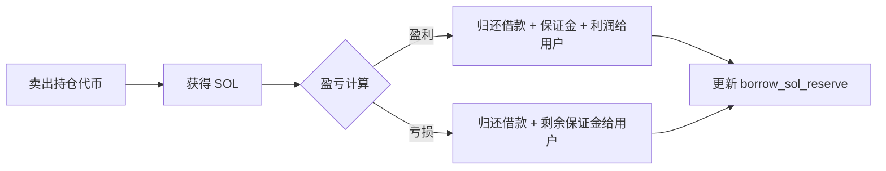
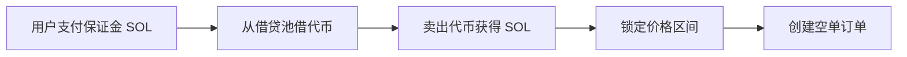
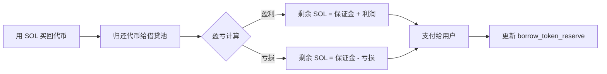
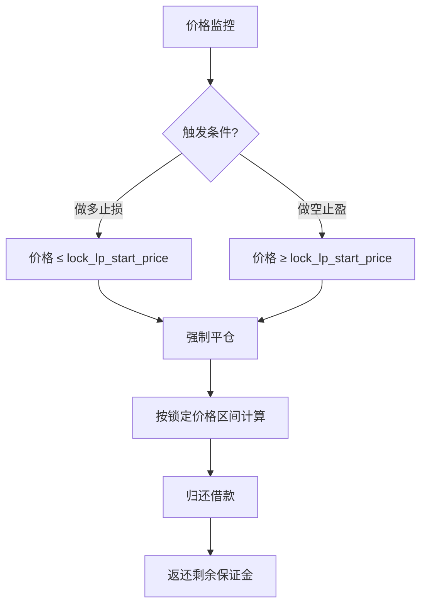
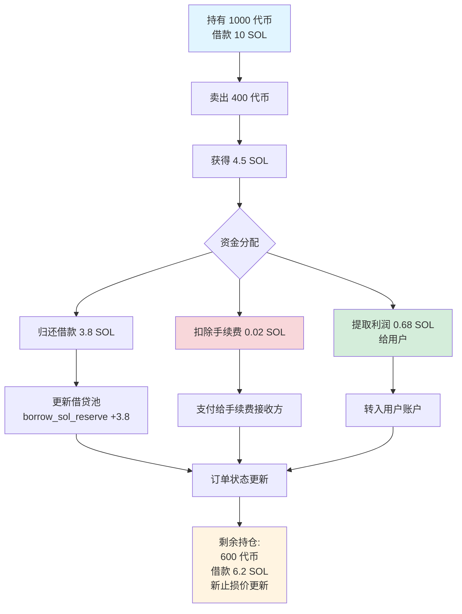
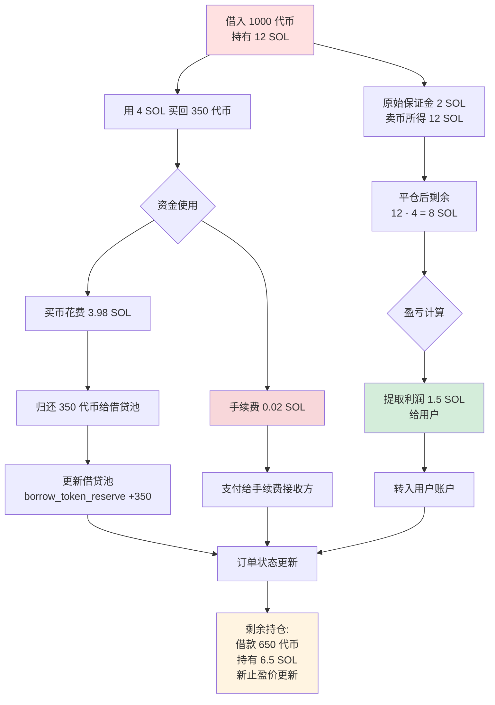

# 🏦 借贷池功能简介

## 一、📋 概述

PinPet 借贷池是支持杠杆交易的核心模块,为用户提供 SOL 和代币的借贷服务,实现做多和做空功能。借贷池采用**虚拟储备池**机制,独立于现货交易的流动性池,确保杠杆交易不影响现货市场的正常运作。

## 二、🎭 借贷池的双重角色

### 2.1 💰 作为资金池
- **SOL 借贷池**: 为做多交易者提供 SOL 借款
- **代币借贷池**: 为做空交易者提供代币借款

### 2.2 📦 储备管理
借贷池维护两个独立的虚拟储备:

| 储备类型 | 说明 | 用途 |
|---------|------|------|
| `borrow_sol_reserve` | SOL 虚拟储备 | 供做多交易者借用 |
| `borrow_token_reserve` | 代币虚拟储备 | 供做空交易者借用 |

这些储备是**虚拟账本**,实际资金存储在现货流动性池中,通过价格区间锁定机制实现隔离。

## 三、🔄 杠杆交易借贷流程

### 3.1 📈 做多交易 (Long) - 借 SOL 买代币

#### ⬆️ 开仓阶段


**详细流程**:
1. **用户投入**: 支付保证金(例如 0.5 SOL) 💵
2. **借贷池放款**: 从 `borrow_sol_reserve` 借出 SOL(例如 4.5 SOL) 💸
3. **执行交易**: 用总共 5 SOL 在 AMM 上买入代币 ⚙️
4. **价格区间锁定**: 记录买入时的价格区间,用于平仓计算 🔒
5. **订单记录**: 创建 `MarginOrder`,记录借款金额、保证金、持仓代币数量 📝


#### ⬇️ 平仓阶段


**资金结算**:
- 卖出代币获得 SOL 总额 = `output_sol` 💰
- 扣除交易手续费 💸
- 归还借贷池: `borrow_amount` 返回 `borrow_sol_reserve` ⬅️
- 用户收益 = 总额 - 借款 - 保证金 ✅

### 3.2 📉 做空交易 (Short) - 借代币卖出换 SOL

#### ⬆️ 开仓阶段


**详细流程**:
1. **用户投入**: 支付保证金 SOL 💵
2. **借贷池放款**: 从 `borrow_token_reserve` 借出代币 💎
3. **执行交易**: 卖出代币获得 SOL,存入资金池 ⚙️
4. **价格区间锁定**: 记录卖出时的价格区间 🔒
5. **订单记录**: 创建 `MarginOrder`,记录借款代币数量、保证金、持仓 SOL 📝


#### ⬇️ 平仓阶段


**资金结算**:
- 买回代币所需 SOL 总额 = `required_sol` + 手续费 💰
- 归还借贷池: `borrow_amount`(代币) 返回 `borrow_token_reserve` ⬅️
- 用户收益 = 开仓卖币所得 SOL - 平仓买币花费 SOL - 保证金 ✅

## 四、💸 借贷池的还款机制

### 4.1 ✅ 主动平仓还款
用户主动平仓时,系统自动执行还款:

| 交易类型 | 还款资产 | 还款来源 | 返还储备 |
|---------|---------|---------|---------|
| 平多仓 | SOL | 卖出代币所得 | `borrow_sol_reserve` |
| 平空仓 | 代币 | 买回代币 | `borrow_token_reserve` |

**还款优先级**:
1. 扣除交易手续费 💸
2. 归还借款本金 ⬅️
3. 返还保证金 💰
4. 分配盈利/处理亏损 📊

### 4.2 ⚠️ 强制清算还款
当价格触及止损/止盈价格时,系统自动强制平仓:



**清算保护** 🛡️:
- 通过锁定价格区间,确保即使市场价格剧烈波动,也能按预定价格平仓
- 保证金设计确保借贷池资金安全

### 4.3 ⏰ 到期清算
订单到期后任何人都可触发平仓:

- 做多订单: 到期时间 `end_time` = 开仓时间 + `borrow_duration` ⏱️
- 做空订单: 同上
- 到期后按当前市价强制平仓,归还借款 ⚡

## 五、🛡️ 借贷池资金安全机制

### 5.1 💼 保证金要求
- **最低保证金**: `MIN_MARGIN_SOL_AMOUNT` (系统参数) 💰
- **保证金比例**: 根据杠杆倍数和价格波动范围动态计算 📊
- **保证金用途**: 覆盖价格不利变动时的亏损 🔒

### 5.2 🔐 价格区间锁定
每个订单锁定特定价格区间的流动性:

```
做多锁定: [lock_lp_start_price, lock_lp_end_price] (价格下跌区间)
做空锁定: [lock_lp_start_price, lock_lp_end_price] (价格上涨区间)
```

这确保平仓时有足够的流动性来归还借款。✅

### 5.3 ✔️ 储备检查
开仓前系统检查:

| 检查项 | 条件 | 错误码 |
|-------|------|-------|
| SOL 储备 | `required_borrow_sol ≤ borrow_sol_reserve` | `InsufficientBorrowingReserve` |
| 代币储备 | `required_borrow_token ≤ borrow_token_reserve` | `InsufficientBorrowingReserve` |


## 六、💸 手续费机制

### 6.1 📊 杠杆交易手续费
- **手续费率**: `borrow_fee` (例如 0.5% = 50 基点) 💰
- **收费时机**: 开仓和平仓时都收取 ⏰
- **费用分配**:
  - 合作伙伴: `fee_split` 比例 (例如 80%) 🤝
  - 技术提供方: 100% - `fee_split` (例如 20%) ⚙️

### 6.2 ⚡ 强制清算手续费
- 触发清算时额外收取 `borrow_fee` 作为清算费 💸
- 用于激励第三方执行到期清算 🎯

## 七、🎯 部分平仓功能

用户可以部分平仓,灵活管理风险: ⚙️

### 7.1 📈 做多部分平仓



**订单更新明细**:

| 字段 | 平仓前 | 平仓后 | 说明 |
|-----|-------|-------|------|
| `position_asset_amount` | 1000 代币 | 600 代币 | 剩余持仓 |
| `borrow_amount` | 10 SOL | 6.2 SOL | 剩余借款 |
| `lock_lp_start_price` | 原止损价 | 新止损价 | 按新持仓重新计算 |
| `realized_sol_amount` | 0 SOL | 0.68 SOL | 累加已实现利润 |

### 7.2 📉 做空部分平仓



**订单更新明细**:

| 字段 | 平仓前 | 平仓后 | 说明 |
|-----|-------|-------|------|
| `borrow_amount` | 1000 代币 | 650 代币 | 剩余借款(代币) |
| `position_asset_amount` | 12 SOL | 6.5 SOL | 剩余持有 SOL |
| `lock_lp_start_price` | 原止盈价 | 新止盈价 | 按新持仓重新计算 |
| `realized_sol_amount` | 0 SOL | 1.5 SOL | 累加已实现利润 |

### 7.3 ⚠️ 最小持仓限制
部分平仓后剩余持仓必须 ≥ `MIN_TRADE_TOKEN_AMOUNT * 2`,防止产生无法清算的微小头寸。

## 八、🔗 借贷池与流动性池的关系

### 8.1 🔒 资金隔离
- **现货流动性池**: `lp_sol_reserve` + `lp_token_reserve`
- **借贷虚拟池**: `borrow_sol_reserve` + `borrow_token_reserve`

虽然实际资金都在同一个 `pool_sol_account` 和 `pool_token_account`,但通过价格区间锁定机制实现逻辑隔离。🛡️

### 8.2 🔄 价格同步
- 现货交易和杠杆交易共享同一个 `price` (当前市场价格) 💹
- 价格更新后,系统重新计算流动性储备: `price_to_reserves(price)` ⚙️

### 8.3 🤝 流动性互补
- 杠杆交易锁定的价格区间不参与现货交易 🔐
- 现货交易可以触发杠杆订单的强制平仓,释放流动性 ⚡

## 九、✨ 关键优势

| 特性 | 说明 | 优势 |
|-----|------|------|
| 虚拟储备 | 借贷池是账本记录,非实际资金池 | 资金效率高,无需额外注资 |
| 价格区间锁定 | 平仓价格可预测 | 降低清算风险,保护借贷池 |
| 双向借贷 | 支持 SOL 和代币双向借贷 | 做多做空功能完整 |
| 部分平仓 | 灵活调整仓位 | 用户体验好,风险可控 |
| 到期清算 | 时间限制 + 第三方激励 | 确保资金及时归还 |


