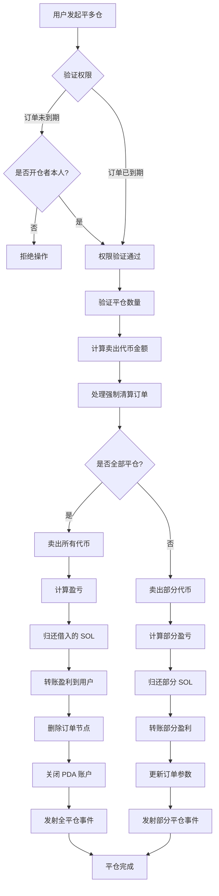
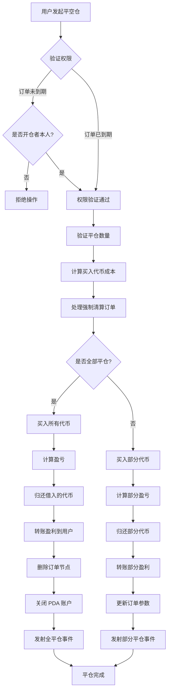

# 💼 PinPet 杠杆平仓功能产品简介

## 1. 📋 功能概述

### 🤔 什么是平仓？

平仓是指用户关闭其持有的杠杆交易仓位的操作。在 PinPet 平台上，用户开仓后会创建一个保证金订单，记录借贷关系和仓位信息。平仓操作会结算该订单，归还借款，并将盈亏结算给用户。

### 💡 为什么需要平仓？

| 平仓原因 | 说明 |
|---------|------|
| **🎯 止盈/止损** | 用户主动平仓，锁定利润或限制损失 |
| **⏰ 订单到期** | 到期后任何人都可触发平仓，归还借贷资源 |
| **💰 资金管理** | 释放保证金，灵活调整交易策略 |
| **🛡️ 风险控制** | 避免市场波动导致更大损失 |

### 📊 平仓类型

- **🔚 全部平仓**：一次性关闭整个仓位，结算全部盈亏
- **✂️ 部分平仓**：分批关闭仓位，实现部分盈利，保留剩余仓位

## 2. 📈 平多仓功能 (Close Long)

### 📝 功能说明

平多仓本质上是**卖出代币**的操作。用户之前通过做多开仓时借入 SOL 购买了代币，平仓时需要卖出代币换回 SOL 来归还借款。

### 🔄 操作流程图



### ⚙️ 关键参数说明

| 参数名称 | 用途说明 | 示例值 |
|---------|---------|--------|
| `sell_token_amount` | 希望卖出的代币数量（非精确值，可能有微小偏差） | 1000000 (1 代币) |
| `min_sol_output` | 卖出后期望获得的最少 SOL 数量（滑点保护） | 50000000 (0.05 SOL) |
| `prev_order_id` | 链表中前一个订单的索引位置 | 2 |
| `close_order_id` | 要平仓的订单在订单数组中的索引 | 5 |
| `next_order_id` | 链表中下一个订单的索引位置 | 7 |
| `close_order_address` | 平仓订单的地址（用于安全验证） | "Abc123..." |

### 🧮 盈亏计算说明

#### 🔚 全部平仓场景

**计算公式**：

```
盈利 SOL = (卖出获得的 SOL) + (保证金 SOL) - (借入的 SOL)
```

**计算步骤**：
1. 卖出所有持有的代币，获得 SOL（已扣除手续费）
2. 加上开仓时缴纳的保证金
3. 减去开仓时借入的 SOL
4. 正数为盈利，负数为亏损

#### ✂️ 部分平仓场景

**计算公式**：

```
当次盈利 = (当次卖出 SOL) + (总保证金) + (剩余代币未来可卖 SOL) - (总借款 SOL)
```

**计算步骤**：
1. 计算本次卖出代币获得的 SOL
2. 计算剩余代币在新止损价位能卖出的 SOL（扣除手续费后）
3. 总资产 = 本次所得 + 保证金 + 剩余可得
4. 减去总借款，得到部分盈利
5. 归还部分借款，剩余保证金继续持仓

### 💹 盈亏场景对比

| 场景 | 开仓价格 | 平仓价格 | 持仓代币 | 借入 SOL | 保证金 | 卖出所得 SOL | 盈亏结果 |
|------|---------|---------|---------|---------|--------|-------------|---------|
| **🟢 盈利场景** | 0.05 SOL | 0.08 SOL | 100 Token | 5 SOL | 0.5 SOL | 8 SOL | +2.5 SOL |
| **🔴 亏损场景** | 0.05 SOL | 0.03 SOL | 100 Token | 5 SOL | 0.5 SOL | 3 SOL | -1.5 SOL |
| **⚖️ 持平场景** | 0.05 SOL | 0.055 SOL | 100 Token | 5 SOL | 0.5 SOL | 5.5 SOL | 0 SOL |

## 3. 📉 平空仓功能 (Close Short)

### 📝 功能说明

平空仓本质上是**买入代币**的操作。用户之前通过做空开仓时借入代币并卖出获得 SOL，平仓时需要用 SOL 买回代币来归还借款。

### 🔄 操作流程图



### ⚙️ 关键参数说明

| 参数名称 | 用途说明 | 示例值 |
|---------|---------|--------|
| `buy_token_amount` | 希望买入的代币数量 | 1000000 (1 代币) |
| `max_sol_amount` | 愿意支付的最大 SOL 数量（滑点保护） | 60000000 (0.06 SOL) |
| `prev_order_id` | 链表中前一个订单的索引位置 | 1 |
| `close_order_id` | 要平仓的订单在订单数组中的索引 | 3 |
| `next_order_id` | 链表中下一个订单的索引位置 | 6 |
| `close_order_address` | 平仓订单的地址（用于安全验证） | "Def456..." |

### 🧮 盈亏计算说明

#### 🔚 全部平仓场景

**计算公式**：

```
盈利 SOL = (开仓时卖出代币所得 SOL 含手续费) - (平仓买回代币花费的 SOL) - (手续费)
```

**计算步骤**：
1. 用 SOL 买回所有借入的代币
2. 归还借入的代币到借贷池
3. 计算：开仓卖出所得 - 平仓买入成本 - 手续费
4. 正数为盈利，负数为亏损

#### ✂️ 部分平仓场景

**计算公式**：

```
当次盈利 = (本次买回区间含手续费) - (实际买回花费 SOL) - (买回手续费)
```

**计算步骤**：
1. 计算本次买回部分代币的成本（含手续费）
2. 计算剩余代币未来买回的成本（含手续费）
3. 当次盈利 = 本次应付 - 实际花费
4. 归还部分代币，更新订单参数
5. 剩余保证金继续持仓

### 💹 盈亏场景对比

| 场景 | 开仓价格 | 平仓价格 | 借入代币 | 卖出所得 SOL | 保证金 | 买回成本 SOL | 盈亏结果 |
|------|---------|---------|---------|-------------|--------|-------------|---------|
| **🟢 盈利场景** | 0.08 SOL | 0.05 SOL | 100 Token | 8 SOL | 0.5 SOL | 5 SOL | +2.5 SOL |
| **🔴 亏损场景** | 0.05 SOL | 0.08 SOL | 100 Token | 5 SOL | 0.5 SOL | 8 SOL | -2.5 SOL |
| **⚖️ 持平场景** | 0.06 SOL | 0.06 SOL | 100 Token | 6 SOL | 0.5 SOL | 6 SOL | -0.06 SOL (手续费) |

## 4. ⏰ 平仓时机和策略

### 🎯 主动平仓时机

| 时机类型 | 适用场景 | 建议策略 |
|---------|---------|---------|
| **📈 止盈平仓** | 价格达到预期目标 | 部分平仓锁定利润，剩余仓位继续持有 |
| **🛑 止损平仓** | 价格跌破止损位 | 及时全部平仓，控制损失 |
| **🔧 调整仓位** | 市场趋势变化 | 减仓或加仓，优化持仓结构 |
| **⏳ 到期前平仓** | 接近订单到期时间 | 主动平仓避免被强制清算 |

### ⚡ 被动平仓（强制清算）

**触发条件**：
- ⏰ 订单到期时间已过
- 👥 任何用户都可触发清算
- 💵 清算者可获得一定的手续费奖励

**⚠️ 风险提示**：
- 📉 到期后可能以不利价格被强制平仓
- 💡 建议在到期前主动管理仓位

## 5. 📖 使用场景举例

### 🟢 场景一：做多盈利平仓

**背景**：
- 用户以 0.05 SOL 价格做多，买入 100 代币
- 借入 4.5 SOL，缴纳 0.5 SOL 保证金
- 当前价格涨到 0.08 SOL

**操作**：
1. 用户决定全部平仓锁定利润
2. 卖出 100 代币，获得约 8 SOL（扣除手续费后）
3. 归还 4.5 SOL 借款
4. 收回 0.5 SOL 保证金
5. 净盈利：8 - 4.5 + 0.5（保证金已在开仓时计入） = 约 3 SOL

**✅ 结果**：成功实现 60% 的收益率

### 🔴 场景二：做空止损平仓

**背景**：
- 用户以 0.05 SOL 价格做空，借入并卖出 100 代币，获得 5 SOL
- 缴纳 0.5 SOL 保证金
- 价格上涨到 0.08 SOL，触及止损价

**操作**：
1. 用户紧急止损平仓
2. 用 8 SOL 买回 100 代币（含手续费）
3. 归还 100 代币到借贷池
4. 保证金 0.5 SOL + 开仓所得 5 SOL = 5.5 SOL 可用资金
5. 净亏损：5.5 - 8 = -2.5 SOL

**✅ 结果**：及时止损，避免更大损失

### ✂️ 场景三：部分平仓调整仓位

**背景**：
- 用户做多持有 200 代币
- 价格已经上涨 30%
- 用户希望锁定部分利润，但继续持有看好后市

**操作**：
1. 部分平仓 100 代币
2. 归还部分 SOL 借款
3. 获得部分盈利转入账户
4. 剩余 100 代币继续持仓
5. 订单参数更新，止损价位调整

**✅ 结果**：实现灵活的仓位管理策略

## 6. ⚠️ 注意事项和限制

### 🚫 操作限制

| 限制类型 | 具体要求 | 说明 |
|---------|---------|------|
| **🔐 权限验证** | 订单未到期时只能由开仓者平仓 | 保护用户资产安全 |
| **💳 结算地址** | 必须是开仓者的钱包地址 | 资金只能回到原地址 |
| **📏 最小交易量** | 部分平仓时不低于 2 倍最小交易量 | 避免粉尘订单 |
| **📊 剩余数量** | 部分平仓后剩余不少于最小交易量 | 保证订单有效性 |

### ⚠️ 风险提示

#### 📉 滑点风险
- 平仓时实际成交价格可能与预期有偏差
- 建议设置合理的滑点保护参数
- 大额平仓时滑点影响更显著

#### 💸 手续费成本
- 每次平仓都需支付交易手续费
- 频繁平仓会增加成本
- 部分平仓需要两次手续费（本次 + 未来全平）

#### ⏰ 时间风险
- 到期后任何人可触发平仓
- 可能以不利价格被清算
- 建议提前管理即将到期的订单

#### 🌊 市场风险
- 价格快速波动可能导致平仓时机不佳
- 极端行情下可能出现爆仓
- 建议合理设置止损位

### 💡 最佳实践建议

1. **🛡️ 设置合理止损**：开仓时就规划好止损价位，严格执行
2. **✂️ 分批平仓**：大仓位建议分批平仓，降低市场冲击
3. **⏰ 关注到期时间**：提前 1-2 天主动管理即将到期的订单
4. **💰 控制手续费**：避免过于频繁的部分平仓操作
5. **📊 监控市场深度**：大额平仓前查看市场流动性

### 🔒 技术安全保障

- **✅ 地址验证**：平仓时验证订单地址，防止操作错误订单
- **🔐 权限检查**：多重权限验证，确保只有授权用户能操作
- **🛡️ 溢出保护**：所有数值计算使用安全的 checked 方法
- **⚛️ 原子性操作**：平仓过程中所有步骤原子化执行，防止状态不一致

---

## 📚 附录：术语解释

| 术语 | 解释 |
|------|------|
| **PDA** | Program Derived Address，程序派生地址，用于存储订单数据 |
| **保证金** | 用户开仓时缴纳的 SOL，作为风险担保 |
| **借贷池** | 提供杠杆资金的虚拟池子 |
| **止损价** | 订单被强制平仓的价格阈值 |
| **手续费折扣** | 满足条件后享受的手续费优惠 |
| **强制清算** | 订单到期后被自动平仓的机制 |
| **链表节点** | 订单在链表中的位置，用于高效管理多个订单 |

---

*本文档为产品功能简介，不包含技术实现细节。如需了解技术实现，请参考项目代码及技术文档。*
