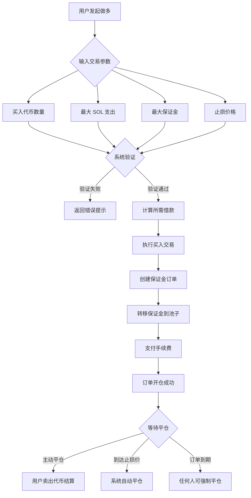
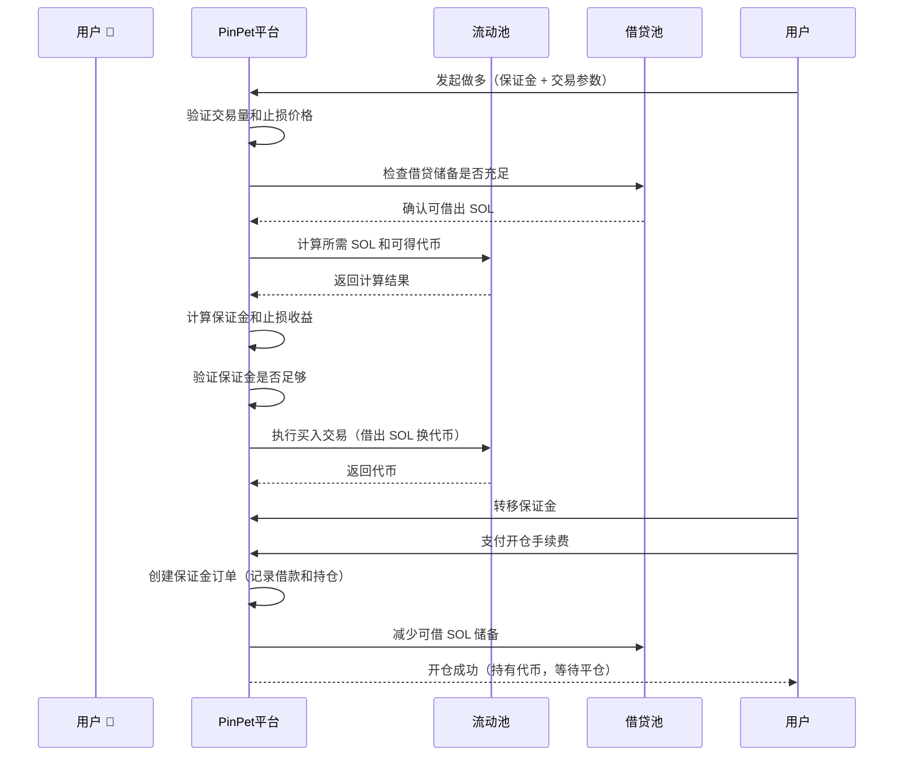
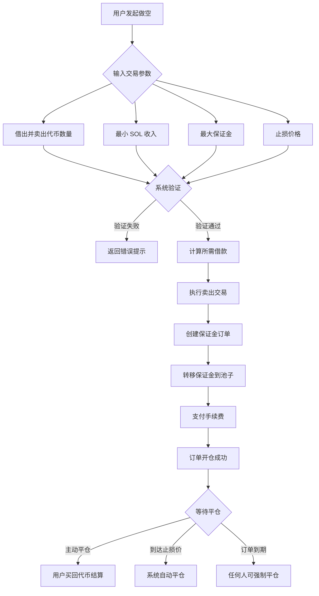
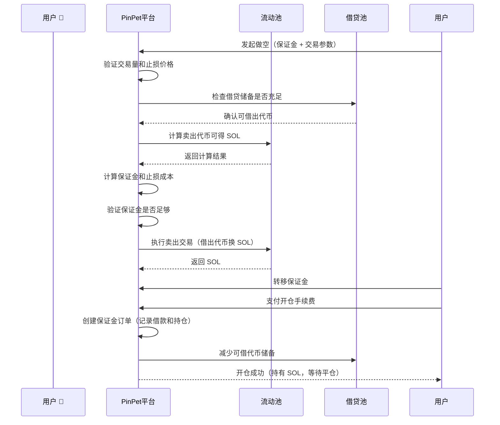
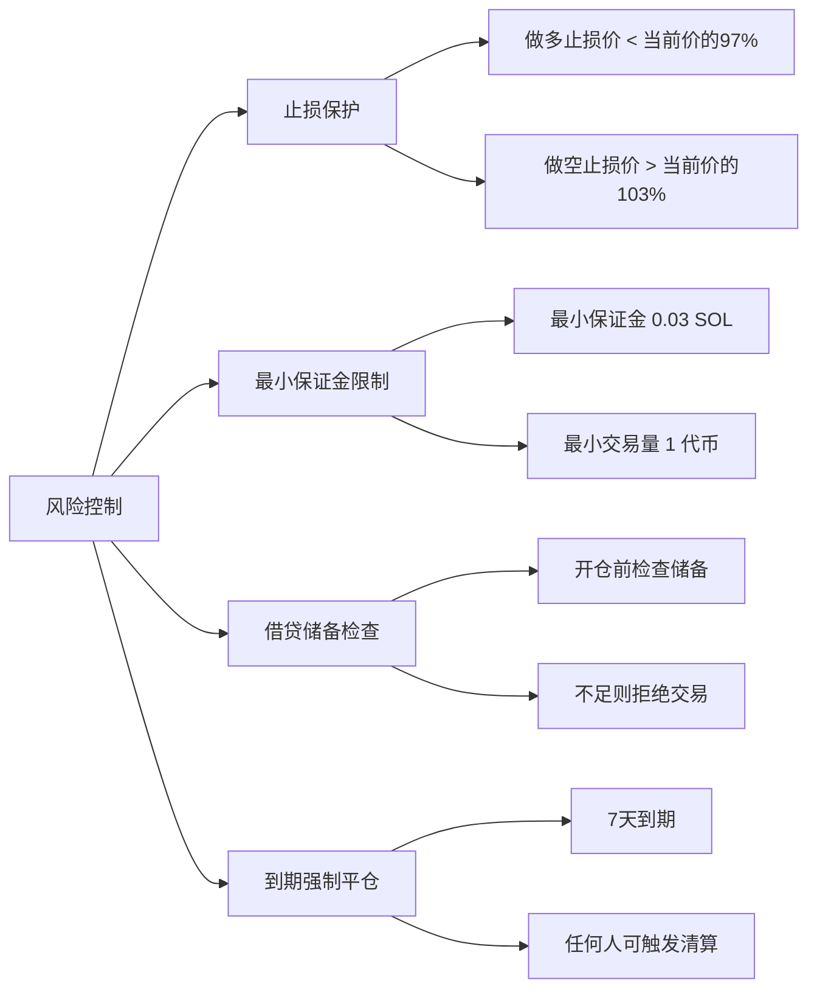

# 📊 PinPet 杠杆开仓功能产品简介

## 1. 功能概述 🎯

### 什么是杠杆交易 💹

杠杆交易是一种利用借贷资金放大交易规模的金融工具，允许用户用较少的保证金控制更大价值的资产。PinPet 平台提供做多和做空两种杠杆交易方式，让用户能够在代币价格上涨或下跌时均可获利。

### 核心概念 💡

- **保证金（Margin）** 💰: 用户自己投入的 SOL 资金，作为交易的担保
- **借款（Borrow）** 💵: 从平台借出的资产（做多借 SOL，做空借代币）
- **止损价格（Stop Loss Price）** 🛡️: 当价格达到此价位时，系统自动平仓以控制风险
- **平仓（Close Position）** 🔄: 归还借款并结算盈亏的操作

### 杠杆类型 📈📉

| 交易类型 | 市场预期 | 借出资产 | 持有资产 | 盈利条件 |
|---------|---------|---------|---------|---------|
| 做多（Long） 🟢 | 看涨 ⬆️ | 借 SOL | 持有代币 | 代币价格上涨 |
| 做空（Short） 🔴 | 看跌 ⬇️ | 借代币 | 持有 SOL | 代币价格下跌 |

---

## 2. 做多交易（Long）🟢📈

### 功能说明 ✨

做多是指用户看好代币未来价格上涨，通过向平台借入 SOL 来购买更多代币，待价格上涨后卖出代币归还借款并获利。

### 用户操作流程 🔄



### 做多交易流程图 📋



### 关键参数说明 📝

| 参数名称 | 说明 | 示例值 | 约束条件 |
|---------|------|--------|---------|
| buy_token_amount | 希望买入的代币数量 | 1,000,000（1个代币） | 不低于最小交易量（1个代币） |
| max_sol_amount | 愿意支付的最大 SOL 数量 | 100,000,000（0.1 SOL） | 实际可能更少（滑点保护） |
| margin_sol_max | 用户愿意投入的最大保证金 | 50,000,000（0.05 SOL） | 不低于 0.03 SOL |
| close_price | 止损价格（自动平仓触发价） | 当前价格的 95% | 必须低于当前价格的 97% |
| borrow_amount | 系统计算的实际借款量 | 50,000,000（0.05 SOL） | 不超过借贷池储备 |
| position_asset_amount | 持仓代币数量 | 1,000,000（1个代币） | 等于买入的代币数量 |

### 保证金计算逻辑 🧮

保证金的作用是确保用户在止损平仓时能够归还借款。计算公式如下：

```
实际保证金 = 买币总花费 - 止损平仓时收益（扣除手续费后）
```

**举例说明：**

假设当前代币价格为 0.1 SOL/Token：

1. 用户想买 1 个代币，需要约 0.1 SOL
2. 用户投入保证金 0.05 SOL，借入 0.05 SOL
3. 设置止损价格为 0.095 SOL/Token（当前价格的 95%）
4. 系统计算：如果在 0.095 价格卖出 1 个代币，扣除手续费后约得 0.0945 SOL
5. 计算保证金：0.1 - 0.0945 = 0.0055 SOL（实际所需保证金）
6. 用户提供的 0.05 SOL 大于 0.0055 SOL，满足开仓条件

### 风险提示 ⚠️

- **止损触发** 🛑: 当代币价格下跌到止损价格时，系统自动卖出代币归还借款，用户将损失保证金
- **订单到期** ⏰: 超过借贷期限（默认 7 天）未平仓，任何人可强制平仓，用户需尽快主动平仓
- **借贷成本** 💸: 开仓和平仓均需支付手续费（默认 0.25%）

---

## 3. 做空交易（Short）🔴📉

### 功能说明 ✨

做空是指用户看空代币未来价格下跌，通过向平台借入代币立即卖出换取 SOL，待价格下跌后买回代币归还借款并获利。

### 用户操作流程 🔄



### 做空交易流程图 📋



### 关键参数说明 📝

| 参数名称 | 说明 | 示例值 | 约束条件 |
|---------|------|--------|---------|
| borrow_sell_token_amount | 希望借出并卖掉的代币数量 | 1,000,000（1个代币） | 不低于最小交易量（1个代币） |
| min_sol_output | 卖出后期望获得的最小 SOL | 90,000,000（0.09 SOL） | 实际可能更多（滑点保护） |
| margin_sol_max | 用户愿意投入的最大保证金 | 50,000,000（0.05 SOL） | 不低于 0.03 SOL |
| close_price | 止损价格（自动平仓触发价） | 当前价格的 105% | 必须高于当前价格的 103% |
| borrow_amount | 系统计算的实际借款量 | 1,000,000（1个代币） | 不超过借贷池储备 |
| position_asset_amount | 持仓 SOL 数量 | 95,000,000（0.095 SOL） | 等于卖出后得到的 SOL（扣除手续费） |

### 保证金计算逻辑 🧮

做空的保证金用于确保用户在止损平仓时能够买回代币归还借款。计算公式如下：

```
实际保证金 = 止损平仓时买回成本（含手续费） - 卖出时收益（扣除手续费）
```

**举例说明：**

假设当前代币价格为 0.1 SOL/Token：

1. 用户借 1 个代币卖出，扣除手续费后得到约 0.0975 SOL
2. 设置止损价格为 0.105 SOL/Token（当前价格的 105%）
3. 系统计算：如果在 0.105 价格买回 1 个代币，含手续费约需 0.1053 SOL
4. 计算保证金：0.1053 - 0.0975 = 0.0078 SOL（实际所需保证金）
5. 用户需投入至少 0.0078 SOL 作为保证金
6. 用户提供 0.05 SOL 保证金，大于 0.0078 SOL，满足开仓条件

### 风险提示 ⚠️

- **止损触发** 🛑: 当代币价格上涨到止损价格时，系统自动买回代币归还借款，用户将损失保证金
- **无限风险** ⛔: 理论上代币价格可以无限上涨，做空风险大于做多
- **订单到期** ⏰: 超过借贷期限（默认 7 天）未平仓，任何人可强制平仓
- **借贷成本** 💸: 开仓和平仓均需支付手续费（默认 0.25%）

---

## 4. 杠杆交易的风险和收益 📊💰

### 收益放大效应 📈💎

杠杆交易的核心优势是用较少的本金控制更大的资产规模，从而放大收益。

**做多收益示例：**

假设用户投入 0.05 SOL 保证金做多 1 个代币：

| 场景 | 开仓价 | 平仓价 | 持仓价值 | 还款金额 | 净收益 | 收益率 |
|------|--------|--------|----------|----------|--------|--------|
| 小涨 | 0.1 | 0.11 | 0.11 SOL | 0.05 SOL | 0.06 SOL | +120% |
| 大涨 | 0.1 | 0.15 | 0.15 SOL | 0.05 SOL | 0.10 SOL | +200% |
| 小跌 | 0.1 | 0.095 | 0.095 SOL | 0.05 SOL | 0.045 SOL | -10% |
| 触发止损 | 0.1 | 0.095 | 0.095 SOL | 0.05 SOL | 0.045 SOL | -10% |

**做空收益示例：**

假设用户投入 0.05 SOL 保证金做空 1 个代币：

| 场景 | 开仓价 | 平仓价 | 持仓价值 | 买回成本 | 净收益 | 收益率 |
|------|--------|--------|----------|----------|--------|--------|
| 小跌 | 0.1 | 0.09 | 0.0975 SOL | 0.09 SOL | 0.0075 SOL | +15% |
| 大跌 | 0.1 | 0.05 | 0.0975 SOL | 0.05 SOL | 0.0475 SOL | +95% |
| 小涨 | 0.1 | 0.105 | 0.0975 SOL | 0.105 SOL | -0.0075 SOL | -15% |
| 触发止损 | 0.1 | 0.105 | 0.0975 SOL | 0.1053 SOL | -0.0078 SOL | -16% |

### 风险因素 ⚠️

#### 1. 价格波动风险 📉📈

- **做多风险** 🟢: 代币价格下跌超过止损价，损失全部保证金
- **做空风险** 🔴: 代币价格上涨超过止损价，损失全部保证金
- **剧烈波动** ⚡: 短时间内价格大幅波动可能导致快速止损

#### 2. 流动性风险 💧

- **借贷池枯竭** 📛: 如果借贷池储备不足，无法开仓
- **滑点损失** 📊: 交易量过大可能导致实际成交价格偏离预期

#### 3. 时间风险 ⏰

- **订单到期** 🔔: 超过 7 天未平仓，任何人可强制平仓，可能在不利价格被清算
- **持仓成本** 💸: 长期持仓需承担时间成本和市场不确定性

#### 4. 系统风险 🔧

- **价格计算** 🧮: 基于恒定乘积算法，大额交易可能面临较大滑点
- **手续费累积** 💰: 多次开平仓手续费累积会侵蚀利润

### 风险控制措施 🛡️

PinPet 平台提供多重风险控制机制：



---

## 5. 使用场景举例 💼

### 场景一：看涨行情做多 🟢⬆️

**背景** 📖: 小明看到某个 Meme 代币有上涨趋势，当前价格 0.1 SOL

**操作步骤** 🎯:
1. 小明投入 0.1 SOL 保证金
2. 借入 0.1 SOL（平台借给小明）
3. 用总计 0.2 SOL 买入 2 个代币
4. 设置止损价格 0.095 SOL（如果跌破自动止损）

**盈利情况** 💰📈: 代币涨到 0.15 SOL
- 卖出 2 个代币得到 0.3 SOL（扣除手续费约 0.2985 SOL）
- 归还借款 0.1 SOL，剩余 0.1985 SOL
- 扣除保证金 0.1 SOL，净利润 0.0985 SOL（约 +98.5%）

**止损情况** 🛑📉: 代币跌到 0.095 SOL（触发止损）
- 自动卖出 2 个代币得到 0.19 SOL（扣除手续费约 0.1895 SOL）
- 归还借款 0.1 SOL，剩余 0.0895 SOL
- 损失保证金 0.1 - 0.0895 = 0.0105 SOL（约 -10.5%）

### 场景二：看跌行情做空 🔴⬇️

**背景** 📖: 小红认为某代币价格虚高，当前价格 0.2 SOL，准备做空

**操作步骤** 🎯:
1. 小红投入 0.15 SOL 保证金
2. 借入 1 个代币（平台借给小红）
3. 立即卖出 1 个代币得到 0.2 SOL（扣除手续费约 0.195 SOL）
4. 设置止损价格 0.21 SOL（如果涨破自动止损）

**盈利情况** 💰📉: 代币跌到 0.15 SOL
- 用 0.15 SOL 买回 1 个代币（含手续费约 0.1504 SOL）
- 归还借款 1 个代币
- 剩余 0.195 - 0.1504 = 0.0446 SOL
- 加上保证金 0.15 SOL，总计 0.1946 SOL（净利润 0.0446 SOL，约 +29.7%）

**止损情况** 🛑📈: 代币涨到 0.21 SOL（触发止损）
- 自动用 0.21 SOL 买回 1 个代币（含手续费约 0.2105 SOL）
- 归还借款 1 个代币
- 支出 0.2105 SOL，但卖出时只得到 0.195 SOL
- 损失 0.0155 SOL，扣除保证金（约 -10.3%）

### 场景三：波段操作 🔄📊

**背景** 📖: 小刚擅长短线交易，在代币价格 0.08 - 0.12 SOL 区间波动时反复操作

**策略** 🎯:
- 价格接近 0.08 SOL 时做多，设止损 0.075 SOL
- 价格接近 0.12 SOL 时做空，设止损 0.125 SOL
- 每次盈利 5-10% 时主动平仓

**优势** ✅: 利用杠杆放大区间波动收益

**风险** ⚠️: 突破区间时可能止损，需要严格执行纪律

---

## 6. 注意事项和限制 📌

### 交易限制 🔒

| 限制项目 | 数值 | 说明 |
|---------|------|------|
| 最小交易代币量 | 1 Token（1,000,000 最小单位） | 防止交易量过小 |
| 最小保证金 | 0.03 SOL（30,000,000 lamports） | 保证交易有意义的规模 |
| 做多止损价 | 当前价格的 97% 以下 | 至少 3% 的止损空间 |
| 做空止损价 | 当前价格的 103% 以上 | 至少 3% 的止损空间 |
| 最大借贷期限 | 7 天（604,800 秒） | 超期可被强制平仓 |
| 借贷池上限 | 依据流动池规模动态调整 | 储备不足时拒绝交易 |

### 手续费说明 💸

**手续费类型** 📊:
- 开仓手续费: 默认 0.25%（borrow_fee）
- 平仓手续费: 默认 0.25%（borrow_fee）
- 手续费分配: 合作伙伴和技术提供方按比例分成

**手续费计算** 🧮:
- 做多开仓: 对买入 SOL 金额收取手续费
- 做空开仓: 对卖出 SOL 金额收取手续费
- 平仓: 对交易额收取手续费

### 最佳实践建议 💡

#### 1. 合理设置止损 🛡️

- **不要过度贪婪**: 止损价格不宜设置过近（接近 3% 下限）
- **留出缓冲空间**: 考虑短期波动，给予 5-10% 止损空间更安全
- **及时止盈**: 盈利达到预期后主动平仓，不要等待强制平仓

#### 2. 控制仓位规模 📊

- **分散投资** 🎯: 不要将所有资金投入单一订单
- **逐步建仓** ➡️: 可以多次小额开仓，降低单次风险
- **预留资金** 💰: 保留部分资金应对追加保证金需求（未来功能）

#### 3. 选择合适时机 ⏰

- **流动性充足** 💧: 选择借贷池储备充足时开仓
- **避免剧烈波动** ⚡: 价格大幅波动时容易触发止损
- **关注到期时间** 🔔: 预计持仓时间不要接近 7 天上限

#### 4. 监控订单状态 👀

- **定期查看** 🔍: 每天至少检查一次订单状态
- **价格预警** 🚨: 价格接近止损价时及时决策
- **主动平仓** ✅: 不要等待系统自动止损，主动平仓可避免滑点

### 常见问题 ❓

**Q1: 保证金会被退还吗？**

A: 会的。主动平仓时，如果有盈利，保证金加上盈利一并退还；如果触发止损，剩余保证金会退还（可能为零）。

**Q2: 可以提前平仓吗？**

A: 可以。订单到期前，用户可以随时主动平仓，不会有额外惩罚。

**Q3: 订单到期后会怎样？**

A: 订单到期后，任何人都可以触发强制平仓。建议在到期前主动平仓，以避免在不利价格被清算。

**Q4: 借贷池储备不足怎么办？**

A: 如果借贷池储备不足，系统会拒绝开仓。建议等待其他用户平仓释放储备，或选择其他交易对。

**Q5: 手续费如何计算？**

A: 手续费根据交易金额的一定比例收取（默认 0.25%）。开仓和平仓各收取一次，总计约 0.5% 的成本。

**Q6: 可以调整止损价格吗？**

A: 当前版本不支持调整止损价格。建议开仓时谨慎设置止损价格。

---

## 7. 总结 📝

PinPet 杠杆开仓功能为用户提供了灵活的做多做空工具，在代币上涨或下跌时均可获利。通过合理使用保证金和止损机制，用户可以放大收益同时控制风险。

**核心优势** ✨:
- **双向交易** 🔄: 做多做空均可盈利
- **杠杆放大** 📈: 小资金撬动大收益
- **自动止损** 🛡️: 价格保护机制降低风险
- **灵活平仓** ✅: 随时主动结算

**风险警示** ⚠️:
- ⛔ 杠杆交易具有高风险，可能损失全部保证金
- 📚 请充分理解交易机制后再进行操作
- 💡 建议从小额开始，逐步积累经验
- 🚫 切勿投入超过承受能力的资金

祝您交易顺利！🎉
