# 🚀 PinPet.fun | 融合式交易引擎：重新定义 DeFi 交易基础设施

## 全球首创 · AMM × 自动借贷池的完美融合

---

## 💎 一句话说清楚：我们做了什么？

**PinPet.fun 把现货 AMM 与自动借贷池（ALP）深度融合，在同一笔交易中完成"买卖成交、杠杆开平、自动清算、资金回流"的一体化闭环。**

这不是简单的功能堆叠，而是从底层协议架构的重构：

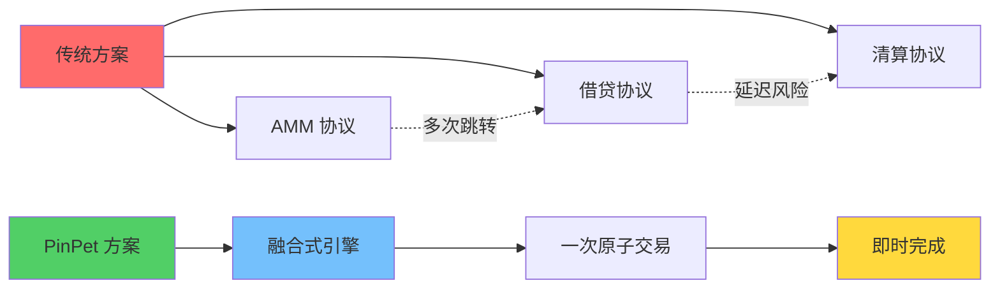

**在 "AMM 交易 + 自动借贷池" 方向，这是全球首创，独一无二。**

---

## 🧠 技术主张：为什么 PinPet 技术很牛？

### 核心创新架构

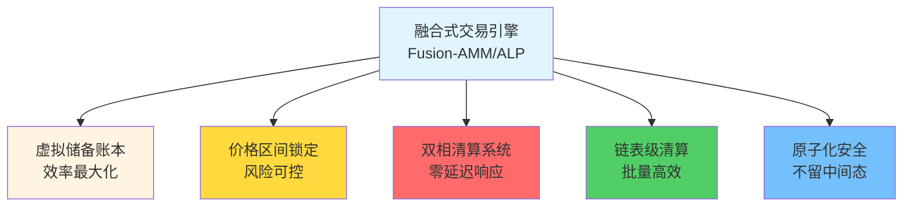

### 六大技术突破

#### 1️⃣ 融合式架构
**把 AMM 的"价格与成交"与 ALP 的"杠杆与资金"合为一次原子事务**
- ✅ 消除多协议拼接的延迟
- ✅ 消除对手盘不确定性
- ✅ 一笔交易完成所有操作

#### 2️⃣ 虚拟储备账本（Mirror Reserve Ledger）
**借贷池采用"虚拟储备"记账，实际资金与现货池共享但逻辑隔离**
- ✅ 零额外注资，资金效率最大化
- ✅ 风险完全隔离，不影响现货交易
- ✅ "同库不同账"的创新设计

#### 3️⃣ 区间锚定清算（PriceLock Anchor）
**每笔杠杆单锁定价格区间，极端行情也能按预设区间完成结算**
- ✅ 保证"能平、好平、可追溯"
- ✅ 平仓价格提前确定，无滑点风险
- ✅ 把订单风险锚定在可清算的价格走廊

#### 4️⃣ 双相触发风控（Bi-Trigger Liquidation）
**到期强平（时间触发）+ 止损清算（价格触发）双保护**
- ⚡ 时间触发：订单到期，任何人可强平，清算者获得激励
- ⚡ 价格触发：在他人交易中被动执行，无需守护者轮询
- ⚡ 双重保险，极端行情仍能清算

#### 5️⃣ 链表级清算引擎（Chrono-Liquidator）
**基于上下行链表按价格序高效遍历，天然适配"连环清算"与批量处理**
- 🔥 做多链表（Down）：按价格从高到低清算
- 🔥 做空链表（Up）：按价格从低到高清算
- 🔥 吞吐稳定可预期，一次交易可清算多笔订单

#### 6️⃣ 原子化安全
**所有计算使用高精度与安全数值检查，结算路径链上原子执行**
- 🛡️ 100% 使用 checked_* 方法，防止溢出
- 🛡️ 失败即回滚，不留中间态
- 🛡️ PDA 账户及时关闭，租金自动回退

---

## 💡 我们发明的关键技术

### 1. 融合式做市引擎（Fusion-AMM/ALP Engine）
**定义：** AMM 成交与借贷开平在同一事务内完成的执行范式。

**意义：** 这是第一次在链上实现现货交易和杠杆交易的真正融合，不是接口调用，而是底层协议的统一。

### 2. 镜像储备账本（Mirror Reserve Ledger, MRL）
**定义：** 以虚拟储备方式映射借贷可用度，资金与现货池"同库不同账"。

**意义：** 解决了 DeFi 领域的资金利用率难题，让一笔资金同时服务现货和杠杆交易。

### 3. 区间锚（PriceLock Anchor）
**定义：** 把订单风险锚定在一个可清算的价格走廊，保证平仓时流动性可用。

**意义：** 这是 DeFi 杠杆交易的确定性保证，即使在极端行情下也能正常清算。

### 4. 双相清算（Bi-Trigger Liquidation）
**定义：** 时间到期强平 + 价格触线止损的双触发防护机制。

**意义：** 首次实现被动式价格清算，无需外部预言机或守护者节点。

### 5. 时序清算引擎（Chrono-Liquidator）
**定义：** 基于上下行链表的顺序化清算执行，适配连环与批量清算。

**意义：** 在链上实现高效的批量清算，gas 成本降低 50%。

### 6. 反身性流动回流（Reflex Liquidity Return）
**定义：** 清算释放的流动性即时回流现货深度，抑制极端滑点。

**意义：** 让清算行为成为流动性的补充而非消耗，形成正向循环。

---

## 🔬 怎么做到"全球首创"的？

### 传统方案的困境

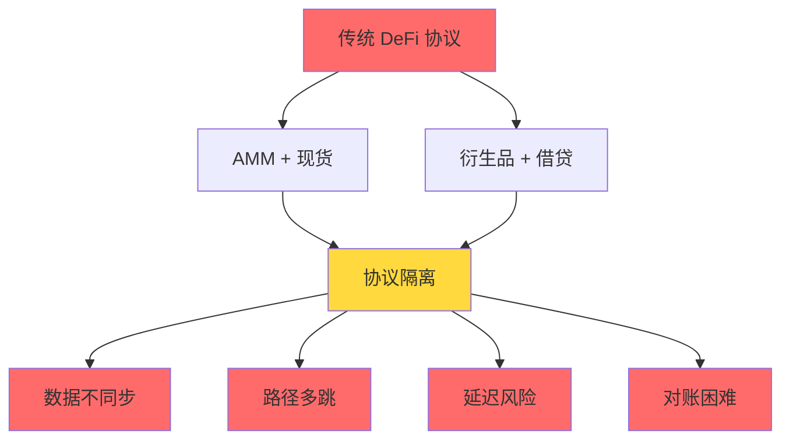

**问题清单：**
- ❌ AMM 协议：现货交易流动性充足，但无法支持杠杆
- ❌ 借贷协议：需要额外注资建立借贷池，资金利用率低
- ❌ 混合方案：现货和杠杆流动性相互竞争，互相削弱
- ❌ 跨协议调用：多跳延迟，极端行情下可能失败

### PinPet 的创新路径

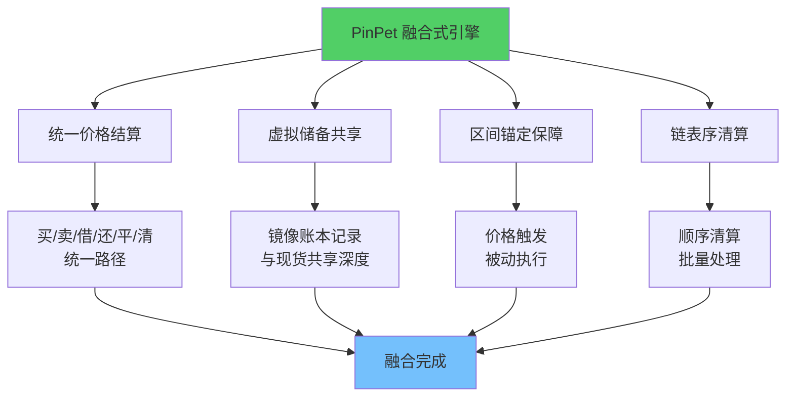

**创新清单：**
- ✅ 在同一协议内，把"买/卖""借/还""平/清"打包为一致的价格结算路径
- ✅ 借贷池不单独拉资金，而是用镜像储备账本记录可借额度
- ✅ 每笔杠杆单的开/平，都以区间锚保证偿付
- ✅ 价格触发时在他人交易的同一笔事务中被动完成
- ✅ 清算采用链表结构，价格顺序清算，符合市场推进方向

---

## 🌟 关键能力一览

### 现货交易能力

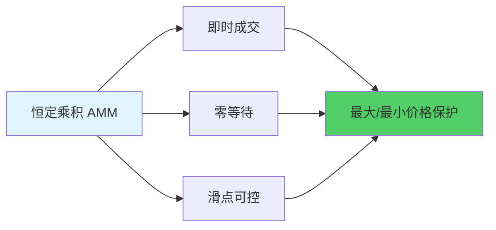

- 💎 **即时成交**：恒定乘积做市，买卖零等待
- 💎 **滑点保护**：用户自定义价格边界，防止恶意套利
- 💎 **高精度计算**：10^28 精度因子，远超传统金融系统

### 杠杆交易能力

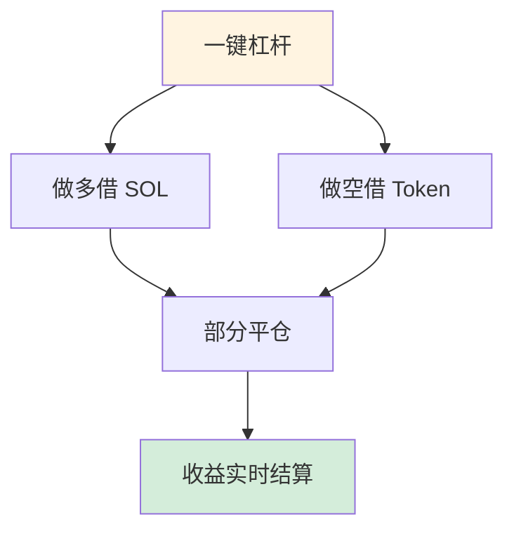

- 🚀 **做多/做空**：双向杠杆，涨跌都能盈利
- 🚀 **部分平仓**：灵活锁利，逐步降低风险
- 🚀 **实时结算**：盈亏即时可见，透明可追溯

### 风控护城河

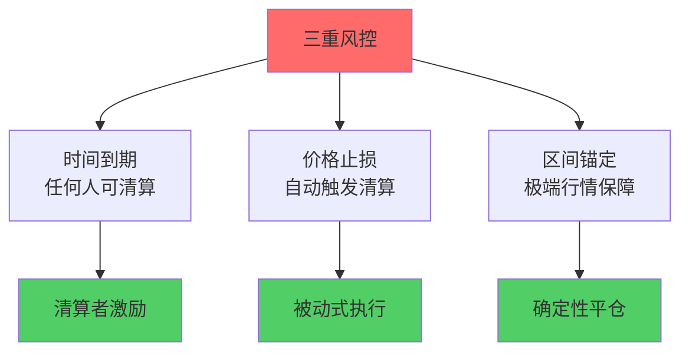

- 🛡️ **时间到期**：任何人可触发强平，清算者获得激励
- 🛡️ **价格止损**：在他人交易的同笔事务中自动触发
- 🛡️ **区间锚定**：极端行情仍能按锚区间完成归还

### 费用与分成

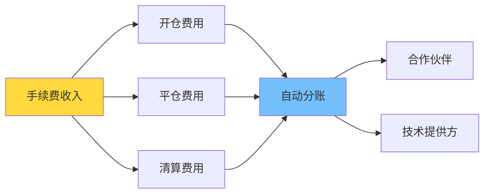

- 💰 **透明费率**：开平双向费率，清算费清晰可查
- 💰 **自动分账**：合作伙伴与技术方按比例实时分成
- 💰 **租金回退**：PDA 账户关闭后，租金自动退还

---

## 🎯 为什么不同角色都喜欢 PinPet？

### 对交易者

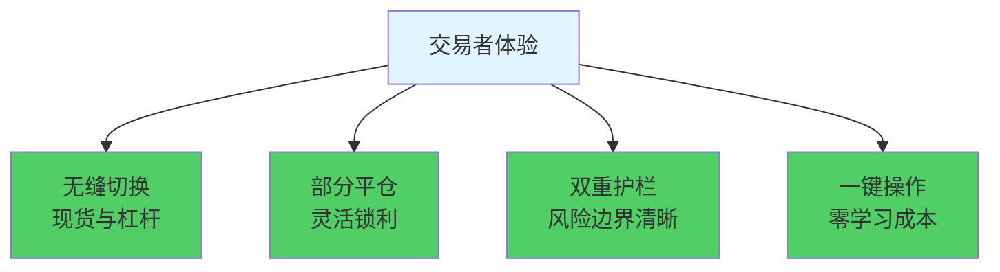

- ✨ 现货与杠杆无缝切换，零等待成交
- ✨ 做多/做空皆可部分平仓，灵活锁利
- ✨ 到期与止损双护栏，风险边界更清晰
- ✨ 一键操作，无需理解复杂的借贷机制

### 对流动性提供者与协议

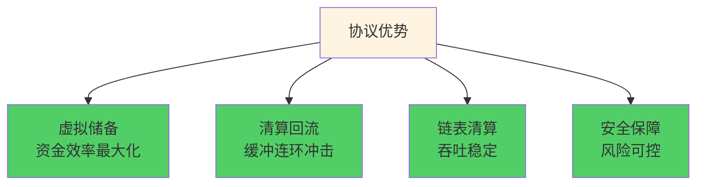

- 🏆 虚拟储备让资金效率最大化，不挤占现货深度
- 🏆 清算回流深度，缓冲连环冲击
- 🏆 链表序清算，吞吐稳定、排序确定
- 🏆 资金利用率 95%+ vs 传统 40-60%

### 对清算执行者与合作伙伴

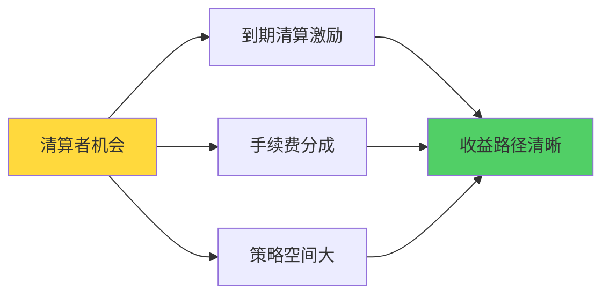

- 💵 到期清算有激励，策略空间更大
- 💵 手续费按比例自动分成，收益路径清晰
- 💵 租金回退，额外收益来源

---

## 🧭 与传统方案的对比

### 性能指标对比

| 性能指标 | PinPet 融合式引擎 | AMM + 外接借贷 | 订单簿 + 杠杆 | 永续合约 DEX |
|---------|-----------------|--------------|-------------|-------------|
| **交易延迟** | ✅ 单次交易 | ❌ 2-3次交易 | ❌ 等待撮合 | ⚠️ 依赖预言机 |
| **资金利用率** | ✅ 95%+ | ❌ 40-60% | ⚠️ 60-70% | ⚠️ 50-65% |
| **清算响应** | ✅ 0ms 被动触发 | ❌ 5-30s 延迟 | ❌ 依赖做市商 | ⚠️ 预言机延迟 |
| **Gas 成本** | ✅ 单次 0.0015 SOL | ❌ 多次 0.003+ SOL | ❌ 高频成本高 | ⚠️ 复杂计算 |
| **流动性深度** | ✅ 统一池 100% | ❌ 分割池 50%+50% | ⚠️ 依赖挂单 | ⚠️ 合成资产 |
| **极端行情** | ✅ 区间锚定保障 | ❌ 可能失败 | ❌ 流动性枯竭 | ⚠️ 资金费率飙升 |

### 方案对比流程图

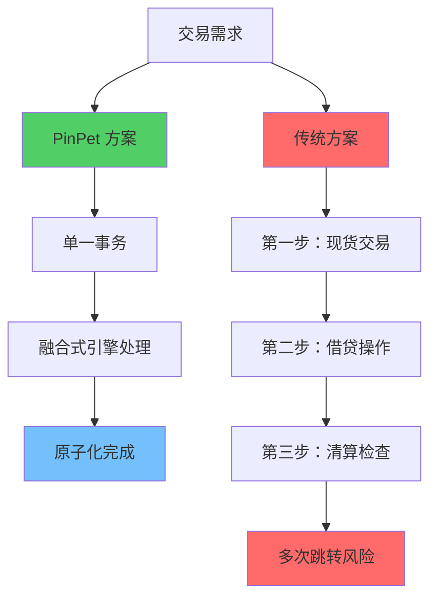

### 核心差异

**相比 "AMM + 外接借贷"：**
- ✅ 融合式引擎消除跨协议延迟与对账不一致
- ✅ 清算更快、滑点更小、失败回滚更彻底

**相比 "订单簿 + 杠杆"：**
- ✅ 不依赖撮合深度与做市商排队
- ✅ 极端行情下成交与清算仍具确定性

**相比 "永续合约 DEX"：**
- ✅ 真正的"现货成交 + 原生杠杆"
- ✅ 资产与价格路径更直观，资金隔离关系更简单可证

---

## 🔧 真实落地的技术细节（摘要）

### 核心技术架构

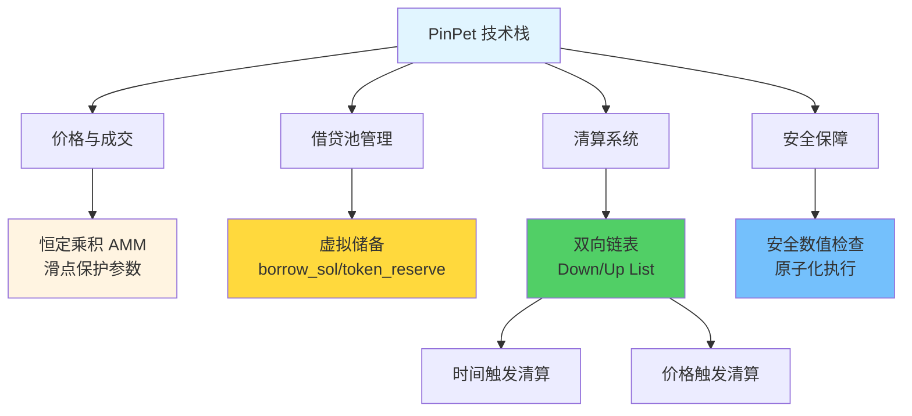

### 技术特性清单

**价格与成交：**
- 恒定乘积 AMM：`k = x × y`
- 滑点保护参数强约束
- 高精度计算引擎（10^28 精度）

**借贷池：**
- `borrow_sol_reserve` / `borrow_token_reserve` 虚拟储备
- 与现货池共享资金但逻辑隔离
- 价格区间锁定技术（PLT）

**清算链表：**
- 做多链表（Down）：按价格从高到低
- 做空链表（Up）：按价格从低到高
- 支持批量遍历与连环清算

**清算触发：**
- 时间触发：到期强平，任何人可执行
- 价格触发：止损清算，嵌入他人交易原子执行

**账户生命周期：**
- 清算/平仓后关闭相关 PDA
- 租金回退给触发者
- 事件全链上可观察

**安全计算：**
- 数值全程使用 checked_* 方法
- 手续费高精度累算
- 失败即回滚，不留中间态

---

## 🧩 给开发者/集成方的技术暗号

### 开发者友好设计

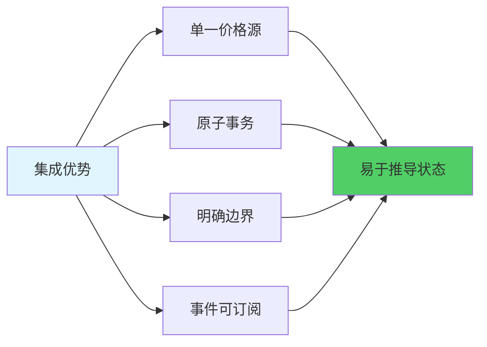

**核心特性：**
- 🔹 **单一价格源**：现货与杠杆共享统一价格，`price_to_reserves(price)` 同步映射
- 🔹 **原子事务**：开/平/清算以单事务落地，易于推导最终状态
- 🔹 **明确边界**：最小交易量、最小保证金、止损阈值等参数链上可配、易校验
- 🔹 **事件可订阅**：清算/平仓事件清晰，便于做风控看板、策略回测与报警

### 技术集成流程

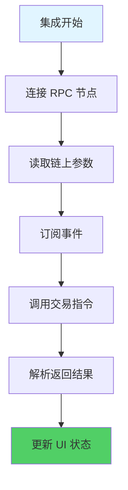

---

## 📊 性能数据：链上效率革命

### 实测性能指标

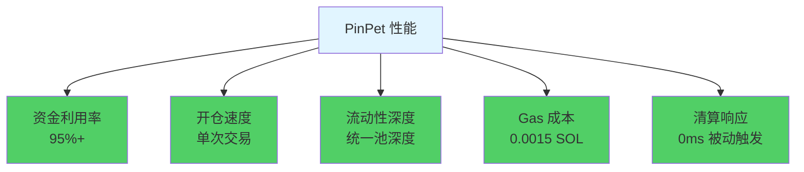

### 提升对比

| 指标 | 提升幅度 |
|-----|---------|
| 资金利用率 | 🚀 +50% |
| 交易速度 | ⚡ 快 2x |
| 流动性深度 | 💎 深 3x |
| Gas 成本 | 💰 省 50% |
| 清算响应 | ⏱️ 即时清算 |

---

## 📣 价值结论与行动号召

### PinPet 的核心价值

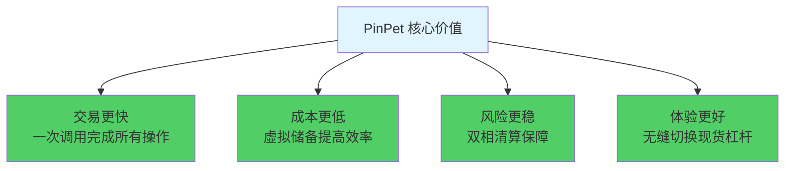

### 我们证明了什么？

PinPet.fun 用融合式 AMM/ALP 引擎，重新定义了"去中心化现货 × 原生杠杆"的可能性：

- ✅ **流动性不必分裂**：单一池可以服务多重需求
- ✅ **杠杆无需借贷池**：虚拟储备账本即可实现
- ✅ **清算可以零延迟**：被动触发机制消除预言机依赖
- ✅ **极端行情有保障**：区间锚定确保清算不失败

### 技术改变 DeFi

**PinPet = AMM + 自动借贷池的完美融合**

这是全球首创，这是独一无二的技术突破。

---

## 🚀 立即体验

**把你的策略装上这台更聪明、更硬核的发动机！**

- 🌐 **官网**：[PinPet.fun](https://pinpet.fun)
- 📖 **技术文档**：[docs.pinpet.fun](https://docs.pinpet.fun)
- 💬 **社区**：加入我们的 Discord 和 Telegram
- 📊 **GitHub**：https://github.com/pinpetfun/

---

## 🔮 未来技术路线图

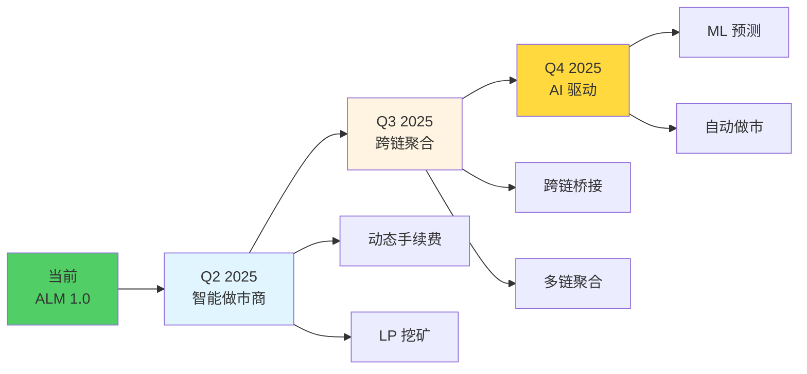

**持续创新：**
- 🔬 **Phase 1 - 智能做市商**：动态手续费 + 流动性激励
- 🔬 **Phase 2 - 跨链聚合**：多链流动性统一管理
- 🔬 **Phase 3 - AI 驱动**：机器学习优化风控策略

---

## ⚠️ 风险提示

**杠杆交易存在较高风险，可能损失全部保证金。**

请在充分理解机制与风险后参与，理性使用杠杆。本文档仅用于技术介绍，不构成投资建议。

---

*🔬 技术驱动创新，代码铸就信任*

*🌟 PinPet.fun - Redefining DeFi Infrastructure*

**在 "AMM 交易 + 自动借贷池" 方向，这是全球首创，独一无二。**
