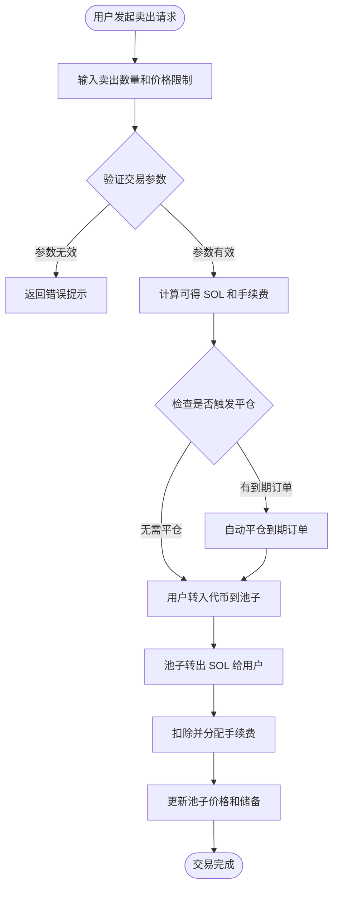

# 💱 PinPet 现货交易功能简介

## 📊 功能概述

现货交易是 PinPet 平台的核心功能之一，允许用户在去中心化的流动性池中直接买卖代币。与传统的订单簿模式不同，PinPet 采用自动做市商（AMM）机制，基于恒定乘积算法（x × y = k）自动确定交易价格。

**✨ 核心特点：**
- **⚡ 即时成交**：无需等待买卖双方匹配，交易立即完成
- **🔍 透明定价**：价格由算法自动计算，公开透明
- **🌊 持续流动性**：只要池中有足够资产，随时可以交易
- **🛡️ 滑点保护**：用户可设置最大/最小价格限制，防止价格异常波动

---

## 🛒 买入交易流程 (Buy)

### 👤 用户操作步骤

买入交易允许用户使用 SOL（Solana 原生代币）购买项目代币。

### 🔑 关键参数说明

| 参数名称 | 用途说明 | 示例值 | 备注 |
|---------|---------|--------|------|
| buy_token_amount | 想要购买的代币数量 | 1000000（1个代币） | 最小值：1000000（1个代币） |
| max_sol_amount | 愿意支付的最大 SOL 数量 | 50000000（0.05 SOL） | 用于防止价格滑点过大 |
| lp_pairs | 流动性池状态快照 | [{sol: 30, token: 1000000}] | 由前端自动提供 |

### ⚙️ 交易执行逻辑

1. **参数验证**
   - 检查买入数量是否达到最小交易量（1个代币）
   - 验证流动性池状态是否与链上一致

2. **价格计算**
   - 基于当前池子储备量，使用恒定乘积公式计算所需 SOL
   - 计算包含手续费的实际支付金额
   - 检查实际成交价是否超过用户设定的最大值

3. **自动平仓机制**
   - 如果交易会导致价格跨越某些杠杆订单的平仓价，系统自动平仓这些订单
   - 平仓产生的手续费分配给平台和合作伙伴

4. **资金转移**
   - 用户账户 → 流动性池：转入 SOL（含手续费）
   - 流动性池 → 用户账户：转出代币

5. **手续费分配**
   - 按预设比例分配给合作伙伴和技术提供方
   - 默认手续费率可由管理员配置

6. **状态更新**
   - 更新流动性池的当前价格
   - 重新计算池子的 SOL 和代币储备量
   - 检查是否触发手续费折扣

---

## 💸 卖出交易流程 (Sell)

### 👤 用户操作步骤

卖出交易允许用户出售持有的代币，换回 SOL。

### 🔑 关键参数说明

| 参数名称 | 用途说明 | 示例值 | 备注 |
|---------|---------|--------|------|
| sell_token_amount | 想要出售的代币数量 | 1000000（1个代币） | 最小值：1000000（1个代币） |
| min_sol_output | 期望获得的最小 SOL 数量 | 20000000（0.02 SOL） | 用于防止价格滑点过大 |
| lp_pairs | 流动性池状态快照 | [{sol: 30, token: 1000000}] | 由前端自动提供 |

### ⚙️ 交易执行逻辑

1. **参数验证**
   - 检查卖出数量是否达到最小交易量（1个代币）
   - 验证用户代币账户余额是否充足
   - 确认流动性池状态有效

2. **价格计算**
   - 基于当前池子储备量，使用恒定乘积公式计算可得 SOL
   - 计算扣除手续费后的实际到账金额
   - 检查实际成交价是否低于用户设定的最小值

3. **自动平仓机制**
   - 如果交易会导致价格跨越某些杠杆订单的平仓价，系统自动平仓这些订单
   - 平仓产生的手续费和清算奖励分配

4. **资金转移**
   - 用户账户 → 流动性池：转入代币
   - 流动性池 → 用户账户：转出 SOL（已扣除手续费）

5. **手续费处理**
   - 从应得 SOL 中扣除手续费
   - 按比例分配给合作伙伴和技术提供方

6. **状态更新**
   - 更新流动性池的当前价格（价格下降）
   - 重新计算池子的 SOL 和代币储备量
   - 检查是否触发手续费折扣

---

## 💡 使用场景举例

### 📈 场景一：普通买入交易

**背景：**
- 当前价格：1个代币 = 0.03 SOL
- 用户想买入 10 个代币
- 手续费率：1%

**操作流程：**
1. 用户设置买入数量：10,000,000（10个代币）
2. 用户设置最大支付：0.35 SOL（350,000,000）
3. 系统计算实际需要：0.303 SOL（含手续费）
4. 价格检查通过（未超过最大限制）
5. 交易执行：
   - 用户支付 0.303 SOL
   - 收到 10 个代币
   - 手续费 0.003 SOL 分配给平台
6. 成交后价格上涨至：0.0303 SOL/代币

---

### 📉 场景二：卖出触发自动平仓

**背景：**
- 当前价格：1个代币 = 0.05 SOL
- 存在一个做多订单，平仓价为 0.048 SOL
- 用户想卖出 50 个代币

**操作流程：**
1. 用户设置卖出数量：50,000,000（50个代币）
2. 用户设置最小收入：2.3 SOL
3. 系统检测到卖出会使价格跌破 0.048 SOL
4. 系统自动平仓做多订单：
   - 计算订单盈亏
   - 收取平仓手续费
   - 关闭订单账户，退还租金
5. 继续执行卖出交易：
   - 用户转入 50 个代币
   - 收到 2.4 SOL（扣除手续费后）
6. 成交后价格下跌至：0.047 SOL/代币

---

### 🛡️ 场景三：滑点保护触发

**背景：**
- 当前价格：1个代币 = 0.02 SOL
- 用户想买入 1000 个代币
- 流动性池较小，大额交易会造成显著滑点

**操作流程：**
1. 用户设置买入数量：1,000,000,000（1000个代币）
2. 用户设置最大支付：21 SOL
3. 系统计算实际需要：22.5 SOL（含手续费）
4. 价格检查失败（超过用户最大限制）
5. 交易被拒绝，返回错误提示
6. 用户可以选择：
   - 提高最大支付限制
   - 减少买入数量
   - 分批次买入

---

## ⚠️ 注意事项和限制

### 🚫 交易限制

| 限制项目 | 具体要求 | 原因说明 |
|---------|---------|---------|
| 最小交易量 | 1,000,000（1个代币） | 防止过小交易影响系统效率 |
| 手续费率上限 | 10% | 保护用户免受过高手续费 |
| 流动性检查 | 必须提供当前池状态快照 | 确保链上链下状态一致 |
| 价格滑点保护 | 必填 max_sol_amount / min_sol_output | 防止价格异常波动造成损失 |

### ⚠️ 风险提示

1. **📊 价格波动风险**
   - 大额交易会造成显著的价格滑点
   - 建议大额交易分批进行，降低冲击成本
   - 设置合理的滑点容忍度

2. **💰 手续费成本**
   - 每笔交易都会产生手续费
   - 频繁小额交易会累积较高的手续费成本
   - 建议合并交易以降低成本

3. **💧 流动性风险**
   - 流动性不足时，大额交易可能无法完成
   - 池子储备量会影响成交价格
   - 关注池子的 SOL 和代币储备情况

4. **🔄 自动平仓影响**
   - 交易可能触发杠杆订单的自动平仓
   - 平仓会消耗部分流动性
   - 可能影响最终成交价格

### 🔧 技术要求

**👛 用户端要求：**
- 拥有 Solana 钱包（如 Phantom、Solflare）
- 账户中有足够的 SOL 用于交易和支付交易费用
- 交易代币前需创建对应的代币账户（通常由前端自动处理）

**💵 交易费用构成：**
- Solana 网络费用：约 0.000005 SOL（交易签名费）
- 交易手续费：按交易金额的百分比收取（由管理员配置）
- 账户租金：如需创建新账户，一次性支付（可回收）

### ❓ 常见问题

**Q: 交易失败会损失手续费吗？**
A: ✅ 不会。如果交易因参数检查失败而被拒绝，不会扣除任何手续费，只会消耗少量 Solana 网络费用（约 0.000005 SOL）。

**Q: 如何获得最优成交价格？**
A: 💡 在流动性充足的时段交易，避免单笔过大的交易量，关注池子的 SOL/Token 比例，选择合适的时机进行交易。

**Q: 自动平仓会影响我的交易吗？**
A: ⚠️ 可能会。如果你的交易触发了他人杠杆订单的平仓，会消耗部分流动性，可能导致实际成交价与预期略有偏差，但仍在你设置的滑点范围内。

**Q: 交易被拒绝的常见原因？**
A: ❌ 常见原因包括：
- 买入数量或卖出数量低于最小交易量（1个代币）
- 实际成交价超出你设置的滑点保护范围
- 账户余额不足（SOL 或代币）
- 流动性池状态快照过期（前端需重新获取）

**Q: 手续费如何计算和分配？**
A: 💰 手续费按交易金额的一定比例收取（默认 1%，可由管理员调整），收取后按预设比例分配给合作伙伴和技术提供方。某些情况下可能享受手续费折扣。

---

## 🔗 相关功能

- **📊 杠杆交易**：使用借贷机制进行做多/做空交易
- **💧 流动性管理**：查看和管理流动性池状态
- **🪙 代币创建**：创建新的交易代币对
- **📋 订单管理**：查看和管理杠杆交易订单

---

*📝 注：本文档为产品功能说明，不包含技术实现细节。如需了解开发相关信息，请参考项目的技术文档。*
