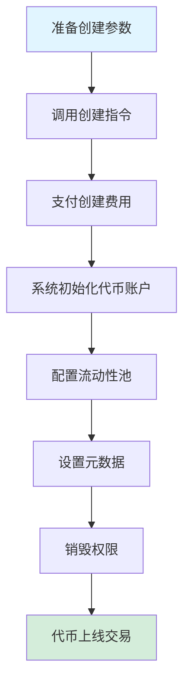
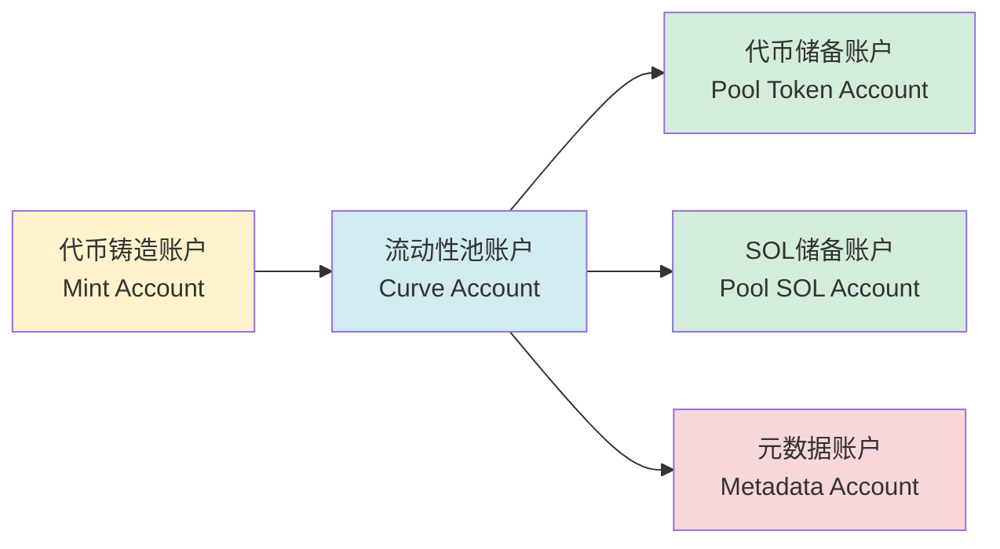
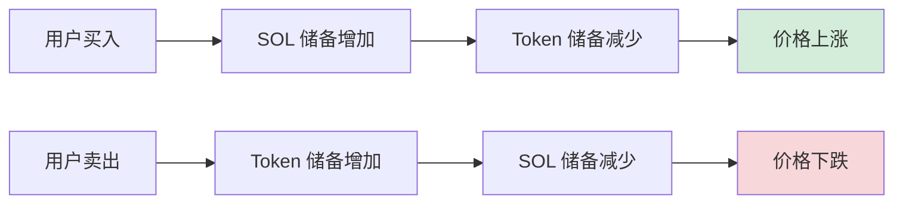

# 🪙 PinPet 代币创建功能简介

## 一、📋 功能概述

### 💎 什么是代币创建

代币创建是 PinPet 平台的核心功能之一，允许用户一键发行全新的 SPL 代币（Solana 区块链标准代币）并自动配置交易市场。通过该功能，用户无需深入理解复杂的区块链技术，即可快速创建具备完整元数据、自动流动性支持和即时交易能力的代币。

### ❓ 为什么需要创建代币

**⚠️ 传统代币发行的痛点：**
- 需要专业的技术知识（Solana 编程、SPL Token 标准）
- 手动配置铸造权限、流动性池、元数据等多个环节
- 缺乏即时的流动性和交易市场
- 安全性设置复杂（权限销毁、防增发等）

**✅ PinPet 代币创建的优势：**
- **⚡ 一键发行**：仅需提供代币名称、符号、图标三个基本信息
- **🚀 即时上线**：创建完成即可交易，无需等待流动性积累
- **🔒 自动安全配置**：自动销毁铸造权限和冻结权限，防止恶意增发
- **🏦 内置交易市场**：基于恒定乘积 AMM 算法，支持现货和杠杆交易
- **✔️ 合规元数据**：符合 Metaplex 标准，钱包和交易所自动识别

### ⭐ 核心特性

| 特性 | 说明 |
|------|------|
| 代币标准 | SPL Token（Solana 官方标准） |
| 精度 | 6 位小数（1 Token = 1,000,000 最小单位） |
| 总供应量 | 1,609,500,000,000,000 单位（固定供应，不可增发） |
| 元数据标准 | Metaplex Token Metadata |
| 初始价格 | 约 0.0000000000279589934762 SOL/Token |
| 流动性模型 | 恒定乘积 AMM（x × y = k） |

---

## 二、🔄 代币创建流程

### 👤 用户操作步骤



### 📊 详细流程说明

#### 📝 阶段一：准备参数
用户需要提供三个基本参数：

| 参数 | 类型 | 说明 | 示例 |
|------|------|------|------|
| name | 字符串 | 代币全称 | "PinPet Token" |
| symbol | 字符串 | 代币符号（3-10字符） | "PINPET" |
| uri | 字符串 | 元数据 JSON 文件的链接 | "https://example.com/metadata.json" |

#### 🔧 阶段二：账户初始化
系统自动创建和配置以下账户：



#### 💧 阶段三：流动性池初始化
系统自动配置两个资金池：

**1. 现货流动性池（LP Pool）**
- 代币储备：1,073,000,000,000,000 单位
- SOL 储备：30 SOL（虚拟余额）
- 实际 SOL：10,000 lamports（防止余额不足）
- 用途：支持现货交易（买入/卖出）

**2. 杠杆借贷池（Borrow Pool）**
- 代币储备：536,500,000,000,000 单位
- SOL 储备：10,000,000 SOL（虚拟余额）
- 用途：支持保证金交易（做多/做空）

**📊 资金分配图：**
```
💰 总供应量：1,609,500,000,000,000 单位
├── 现货流动性池：1,073,000,000,000,000 (66.67%)
└── 杠杆借贷池：  536,500,000,000,000 (33.33%)
```

#### 📄 阶段四：元数据创建
系统调用 Metaplex Token Metadata 程序创建代币元数据：

| 元数据字段 | 内容 | 说明 |
|-----------|------|------|
| name | 用户提供的名称 | 显示在钱包中的代币名称 |
| symbol | 用户提供的符号 | 代币简称 |
| uri | 用户提供的链接 | 指向包含图标、描述等信息的 JSON |
| creators | 创建者地址 | 标记代币创建者，未验证状态 |
| seller_fee_basis_points | 0 | 版税费率（设为0） |
| is_mutable | true | 允许更新元数据 |

**📋 元数据 JSON 标准格式示例：**
```json
{
  "name": "PinPet Token",
  "symbol": "PINPET",
  "description": "基于 PinPet 平台发行的代币",
  "image": "https://example.com/logo.png",
  "attributes": [],
  "properties": {
    "files": [
      {
        "uri": "https://example.com/logo.png",
        "type": "image/png"
      }
    ]
  }
}
```

#### 🔒 阶段五：权限销毁
为确保代币安全性和不可篡改性，系统自动执行：

| 操作 | 目的 | 效果 |
|------|------|------|
| 销毁铸造权限 | 防止增发 | 总供应量永久锁定 |
| 销毁冻结权限 | 防止冻结用户账户 | 代币永久可流通 |

#### 💵 阶段六：手续费配置
系统从合作伙伴参数账户读取手续费设置：

| 费率类型 | 默认值 | 说明 |
|---------|--------|------|
| 现货交易手续费 | 1% | 买卖交易时扣除 |
| 保证金交易手续费 | 0.25% | 杠杆交易时扣除 |
| 手续费折扣标志 | 0（原价） | 可根据交易量自动调整 |
| 手续费分配比例 | 20%/80% | 技术方/合作伙伴分成比例 |

---

## 三、💧 流动性池机制

### 🔢 恒定乘积公式

PinPet 采用自动做市商（AMM）模型，核心公式为：

```
x × y = k
```

其中：
- **x**：SOL 储备量
- **y**：Token 储备量
- **k**：常量乘积（初始值 = 30 × 1,073,000,000 = 32,190,000,000）

### 💰 初始价格计算

```
初始价格 = SOL 储备 ÷ Token 储备
         = 30 ÷ 1,073,000,000
         ≈ 0.0000000279589934762 SOL/Token
```

### 📈 价格变动机制



### 🛡️ 价格滑点保护

为保护流动性池，系统采用多重安全机制：

| 保护措施 | 说明 |
|---------|------|
| 精度因子 | 价格使用 10^26 精度因子，避免舍入误差 |
| 溢出检查 | 所有计算使用 `checked_*` 方法防止溢出 |
| 价格上限 | 最高价格限制为 50,000,000,000,000,000,000,000,000,000 |
| 价格下限 | 最低价格限制为 0.000000001（防止除零） |

---

## 四、📝 代币元数据说明

### ✅ Metaplex 标准

PinPet 使用 Metaplex Token Metadata v5.1.1 标准，确保代币在 Solana 生态系统中的兼容性：

**✨ 标准优势：**
- 💳 主流钱包（Phantom、Solflare）自动识别
- 🔄 DEX 平台（Jupiter、Raydium）自动抓取信息
- 🎨 NFT 市场和聚合器自动索引
- 🔍 区块链浏览器（Solscan、Solana Explorer）完整展示

### 🗂️ 元数据账户结构

```
元数据账户地址 (PDA)
├── 派生种子：["metadata", Metaplex Program ID, Mint Address]
├── 存储内容：
│   ├── 代币名称
│   ├── 代币符号
│   ├── URI（元数据 JSON 链接）
│   ├── 创建者信息
│   ├── 版税设置
│   └── 集合信息（可选）
└── 权限：
    ├── 更新权限：流动性池账户（PDA）
    └── 可变性：true（允许更新）
```

### 🌐 URI 托管建议

| 托管方式 | 优点 | 缺点 | 适用场景 |
|---------|------|------|---------|
| IPFS | 去中心化、永久存储 | 访问速度较慢 | 长期项目 |
| Arweave | 永久存储、速度快 | 需要付费 | 高价值代币 |
| 云存储（AWS S3/CDN） | 速度快、便宜 | 中心化、可能失效 | 测试或短期项目 |

---

## 五、🎯 使用场景举例

### 🚀 场景 1：创业团队发行项目代币

**需求：**
某 Web3 创业团队希望为自己的 DeFi 项目发行治理代币

**操作流程：**
1. 设计代币图标和描述文档
2. 将元数据 JSON 上传到 IPFS
3. 准备参数：
   - name: "SuperDeFi Governance Token"
   - symbol: "SDEFI"
   - uri: "https://ipfs.io/ipfs/QmXXX..."
4. 调用 PinPet 创建指令，支付少量创建费用
5. 代币即时上线，团队成员和社区可立即交易

**✅ 优势：**
- ⚡ 无需编写智能合约
- 💧 自带流动性市场
- 🔒 安全性由协议保障

---

### 🎉 场景 2：社区 Meme 代币发行

**需求：**
社区希望发行一个主题 Meme 代币用于娱乐和交易

**操作流程：**
1. 社区投票确定代币名称和图标
2. 使用免费图床托管图片
3. 准备参数：
   - name: "Doge to the Moon"
   - symbol: "DMOON"
   - uri: "https://cloudinary.com/dmoon.json"
4. 任一社区成员发起创建
5. 社区成员立即开始交易

**✅ 优势：**
- 💰 低成本快速发行
- 👥 无需技术背景
- 🔒 自动防增发机制

---

### 🎨 场景 3：NFT 项目发行实用代币

**需求：**
NFT 项目方希望发行配套的实用代币用于生态激励

**操作流程：**
1. 设计符合 NFT 风格的代币形象
2. 准备详细的代币白皮书
3. 使用 Arweave 永久存储元数据
4. 准备参数：
   - name: "CryptoArt Utility Token"
   - symbol: "CART"
   - uri: "ar://abc123..."
5. 创建代币并设置手续费接收账户
6. NFT 持有者可质押获取代币奖励

**✅ 优势：**
- 💾 元数据永久存储
- 🔗 与 NFT 生态无缝集成
- 📊 支持复杂的经济模型

---

## 六、⚠️ 注意事项和限制

### 📝 创建前的准备工作

| 检查项 | 说明 |
|--------|------|
| 钱包余额 | 确保有足够 SOL 支付创建费用（约 0.01-0.05 SOL） |
| 元数据准备 | JSON 文件已上传且可访问 |
| 代币信息 | 名称和符号符合规范，无歧义 |
| 合作伙伴账户 | 已创建合作伙伴参数账户（首次需创建） |

### 🚫 代币创建限制

**⚙️ 技术限制：**
- 代币精度固定为 6 位小数，创建后不可修改
- 总供应量固定，铸造权限销毁后无法增发
- 初始流动性配置固定，无法自定义

**🔒 安全限制：**
- 手续费率上限为 10%，超过将创建失败
- 元数据更新权限归流动性池账户所有
- 冻结权限已销毁，无法冻结用户账户

**💰 经济限制：**
- 初始价格由算法计算，无法自定义
- 流动性分配比例固定（现货 66.67%，杠杆 33.33%）
- SOL 储备为虚拟余额，不可直接提取

### ❓ 常见问题

**💵 Q1：创建代币需要多少费用？**
A：主要费用包括账户租金（约 0.01-0.03 SOL）和交易费用（约 0.00001 SOL），总计约 0.01-0.05 SOL。

**✏️ Q2：代币创建后可以修改名称或符号吗？**
A：可以通过更新元数据 URI 指向的 JSON 文件内容来修改，但链上记录的 name 和 symbol 不可变。

**🔒 Q3：如何确保代币安全？**
A：系统自动销毁铸造和冻结权限，确保供应量固定且不可篡改。建议使用去中心化存储（IPFS/Arweave）托管元数据。

**❗ Q4：创建失败如何处理？**
A：检查钱包余额、参数格式、合作伙伴账户状态。常见错误包括手续费率超限、URI 无效等。

**🗑️ Q5：代币可以销毁吗？**
A：代币账户本身无法销毁，但可以通过转移到黑洞地址（0x000...）的方式永久锁定代币。

### 💡 最佳实践建议

1. **元数据托管**：优先使用 IPFS 或 Arweave 等去中心化存储，避免链接失效
2. **代币命名**：简洁明了，避免与知名项目混淆，防止侵权
3. **图标设计**：使用高质量图片（建议 512x512 像素），符合代币定位
4. **白皮书准备**：在 URI 指向的 JSON 中包含详细的项目说明和路线图
5. **社区建设**：创建后及时建立社交媒体账号，提升代币知名度
6. **合规性**：确保代币用途合法，避免违反当地法律法规

---

## 七、🔧 技术支持

### 📍 相关账户地址

| 账户类型 | 派生规则 | 说明 |
|---------|---------|------|
| 流动性池账户 | `["borrowing_curve", mint_address]` | 管理流动性和交易参数 |
| 代币储备账户 | `["pool_token", mint_address]` | 存储流动性池中的代币 |
| SOL 储备账户 | `["pool_sol", mint_address]` | 存储流动性池中的 SOL |
| 元数据账户 | Metaplex 标准 PDA | 存储代币元数据 |

### 🖥️ 程序接口

**✨ 创建指令：**
```
函数名：create
参数：
  - name: String（代币名称）
  - symbol: String（代币符号）
  - uri: String（元数据 URI）
```

**📡 事件监听：**
创建成功后会发出 `TokenCreatedEvent` 事件，包含以下信息：
- 铸造账户地址
- 流动性池账户地址
- 手续费设置
- 代币名称、符号、URI

---

## 🎯 总结

PinPet 代币创建功能为用户提供了一个 🔒 安全、⚡ 便捷、💰 低成本的代币发行解决方案。通过自动化的流动性配置和标准化的元数据管理，用户可以在几分钟内完成代币创建并立即上线交易，无需担心技术细节和安全问题。

无论是 🚀 创业团队发行项目代币、🎉 社区创建 Meme 代币，还是 🎨 NFT 项目配套实用代币，PinPet 都能提供完整的支持，让代币发行变得简单高效。
