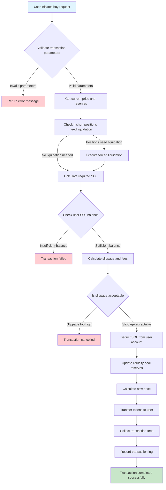
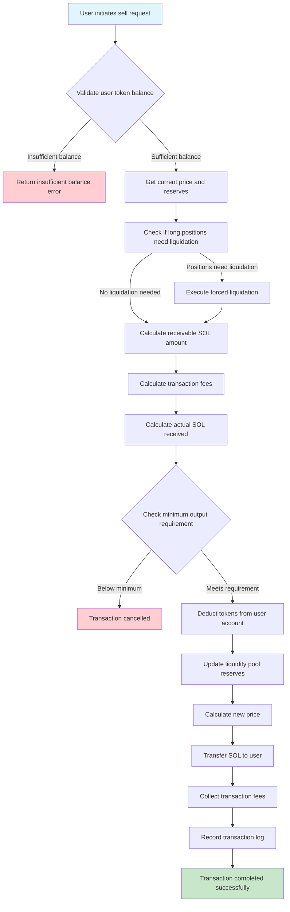
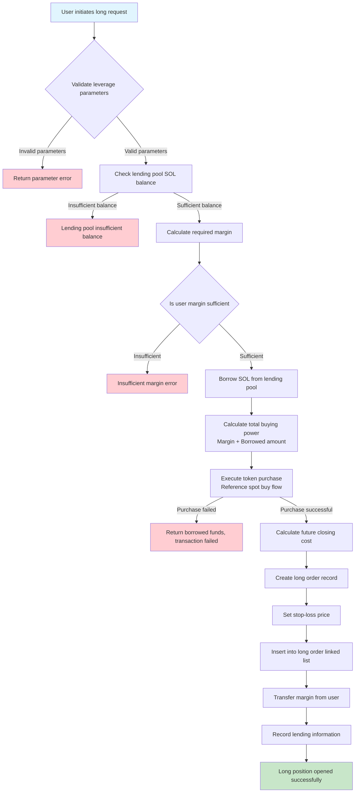
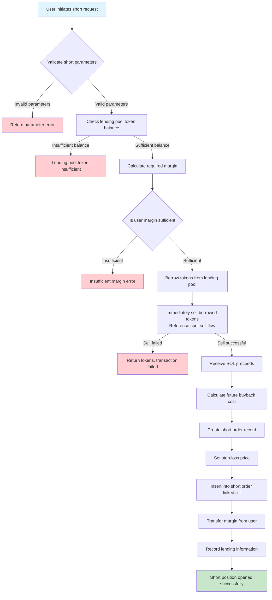
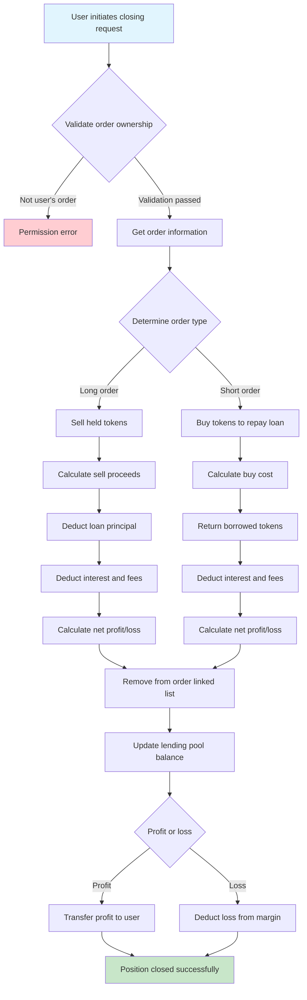
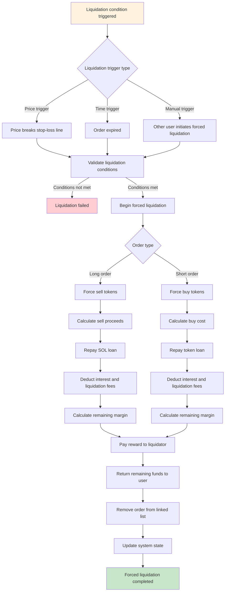
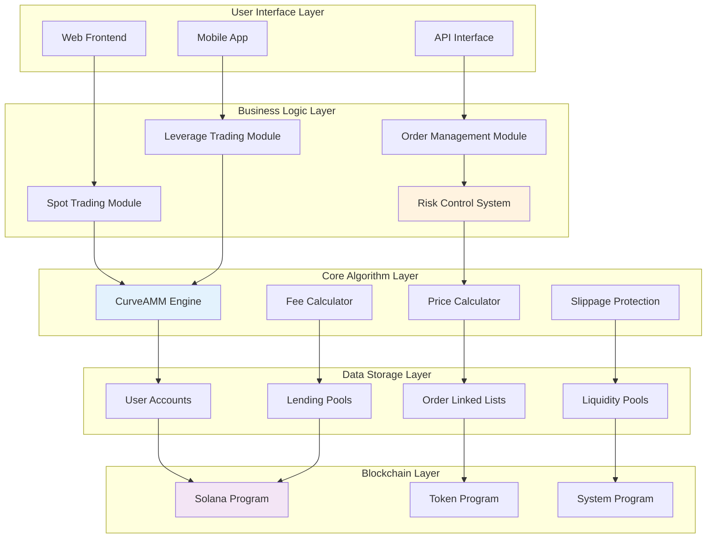

# SpinPet Trading Flow Diagrams

This document provides detailed flowcharts explaining the execution processes of various trading methods on the SpinPet platform, helping users and developers understand the system's operational mechanisms.

## Table of Contents
1. [Spot Buy Trading Flow](#spot-buy-trading-flow)
2. [Spot Sell Trading Flow](#spot-sell-trading-flow)
3. [Leveraged Long Trading Flow](#leveraged-long-trading-flow)
4. [Leveraged Short Trading Flow](#leveraged-short-trading-flow)
5. [Active Position Closing Flow](#active-position-closing-flow)
6. [Forced Liquidation Flow](#forced-liquidation-flow)
7. [System Architecture Diagram](#system-architecture-diagram)

---

## Spot Buy Trading Flow

Spot buying is the most basic trading method, where users directly purchase tokens with SOL.

### Key Steps Explanation:
1. **Parameter Validation**: Check buy amount, maximum SOL limit and other parameters
2. **Liquidation Check**: If price increase would trigger short position stop-loss, liquidation must occur first
3. **Slippage Protection**: Ensure actual price doesn't exceed user's acceptable range
4. **Atomic Execution**: All operations either succeed completely or rollback entirely

---

## Spot Sell Trading Flow

Spot selling is the process of users exchanging their held tokens back to SOL.

### Key Steps Explanation:
1. **Balance Validation**: Ensure user has sufficient tokens for trading
2. **Liquidation Check**: Price decline may trigger long position stop-loss
3. **Minimum Output Protection**: Prevent user losses due to excessive slippage

---

## Leveraged Long Trading Flow

Leveraged long allows users to borrow funds to amplify buying power, expecting profit from price increases.

### Key Steps Explanation:
1. **Leverage Calculation**: Calculate borrowing amount based on user's selected multiplier
2. **Risk Assessment**: Ensure user has sufficient margin to bear potential losses
3. **Order Management**: Create linked list structure to manage all long orders
4. **Stop-loss Setting**: Automatically set reasonable stop-loss price to protect funds

---

## Leveraged Short Trading Flow

Leveraged short allows users to borrow tokens and sell them immediately, expecting profit when prices decline.

### Key Steps Explanation:
1. **Token Lending**: Borrow specified amount of tokens from token lending pool
2. **Immediate Sale**: Sell borrowed tokens immediately in the market to receive SOL
3. **Risk Control**: Set stop-loss price to prevent excessive losses from price increases
4. **Order Tracking**: Record lending information for subsequent closing operations

---

## Active Position Closing Flow

Users can actively close positions at any time to end leveraged trades and settle profits/losses.

### Key Steps Explanation:
1. **Permission Validation**: Ensure only order owner can close position
2. **Reverse Operation**: Long closing requires selling, short closing requires buying
3. **Debt Settlement**: Prioritize repaying loan principal and interest
4. **Profit/Loss Settlement**: Calculate final profit or loss

---

## Forced Liquidation Flow

When stop-loss conditions are triggered or orders expire, the system automatically executes forced liquidation.

### Key Steps Explanation:
1. **Trigger Conditions**: Price stop-loss, order expiration, or manual trigger
2. **Priority Debt Repayment**: Ensure lender fund safety
3. **Incentive Mechanism**: Provide certain rewards to liquidation executors
4. **Fund Protection**: Try to protect user's remaining margin

---

## System Architecture Diagram

The overall SpinPet system architecture and component relationships.

### System Features:
1. **Layered Architecture**: Clear layered design for easy maintenance and expansion
2. **Modularization**: Relatively independent functional modules with reduced coupling
3. **Security**: Multi-layer risk control protection ensuring fund safety
4. **High Performance**: Based on Solana's high-speed blockchain infrastructure

---

## Trading Flow Summary

### Spot Trading Characteristics:
- **Immediacy**: Transactions execute immediately without waiting for matching
- **Transparency**: Prices determined entirely by algorithms, open and transparent
- **Liquidity**: 24/7 liquidity provision with no trading time restrictions

### Leveraged Trading Characteristics:
- **Amplification Effect**: Both returns and risks are amplified
- **Lending Mechanism**: Need to pay lending interest
- **Risk Control Protection**: Multiple security mechanisms to prevent risks

### Position Closing Mechanism Characteristics:
- **Flexibility**: Users can actively close positions at any time
- **Automation**: Automatic execution when trigger conditions are met
- **Protection**: Priority protection of lender and user funds

Through these flowcharts, users can clearly understand the execution steps and risk control mechanisms of each trading method, enabling them to make more informed trading decisions. 