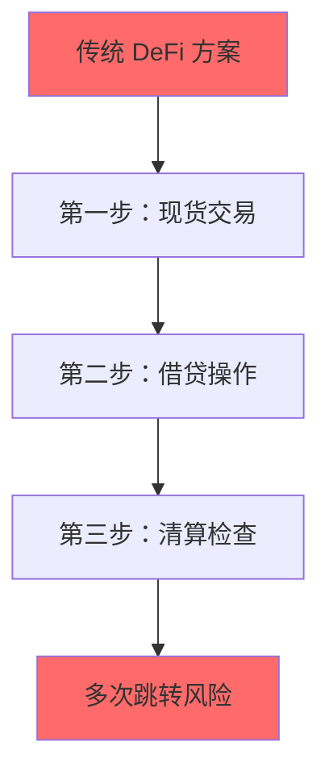
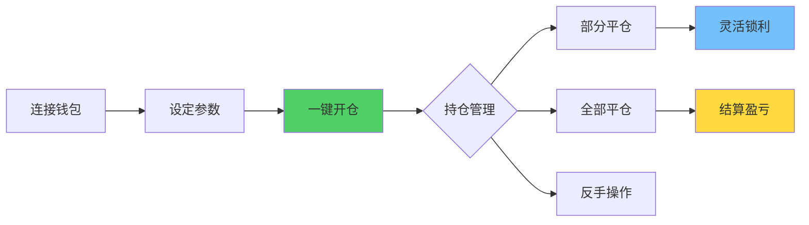
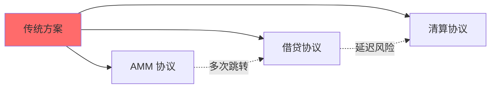
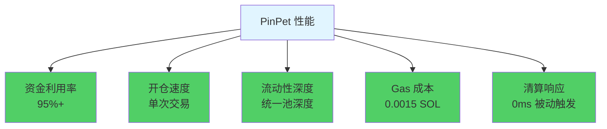
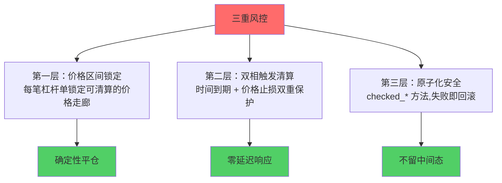
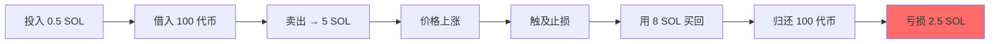
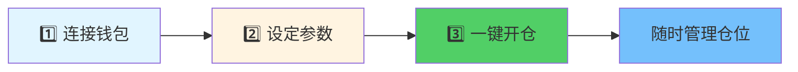
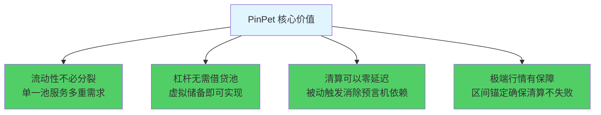
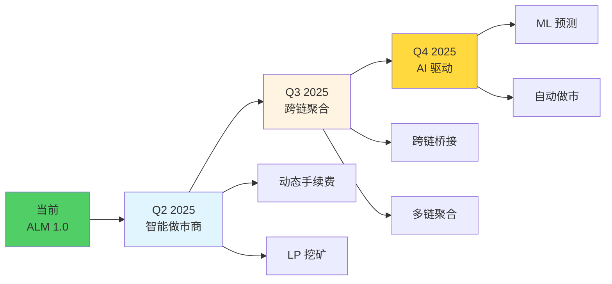

# PinPet.fun 产品介绍 PPT 方案

## 📊 PPT 结构框架 (共 15-18 页)

---

## 第一部分：开场与问题 (3页)

### 第 1 页：封面

**标题**: PinPet.fun ⚡ 真现货 × 原生杠杆

**副标题**: 链上交易新范式 - 把"价格、杠杆、清算"装进同一台引擎

**视觉**:
- 科技感背景 + Solana 生态标识
- 底部: 官网链接 + 社交媒体图标

---

### 第 2 页：行业痛点

**标题**: 传统 DeFi 交易的三大困境

**内容**:

```
❌ 流动性分裂      现货池 vs 借贷池互相竞争,深度不足
❌ 操作复杂        现货 + 借贷 + 清算 = 3次交易,延迟高
❌ 资金效率低      传统利用率 20-50%,大量资金闲置
```

**视觉**: 对比图表展示传统方案的多步骤流程



---

### 第 3 页：解决方案

**标题**: PinPet 的创新答案

**一句话价值**:

> **用 1 份保证金,抓住 10 份机会**
>
> **一次原子交易,完成买卖+借贷+风控**

**视觉**: 简洁流程图 (传统3步 vs PinPet 1步)


---

## 第二部分：核心价值 (4页)

### 第 4 页：四大核心优势

**标题**: 为什么选择 PinPet?

**内容** (四象限布局):

| ⚡ **更快** | 💰 **更省** |
|-----------|-----------|
| 单次原子交易 | 资金利用率 95%+ |
| 毫秒级成交 | Gas 费仅 $0.00025 |

| 🛡️ **更稳** | 🔓 **更自由** |
|-----------|-------------|
| 三层风控护航 | 做多/做空双向盈利 |
| 区间锚机制 | 部分平仓灵活调整 |

**视觉**: 四个象限,每个配图标和关键数据

---

### 第 5 页：用户价值对比

**标题**: 立竿见影的价值提升

**对比表格**:

| 维度 | 传统 DEX | **PinPet.fun** |
|-----|---------|---------------|
| **资金门槛** | 0.1 SOL → 0.1 SOL | 🎁 0.1 SOL → **1 SOL 敞口** |
| **盈利方向** | 只能做多 | 📈📉 **涨跌都能盈利** |
| **操作次数** | 2-3 次交易 | 🎯 **1 次原子交易** |
| **资金利用率** | 20-50% | 🚀 **95%+** |
| **流动性深度** | 现货池 50% + 借贷池 50% 分裂 | 🌊 统一池 **100% 深度** |
| **清算响应** | 5-30秒延迟 | ⚡ **0ms 被动触发** |
| **极端行情** | 无法清算穿仓 | 🛡️ **区间锚定保障** |

**视觉**: 突出 PinPet 的数据优势

---

### 第 6 页：适用人群

**标题**: 谁需要 PinPet?

**三列布局**:

| 🎓 **新手交易者** | 💼 **专业交易员** | 🤖 **量化团队** |
|----------------|----------------|--------------|
| • 2-3× 逐仓起步 | • 5-10× 杠杆策略 | • 原子事件流 |
| • 低成本试错 | • 部分平仓锁利 | • 0.4秒确认 |
| • 智能风险预警 | • 多空双向全天候 | • API/SDK 友好 |
| • 小资金体验专业级策略 | • 资金高效周转 | • 易于集成 |

**视觉**: 三个角色头像 + 关键特征

---

### 第 7 页：核心功能矩阵

**标题**: 完整的交易能力

**功能模块**:

| 功能 | 说明 |
|-----|------|
| ✅ **现货交易** | 即时成交,滑点保护 |
| ✅ **杠杆做多** | 借 SOL 买代币,放大收益 |
| ✅ **杠杆做空** | 借代币卖出,下跌获利 |
| ✅ **部分平仓** | 分批锁利,灵活调仓 |
| ✅ **自动清算** | 时间到期 + 价格止损双保护 |
| ✅ **风险护栏** | 区间锚定,极端行情保障 |

**视觉**: 流程图展示从开仓到平仓的完整链路



---

## 第三部分：技术创新 (4页)

### 第 8 页：全球首创技术

**标题**: 在"AMM + 自动借贷池"方向,全球首创

**核心主张**:

> **把现货 AMM 与自动借贷池深度融合**
>
> **不是接口调用,而是底层协议的统一**

**视觉**: 架构对比图

**传统方案**:


**PinPet 方案**:


---

### 第 9 页：四大技术发明

**标题**: 重新定义 DeFi 基础设施

**内容**:

#### 1️⃣ 融合式做市引擎 (Fusion-AMM/ALP)
**定义**: AMM 成交与借贷开平在同一事务内完成的执行范式

**价值**:
- ✅ 消除多协议拼接的延迟
- ✅ 消除对手盘不确定性
- ✅ 一笔交易完成所有操作

#### 2️⃣ 镜像储备账本 (Mirror Reserve Ledger, MRL)
**定义**: 以虚拟储备方式映射借贷可用度,资金与现货池"同库不同账"

**价值**:
- ✅ 零额外注资,资金效率最大化
- ✅ 风险完全隔离,不影响现货交易
- ✅ 解决 DeFi 领域的资金利用率难题

#### 3️⃣ 区间锚机制 (PriceLock Anchor)
**定义**: 把订单风险锚定在一个可清算的价格走廊

**价值**:
- ✅ 保证"能平、好平、可追溯"
- ✅ 平仓价格提前确定,无滑点风险
- ✅ 极端行情也能按预设区间完成结算

#### 4️⃣ 双相清算系统 (Bi-Trigger Liquidation)
**定义**: 时间到期强平 + 价格触线止损的双触发防护机制

**价值**:
- ⚡ 时间触发：订单到期,任何人可强平,清算者获得激励
- ⚡ 价格触发：在他人交易中被动执行,无需守护者轮询
- ⚡ 首次实现被动式价格清算,无需外部预言机

---

### 第 10 页：技术优势数据

**标题**: 链上效率革命

**性能指标**:

| 指标 | PinPet | 传统方案 | 提升幅度 |
|-----|--------|---------|---------|
| 📊 **资金利用率** | 95%+ | 40-60% | 🚀 **+50%** |
| ⚡ **交易速度** | 单次交易 | 2-3次交易 | ⚡ **快 2x** |
| 💎 **流动性深度** | 统一池深度 | 分割池 | 💎 **深 3x** |
| 💰 **Gas 成本** | 0.0015 SOL | 0.003+ SOL | 💰 **省 50%** |
| ⏱️ **清算响应** | 0ms 被动触发 | 5-30s 延迟 | ⏱️ **即时清算** |

**视觉**: 雷达图或柱状图展示性能提升



---

### 第 11 页：安全保障机制

**标题**: 三重风控护城河

**内容**:



**详细说明**:

#### 🛡️ 第一层：价格区间锁定
- 每笔杠杆单锁定特定价格区间的流动性
- 确保平仓时有足够的流动性来归还借款
- 极端行情也能按锚区间完成平仓

#### 🛡️ 第二层：双相触发清算
- **时间触发**: 订单到期后任何人可强平
- **价格触发**: 止损价被触及时自动清算
- 双重保险,极端行情仍能清算

#### 🛡️ 第三层：原子化安全
- 100% 使用 checked_* 方法,防止溢出
- 失败即回滚,不留中间态
- PDA 账户及时关闭,租金自动回退

---

## 第四部分：使用场景 (3页)

### 第 12 页：使用场景举例

**标题**: 实战场景演示

#### 场景 1: 做多盈利 🟢

| 参数 | 开仓 | 平仓 | 结果 |
|-----|------|------|------|
| **价格** | 0.05 SOL | 0.08 SOL | 上涨 60% |
| **保证金** | 0.5 SOL | - | - |
| **借入** | 4.5 SOL | 归还 4.5 SOL | - |
| **买入** | 100 代币 | 卖出 100 代币 | - |
| **所得** | - | 8 SOL | - |
| **盈利** | - | - | **+2.5 SOL (50%)** |

**操作流程**:


---

#### 场景 2: 做空止损 🔴

| 参数 | 开仓 | 平仓 | 结果 |
|-----|------|------|------|
| **价格** | 0.05 SOL | 0.08 SOL | 上涨 60% |
| **保证金** | 0.5 SOL | - | - |
| **借入** | 100 代币 | 归还 100 代币 | - |
| **卖出** | 100 代币 → 5 SOL | - | - |
| **买回** | - | 用 8 SOL 买回 100 代币 | - |
| **亏损** | - | - | **-2.5 SOL** |
| **意义** | - | - | **及时止损,避免更大损失** |

**操作流程**:


---

#### 场景 3: 部分平仓 ✂️

| 参数 | 初始持仓 | 部分平仓 | 剩余持仓 |
|-----|---------|---------|---------|
| **持有代币** | 200 代币 | 卖出 100 代币 | 100 代币 |
| **借款** | 10 SOL | 归还 5 SOL | 5 SOL |
| **价格** | 0.05 SOL | 上涨 30% | - |
| **操作** | - | 锁定部分利润 | 继续持仓看涨 |

**价值**:
- ✅ 锁定部分利润,降低风险
- ✅ 保留剩余仓位,把握后续机会
- ✅ 灵活的仓位管理策略

---

### 第 13 页：操作流程

**标题**: 3 步开启杠杆交易



#### 步骤详解:

**1️⃣ 连接钱包**
- 支持 Phantom、Solflare 等主流 Solana 钱包
- 一键连接,安全可靠

**2️⃣ 设定参数**
- 选择交易对 (如 SOL/USDC)
- 设置杠杆倍数 (2-10×)
- 配置风险护栏:
  - 止盈价格
  - 止损价格
  - 滑点保护

**3️⃣ 一键开仓**
- 单次原子交易完成所有操作
- 随时部分平仓锁利
- 支持反手操作

**视觉**: 产品界面截图 + 步骤标注

---

### 第 14 页：新用户福利

**标题**: 加入 PinPet 社区

**福利清单**:

🎁 **交易奖励**
- 交易量换积分奖励
- 积分可兑换手续费折扣

🎁 **每日抽奖**
- 每日抽取 50 名幸运用户
- 赠送 100$ 等值 SOL 币

🎁 **邀请返利**
- 邀请好友注册返积分
- 好友交易获得额外奖励

---

**行动号召**:

**🌐 立即体验**: [https://pinpet.fun](https://pinpet.fun)

**📱 加入社区**:
- **Twitter**: [@PinPet_Solana](https://twitter.com/PinPet_Solana)
- **Telegram**: [@PinPetOfficial](https://t.me/PinPetOfficial)
- **Discord**: [PinPet Community](https://discord.gg/pinpet)

**视觉**: 礼物盒图标 + 社交媒体按钮 + 二维码

---

## 第五部分：总结与号召 (2页)

### 第 15 页：核心价值总结

**标题**: PinPet = DeFi 交易的范式革命

**价值主张**:



**我们证明了什么?**

✅ **流动性不必分裂** → 单一池可以服务多重需求

✅ **杠杆无需借贷池** → 虚拟储备账本即可实现

✅ **清算可以零延迟** → 被动触发机制消除预言机依赖

✅ **极端行情有保障** → 区间锚定确保清算不失败

---

**核心 Slogan**:

> ## **把你的策略装上这台更聪明、更硬核的发动机！**

> ## **PinPet = AMM + 自动借贷池的完美融合**

> ## **在 "AMM 交易 + 自动借贷池" 方向,这是全球首创,独一无二**

---

### 第 16 页：立即体验

**标题**: 现在就开始


---

**🚀 大号 CTA**:

### 🌐 [访问 PinPet.fun](https://pinpet.fun)

### 📖 [阅读技术文档](https://docs.pinpet.fun)

### 💬 加入社区
- Discord / Telegram 社区
- Twitter @PinPet_Solana

### 🐦 关注 Twitter
- 获取最新动态
- 参与社区活动

---

**⚠️ 风险提示** (小字):

> 杠杆交易存在风险,可能损失全部保证金。
>
> 请在充分理解机制与风险后参与,理性使用杠杆。
>
> 本文档仅用于技术介绍,不构成投资建议。

**视觉**: 大按钮 + 二维码 + 社交媒体图标

---

## 备选页面

### 备选页 A：技术路线图

**标题**: 持续创新



**发展路径**:

| 阶段 | 时间 | 核心功能 | 价值 |
|-----|------|---------|------|
| **Phase 1** | Q2 2025 | 智能做市商 | 动态手续费 + 流动性激励 |
| **Phase 2** | Q3 2025 | 跨链聚合 | 多链流动性统一管理 |
| **Phase 3** | Q4 2025 | AI 驱动 | 机器学习优化风控策略 |

---

### 备选页 B：与竞品对比

**标题**: 竞争优势分析

| 性能指标 | PinPet 融合式引擎 | AMM + 外接借贷 | 订单簿 + 杠杆 | 永续合约 DEX |
|---------|-----------------|--------------|-------------|-------------|
| **交易延迟** | ✅ 单次交易 | ❌ 2-3次交易 | ❌ 等待撮合 | ⚠️ 依赖预言机 |
| **资金利用率** | ✅ 95%+ | ❌ 40-60% | ⚠️ 60-70% | ⚠️ 50-65% |
| **清算响应** | ✅ 0ms 被动触发 | ❌ 5-30s 延迟 | ❌ 依赖做市商 | ⚠️ 预言机延迟 |
| **Gas 成本** | ✅ 单次 0.0015 SOL | ❌ 多次 0.003+ SOL | ❌ 高频成本高 | ⚠️ 复杂计算 |
| **流动性深度** | ✅ 统一池 100% | ❌ 分割池 50%+50% | ⚠️ 依赖挂单 | ⚠️ 合成资产 |
| **极端行情** | ✅ 区间锚定保障 | ❌ 可能失败 | ❌ 流动性枯竭 | ⚠️ 资金费率飙升 |

---

### 备选页 C：FAQ 常见问题

**标题**: 常见问题解答

**Q1: PinPet 与传统 DEX 的主要区别是什么?**

A: PinPet 将现货交易和杠杆交易融合在一个原子交易中,无需跨协议调用,大幅提升效率和资金利用率。

**Q2: 资金安全如何保障?**

A: 三重风控机制 + 区间锚定 + 原子化安全,确保极端行情下也能正常清算。

**Q3: 手续费是多少?**

A: Gas 费约 $0.00025,交易手续费根据交易量有不同档位,持有积分可享受折扣。

**Q4: 支持哪些钱包?**

A: 支持 Phantom、Solflare 等主流 Solana 钱包。

**Q5: 新手可以使用吗?**

A: 可以,我们提供 2-3× 逐仓起步,完整风险教育和智能预警系统。

---

## 🎨 设计建议

### 配色方案

**主色调**:
- **主色**: Solana 紫色渐变 (#9945FF → #14F195)
- **辅色**: 科技蓝 (#00D4FF)
- **强调色**:
  - 黄色 (#FFD93D) - 重要数据
  - 绿色 (#51CF66) - 正向结果
  - 红色 (#FF6B6B) - 风险提示

**色彩应用**:
```
背景: 深色科技感 (#0A0E27)
标题: 白色/渐变色
正文: 浅灰色 (#E5E5E5)
数据: 高亮色 (黄色/绿色)
```

---

### 视觉风格

**设计原则**:
- ✅ 现代科技感,扁平化设计
- ✅ 使用流程图、对比表格、数据图表
- ✅ 动画效果: 页面切换、数据展示
- ✅ 信息层次清晰,重点突出

**图表类型**:
- 流程图: Mermaid 风格,清晰展示操作流程
- 对比表格: 突出 PinPet 优势
- 数据图表: 雷达图、柱状图展示性能指标
- 图标: 统一风格的功能图标

---

### 字体建议

**中文字体**:
- **标题**: 思源黑体 Bold / 阿里巴巴普惠体 Bold
- **正文**: 思源黑体 Regular / 苹方
- **强调**: 思源黑体 Heavy

**英文/数字字体**:
- **标题**: Montserrat Bold
- **正文**: Roboto Regular
- **数据**: Roboto Mono / Fira Code

**字体大小**:
- H1 标题: 48-60pt
- H2 副标题: 32-40pt
- 正文: 20-24pt
- 小字: 14-16pt

---

### 动画效果建议

**页面切换**:
- 淡入淡出
- 左右滑动
- 缩放效果

**内容展示**:
- 数据计数动画
- 图表渐显
- 列表逐条展示

**交互反馈**:
- 按钮悬停效果
- 点击波纹效果
- 加载动画

---

## 🎯 演讲建议

### 时间分配 (总计 12-17 分钟)

| 部分 | 时间 | 重点内容 |
|-----|------|---------|
| **引入问题** | 2-3分钟 | 传统 DeFi 的痛点,引起共鸣 |
| **展示方案** | 3-4分钟 | PinPet 的创新价值,四大优势 |
| **技术深度** | 4-5分钟 | 全球首创技术解析,建立专业度 |
| **场景演示** | 2-3分钟 | 实战案例展示,具象化价值 |
| **行动号召** | 1-2分钟 | 邀请体验,社区互动 |

---

### 演讲要点

**开场 (第 1-3 页)**:
- 🎯 直击痛点: "你是否遇到过这些问题..."
- 💡 提出方案: "PinPet 用一台引擎解决所有问题"
- 🔥 制造期待: "这是全球首创的技术"

**核心价值 (第 4-7 页)**:
- 📊 数据说话: 强调 95%+ 资金利用率
- 💰 价值对比: 0.1 SOL → 1 SOL 敞口
- 👥 场景化: "无论你是新手还是专业交易员..."

**技术深度 (第 8-11 页)**:
- 🚀 强调首创: "全球首个融合 AMM + ALP"
- 🔬 技术发明: 四大核心技术,通俗易懂
- 📈 性能数据: 用图表展示性能提升

**场景演示 (第 12-14 页)**:
- 🟢 成功案例: "看看这位用户如何盈利 50%"
- 🔴 风险管理: "及时止损避免更大损失"
- ✂️ 灵活策略: "部分平仓,进退自如"

**结尾号召 (第 15-16 页)**:
- ✅ 总结价值: "我们重新定义了 DeFi 交易"
- 🚀 行动号召: "现在就访问 pinpet.fun"
- ⚠️ 风险提示: 负责任的披露风险

---

### 演讲技巧

**语言风格**:
- ✅ 用类比: "就像把 3 个工具合并成 1 个瑞士军刀"
- ✅ 用数据: "资金利用率提升 50%,这意味着..."
- ✅ 用故事: "一个交易者的真实经历..."
- ✅ 用对比: "传统方案需要 3 步,我们只需 1 步"

**互动设计**:
- 💬 提问引导: "大家有过这样的经历吗?"
- 📊 数据展示: "请看这组数据..."
- 🎯 场景代入: "假设你投入 0.5 SOL..."
- 🤝 号召参与: "欢迎加入我们的社区"

**重点强调**:
- 🔥 **全球首创** - 反复强调技术独创性
- 💎 **资金效率** - 95%+ 是核心卖点
- ⚡ **原子交易** - 一次完成所有操作
- 🛡️ **风险可控** - 三重风控机制

---

## 📝 备注

### 目标受众

**投资人版本**:
- 强调技术创新和市场潜力
- 突出竞争优势和护城河
- 展示团队和路线图

**合作伙伴版本**:
- 强调共赢模式和分成机制
- 突出技术成熟度和安全性
- 展示集成便利性

**社区用户版本**:
- 强调使用简单和价值直观
- 突出福利和激励机制
- 展示成功案例和社区氛围

---

### 可选附录页

**技术白皮书链接**:
- 详细技术实现文档
- 代码仓库链接
- 审计报告

**团队介绍**:
- 核心团队成员
- 技术顾问
- 合作伙伴

**数据看板**:
- 实时交易量
- TVL (Total Value Locked)
- 用户数量

**媒体报道**:
- 行业媒体报道
- KOL 推荐
- 社区评价

---

## 🎬 使用建议

### 演讲场景

**线上演示**:
- 使用动画效果增强吸引力
- 适当放慢语速,给观众消化时间
- 准备 Q&A 环节

**线下路演**:
- 打印关键页作为 Handout
- 准备 Demo 演示
- 准备名片和联系方式

**社交媒体分享**:
- 拆分为单页海报
- 制作短视频版本
- 准备 Twitter Thread 版本

---

### 定制建议

根据不同场景,可以调整:

1. **缩减版 (8-10页)**:
   - 保留: 封面 + 痛点 + 方案 + 核心优势 + 技术亮点 + 场景 + CTA
   - 适用于: 快速路演、社交媒体分享

2. **标准版 (15-18页)**:
   - 本方案的完整版本
   - 适用于: 正式演讲、投资人见面会

3. **深度版 (20-25页)**:
   - 增加: 技术白皮书、团队介绍、详细路线图、竞品分析
   - 适用于: 技术研讨会、合作伙伴洽谈

---

*本 PPT 方案基于 PinPet.fun 产品文档整理,旨在清晰传达产品价值和技术创新*

**文档版本**: v1.0
**最后更新**: 2025-10-16
**作者**: PinPet Team
