# PinPet 杠杆交易功能 PPT 方案

## 📊 PPT 结构框架 (共 12-15 页)

---

## 第一部分:产品概述 (3页)

### 第 1 页:封面

**标题**: PinPet 杠杆交易 🚀

**副标题**: 融合式 AMM + 自动借贷池 | 做多做空 双向盈利

**视觉**:
- 科技感渐变背景 (Solana 紫 → 科技蓝)
- 核心 Slogan: "一次交易,完成买卖+借贷+风控"
- Logo + 官网链接

---

### 第 2 页:什么是杠杆交易

**标题**: 杠杆交易 = 小资金撬动大收益 📈

**核心概念**:

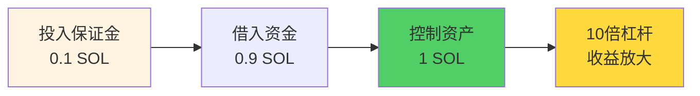

**关键术语**:

| 术语 | 说明 | 示例 |
|-----|------|------|
| 💰 **保证金** | 用户投入的资金担保 | 0.05 SOL |
| 💵 **借款** | 平台借出的资金 | 做多借 SOL,做空借代币 |
| 🛡️ **止损价** | 自动平仓的保护价格 | 当前价的 95%-105% |
| 🔄 **平仓** | 归还借款并结算盈亏 | 主动平仓/自动平仓 |

**价值主张**:
> **用 1 份保证金,抓住 10 份机会**
>
> **涨跌都能盈利,进退自如**

---

### 第 3 页:PinPet 杠杆交易的独特价值

**标题**: 为什么选择 PinPet? ⚡

**核心优势对比**:

| 维度 | 传统方案 | **PinPet 融合式引擎** |
|-----|---------|---------------------|
| **开仓速度** | 2-3次交易 | ⚡ **单次原子交易** |
| **资金效率** | 40-60% | 🚀 **95%+ 利用率** |
| **流动性** | 只有现货池 | 🌊 **现货池+借贷池** |


**技术突破**:
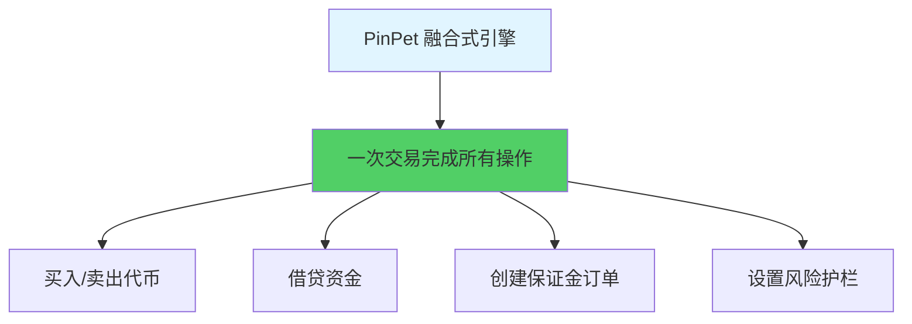

**Slogan**:
> **把"交易、借贷、风控"装进同一台引擎**

---

## 第二部分:杠杆开仓 (3页)

### 第 4 页:做多交易 - 看涨赚钱 🟢📈

**功能说明**:
看好代币上涨,借 SOL 买入代币,价格上涨后卖出获利

**操作流程**:

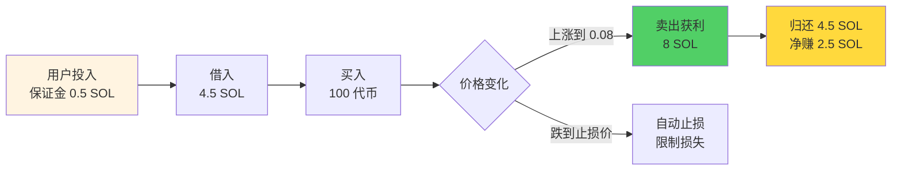

**盈利案例**:

| 参数 | 开仓 | 平仓 | 结果 |
|-----|------|------|------|
| **价格** | 0.05 SOL | 0.08 SOL | ⬆️ 上涨 60% |
| **保证金** | 0.5 SOL | - | - |
| **借入** | 4.5 SOL | 归还 4.5 SOL | - |
| **持仓** | 100 代币 | 卖出 8 SOL | - |
| **盈利** | - | - | **+2.5 SOL (+500%)** |

**关键参数**:
- `buy_token_amount`: 买入代币数量
- `max_sol_amount`: 最大 SOL 支出 (滑点保护)
- `margin_sol_max`: 最大保证金
- `close_price`: 止损价格 (< 当前价 97%)

**风险提示**: 🛑 价格下跌触发止损,可能损失全部保证金

---

### 第 5 页:做空交易 - 看跌赚钱 🔴📉

**功能说明**:
看跌代币价格,借代币卖出换 SOL,价格下跌后买回获利

**操作流程**:

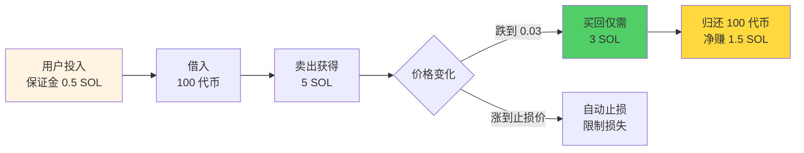

**盈利案例**:

| 参数 | 开仓 | 平仓 | 结果 |
|-----|------|------|------|
| **价格** | 0.08 SOL | 0.05 SOL | ⬇️ 下跌 37.5% |
| **保证金** | 0.5 SOL | - | - |
| **借入** | 100 代币 | 归还 100 代币 | - |
| **卖出** | 8 SOL | 买回 5 SOL | - |
| **盈利** | - | - | **+2.5 SOL (+500%)** |

**关键参数**:
- `borrow_sell_token_amount`: 借出并卖出代币数量
- `min_sol_output`: 最小 SOL 收入 (滑点保护)
- `margin_sol_max`: 最大保证金
- `close_price`: 止损价格 (> 当前价 103%)

**风险提示**: 🛑 价格上涨触发止损,理论上涨幅无限,风险大于做多

---

### 第 6 页:保证金与风控机制 🛡️

**保证金计算逻辑**:

**做多保证金**:
```
保证金 = 买币总花费 - 止损平仓时收益(扣除手续费)
```

**做空保证金**:
```
保证金 = 止损平仓时买回成本(含手续费) - 卖出收益(扣除手续费)
```

**三重风控护城河**:

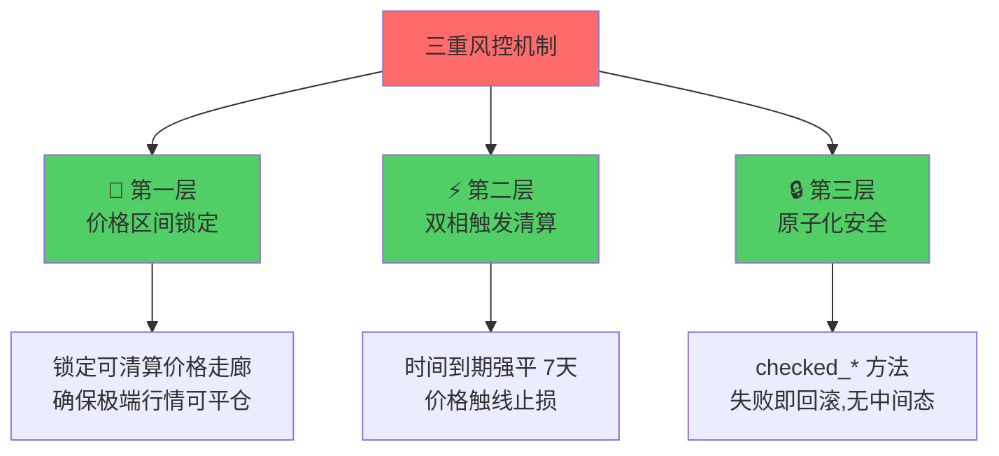

**交易限制**:

| 限制项 | 数值 | 说明 |
|-------|------|------|
| 最小交易量 | 1 Token | 防止粉尘交易 |
| 最小保证金 | 0.03 SOL | 保证有意义规模 |
| 做多止损价 | < 当前价 97% | 至少 3% 止损空间 |
| 做空止损价 | > 当前价 103% | 至少 3% 止损空间 |
| 借贷期限 | 7 天 | 到期可被强制平仓 |
| 手续费 | 0.25% | 开仓+平仓各一次 |

---

## 第三部分:杠杆平仓 (3页)

### 第 7 页:什么是平仓? 🔄

**平仓定义**:
关闭杠杆仓位,归还借款,结算盈亏

**平仓类型**:

| 类型 | 说明 | 适用场景 |
|-----|------|---------|
| 🔚 **全部平仓** | 一次性关闭整个仓位 | 目标达成/止损出局 |
| ✂️ **部分平仓** | 分批关闭部分仓位 | 锁定部分利润,保留仓位 |

**为什么需要平仓?**

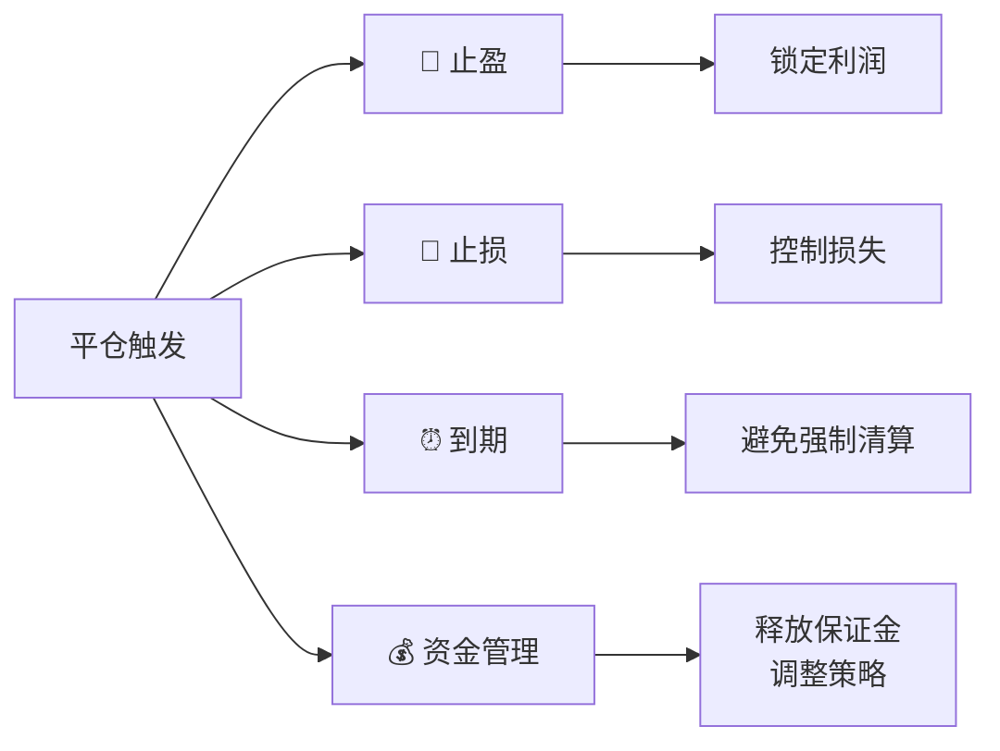

**主动平仓 vs 被动平仓**:

| 平仓方式 | 触发条件 | 执行者 | 价格 |
|---------|---------|--------|------|
| **主动平仓** | 用户主动操作 | 订单所有者 | 用户可控 |
| **被动平仓** | 订单到期 (7天) | 任何人 | 可能不利 |
| **自动止损** | 价格触及止损位 | 系统自动 | 预设价格 |

**建议**: 💡 建议到期前主动平仓,避免被动清算风险

---

### 第 8 页:平多仓流程 - 卖出代币归还 🟢

**功能说明**:
平多仓 = 卖出代币换 SOL,归还借款

**完整流程**:

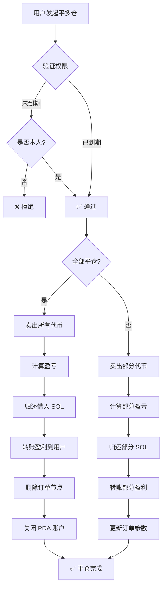

**盈亏计算**:

**全部平仓**:
```
盈利 = (卖出所得 SOL) + (保证金) - (借入 SOL)
```

**部分平仓**:
```
当次盈利 = (当次卖出 SOL) + (保证金) + (剩余代币可卖 SOL) - (总借款)
```

**盈亏场景对比**:

| 场景 | 开仓价 | 平仓价 | 持仓 | 借入 | 保证金 | 卖出所得 | 盈亏 |
|-----|--------|--------|------|------|--------|---------|------|
| 🟢 盈利 | 0.05 | 0.08 | 100 Token | 5 SOL | 0.5 SOL | 8 SOL | **+2.5 SOL** |
| 🔴 亏损 | 0.05 | 0.03 | 100 Token | 5 SOL | 0.5 SOL | 3 SOL | **-1.5 SOL** |
| ⚖️ 持平 | 0.05 | 0.055 | 100 Token | 5 SOL | 0.5 SOL | 5.5 SOL | **0 SOL** |

---

### 第 9 页:平空仓流程 - 买回代币归还 🔴

**功能说明**:
平空仓 = 用 SOL 买回代币,归还借款

**完整流程**:

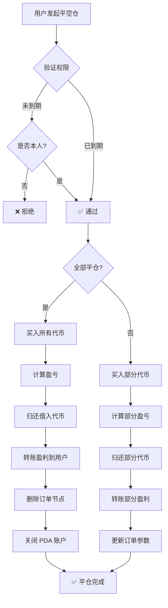

**盈亏计算**:

**全部平仓**:
```
盈利 = (开仓卖出所得 SOL) - (买回花费 SOL) - (手续费)
```

**部分平仓**:
```
当次盈利 = (本次买回区间含手续费) - (实际买回花费) - (手续费)
```

**盈亏场景对比**:

| 场景 | 开仓价 | 平仓价 | 借入 | 卖出所得 | 保证金 | 买回成本 | 盈亏 |
|-----|--------|--------|------|---------|--------|---------|------|
| 🟢 盈利 | 0.08 | 0.05 | 100 Token | 8 SOL | 0.5 SOL | 5 SOL | **+2.5 SOL** |
| 🔴 亏损 | 0.05 | 0.08 | 100 Token | 5 SOL | 0.5 SOL | 8 SOL | **-2.5 SOL** |
| ⚖️ 持平 | 0.06 | 0.06 | 100 Token | 6 SOL | 0.5 SOL | 6 SOL | **-0.06 SOL** |

---

## 第四部分:实战场景 (3页)

### 第 10 页:场景一 - 做多盈利全平仓 🟢✅

**背景**:
- 小明看好 MEME 代币,当前价 0.05 SOL
- 投入 0.5 SOL 保证金,借入 4.5 SOL
- 用 5 SOL 买入 100 代币
- 设置止损价 0.048 SOL

**价格上涨到 0.08 SOL,决定全部平仓**:

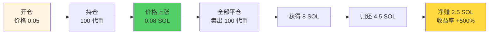

**收益计算**:
- 卖出所得: 8 SOL (扣除手续费)
- 归还借款: 4.5 SOL
- 收回保证金: 0.5 SOL
- **净盈利: 8 - 4.5 = 3.5 SOL**
- **收益率: (3.5 - 0.5) / 0.5 = +600%**

**关键决策**:
✅ 涨幅达预期,及时止盈
✅ 全部平仓,锁定利润
✅ 避免贪婪,落袋为安

---

### 第 11 页:场景二 - 做空止损平仓 🔴🛑

**背景**:
- 小红认为某代币虚高,当前价 0.05 SOL
- 投入 0.5 SOL 保证金,借入 100 代币
- 卖出 100 代币获得 5 SOL
- 设置止损价 0.08 SOL

**价格上涨到 0.08 SOL,触发止损**:

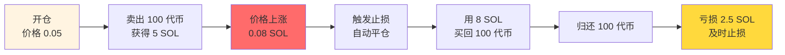

**损失计算**:
- 开仓卖出所得: 5 SOL
- 平仓买回成本: 8 SOL (含手续费)
- 保证金: 0.5 SOL
- **净亏损: 5 + 0.5 - 8 = -2.5 SOL**
- **损失率: 2.5 / 0.5 = -500%**

**关键教训**:
✅ 及时止损,避免更大损失
✅ 做空风险高于做多
✅ 设置合理止损位至关重要

---

### 第 12 页:场景三 - 部分平仓灵活调仓 ✂️

**背景**:
- 小刚做多持有 200 代币
- 价格已上涨 30%,有盈利
- 但仍看好后市,不想全部平仓

**策略:部分平仓 100 代币**:

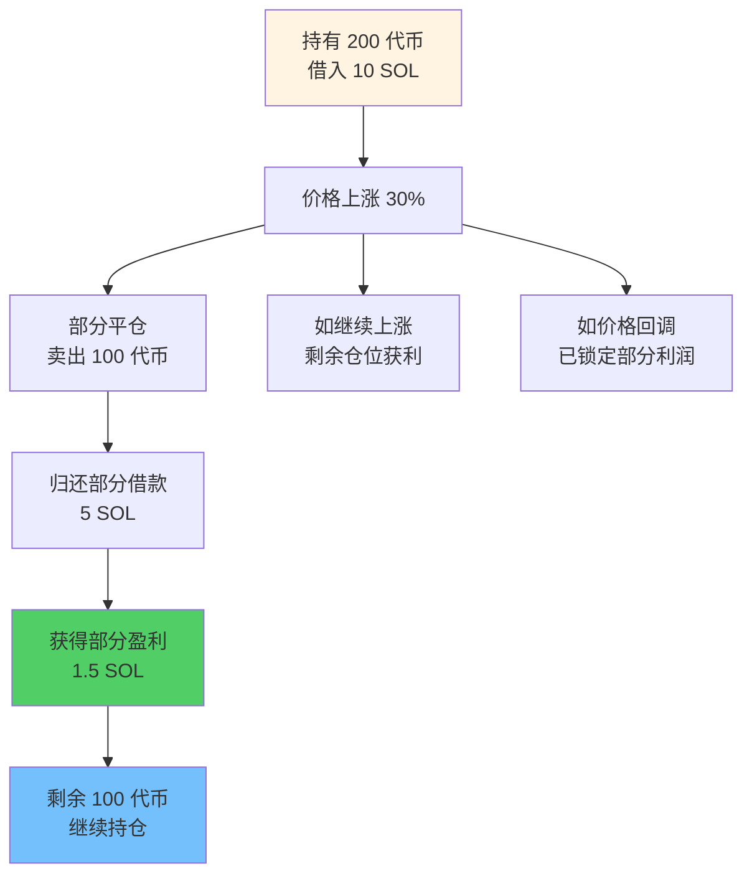

**价值**:

| 优势 | 说明 |
|-----|------|
| 💰 **锁定利润** | 部分盈利落袋为安 |
| 📈 **保留机会** | 剩余仓位继续持有 |
| 🛡️ **降低风险** | 减少借款,降低爆仓风险 |
| ⚖️ **灵活策略** | 进可攻,退可守 |

**操作要点**:
- 部分平仓数量 ≥ 2倍最小交易量
- 剩余持仓 ≥ 最小交易量
- 订单参数自动更新
- 止损价位重新调整

---

## 第五部分:风险与建议 (2页)

### 第 13 页:风险提示与最佳实践 ⚠️

**四大风险**:

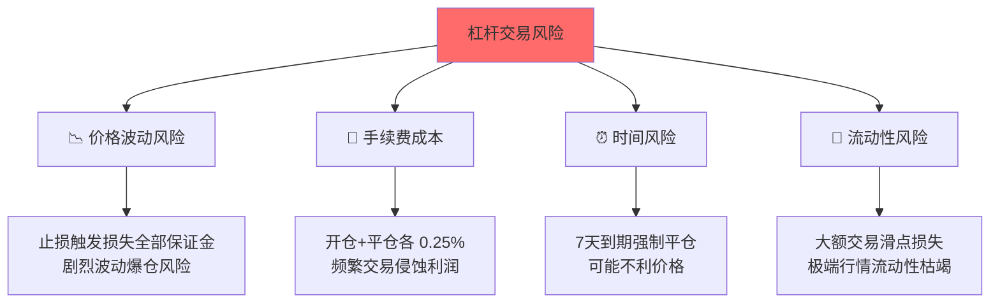

**最佳实践建议**:

| 建议 | 详细说明 |
|-----|---------|
| 🛡️ **合理止损** | 止损价不宜过近,留 5-10% 缓冲空间 |
| 📊 **控制仓位** | 不要 all-in,分散投资降低风险 |
| ⏰ **关注到期** | 提前 1-2 天主动管理即将到期订单 |
| 💰 **减少频繁操作** | 避免过于频繁部分平仓,控制手续费 |
| 📈 **止盈纪律** | 达到预期收益及时平仓,不要贪婪 |
| 🔍 **监控市场** | 大额平仓前查看流动性深度 |

**安全保障**:

✅ **地址验证**: 防止操作错误订单
✅ **权限检查**: 只有授权用户能操作
✅ **溢出保护**: checked 方法确保计算安全
✅ **原子性**: 所有步骤原子化执行,防止状态不一致

---

### 第 14 页:操作指南与行动号召 🚀

**3 步开启杠杆交易**:

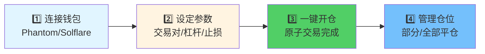

**关键参数设置**:

**做多开仓**:
- `buy_token_amount`: 买入数量 (≥ 1 Token)
- `max_sol_amount`: 最大 SOL 支出 (滑点保护)
- `margin_sol_max`: 最大保证金 (≥ 0.03 SOL)
- `close_price`: 止损价格 (< 当前价 97%)

**做空开仓**:
- `borrow_sell_token_amount`: 借出卖出数量 (≥ 1 Token)
- `min_sol_output`: 最小 SOL 收入 (滑点保护)
- `margin_sol_max`: 最大保证金 (≥ 0.03 SOL)
- `close_price`: 止损价格 (> 当前价 103%)

**平仓参数**:
- `sell/buy_token_amount`: 平仓数量
- `min/max_sol_amount`: 滑点保护
- `prev/close/next_order_id`: 链表节点位置
- `close_order_address`: 订单地址验证

---

**行动号召**:

### 🌐 [立即体验 PinPet.fun](https://pinpet.fun)

### 📖 [阅读完整文档](https://docs.pinpet.fun)

### 💬 [加入社区](https://t.me/PinPetOfficial)
- **Telegram**: 实时交流
- **Discord**: 技术支持
- **Twitter**: 最新动态

---

**核心价值总结**:

> ## **融合式引擎 = AMM + 自动借贷池**
>
> ## **一次交易完成:买卖 + 借贷 + 风控**
>
> ## **涨跌双向盈利,进退灵活自如**

---

**⚠️ 免责声明** (小字):

杠杆交易具有高风险,可能损失全部保证金。请在充分理解机制和风险后谨慎参与,理性使用杠杆。本文档仅用于功能介绍,不构成投资建议。

---

## 附录:常见问题 FAQ

### Q1: 可以提前平仓吗?
**A**: 可以。订单到期前,用户可随时主动平仓,无额外惩罚。

### Q2: 订单到期后会怎样?
**A**: 到期后任何人可触发强制平仓。建议到期前主动平仓,避免被动清算。

### Q3: 保证金会退还吗?
**A**: 会。平仓时如有盈利,保证金+盈利一并退还;触发止损时,剩余保证金退还。

### Q4: 可以调整止损价吗?
**A**: 当前版本不支持。建议开仓时谨慎设置止损价格。

### Q5: 手续费如何计算?
**A**: 开仓和平仓各收取 0.25%,总计约 0.5% 交易成本。

### Q6: 借贷池储备不足怎么办?
**A**: 系统会拒绝开仓。建议等待其他用户平仓释放储备,或选择其他交易对。

---

## 🎨 演讲建议

### 时间分配 (总计 10-12 分钟)

| 部分 | 时间 | 重点 |
|-----|------|------|
| **产品概述** | 2分钟 | 什么是杠杆,PinPet 的独特价值 |
| **杠杆开仓** | 3分钟 | 做多/做空/风控机制 |
| **杠杆平仓** | 2分钟 | 平多/平空流程 |
| **实战场景** | 2-3分钟 | 三个真实案例 |
| **风险与行动** | 1-2分钟 | 风险提示+CTA |

### 演讲要点

**开场**:
- 🎯 "小资金如何撬动大收益?杠杆交易!"
- 💡 "但传统方案效率低、风险高"
- 🚀 "PinPet 用融合式引擎解决所有问题"

**核心价值**:
- 📊 "单次交易完成所有操作"
- 💰 "95%+ 资金利用率,行业领先"
- ⚡ "0ms 清算响应,极端行情保障"

**功能讲解**:
- 🟢 "做多:看涨赚钱,借 SOL 买代币"
- 🔴 "做空:看跌赚钱,借代币卖出"
- ✂️ "部分平仓:灵活调仓,进退自如"

**场景演示**:
- 💎 "看这个案例:0.5 SOL 赚 2.5 SOL"
- 🛡️ "及时止损案例:控制损失避免爆仓"
- ⚖️ "部分平仓:锁利同时保留机会"

**结尾**:
- ✅ "融合式引擎,全球首创"
- 🚀 "现在就访问 pinpet.fun 体验"
- ⚠️ "风险提示:理性使用杠杆"

---

*文档版本: v1.0*
*最后更新: 2025-10-16*
*基于: leverage_open_position.md + leverage_close_position.md*
