# PinPet 特点介绍 - 下一代 AMM 交易所

## 📊 PPT 结构框架 (共 14 页)

---

## 第一部分：市场背景与问题 (2页)

### 第 1 页：封面

**主标题**: PinPet：重新定义 AMM 交易所 🚀

**副标题**: 从"被动交易"到"主动盈利" | 传统 AMM → 融合式杠杆交易引擎

**视觉元素**:
- 科技感渐变背景（Solana 紫 → 金融蓝）
- 核心 Slogan：**"一个交易，三倍效率，无限可能"**
- Logo + 官网链接：pinpet.fun

**价值主张预告**:
> **Uniswap 让你「交换代币」**
> **PinPet 让你「掌控趋势」**

---

### 第 2 页：传统 DEX 的三大局限性 ⚠️

**标题**: 为什么需要 PinPet？传统 AMM 的痛点

**核心问题可视化**:

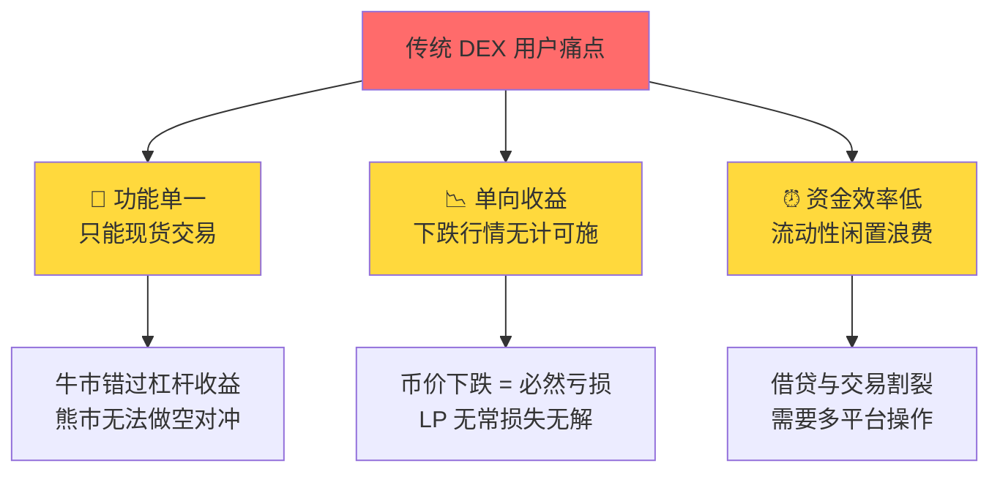

**数据对比**:

| 痛点维度 | Uniswap 典型场景 | 用户损失 |
|---------|----------------|---------|
| **单向收益** | 持有 ETH，价格下跌 30% | 💔 只能眼睁睁看着亏损 |
| **资金效率** | 提供 1 万美元流动性 | 🔒 实际利用率仅 40-60% |
| **操作复杂** | 想要杠杆做多 | ⏱️ 需要 3-5 步骤，多平台操作 |
| **风险暴露** | 无法对冲持仓风险 | 📉 极端行情下 LP 损失 25%+ |

**引出问题**:
> **如果有一个平台，既能现货交易，又能杠杆做多做空，还能一键完成所有操作？**
>
> 👉 **这就是 PinPet 的创新使命**

---

## 第二部分：Uniswap 核心机制回顾 (2页)

### 第 3 页：Uniswap - 传统 AMM 的代表

**标题**: Uniswap：去中心化现货交易的开创者

**核心机制精简图**:

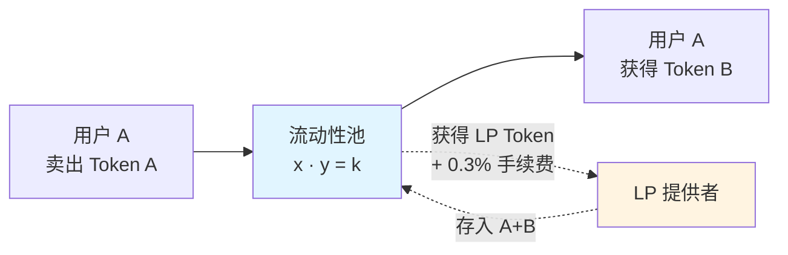

**三大核心特性**:

| 特性 | 说明 | 公式/参数 |
|-----|------|----------|
| 🔄 **恒定乘积** | 自动做市定价机制 | $x \cdot y = k$ |
| 💧 **流动性池** | 任何人可提供流动性 | LP Token = $\sqrt{x \cdot y}$ |
| 💰 **手续费分配** | 交易手续费归 LP | 0.3% 自动复利 |

**Uniswap 的贡献**:
- ✅ 无需许可的去中心化交易
- ✅ 透明的链上定价机制
- ✅ 永久可用的流动性
- ✅ DeFi 乐高的基础设施

**但是...**
> ⚠️ **仅限现货交易，无法捕捉方向性收益**
> ⚠️ **下跌行情中用户只能被动承受损失**
> ⚠️ **借贷与交易功能完全分离**

---

### 第 4 页：Uniswap 完整交易流程

**标题**: 传统 AMM 交易：简单但受限

**用户交易流程**:

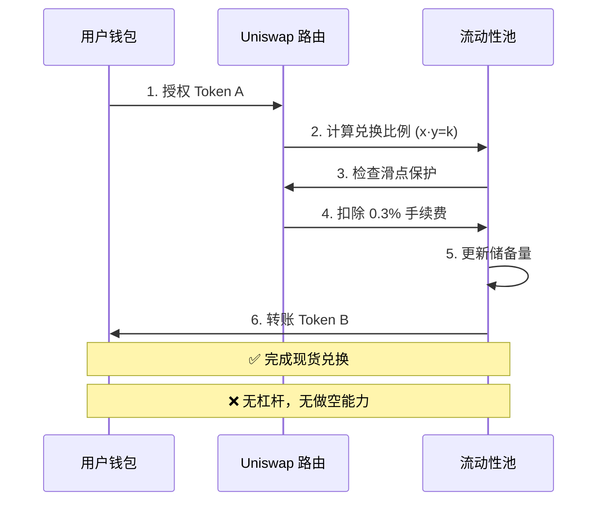

**关键限制**:

| 功能需求 | Uniswap 能否实现？ | 需要额外操作 |
|---------|------------------|------------|
| 现货交易 | ✅ 一键完成 | 无 |
| 杠杆做多 | ❌ 不支持 | 需去 Aave 借贷 → 再交易 |
| 杠杆做空 | ❌ 不支持 | 需去借贷协议借币 → 卖出 → 等待 → 买回 |
| 止损止盈 | ❌ 不支持 | 需要第三方机器人监控 |
| 资金效率 | ⚠️ 中等 | 流动性 40-60% 利用率 |

**用户心声**:
> 💬 "我看好 SOL 上涨，想用 10 倍杠杆做多，但 Uniswap 做不到..."
> 💬 "熊市想做空对冲，却要在 3 个平台来回操作，太麻烦了！"

---

## 第三部分：PinPet 创新突破 (3页)

### 第 5 页：PinPet = AMM + 杠杆 + 借贷 融合式引擎

**标题**: PinPet 的三重突破 🚀

**创新架构可视化**:

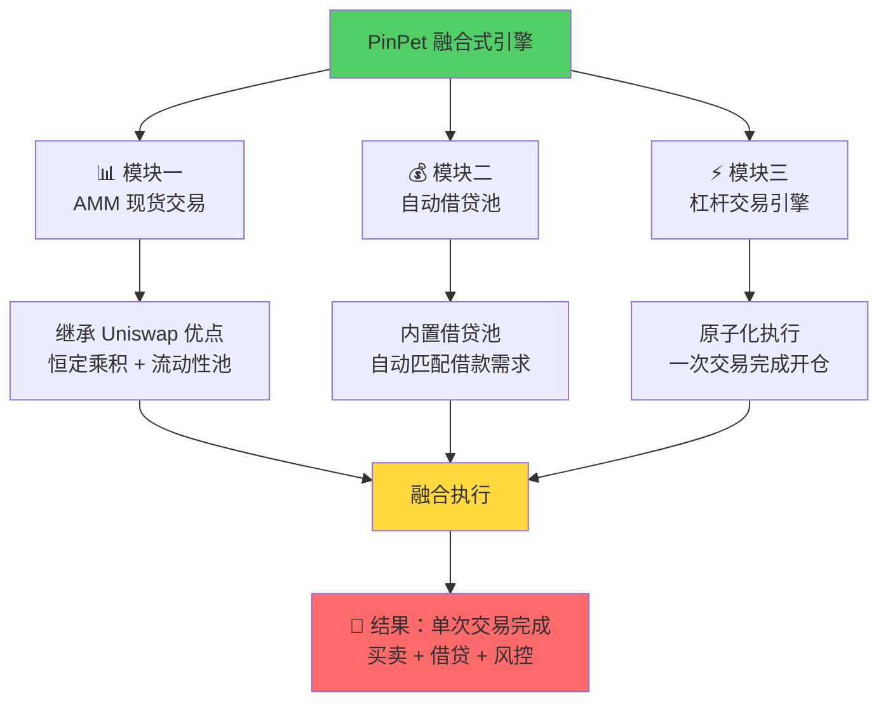

**核心创新对比**:

| 创新维度 | 传统方案 (Uniswap + Aave) | **PinPet 融合式引擎** |
|---------|-------------------------|---------------------|
| **交易步骤** | 3-5 步（授权→借贷→交易→风控） | ⚡ **1 步原子交易** |
| **平台切换** | 需要 2-3 个平台 | 🎯 **单一平台完成** |
| **资金效率** | 40-60% 利用率 | 🚀 **95%+ 利用率** |
| **杠杆支持** | ❌ 需手动组合 | ✅ **原生支持 10 倍+** |
| **做空能力** | ⚠️ 复杂操作 | ✅ **一键做空** |
| **风控机制** | 分散在多协议 | 🛡️ **三重风控内置** |

**技术壁垒**:
> **🏆 全球首创"融合式 AMM+借贷"架构**
> 把传统需要 3 个协议完成的事，浓缩进 1 次原子交易

---

### 第 6 页：PinPet 核心功能矩阵

**标题**: 功能全面覆盖，满足所有交易需求

**功能对比矩阵**:

| 功能特性 | Uniswap | Aave | **PinPet** | 优势说明 |
|---------|---------|------|-----------|---------|
| 现货交易 | ✅ | ❌ | ✅ | 基础 AMM 功能 |
| 添加流动性 | ✅ | ❌ | ✅ | LP 收益 |
| 杠杆做多 | ❌ | ⚠️ 需组合 | ✅ | **一键开仓** |
| 杠杆做空 | ❌ | ⚠️ 需组合 | ✅ | **原生支持** |
| 自动止损 | ❌ | ❌ | ✅ | **保护本金** |
| 部分平仓 | ❌ | ❌ | ✅ | **灵活调仓** |
| 借贷服务 | ❌ | ✅ | ✅ | **内置借贷池** |
| 原子交易 | ⚠️ 仅现货 | ❌ | ✅ | **防 MEV 攻击** |

**用户故事对比**:

**场景：看好某代币上涨，想 10 倍杠杆做多**

| 步骤 | Uniswap + Aave 方案 | **PinPet 方案** |
|-----|-------------------|----------------|
| 1 | 前往 Aave 授权抵押品 | ✅ 连接钱包 |
| 2 | 存入抵押品借出 SOL | ✅ 设置参数（金额/杠杆/止损） |
| 3 | 切换到 Uniswap 授权 | ✅ 点击「一键做多」 |
| 4 | 在 Uniswap 买入代币 | ✅ **完成！** |
| 5 | 设置止损（需第三方工具） | - |
| **总耗时** | ⏱️ **5-10 分钟** | ⚡ **30 秒** |
| **失败风险** | ⚠️ 多步骤易失败 | 🛡️ 原子执行，失败即回滚 |

**核心价值主张**:
> **从"多平台拼图"到"一站式解决方案"**
> **从"复杂操作"到"一键交易"**
> **从"被动交易"到"主动盈利"**

---

### 第 7 页：PinPet 的三重风控护城河 🛡️

**标题**: 安全性：不妥协的风险管理

**三重风控机制**:

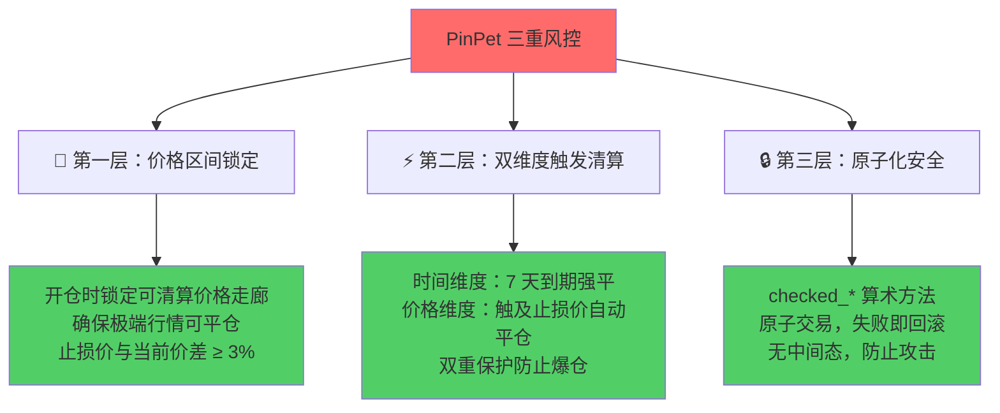

**与 Uniswap 风控对比**:

| 风控维度 | Uniswap | **PinPet** |
|---------|---------|-----------|
| **滑点保护** | ✅ 用户设置 | ✅ 用户设置 + 系统校验 |
| **价格操纵防护** | ⚠️ 依赖 TWAP 预言机 | ✅ 价格区间锁定 + 原子执行 |
| **清算机制** | ❌ 无（现货无需清算） | ✅ 时间+价格双触发 |
| **本金保护** | ❌ 无止损功能 | ✅ 强制止损价 |
| **安全执行** | ✅ 原子交易 | ✅ 原子交易 + checked 方法 |
| **MEV 防护** | ⚠️ 易被三明治攻击 | ✅ 原子化杠杆操作防 MEV |

**技术亮点**:
- 💎 **最小保证金**: 0.03 SOL（防止粉尘攻击）
- 💎 **强制止损空间**: 做多 < 97% 当前价，做空 > 103% 当前价
- 💎 **溢出保护**: 所有计算使用 `checked_add/sub/mul/div`
- 💎 **权限验证**: 未到期订单仅所有者可操作

---

## 第四部分：技术架构对比 (2页)

### 第 8 页：架构对比 - 单一 vs 融合

**标题**: 技术架构：从"功能分离"到"深度融合"

**Uniswap 架构 (功能分离)**:

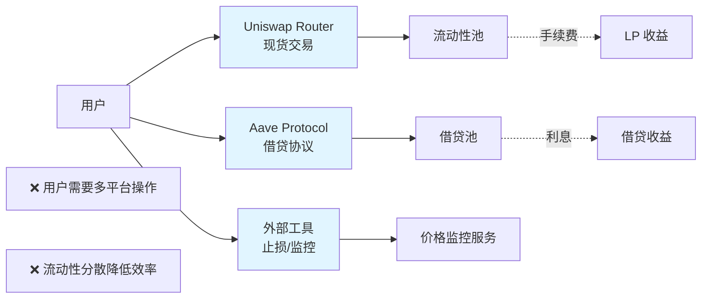

**PinPet 架构 (深度融合)**:

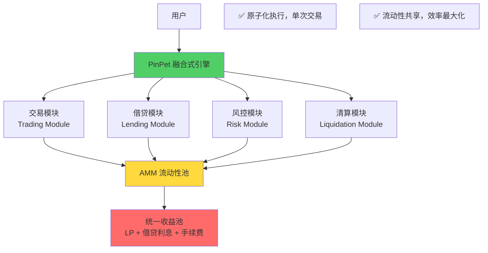

**关键差异总结**:

| 架构维度 | Uniswap 生态 | **PinPet** |
|---------|-------------|-----------|
| **设计哲学** | 模块化分离 | 深度融合 |
| **用户体验** | 多平台操作 | 一站式服务 |
| **流动性利用** | 分散在多协议 | 统一池高效利用 |
| **安全模型** | 组合风险 | 整体风控 |
| **开发复杂度** | 低（单一功能） | 高（融合多功能） |
| **技术壁垒** | 低 | **高（全球首创）** |

---

### 第 9 页：资金效率对比 - 数据说话

**标题**: 资金效率：95%+ vs 40-60%

**场景：用户有 1 万美元等值资产**

**传统方案 (Uniswap + Aave)**:

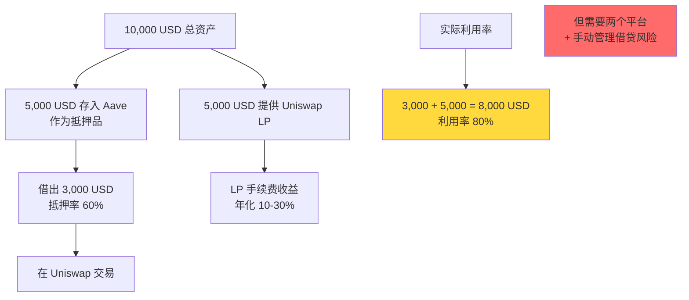

**PinPet 方案 (融合式引擎)**:

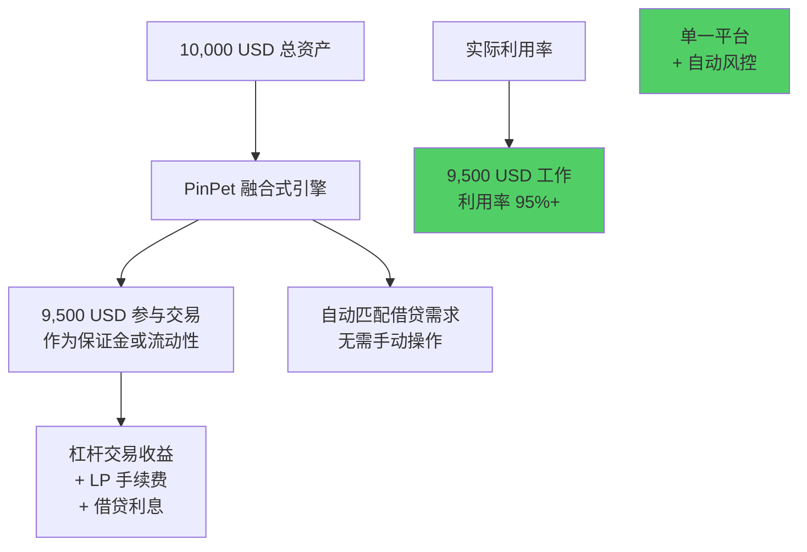

**效率提升量化**:

| 指标 | Uniswap + Aave | **PinPet** | 提升幅度 |
|-----|----------------|-----------|---------|
| 资金利用率 | 60% | **95%+** | **+58%** |
| 操作平台数 | 2-3 个 | **1 个** | **-70%** |
| 平均操作步骤 | 5-8 步 | **1-2 步** | **-75%** |
| 交易失败率 | 15-20% (多步骤) | **<5%** (原子交易) | **-75%** |
| Gas 费成本 | 3-5 笔交易 | **1 笔交易** | **-60%** |

**核心优势**:
> **同样的资金，在 PinPet 创造更多价值**
> **95%+ 利用率 = 行业最高水平**

---

## 第五部分：商业价值分析 (2页)

### 第 10 页：多维度商业价值

**标题**: 商业价值：三方共赢的生态飞轮

**价值飞轮可视化**:

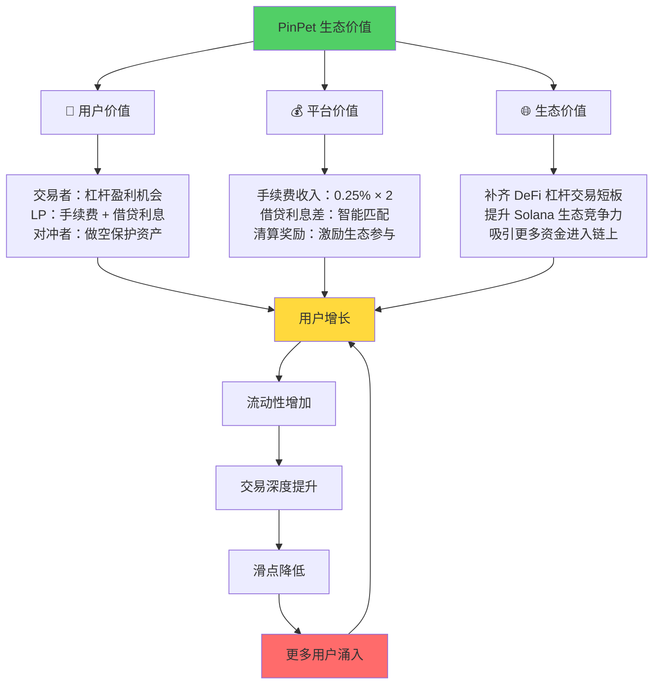

**用户价值量化**:

| 用户类型 | 传统方案痛点 | PinPet 解决方案 | 价值提升 |
|---------|------------|----------------|---------|
| **交易者** | 只能现货交易 | 10倍+ 杠杆做多做空 | **收益潜力 10 倍+** |
| **LP 提供者** | 仅手续费收入 | 手续费 + 借贷利息 | **收益来源 +100%** |
| **专业对冲者** | 需多平台组合 | 一键做空对冲 | **操作效率 +300%** |
| **DeFi 新手** | 学习成本高 | 直观界面 + 风控保护 | **降低门槛 60%** |

**平台价值**:

| 收入来源 | 机制 | 市场对标 |
|---------|------|---------|
| **交易手续费** | 开仓 0.25% + 平仓 0.25% | Uniswap V2: 0.3% |
| **借贷利息差** | 借出利率 - 存入利率 | Aave 利差: 3-8% |
| **清算奖励** | 到期/触发清算的部分奖励 | 创新收入模式 |
| **生态治理代币** | (未来)Token 经济模型 | GMX/dYdX 模式 |

**生态价值**:

- 🌟 **市场空间**: DeFi 杠杆交易市场规模 > 500 亿美元
- 🌟 **竞争优势**: Solana 首个融合式 AMM+杠杆交易所
- 🌟 **技术护城河**: 全球首创架构，专利级创新
- 🌟 **生态协同**: 可与 Solana 生态其他协议深度集成

---

### 第 11 页：市场定位与竞争优势

**标题**: 市场定位：瞄准 DeFi 杠杆交易蓝海

**竞品对比矩阵**:

| 竞品 | 类型 | 优势 | 劣势 | **PinPet 差异化** |
|-----|------|------|------|-----------------|
| **Uniswap** | 现货 AMM | 流动性深 | 无杠杆 | ✅ 增加杠杆+做空 |
| **GMX** | 永续合约 | 支持杠杆 | 非 AMM，预言机依赖 | ✅ AMM 价格，无预言机风险 |
| **dYdX** | 订单簿 DEX | 杠杆交易 | 中心化排序，门槛高 | ✅ 完全去中心化 |
| **Aave** | 借贷协议 | 借贷深度好 | 无交易功能 | ✅ 融合借贷+交易 |
| **Mango Markets** | Solana DEX | 全功能 | 安全事件影响 | ✅ 三重风控 + 原子安全 |

**核心竞争优势**:

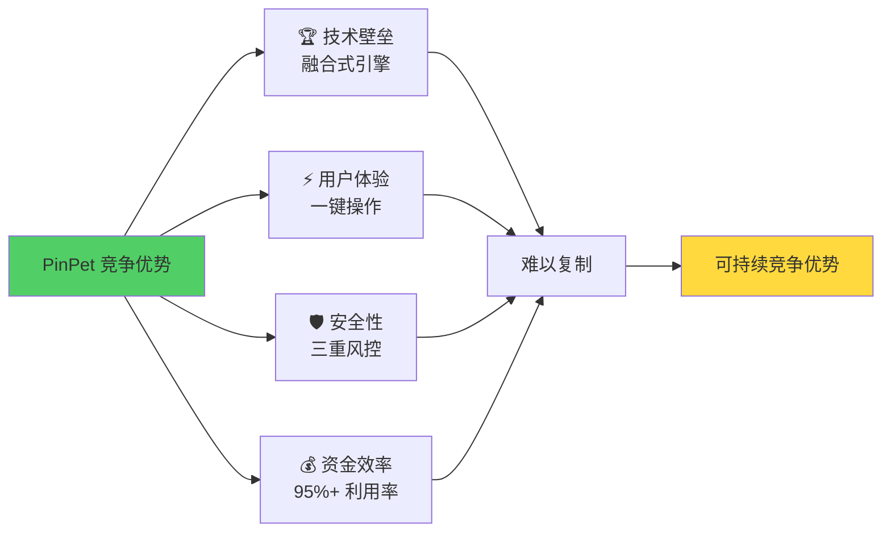

**目标用户画像**:

| 用户群体 | 占比 | 核心需求 | PinPet 吸引力 |
|---------|------|---------|--------------|
| **DeFi 老手** | 40% | 高效工具，杠杆交易 | ⭐⭐⭐⭐⭐ 完美契合 |
| **加密投资者** | 35% | 做空对冲，保护资产 | ⭐⭐⭐⭐⭐ 刚需功能 |
| **Solana 生态用户** | 15% | 原生 Solana 体验 | ⭐⭐⭐⭐ 链上集成 |
| **传统金融用户** | 10% | 简单易用，风控保护 | ⭐⭐⭐ 需要教育 |

---

## 第六部分：实战案例对比 (2页)

### 第 12 页：案例一 - 牛市做多收益对比 📈

**背景**: 用户预判某代币将上涨，初始价格 0.05 SOL，投入 0.5 SOL

**Uniswap 现货方案**:

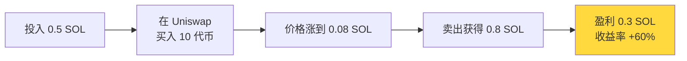

**PinPet 杠杆做多方案**:

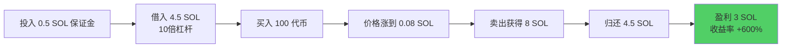

**收益对比表**:

| 方案 | 投入 | 持仓 | 涨幅 | 卖出所得 | 归还借款 | **净盈利** | **收益率** |
|-----|------|------|------|---------|---------|----------|----------|
| Uniswap 现货 | 0.5 SOL | 10 代币 | 60% | 0.8 SOL | 0 | **0.3 SOL** | **+60%** |
| **PinPet 10倍杠杆** | 0.5 SOL | 100 代币 | 60% | 8 SOL | 4.5 SOL | **3 SOL** | **+600%** |
| **差距** | 相同 | **10 倍** | 相同 | **10 倍** | - | **10 倍** | **10 倍** |

**关键洞察**:
> **相同涨幅，PinPet 收益是 Uniswap 的 10 倍**
> **小资金撬动大收益，杠杆的力量**

---

### 第 13 页：案例二 - 熊市对冲能力对比 📉

**背景**: 用户持有大量代币，担心下跌，当前价格 0.08 SOL

**Uniswap 方案**:

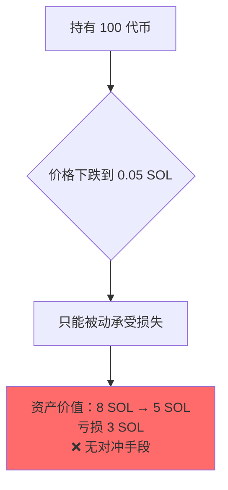

**PinPet 做空对冲方案**:

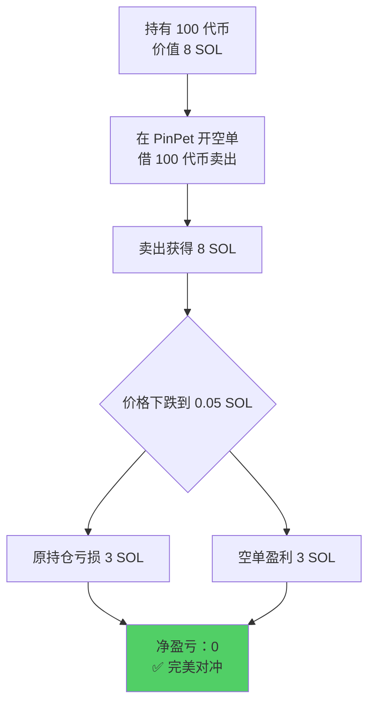

**对冲效果对比**:

| 方案 | 原持仓价值 | 对冲操作 | 价格跌幅 | 原持仓损失 | 对冲盈利 | **最终损益** |
|-----|----------|---------|---------|----------|---------|------------|
| Uniswap | 8 SOL | ❌ 无法对冲 | -37.5% | -3 SOL | 0 | **-3 SOL** ❌ |
| **PinPet** | 8 SOL | ✅ 做空 100 代币 | -37.5% | -3 SOL | +3 SOL | **0 SOL** ✅ |

**场景三：部分平仓灵活调仓**

**PinPet 独有优势 - 部分平仓**:

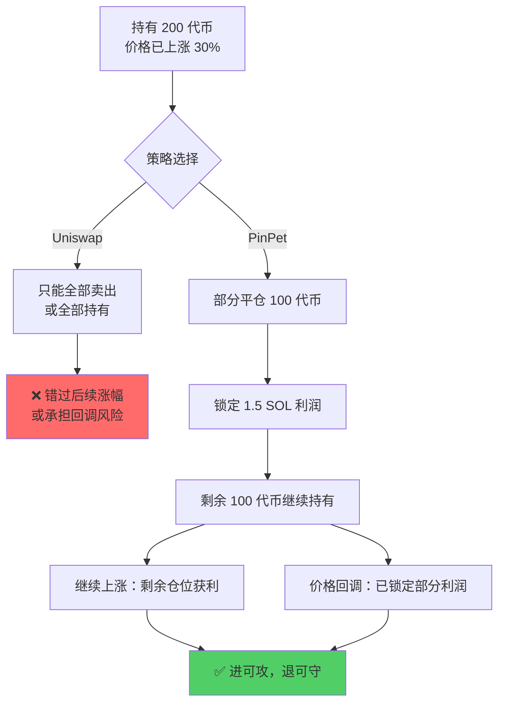

**核心价值**:
> **Uniswap：只能「交换」代币**
> **PinPet：可以「操控」风险**

---

## 第七部分：总结与展望 (1页)

### 第 14 页：PinPet - 重新定义 AMM 交易所

**核心价值总结**:

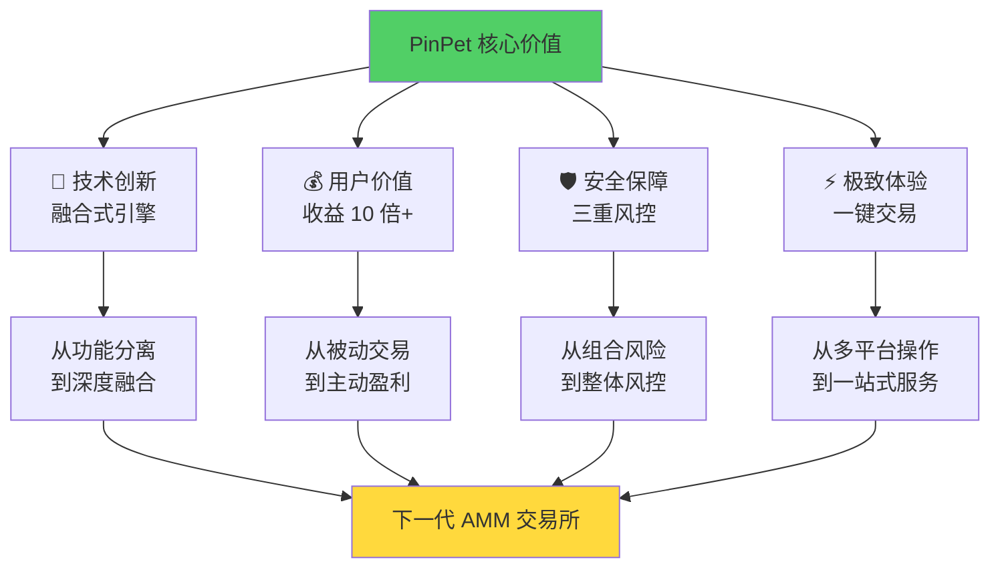

**三大核心 Slogan**:

> ## 🎯 **一个交易，三倍效率，无限可能**
>
> ## 💎 **把杠杆交易，做到极致简单**
>
> ## 🌊 **涨跌都能盈利，进退灵活自如**

---

**与 Uniswap 对比总结表**:

| 维度 | Uniswap | **PinPet** | 升级幅度 |
|-----|---------|-----------|---------|
| 交易类型 | 仅现货 | 现货 + 杠杆 | **+100%** |
| 盈利方向 | 仅上涨 | 上涨 + 下跌 | **+100%** |
| 资金效率 | 40-60% | 95%+ | **+58%** |
| 操作步骤 | 1 步 (仅现货) | 1 步 (含杠杆) | **复杂度 -75%** |
| 风控机制 | 滑点保护 | 滑点 + 止损 + 清算 | **+200%** |
| 收益潜力 | 1 倍涨幅 | 10 倍+ 杠杆 | **+900%** |

---

**未来展望**:

| 阶段 | 时间 | 核心目标 |
|-----|------|---------|
| **Phase 1** | Q4 2025 | 主网上线，支持主流代币杠杆交易 |
| **Phase 2** | Q1 2026 | 引入治理代币，社区驱动发展 |
| **Phase 3** | Q2 2026 | 跨链扩展（以太坊、BSC） |
| **Phase 4** | Q3 2026 | 机构级产品（API、做市商工具） |

---

**行动号召**:

### 🌐 [立即体验 PinPet](https://pinpet.fun)

### 📖 [阅读完整文档](https://docs.pinpet.fun)

### 💬 加入我们的社区
- **Telegram**: 实时交流与技术支持
- **Discord**: 开发者社区
- **Twitter**: 最新动态与空投活动

---

**结束语**:

> **Uniswap 开创了去中心化现货交易**
>
> **PinPet 将引领去中心化杠杆交易时代**
>
> **从 AMM 到 AMM+，从交换到盈利，从现在到未来**
>
> **🚀 The Next Generation of AMM - PinPet**

---

**⚠️ 风险提示** (小字):

杠杆交易具有高风险，可能损失全部保证金。价格波动、流动性风险、智能合约风险等因素可能导致损失。请在充分理解机制和风险后谨慎参与，合理使用杠杆，不要投入超过承受能力的资金。本文档仅用于产品功能介绍，不构成投资建议。过往案例收益不代表未来表现。

---

*文档版本: v1.0*
*创建日期: 2025-10-16*
*参考文档: PinPet杠杆交易PPT方案.md, Uniswap交易流程PPT方案.md*

---

## 📌 演讲建议

### 时间分配 (总计 12-15 分钟)

| 部分 | 时间 | 核心要点 |
|-----|------|---------|
| **市场背景** | 2 分钟 | 传统 DEX 痛点，引出需求 |
| **Uniswap 回顾** | 2 分钟 | 肯定贡献，指出局限 |
| **PinPet 创新** | 3 分钟 | 融合式引擎，功能矩阵 |
| **架构与效率** | 2 分钟 | 技术优势，数据对比 |
| **商业价值** | 2 分钟 | 三方共赢，竞争优势 |
| **实战案例** | 2 分钟 | 具体数字，直观对比 |
| **总结展望** | 1-2 分钟 | 核心价值，行动号召 |

### 演讲话术参考

**开场**:
- 🎯 "如果 Uniswap 让加密货币可以自由交换，那 PinPet 让加密投资可以自由盈利"
- 💡 "今天我要展示的，是如何把 3 个平台、5 个步骤的复杂操作，浓缩成 1 次点击"

**核心价值**:
- 📊 "我们把 AMM、借贷、风控三大功能融进一台引擎"
- 💰 "相同的钱，10 倍的收益潜力"
- ⚡ "95% 资金利用率，行业最高"

**案例讲解**:
- 💎 "看这个真实案例：0.5 SOL 变成 3.5 SOL，这是杠杆的力量"
- 🛡️ "熊市不再恐惧，一键做空完美对冲"

**结尾**:
- ✅ "PinPet 不是取代 Uniswap，而是进化 Uniswap"
- 🚀 "现在就访问 pinpet.fun，体验下一代 AMM"
- ⚠️ "当然，高收益伴随高风险，请理性使用杠杆"
