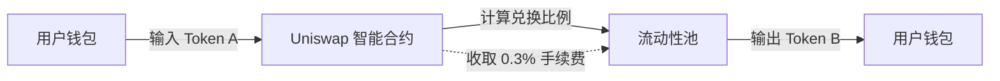
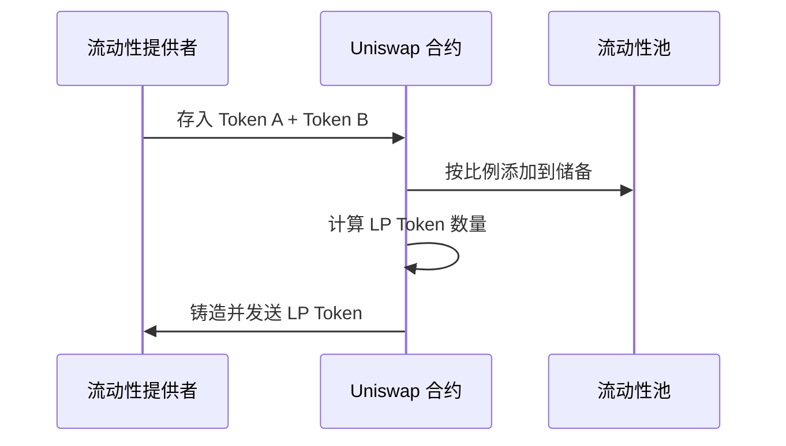
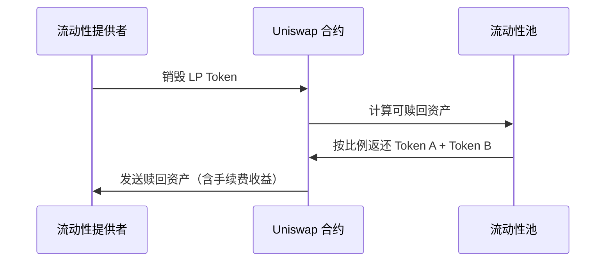
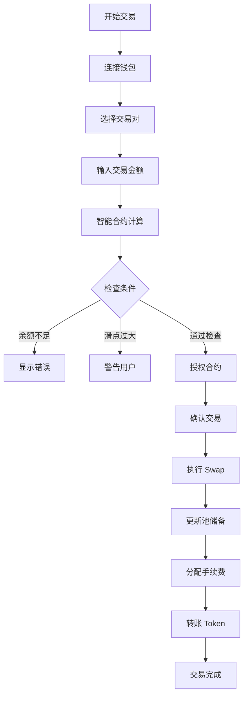
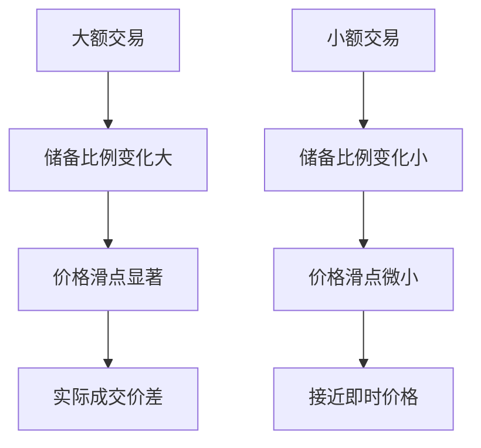

# Uniswap AMM 交易所交易流程介绍

---

## 第一部分：Uniswap 简介

### 什么是 Uniswap？

- **去中心化交易所 (DEX)**：无需中心化订单簿的自动化做市商
- **AMM 机制**：Automated Market Maker（自动做市商）
- **无需许可**：任何人都可以创建交易对、提供流动性、进行交易
- **链上运行**：智能合约完全在以太坊及其他 EVM 链上执行

### Uniswap 核心版本演进

- **V1**（2018）：基础 AMM 模型，仅支持 ETH/ERC20 交易对
- **V2**（2020）：支持任意 ERC20/ERC20 交易对，引入价格预言机
- **V3**（2021）：集中流动性、多级费率、NFT LP 凭证
- **V4**（2024）：Hooks 系统、单例合约架构、闪电记账

---

## 第二部分：AMM 核心原理

### 恒定乘积做市商模型 (CPMM)

Uniswap V2 使用的核心公式：

$$
x \cdot y = k
$$

其中：
- $x$ = Token A 储备量
- $y$ = Token B 储备量
- $k$ = 恒定常数（流动性池总价值）

### 价格计算机制

**即时价格**（边际价格）：

$$
P = \frac{y}{x}
$$

**交易后价格**：

$$
P_{new} = \frac{y - \Delta y}{x + \Delta x}
$$

### 滑点计算

由于 AMM 机制，大额交易会改变池子储备比例，导致价格滑移：

$$
\text{滑点} = \frac{P_{执行} - P_{预期}}{P_{预期}} \times 100\%
$$

---

## 第三部分：核心交易功能

### 1. Swap（代币兑换）



**核心特性：**
- 实时计算兑换比例
- 支持多跳路由（A→B→C）
- 滑点保护设置
- 手续费自动分配给 LP

### 2. Add Liquidity（添加流动性）



**LP Token 计算**（首次添加）：

$$
\text{LP Token} = \sqrt{x \cdot y}
$$

后续添加：

$$
\text{LP Token} = \min\left(\frac{\Delta x}{x}, \frac{\Delta y}{y}\right) \times \text{总LP供应}
$$

### 3. Remove Liquidity（移除流动性）



**赎回计算**：

$$
\text{可赎回 Token A} = \frac{\text{用户LP Token}}{\text{总LP供应}} \times x
$$

$$
\text{可赎回 Token B} = \frac{\text{用户LP Token}}{\text{总LP供应}} \times y
$$

---

## 第四部分：完整交易流程

### Swap 交易详细流程



### 关键步骤说明

**1. 计算输出金额**（考虑 0.3% 手续费）：

$$
\Delta y = \frac{y \cdot \Delta x \cdot 997}{x \cdot 1000 + \Delta x \cdot 997}
$$

**2. 更新池储备**：
```
x_new = x + Δx
y_new = y - Δy
```

**3. 验证恒定乘积**：
```
x_new * y_new >= x * y
```


---

## 第七部分：手续费机制

### V2 手续费结构

| 费用类型 | 比例 | 分配对象 |
|---------|------|---------|
| 交易手续费 | 0.30% | 流动性提供者 100% |
| 协议费（可选）| 0.05% | Uniswap DAO（未启用）|

### V3 多级费率

| 费率层级 | 适用场景 | 典型交易对 |
|---------|---------|-----------|
| 0.01% | 稳定币对 | USDC/USDT |
| 0.05% | 标准代币对 | ETH/USDC |
| 0.30% | 主流代币 | ETH/DAI |
| 1.00% | 高波动/长尾资产 | 山寨币 |

---

## 第八部分：风险与注意事项

### 无常损失（Impermanent Loss）

当价格比例变化时，LP 持有资产价值可能低于单纯持有：

$$
IL = \frac{2\sqrt{P_{new}/P_{old}}}{1 + P_{new}/P_{old}} - 1
$$

**示例：**
- 价格上涨 2 倍 → 无常损失 5.7%
- 价格上涨 5 倍 → 无常损失 25.5%

### 滑点风险



### 安全建议

- ✅ 设置合理的滑点容忍度（通常 0.5-1%）
- ✅ 大额交易分批执行
- ✅ 验证合约地址和交易对
- ✅ 了解 LP 的无常损失风险
- ⚠️ 警惕假币和钓鱼网站

---

## 第九部分：与 PinPet SDK 集成建议

### 参考 Uniswap SDK 架构

```javascript
class TradingModule {
  // 类似 Uniswap Router 的交易接口
  async swap(inputToken, outputToken, amount, slippage) {}

  // 添加流动性
  async addLiquidity(tokenA, tokenB, amountA, amountB) {}

  // 移除流动性
  async removeLiquidity(lpToken, amount) {}

  // 计算输出金额（含滑点）
  calculateOutputAmount(inputAmount, reserves) {}
}
```

### 可借鉴的设计模式

1. **模块化架构**：trading、liquidity、routing 分离
2. **智能路由**：自动寻找最优交易路径
3. **价格计算**：独立的 curve 计算模块
4. **预览功能**：交易前模拟执行

---

## 总结

### Uniswap 核心优势

- 🔒 **去中心化**：无需信任第三方
- 💧 **永久流动性**：任何人都可以成为做市商
- 🔧 **无需许可**：开放的协议标准
- 📊 **透明定价**：链上可验证的价格机制
- 🌐 **可组合性**：作为 DeFi 基础设施

### 关键技术要点

| 功能 | 机制 | 核心公式 |
|-----|------|---------|
| 交易定价 | 恒定乘积 | $x \cdot y = k$ |
| 流动性管理 | LP Token | $\text{LP} = \sqrt{x \cdot y}$ |
| 手续费分配 | 自动复利 | 直接增加储备 |
| 价格预言机 | TWAP | 时间加权平均 |

---

## Q&A

### 常见问题

**Q: 为什么我的交易失败了？**
- 滑点设置过低
- 流动性不足
- Gas 费设置不当
- Token 授权问题

**Q: 如何减少无常损失？**
- 选择价格稳定的交易对
- 提供集中流动性（V3）
- 短期提供流动性
- 确保手续费收益覆盖损失

**Q: Uniswap 如何防止抢跑（MEV）？**
- 使用私有交易池（如 Flashbots）
- 设置合理滑点保护
- 采用时间锁机制

---

感谢观看！
