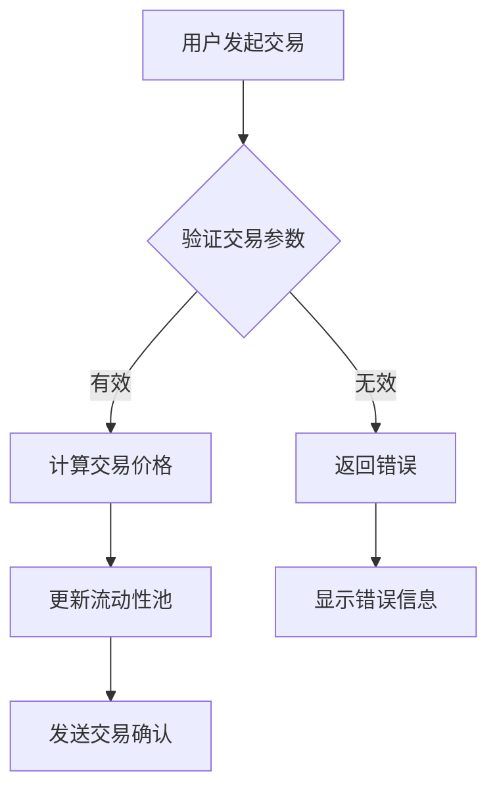
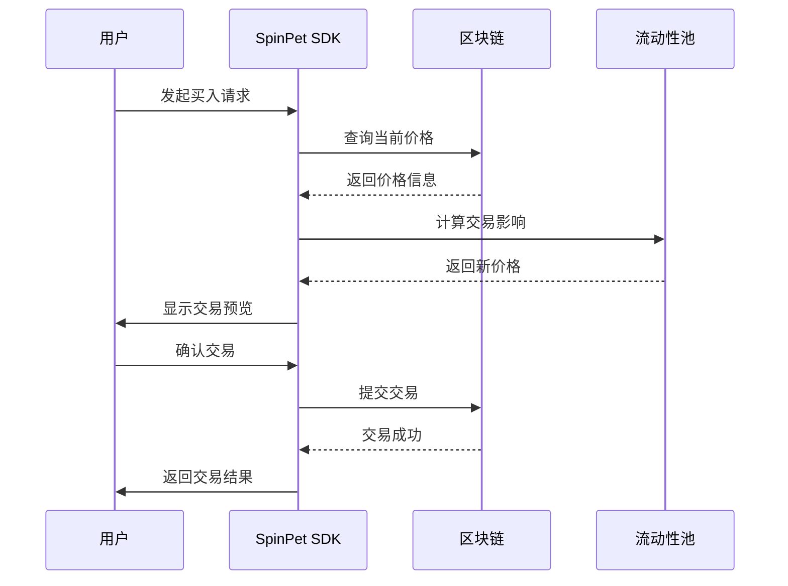
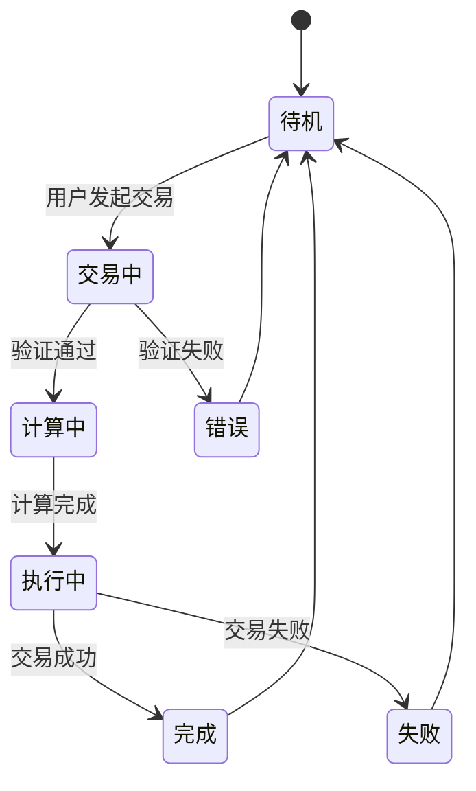

# 数学公式与图表示例

## 概述

本文档展示如何在 Markdown 中使用数学公式和图表，特别适用于 Docsify 文档系统。

## 数学公式

### 行内公式

价格计算公式：$P = \frac{S \cdot R}{L + S}$，其中 $S$ 是供应量，$R$ 是储备金，$L$ 是流动性。

### 块级公式

#### 二次函数

$$f(x) = ax^2 + bx + c$$

其中：
- $a \neq 0$（二次项系数）  
- $b$（一次项系数）
- $c$（常数项）

#### AMM 价格公式

自动做市商 (AMM) 的价格计算：

$$Price = \frac{Reserve_Y}{Reserve_X}$$

恒定乘积公式：
$$x \times y = k$$

当用户交易 $\Delta x$ 数量的代币时，新的价格为：

$$Price_{new} = \frac{Reserve_Y - \Delta y}{Reserve_X + \Delta x}$$

#### 积分与导数

$$\int_{0}^{\infty} e^{-x^2} dx = \frac{\sqrt{\pi}}{2}$$

$$\frac{d}{dx}[\ln(x)] = \frac{1}{x}$$

## 图表示例

### Mermaid 流程图



### 序列图



### 状态图



## 复杂公式示例

### 期权定价模型 (Black-Scholes)

$$C = S_0 \cdot N(d_1) - K \cdot e^{-rT} \cdot N(d_2)$$

其中：
$$d_1 = \frac{\ln(\frac{S_0}{K}) + (r + \frac{\sigma^2}{2})T}{\sigma\sqrt{T}}$$

$$d_2 = d_1 - \sigma\sqrt{T}$$

### 矩阵运算

$$\begin{pmatrix}
a & b \\
c & d
\end{pmatrix} \times \begin{pmatrix}
x \\
y
\end{pmatrix} = \begin{pmatrix}
ax + by \\
cx + dy
\end{pmatrix}$$

### 求和与连乘

$$\sum_{i=1}^{n} i^2 = \frac{n(n+1)(2n+1)}{6}$$

$$\prod_{i=1}^{n} i = n!$$

## 表格数据

| 交易类型 | 手续费率 | 滑点影响 | 风险等级 |
|---------|---------|---------|---------|
| 现货买入 | 0.3% | 低 | 🟢 低 |
| 现货卖出 | 0.3% | 低 | 🟢 低 |
| 多头开仓 | 0.5% | 中 | 🟡 中 |
| 空头开仓 | 0.5% | 中 | 🟡 中 |
| 强制清算 | 1.0% | 高 | 🔴 高 |

## 代码块示例

### JavaScript 计算示例

```javascript
// AMM 价格计算函数
function calculatePrice(reserveX, reserveY, amountIn, isXToY) {
    if (isXToY) {
        const amountOut = (reserveY * amountIn) / (reserveX + amountIn);
        return amountOut / amountIn;
    } else {
        const amountOut = (reserveX * amountIn) / (reserveY + amountIn);
        return amountIn / amountOut;
    }
}

// 使用示例
const price = calculatePrice(1000, 2000, 100, true);
console.log(`价格: ${price}`);
```

### 数学计算

```python
import math

def black_scholes_call(S, K, T, r, sigma):
    """
    Black-Scholes 看涨期权定价
    """
    d1 = (math.log(S / K) + (r + 0.5 * sigma ** 2) * T) / (sigma * math.sqrt(T))
    d2 = d1 - sigma * math.sqrt(T)
    
    call_price = S * norm_cdf(d1) - K * math.exp(-r * T) * norm_cdf(d2)
    return call_price
```

## 总结

这个示例文档展示了：
- ✅ 各种数学公式语法
- ✅ Mermaid 图表（流程图、序列图、状态图）
- ✅ 表格和代码块
- ✅ 中文内容支持

在 Docsify 中，数学公式需要添加 KaTeX 插件支持，图表需要 Mermaid 插件。