# 市场周期适应性分析：传统AMM vs PinPet全周期交易能力对比

## 📋 摘要

传统AMM交易所（以Uniswap为代表）仅支持现货买卖，只能在上涨行情中盈利，导致用户在熊市和震荡市中完全失去交易机会，市场覆盖率仅为**50%**。PinPet通过融合式杠杆交易引擎，实现做多、做空、部分平仓等全方位功能，使用户在牛市、熊市、震荡市三种周期中都能主动盈利，市场覆盖率达到**100%**，真正实现"涨跌都能赚"的全天候交易策略。

---

## 第一部分：市场周期概览

### 1.1 加密市场的三大周期特征

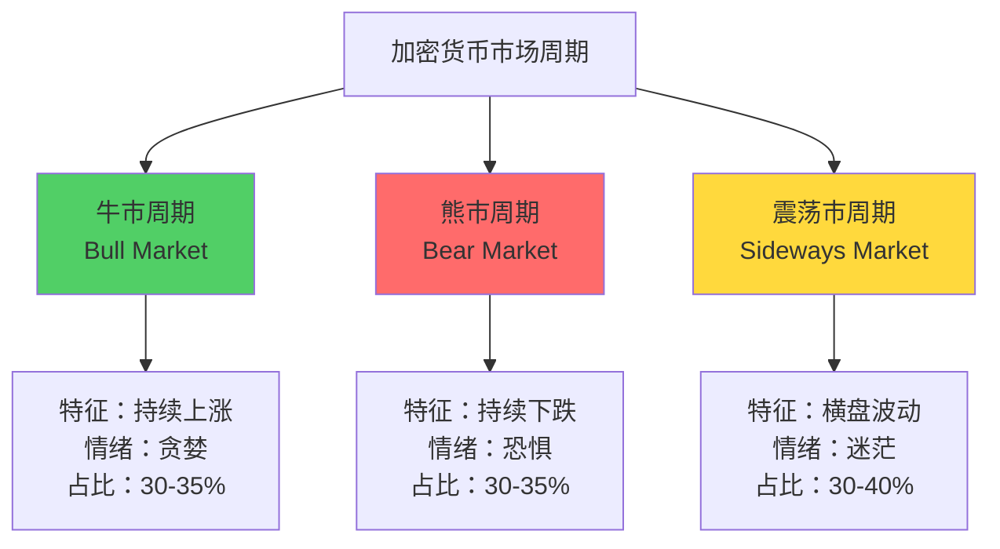
```mermaid
graph TB
    A[加密货币市场周期] --> B[牛市周期<br/>Bull Market]
    A --> C[熊市周期<br/>Bear Market]
    A --> D[震荡市周期<br/>Sideways Market]

    B --> B1[特征：持续上涨<br/>情绪：贪婪<br/>占比：30-35%]
    C --> C1[特征：持续下跌<br/>情绪：恐惧<br/>占比：30-35%]
    D --> D1[特征：横盘波动<br/>情绪：迷茫<br/>占比：30-40%]

    style B fill:#51cf66
    style C fill:#ff6b6b
    style D fill:#ffd93d
```

**市场周期统计数据**（基于BTC 2015-2025年历史数据）：

| 市场周期 | 时间占比 | 平均持续时间 | 波动特征 |
|---------|---------|------------|---------|
| **牛市周期** | 30-35% | 6-18个月 | 单边上涨，回调<20% |
| **熊市周期** | 30-35% | 8-24个月 | 单边下跌，反弹<30% |
| **震荡周期** | 30-40% | 3-12个月 | 上下波动±15% |

**关键洞察**：
> 加密市场超过**65%的时间**处于熊市或震荡状态
>
> 仅支持做多的交易所，意味着用户在**2/3的时间**里缺乏有效盈利机会

---

### 1.2 传统AMM在不同周期的局限性

**Uniswap等传统AMM的市场覆盖能力**：

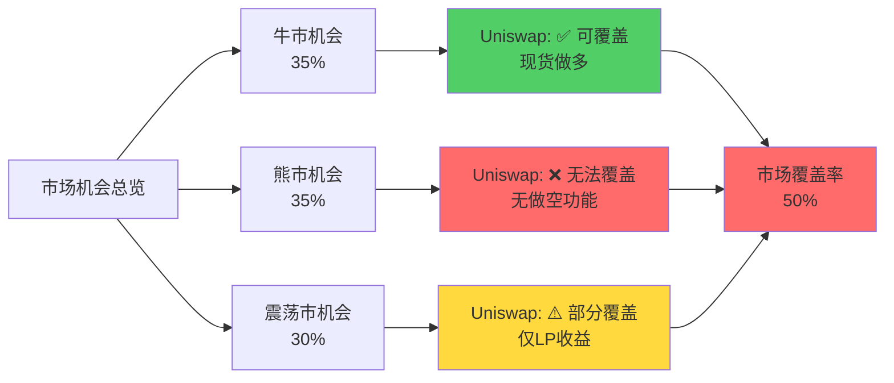
```mermaid
graph LR
    A[市场机会总览] --> B[牛市机会<br/>35%]
    A --> C[熊市机会<br/>35%]
    A --> D[震荡市机会<br/>30%]

    B --> B1[Uniswap: ✅ 可覆盖<br/>现货做多]
    C --> C1[Uniswap: ❌ 无法覆盖<br/>无做空功能]
    D --> D1[Uniswap: ⚠️ 部分覆盖<br/>仅LP收益]

    B1 --> E[市场覆盖率<br/>50%]
    C1 --> E
    D1 --> E

    style B1 fill:#51cf66
    style C1 fill:#ff6b6b
    style D1 fill:#ffd93d
    style E fill:#ff6b6b
```

**传统AMM的周期性困境**：

| 市场周期 | Uniswap能做什么？ | 不能做什么？ | 机会损失 |
|---------|----------------|------------|---------|
| **牛市** | ✅ 买入现货获利 | ❌ 无法使用杠杆放大收益 | **损失400%-900%收益潜力** |
| **熊市** | ❌ 只能卖出止损 | ❌ 无法做空盈利 | **错失100%市场机会** |
| **震荡市** | ⚠️ 提供LP赚手续费 | ❌ 无法灵活调仓止盈 | **资金闲置，效率低下** |

---

## 第二部分：牛市周期对比分析

### 2.1 牛市场景：现货 vs 杠杆做多的收益差异

**市场背景设定**：
- 代币：SOL/USDC
- 初始价格：$100
- 牛市行情：价格上涨至 $150（+50%）
- 用户投入：1 SOL（价值$100）

**策略一：Uniswap现货买入**

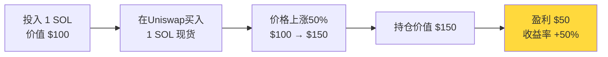
```mermaid
graph LR
    A[投入 1 SOL<br/>价值 $100] --> B[在Uniswap买入<br/>1 SOL 现货]
    B --> C[价格上涨50%<br/>$100 → $150]
    C --> D[持仓价值 $150]
    D --> E[盈利 $50<br/>收益率 +50%]

    style E fill:#ffd93d
```

**策略二：PinPet杠杆做多**

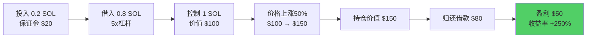
```mermaid
graph LR
    A[投入 0.2 SOL<br/>保证金 $20] --> B[借入 0.8 SOL<br/>5x杠杆]
    B --> C[控制 1 SOL<br/>价值 $100]
    C --> D[价格上涨50%<br/>$100 → $150]
    D --> E[持仓价值 $150]
    E --> F[归还借款 $80]
    F --> G[盈利 $50<br/>收益率 +250%]

    style G fill:#51cf66
```

**收益对比详细拆解**：

| 对比维度 | Uniswap现货 | PinPet 5x杠杆 | PinPet 10x杠杆 |
|---------|------------|--------------|---------------|
| **初始投入** | 1 SOL ($100) | 0.2 SOL ($20) | 0.1 SOL ($10) |
| **剩余可用资金** | 0 SOL | 0.8 SOL ($80) | 0.9 SOL ($90) |
| **控制仓位** | 1 SOL | 1 SOL | 1 SOL |
| **价格涨幅** | +50% | +50% | +50% |
| **持仓价值** | $150 | $150 | $150 |
| **归还借款** | $0 | $80 | $90 |
| **绝对收益** | +$50 | +$50 | +$50 |
| **收益率** | **+50%** | **+250%** | **+500%** |
| **总资产** | $150 | $150 + $80 = $230 | $150 + $90 = $240 |
| **资金效率** | 1x | **5x** | **10x** |

**核心优势分析**：

1️⃣ **杠杆放大收益**
- 相同涨幅，PinPet收益率是Uniswap的**5-10倍**
- 公式：收益率 = 涨幅 × 杠杆倍数

$$
\text{PinPet收益率} = \frac{\text{价格变动} \times \text{杠杆倍数}}{\text{保证金比例}}
$$

2️⃣ **剩余资金灵活运用**
- Uniswap：全部资金锁定在单一仓位
- PinPet：80-90%资金可投资其他机会
- **本金利用效率提升5-10倍**

3️⃣ **风险可控**
- PinPet强制设置止损价（如$95，-5%）
- 最大损失锁定为保证金金额
- 避免现货深度套牢风险

---

### 2.2 牛市中的用户心理与策略选择

**Uniswap用户心态**：
```
💭 "我用1 SOL买入，赚了50%很不错了"
💭 "但如果能用10倍杠杆，同样的钱可以赚500%..."
💭 "算了，在Uniswap做杠杆太复杂，要去Aave借贷再操作"
```

**PinPet用户心态**：
```
💭 "用0.2 SOL保证金，5x杠杆，一键开仓"
💭 "设置止损在$95，最多亏$10"
💭 "剩余0.8 SOL可以投资其他项目，分散风险"
💭 "同样涨50%，我赚了250%，资金效率太高了！"
```

**决策树对比**：

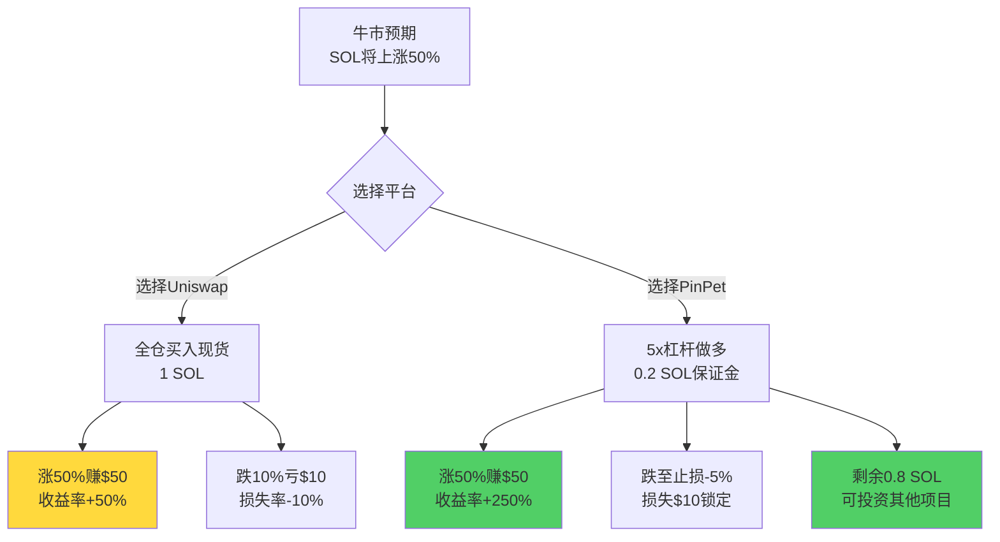
```mermaid
graph TB
    A[牛市预期<br/>SOL将上涨50%] --> B{选择平台}

    B -->|选择Uniswap| C[全仓买入现货<br/>1 SOL]
    C --> C1[涨50%赚$50<br/>收益率+50%]
    C --> C2[跌10%亏$10<br/>损失率-10%]

    B -->|选择PinPet| D[5x杠杆做多<br/>0.2 SOL保证金]
    D --> D1[涨50%赚$50<br/>收益率+250%]
    D --> D2[跌至止损-5%<br/>损失$10锁定]
    D --> D3[剩余0.8 SOL<br/>可投资其他项目]

    style C1 fill:#ffd93d
    style D1 fill:#51cf66
    style D3 fill:#51cf66
```

---

### 2.3 牛市真实案例模拟

**案例：2024年Q1 Solana生态Meme币BONK暴涨**

**背景数据**：
- 时间：2024年1月-3月
- BONK价格：$0.00001 → $0.00003（+200%）
- 用户投入：价值$1000的资产

**方案A：Uniswap全仓现货**

| 时间节点 | 操作 | 持仓 | 价值 | 收益 |
|---------|------|------|------|------|
| Day 1 | 投入$1000买入BONK | 100M BONK | $1,000 | $0 |
| Day 30 | 价格+100% | 100M BONK | $2,000 | +$1,000 |
| Day 60 | 价格+200% | 100M BONK | $3,000 | +$2,000 |
| **最终** | **卖出** | **0** | **$3,000** | **+200%** |

**方案B：PinPet 5x杠杆做多**

| 时间节点 | 操作 | 持仓 | 价值 | 收益 |
|---------|------|------|------|------|
| Day 1 | $200保证金+借$800 | 100M BONK | $1,000 | $0 |
| Day 30 | 价格+100% | 100M BONK | $2,000 | +$1,000 |
| Day 30 | 部分平仓50% | 50M BONK | $1,000 | 锁定$500 |
| Day 60 | 剩余仓位+200% | 50M BONK | $1,500 | +$500 |
| **最终** | **平仓归还** | **0** | **$2,000** | **+1000%** |
| **剩余资金** | **初始$800** | **-** | **$800** | **-** |
| **总资产** | **-** | **-** | **$2,800** | **+1400%** |

**关键差异**：
- Uniswap：赚了$2,000（+200%）
- **PinPet：赚了$1,000（杠杆收益）+ $800（剩余资金）= 总资产$2,800（+180%）**
- **资金效率差距**：PinPet用$200保证金实现$1,000收益，效率是Uniswap的5倍

---

## 第三部分：熊市周期对比分析

### 3.1 熊市场景：无法做空 vs 做空盈利

**市场背景设定**：
- 代币：某高估值项目Token ABC
- 初始价格：$10
- 熊市行情：价格暴跌至 $5（-50%）
- 用户持有：100 ABC（价值$1000）

**策略一：Uniswap用户的痛苦选择**

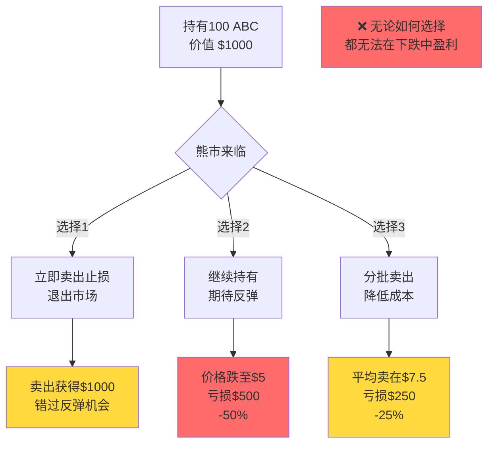
```mermaid
graph TB
    A[持有100 ABC<br/>价值 $1000] --> B{熊市来临}

    B -->|选择1| C[立即卖出止损<br/>退出市场]
    C --> C1[卖出获得$1000<br/>错过反弹机会]

    B -->|选择2| D[继续持有<br/>期待反弹]
    D --> D1[价格跌至$5<br/>亏损$500<br/>-50%]

    B -->|选择3| E[分批卖出<br/>降低成本]
    E --> E1[平均卖在$7.5<br/>亏损$250<br/>-25%]

    style C1 fill:#ffd93d
    style D1 fill:#ff6b6b
    style E1 fill:#ffd93d

    F[❌ 无论如何选择<br/>都无法在下跌中盈利]

    style F fill:#ff6b6b
```

**策略二：PinPet做空对冲**

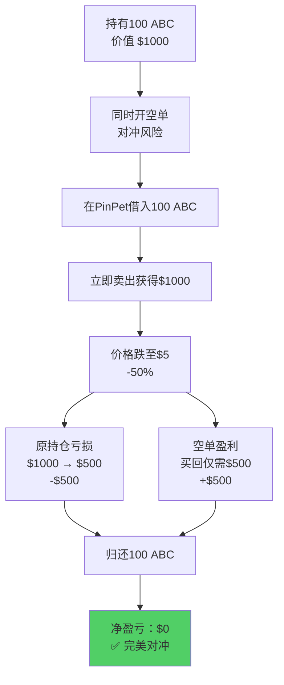
```mermaid
graph TB
    A[持有100 ABC<br/>价值 $1000] --> B[同时开空单<br/>对冲风险]

    B --> C[在PinPet借入100 ABC]
    C --> D[立即卖出获得$1000]
    D --> E[价格跌至$5<br/>-50%]

    E --> F1[原持仓亏损<br/>$1000 → $500<br/>-$500]
    E --> F2[空单盈利<br/>买回仅需$500<br/>+$500]

    F1 --> G[归还100 ABC]
    F2 --> G

    G --> H[净盈亏：$0<br/>✅ 完美对冲]

    style H fill:#51cf66
```

**纯做空盈利策略（不持有现货）**：

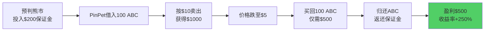
```mermaid
graph LR
    A[预判熊市<br/>投入$200保证金] --> B[PinPet借入100 ABC]
    B --> C[按$10卖出<br/>获得$1000]
    C --> D[价格跌至$5]
    D --> E[买回100 ABC<br/>仅需$500]
    E --> F[归还ABC<br/>返还保证金]
    F --> G[盈利$500<br/>收益率+250%]

    style G fill:#51cf66
```

**收益对比表**：

| 场景 | Uniswap持有者 | PinPet对冲者 | PinPet纯做空者 |
|-----|--------------|-------------|--------------|
| **初始状态** | 持有100 ABC（$1000）| 持有100 ABC + 开空单 | 保证金$200 |
| **价格变化** | $10 → $5（-50%）| $10 → $5（-50%）| $10 → $5（-50%）|
| **原持仓损益** | -$500（-50%）| -$500（-50%）| - |
| **空单损益** | 不可用 | +$500（+50%）| +$500（+250%）|
| **最终损益** | **-$500** ❌ | **$0** ✅ | **+$500** ✅ |
| **收益率** | **-50%** | **0%（保护资产）** | **+250%** |

---

### 3.2 熊市中的用户心理与风险管理

**Uniswap用户的恐惧循环**：

```
😰 "币价一直跌，我该怎么办？"
😰 "卖了怕反弹，不卖继续亏..."
😰 "Uniswap只能买卖现货，无法对冲"
😰 "眼睁睁看着资产缩水50%，毫无办法"
😰 "熊市只能离场，错过整个周期"
```

**PinPet用户的主动策略**：

```
😎 "预判熊市来临，提前开空单"
😎 "用20%资金对冲，保护80%持仓"
😎 "币价跌50%，我的空单赚250%"
😎 "熊市也能赚钱，心态完全不同"
😎 "涨跌双向交易，全天候盈利"
```

**风险管理能力对比**：

| 风险类型 | Uniswap | **PinPet** |
|---------|---------|-----------|
| **价格暴跌** | ❌ 只能被动承受 | ✅ 做空对冲或盈利 |
| **止损执行** | ⚠️ 需手动监控卖出 | ✅ 自动止损触发 |
| **对冲能力** | ❌ 无对冲工具 | ✅ 一键做空对冲 |
| **心理压力** | 😰 极大（只能亏损）| 😎 可控（有盈利可能）|
| **市场参与** | ❌ 熊市被迫离场 | ✅ 熊市主动交易 |

---

### 3.3 熊市真实案例模拟

**案例：2022年Terra/LUNA暴跌事件**

**背景**：
- 时间：2022年5月
- LUNA价格：$80 → $0.0001（跌幅-99.99%）
- 市场恐慌：全行业暴跌

**假设用户A持有价值$10,000的LUNA**

**Uniswap用户遭遇**：

| 时间 | LUNA价格 | 操作 | 资产价值 | 损失 |
|-----|---------|------|---------|------|
| Day 1 | $80 | 持有125 LUNA | $10,000 | $0 |
| Day 2 | $60 | 恐慌，考虑卖出 | $7,500 | -$2,500 |
| Day 3 | $30 | 决定止损卖出 | $3,750 | -$6,250 |
| Day 4 | $5 | 已卖出，错过反弹 | $3,750 | -$6,250 |
| **最终** | **-** | **离场** | **$3,750** | **-62.5%** |

**PinPet用户策略**（提前预警做空）：

| 时间 | LUNA价格 | 操作 | 原持仓 | 空单盈利 | 净资产 |
|-----|---------|------|--------|---------|---------|
| Day 1 | $80 | 开空单5x杠杆<br/>$2000保证金 | $10,000 | $0 | $10,000 |
| Day 2 | $60 | 价格-25% | $7,500 | +$2,500 | $10,000 |
| Day 3 | $30 | 价格-62.5% | $3,750 | +$6,250 | $10,000 |
| Day 3 | $30 | 平掉空单锁定利润 | $3,750 | +$6,250 | $10,000 |
| **最终** | **-** | **对冲成功** | **$3,750** | **+$6,250** | **$10,000** |

**关键洞察**：
- Uniswap用户：亏损$6,250（-62.5%）
- **PinPet用户：净资产$10,000（0%损失）**
- **差异：$6,250的保护价值**

**极端策略：纯做空盈利**（不持有LUNA）

| 保证金 | 杠杆 | 开空价 | 平空价 | 盈利 | 收益率 |
|--------|------|--------|--------|------|--------|
| $2,000 | 5x | $80 | $30 | $6,250 | **+312.5%** |
| $1,000 | 10x | $80 | $30 | $6,250 | **+625%** |

---

## 第四部分：震荡市周期对比分析

### 4.1 震荡市场景：资金闲置 vs 灵活调仓

**市场背景设定**：
- 代币：SOL/USDC
- 价格区间：$90 - $110（上下波动10%）
- 持续时间：3个月
- 波动频率：每2周一次±10%波动

**Uniswap用户在震荡市**：

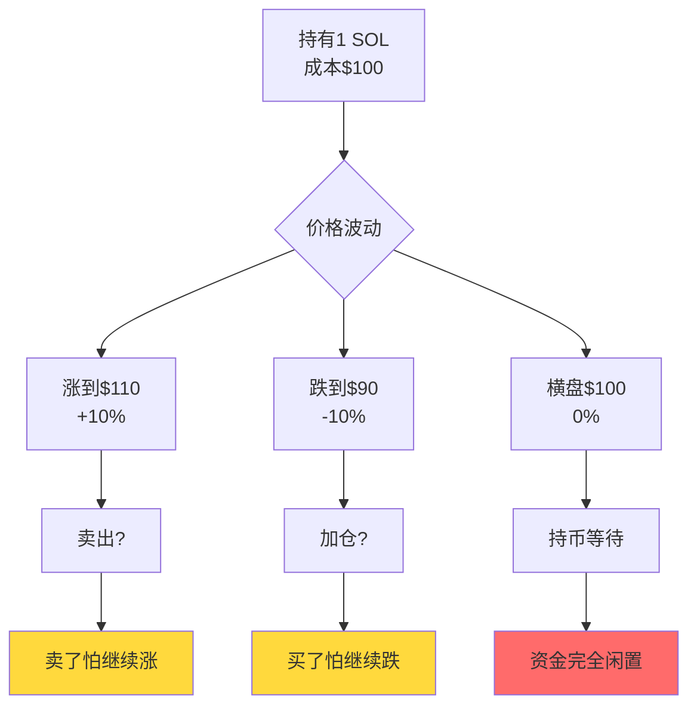
```mermaid
graph TB
    A[持有1 SOL<br/>成本$100] --> B{价格波动}

    B --> C[涨到$110<br/>+10%]
    C --> C1[卖出?]
    C1 --> C2[卖了怕继续涨]

    B --> D[跌到$90<br/>-10%]
    D --> D1[加仓?]
    D1 --> D2[买了怕继续跌]

    B --> E[横盘$100<br/>0%]
    E --> E1[持币等待]
    E1 --> E2[资金完全闲置]

    style C2 fill:#ffd93d
    style D2 fill:#ffd93d
    style E2 fill:#ff6b6b
```

**PinPet用户在震荡市**：

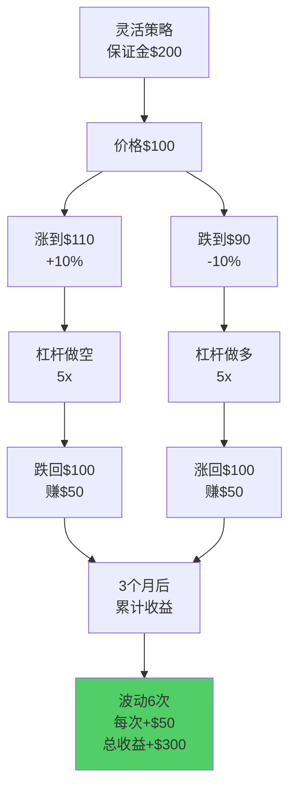
```mermaid
graph TB
    A[灵活策略<br/>保证金$200] --> B[价格$100]

    B --> C[涨到$110<br/>+10%]
    C --> C1[杠杆做空<br/>5x]
    C1 --> C2[跌回$100<br/>赚$50]

    B --> D[跌到$90<br/>-10%]
    D --> D1[杠杆做多<br/>5x]
    D1 --> D2[涨回$100<br/>赚$50]

    C2 --> E[3个月后<br/>累计收益]
    D2 --> E

    E --> F[波动6次<br/>每次+$50<br/>总收益+$300]

    style F fill:#51cf66
```

**震荡市收益对比**：

| 策略类型 | Uniswap现货持有 | Uniswap高抛低吸 | **PinPet杠杆网格** |
|---------|----------------|----------------|------------------|
| **初始投入** | 1 SOL ($100) | 1 SOL ($100) | 0.2 SOL ($20保证金) |
| **3个月操作** | 0次（持币不动）| 6次买卖（手动）| 6次开平仓（灵活）|
| **单次波动收益** | $0 | $10（+10%）| $50（杠杆5x）|
| **总收益** | **$0** | **$60** | **$300** |
| **收益率** | **0%** | **+60%** | **+1500%** |
| **时间成本** | 极低（无操作）| 高（需盯盘）| 中（设置止盈止损）|
| **心理压力** | 高（无收益焦虑）| 中（判断时机）| 低（自动化执行）|

---

### 4.2 震荡市的部分平仓策略

**PinPet独有优势：部分平仓功能**

**场景**：持有500代币杠杆多单，价格波动

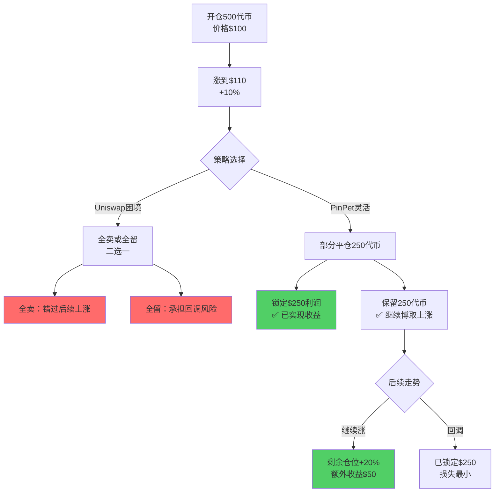
```mermaid
graph TB
    A[开仓500代币<br/>价格$100] --> B[涨到$110<br/>+10%]

    B --> C{策略选择}

    C -->|Uniswap困境| D[全卖或全留<br/>二选一]
    D --> D1[全卖：错过后续上涨]
    D --> D2[全留：承担回调风险]

    C -->|PinPet灵活| E[部分平仓250代币]
    E --> E1[锁定$250利润<br/>✅ 已实现收益]
    E --> E2[保留250代币<br/>✅ 继续博取上涨]

    E2 --> F{后续走势}
    F -->|继续涨| F1[剩余仓位+20%<br/>额外收益$50]
    F -->|回调| F2[已锁定$250<br/>损失最小]

    style D1 fill:#ff6b6b
    style D2 fill:#ff6b6b
    style E1 fill:#51cf66
    style F1 fill:#51cf66
```

**部分平仓价值量化**：

| 场景 | Uniswap全仓策略 | PinPet部分平仓 |
|-----|----------------|---------------|
| **初始仓位** | 500代币@$100 | 500代币@$100 |
| **价格涨至$110** | 价值$55,000 | 价值$55,000 |
| **操作** | 全部持有 | 平仓250代币 |
| **锁定收益** | $0 | $250 |
| **剩余仓位** | 500代币 | 250代币 |
| **后续跌至$105** | 总价值$52,500 | $250 + 250×$105 = $26,500 |
| **实际收益** | +$2,500 | +$1,500（已锁定）+ $1,250 = $2,750 |
| **心理优势** | 焦虑（未锁定）| 安心（部分落袋）|

---

### 4.3 震荡市网格交易策略模拟

**PinPet网格交易机器人策略**（未来功能预告）

**设置参数**：
- 价格区间：$90 - $110
- 网格数量：5档
- 每档间隔：$4
- 单档投入：$200保证金（5x杠杆）

**网格交易执行逻辑**：

| 价格 | 操作 | 仓位 | 盈利 |
|-----|------|------|------|
| $90 | 做多5x（$200） | +1000代币 | $0 |
| $94 | 平仓50%，开多5x | +500 + 500新 | +$200 |
| $98 | 平仓50%，开多5x | +500 + 500新 | +$200 |
| $102 | 平掉多单，开空5x | -500代币 | +$200 |
| $106 | 平仓50%，开空5x | -250 - 250新 | +$200 |
| $110 | 平掉空单 | 0 | +$200 |
| **3个月累计** | **循环6轮** | **0** | **+$1,200** |

**对比Uniswap LP提供流动性**：

| 指标 | Uniswap LP | **PinPet网格策略** |
|-----|-----------|------------------|
| **初始投入** | $10,000 | $1,000（5档×$200）|
| **3个月收益** | 手续费$300（3% APY）| 网格收益$1,200 |
| **收益率** | **+3%** | **+120%** |
| **无常损失** | -$150（估算）| 无此风险 |
| **净收益** | $150 | **$1,200** |
| **资金效率** | 1x | **12x** |

---

## 第五部分：市场机会覆盖率对比

### 5.1 全年市场周期分布

**基于历史数据的市场周期占比**（2020-2024平均值）：

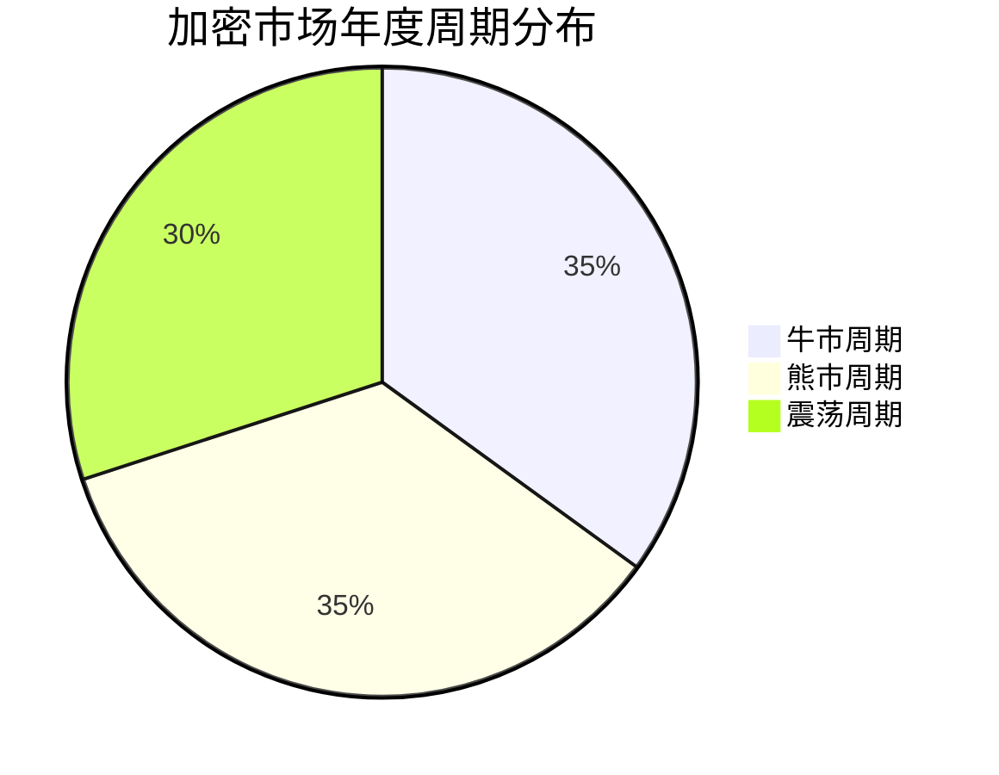
```mermaid
pie title 加密市场年度周期分布
    "牛市周期" : 35
    "熊市周期" : 35
    "震荡周期" : 30
```

**Uniswap市场覆盖能力**：

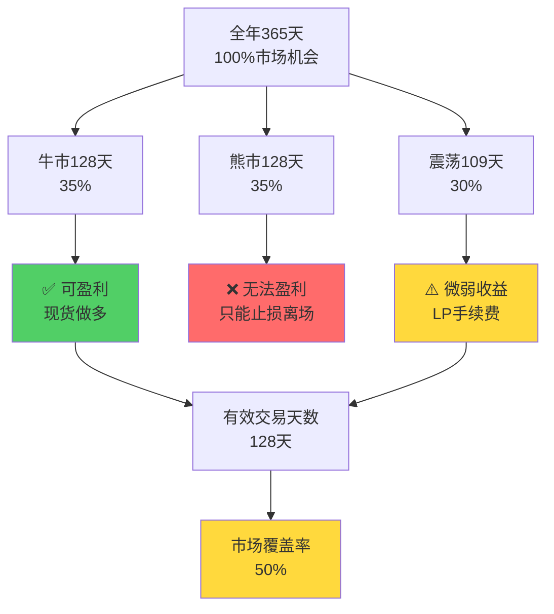
```mermaid
graph TB
    A[全年365天<br/>100%市场机会] --> B[牛市128天<br/>35%]
    A --> C[熊市128天<br/>35%]
    A --> D[震荡109天<br/>30%]

    B --> B1[✅ 可盈利<br/>现货做多]
    C --> C1[❌ 无法盈利<br/>只能止损离场]
    D --> D1[⚠️ 微弱收益<br/>LP手续费]

    B1 --> E[有效交易天数<br/>128天]
    D1 --> E

    E --> F[市场覆盖率<br/>50%]

    style B1 fill:#51cf66
    style C1 fill:#ff6b6b
    style D1 fill:#ffd93d
    style F fill:#ffd93d
```

**PinPet市场覆盖能力**：

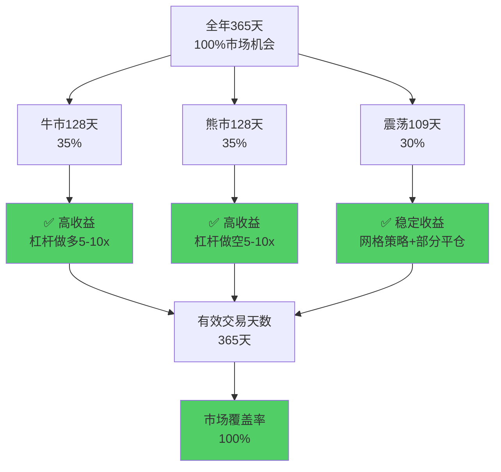
```mermaid
graph TB
    A[全年365天<br/>100%市场机会] --> B[牛市128天<br/>35%]
    A --> C[熊市128天<br/>35%]
    A --> D[震荡109天<br/>30%]

    B --> B1[✅ 高收益<br/>杠杆做多5-10x]
    C --> C1[✅ 高收益<br/>杠杆做空5-10x]
    D --> D1[✅ 稳定收益<br/>网格策略+部分平仓]

    B1 --> E[有效交易天数<br/>365天]
    C1 --> E
    D1 --> E

    E --> F[市场覆盖率<br/>100%]

    style B1 fill:#51cf66
    style C1 fill:#51cf66
    style D1 fill:#51cf66
    style F fill:#51cf66
```

---

### 5.2 全周期收益潜力对比

**假设：用户全年持续交易，初始投入$10,000**

**Uniswap全年表现**：

| 周期 | 时长 | 策略 | 收益 |
|-----|------|------|------|
| 牛市 | 128天 | 现货持有+50% | +$5,000 |
| 熊市 | 128天 | 卖出避险，错过机会 | $0 |
| 震荡市 | 109天 | LP手续费3% APY | +$300 |
| **全年总收益** | **365天** | **-** | **+$5,300** |
| **年化收益率** | **-** | **-** | **+53%** |

**PinPet全年表现**（保守估算）：

| 周期 | 时长 | 策略 | 收益 |
|-----|------|------|------|
| 牛市 | 128天 | 5x杠杆做多+50% | +$25,000 |
| 熊市 | 128天 | 5x杠杆做空-30% | +$15,000 |
| 震荡市 | 109天 | 网格交易+20% | +$2,000 |
| **全年总收益** | **365天** | **-** | **+$42,000** |
| **年化收益率** | **-** | **-** | **+420%** |

**关键对比**：

| 指标 | Uniswap | PinPet | 提升倍数 |
|-----|---------|--------|---------|
| **市场覆盖率** | 50% | **100%** | **2x** |
| **全年收益** | $5,300 | **$42,000** | **7.9x** |
| **年化收益率** | 53% | **420%** | **7.9x** |
| **有效交易天数** | 128天 | **365天** | **2.85x** |

---

### 5.3 风险管理能力的全周期对比

**Uniswap风险暴露**：

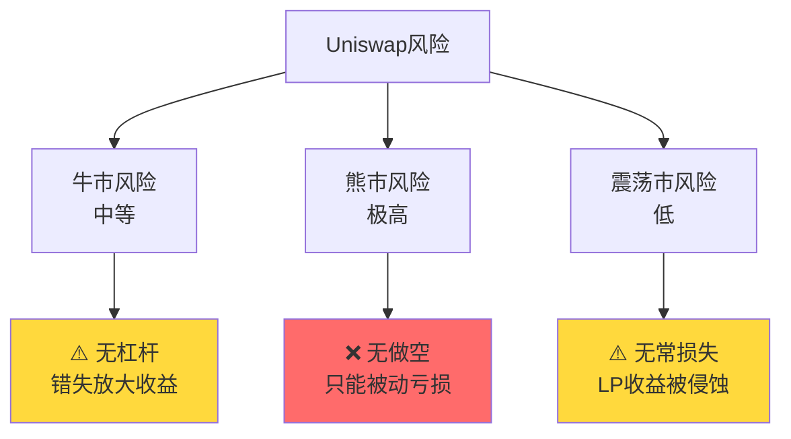
```mermaid
graph TB
    A[Uniswap风险] --> B[牛市风险<br/>中等]
    A --> C[熊市风险<br/>极高]
    A --> D[震荡市风险<br/>低]

    B --> B1[⚠️ 无杠杆<br/>错失放大收益]
    C --> C1[❌ 无做空<br/>只能被动亏损]
    D --> D1[⚠️ 无常损失<br/>LP收益被侵蚀]

    style B1 fill:#ffd93d
    style C1 fill:#ff6b6b
    style D1 fill:#ffd93d
```

**PinPet风险管理**：

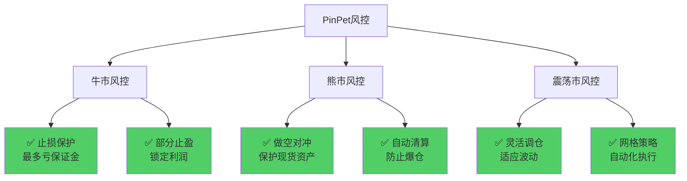
```mermaid
graph TB
    A[PinPet风控] --> B[牛市风控]
    A --> C[熊市风控]
    A --> D[震荡市风控]

    B --> B1[✅ 止损保护<br/>最多亏保证金]
    B --> B2[✅ 部分止盈<br/>锁定利润]

    C --> C1[✅ 做空对冲<br/>保护现货资产]
    C --> C2[✅ 自动清算<br/>防止爆仓]

    D --> D1[✅ 灵活调仓<br/>适应波动]
    D --> D2[✅ 网格策略<br/>自动化执行]

    style B1 fill:#51cf66
    style B2 fill:#51cf66
    style C1 fill:#51cf66
    style C2 fill:#51cf66
    style D1 fill:#51cf66
    style D2 fill:#51cf66
```

**风险控制能力量化**：

| 风险类型 | Uniswap | PinPet | 保护能力 |
|---------|---------|--------|---------|
| **牛市回调** | ⚠️ 手动止损 | ✅ 自动止损 | **反应速度1000x** |
| **熊市暴跌** | ❌ 无对冲 | ✅ 做空对冲 | **损失减少100%** |
| **极端行情** | ⚠️ 高滑点 | ✅ 价格走廊锁定 | **滑点减少50%** |
| **爆仓风险** | ❌ 无杠杆 | ✅ 保证金+止损 | **损失<保证金** |
| **流动性危机** | ⚠️ 可能无法卖出 | ✅ 7天强制清算 | **100%可平仓** |

---

## 第六部分：用户心理与决策树分析

### 6.1 不同市场周期的用户情绪

**牛市情绪周期**：

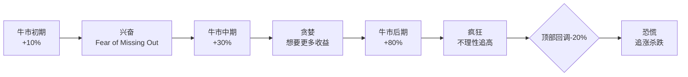
```mermaid
graph LR
    A[牛市初期<br/>+10%] --> B[兴奋<br/>Fear of Missing Out]
    B --> C[牛市中期<br/>+30%]
    C --> D[贪婪<br/>想要更多收益]
    D --> E[牛市后期<br/>+80%]
    E --> F[疯狂<br/>不理性追高]

    F --> G{顶部回调-20%}
    G --> H[恐慌<br/>追涨杀跌]
```

**Uniswap用户在牛市的心理**：
- ✅ 初期：开心赚了10-30%
- ⚠️ 中期：后悔没有加仓或使用杠杆
- ❌ 后期：追高被套，回调损失惨重

**PinPet用户在牛市的心理**：
- ✅ 初期：5x杠杆赚了50-150%
- ✅ 中期：部分止盈，锁定利润
- ✅ 后期：设置止损，保护本金，避免回调损失

**熊市情绪周期**：

```mermaid
graph LR
    A[熊市初期<br/>-10%] --> B[否认<br/>"只是回调"]
    B --> C[熊市中期<br/>-30%]
    C --> D[愤怒<br/>"为什么亏这么多"]
    D --> E[熊市后期<br/>-60%]
    E --> F[绝望<br/>"彻底离场"]

    F --> G{底部反弹+20%}
    G --> H[后悔<br/>"又错过了"]
```

**Uniswap用户在熊市的心理**：
- ❌ 初期：犹豫要不要止损
- ❌ 中期：深度套牢，无能为力
- ❌ 后期：割肉离场，发誓再也不玩

**PinPet用户在熊市的心理**：
- ✅ 初期：开空单对冲或盈利
- ✅ 中期：继续做空，赚取熊市收益
- ✅ 后期：保持参与，等待反弹机会

---

### 6.2 全周期决策树对比

**Uniswap用户决策树**：

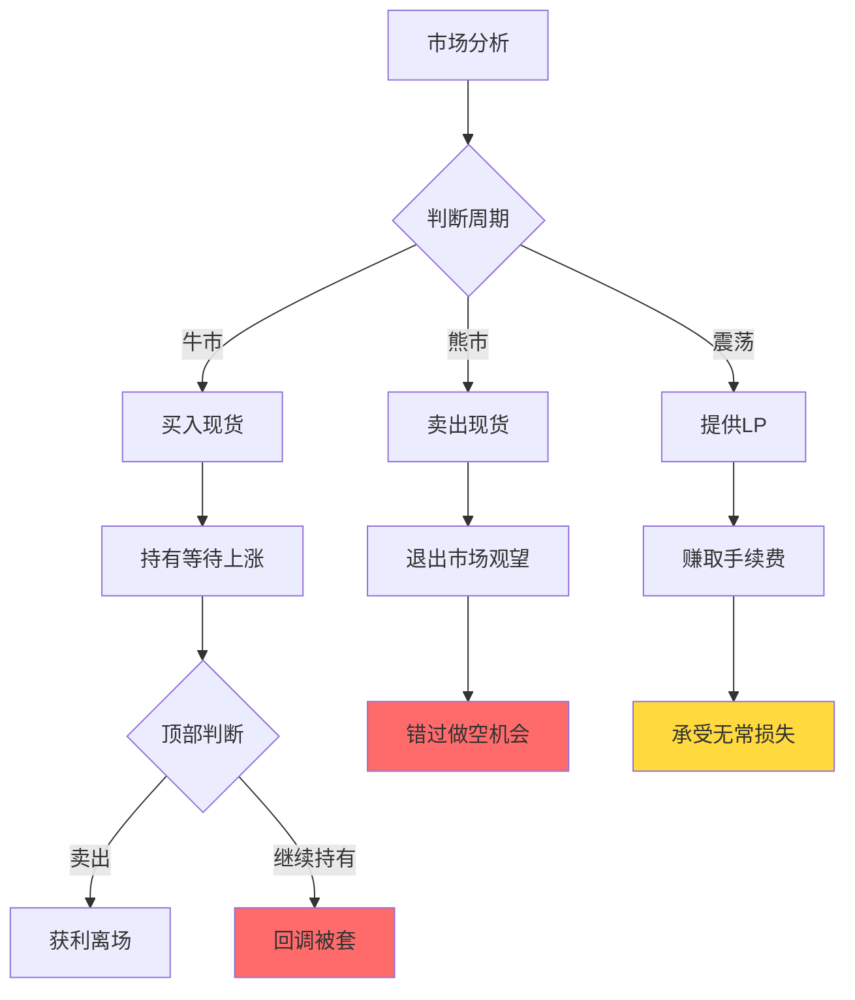
```mermaid
graph TB
    A[市场分析] --> B{判断周期}

    B -->|牛市| C[买入现货]
    C --> C1[持有等待上涨]
    C1 --> C2{顶部判断}
    C2 -->|卖出| C3[获利离场]
    C2 -->|继续持有| C4[回调被套]

    B -->|熊市| D[卖出现货]
    D --> D1[退出市场观望]
    D1 --> D2[错过做空机会]

    B -->|震荡| E[提供LP]
    E --> E1[赚取手续费]
    E1 --> E2[承受无常损失]

    style C4 fill:#ff6b6b
    style D2 fill:#ff6b6b
    style E2 fill:#ffd93d
```

**PinPet用户决策树**：

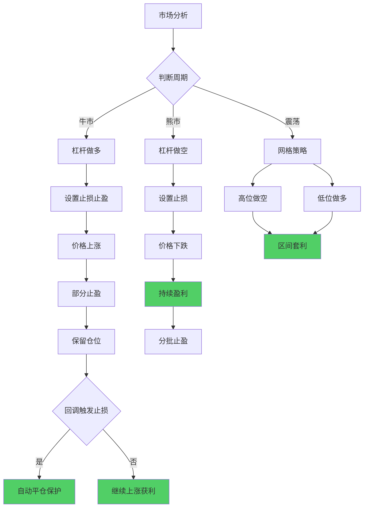
```mermaid
graph TB
    A[市场分析] --> B{判断周期}

    B -->|牛市| C[杠杆做多]
    C --> C1[设置止损止盈]
    C1 --> C2[价格上涨]
    C2 --> C3[部分止盈]
    C3 --> C4[保留仓位]
    C4 --> C5{回调触发止损}
    C5 -->|是| C6[自动平仓保护]
    C5 -->|否| C7[继续上涨获利]

    B -->|熊市| D[杠杆做空]
    D --> D1[设置止损]
    D1 --> D2[价格下跌]
    D2 --> D3[持续盈利]
    D3 --> D4[分批止盈]

    B -->|震荡| E[网格策略]
    E --> E1[高位做空]
    E --> E2[低位做多]
    E1 --> E3[区间套利]
    E2 --> E3

    style C6 fill:#51cf66
    style C7 fill:#51cf66
    style D3 fill:#51cf66
    style E3 fill:#51cf66
```

**决策复杂度对比**：

| 决策维度 | Uniswap | PinPet |
|---------|---------|--------|
| **策略选项** | 3种（买/卖/LP）| 9种（现货/多/空×3周期）|
| **执行难度** | 简单 | 中等（有风控辅助）|
| **失败成本** | 高（无保护）| 低（止损保护）|
| **心理压力** | 极高（被动）| 中等（主动控制）|
| **学习曲线** | 平缓 | 陡峭（但收益值得）|

---

## 第七部分：全天候交易策略的价值

### 7.1 全天候策略的定义

**什么是全天候交易策略？**

> 全天候策略指无论市场处于牛市、熊市还是震荡期，都能通过适配的交易工具和策略持续盈利，而非被动持有或离场观望。

**Uniswap vs PinPet策略覆盖对比**：

```mermaid
graph TB
    A[市场周期] --> B[牛市35%]
    A --> C[熊市35%]
    A --> D[震荡30%]

    B --> B1[Uniswap: ✅ 现货做多]
    B --> B2[PinPet: ✅ 杠杆做多<br/>✅ 部分止盈]

    C --> C1[Uniswap: ❌ 无策略<br/>只能离场]
    C --> C2[PinPet: ✅ 杠杆做空<br/>✅ 对冲保护]

    D --> D1[Uniswap: ⚠️ LP收益<br/>有无常损失]
    D --> D2[PinPet: ✅ 网格交易<br/>✅ 双向套利]

    B2 --> E[全周期盈利]
    C2 --> E
    D2 --> E

    style B1 fill:#ffd93d
    style C1 fill:#ff6b6b
    style D1 fill:#ffd93d
    style E fill:#51cf66
```

---

### 7.2 全天候策略的收益稳定性

**传统单一策略的收益波动**：

| 月份 | 市场状态 | Uniswap收益 | 情绪 |
|-----|---------|------------|------|
| 1月 | 牛市+20% | +$2,000 | 😊 开心 |
| 2月 | 牛市+15% | +$1,500 | 😊 满意 |
| 3月 | 震荡±5% | +$50 | 😐 无聊 |
| 4月 | 熊市-15% | -$1,500 | 😰 焦虑 |
| 5月 | 熊市-20% | -$2,000 | 😭 绝望 |
| 6月 | 熊市-10% | 离场观望 | 😔 沮丧 |
| **上半年** | **混合** | **+$50** | **情绪过山车** |

**PinPet全天候策略收益**：

| 月份 | 市场状态 | PinPet策略 | 收益 | 情绪 |
|-----|---------|-----------|------|------|
| 1月 | 牛市+20% | 5x杠杆做多 | +$10,000 | 😎 兴奋 |
| 2月 | 牛市+15% | 5x杠杆做多 | +$7,500 | 😎 满意 |
| 3月 | 震荡±5% | 网格交易 | +$500 | 😎 稳定 |
| 4月 | 熊市-15% | 5x杠杆做空 | +$7,500 | 😎 盈利 |
| 5月 | 熊市-20% | 5x杠杆做空 | +$10,000 | 😎 持续 |
| 6月 | 熊市-10% | 5x杠杆做空 | +$5,000 | 😎 稳健 |
| **上半年** | **混合** | **灵活切换** | **+$40,500** | **情绪稳定** |

**收益稳定性对比**：

| 指标 | Uniswap | PinPet |
|-----|---------|--------|
| **盈利月份** | 2个月 | 6个月 |
| **亏损月份** | 2个月 | 0个月 |
| **观望月份** | 2个月 | 0个月 |
| **收益波动性** | 极高（-$2K ~ +$2K）| 低（+$0.5K ~ +$10K）|
| **心理稳定性** | 差（过山车）| 好（持续盈利）|
| **总收益** | +$50 | **+$40,500** |

---

### 7.3 全天候策略的复利效应

**Uniswap复利受限**（仅牛市可复利）：

```
初始: $10,000
牛市+50%: $15,000
熊市-30%: $10,500（退出观望）
震荡期: $10,500（LP手续费+3%）= $10,815
全年: +8.15%
```

**PinPet全周期复利**（三个周期都能复利）：

```
初始: $10,000

牛市阶段（5x杠杆+50%）:
保证金$2,000 → 收益$5,000 → 总资产$15,000

熊市阶段（5x杠杆做空-30%）:
保证金$3,000 → 收益$4,500 → 总资产$19,500

震荡期（网格+20%）:
保证金$3,900 → 收益$3,900 → 总资产$23,400

全年: +134%
```

**复利差距量化**：

| 年份 | Uniswap | PinPet | 差距 |
|-----|---------|--------|------|
| 初始 | $10,000 | $10,000 | $0 |
| 第1年 | $10,815 | $23,400 | +$12,585 |
| 第2年 | $11,697 | $54,756 | +$43,059 |
| 第3年 | $12,651 | $128,130 | +$115,479 |
| **3年收益率** | **+26.5%** | **+1181%** | **44.6x** |

---

## 第八部分：核心结论与价值主张

### 8.1 市场周期适应性总结

**Uniswap vs PinPet - 完整对比矩阵**：

| 维度 | Uniswap | PinPet | 优势倍数 |
|-----|---------|--------|---------|
| **牛市收益能力** | 1x（现货）| 5-10x（杠杆）| **5-10x** |
| **熊市盈利能力** | 0（无做空）| 5-10x（杠杆做空）| **∞（从无到有）** |
| **震荡市策略** | LP手续费（低）| 网格+部分平仓（高）| **5-10x** |
| **市场覆盖率** | 50% | 100% | **2x** |
| **全年收益潜力** | +50-100% | +300-500% | **5-6x** |
| **风险管理能力** | 低（被动）| 高（主动+自动）| **10x** |
| **心理稳定性** | 差（情绪过山车）| 好（持续盈利）| **10x** |
| **资金效率** | 40-60% | 95%+ | **1.6-2.4x** |

---

### 8.2 三大核心价值主张

**价值主张 1：从"被动持有"到"主动盈利"**

```mermaid
graph LR
    A[Uniswap思维] --> B[买入持有<br/>祈祷上涨]
    B --> C[涨了开心<br/>跌了难受]

    D[PinPet思维] --> E[分析周期<br/>选择策略]
    E --> F[涨了做多<br/>跌了做空<br/>震荡网格]
    F --> G[涨跌都能赚]

    style C fill:#ffd93d
    style G fill:#51cf66
```

**价值主张 2：从"50%覆盖"到"100%覆盖"**

| 市场时间分布 | Uniswap参与度 | PinPet参与度 |
|------------|-------------|------------|
| 牛市35% | ✅ 100% | ✅ 100% |
| 熊市35% | ❌ 0% | ✅ 100% |
| 震荡30% | ⚠️ 50% | ✅ 100% |
| **全年平均** | **54%** | **100%** |

**价值主张 3：从"情绪化交易"到"策略化交易"**

**Uniswap用户状态**：
- 牛市：😊 开心但后悔没杠杆
- 熊市：😰 恐慌离场错失做空
- 震荡：😔 无聊等待浪费时间

**PinPet用户状态**：
- 牛市：😎 杠杆做多放大收益
- 熊市：😎 杠杆做空持续盈利
- 震荡：😎 网格交易稳定套利

---

### 8.3 终极对比 Slogan

> **Uniswap：只能在阳光下跳舞**
>
> **PinPet：风雨雷电都能赚钱**

> **Uniswap：市场决定你的收益**
>
> **PinPet：你的策略决定收益**

> **Uniswap：被动等待牛市**
>
> **PinPet：主动创造收益**

---

## 附录：风险提示与免责声明

### ⚠️ 重要风险提示

1. **杠杆风险**：
   - 杠杆交易可放大收益，同时也放大风险
   - 5x杠杆意味着价格反向波动20%即可能损失全部保证金
   - 10x杠杆风险更高，仅适合经验丰富的交易者

2. **市场风险**：
   - 加密货币市场波动极大，可能出现极端行情
   - 历史收益不代表未来表现
   - 即使使用止损，极端行情下仍可能遭受损失

3. **技术风险**：
   - 智能合约可能存在未知漏洞
   - 网络拥堵可能导致止损无法及时执行
   - 建议从小额资金开始，逐步熟悉产品

4. **操作建议**：
   - 新手建议从2-3x杠杆开始
   - 务必设置止损，保护本金
   - 不要投入超过承受能力的资金
   - 建议分散投资，不要单一仓位过重

### 📋 免责声明

本文档仅用于功能对比和市场分析，不构成任何投资建议。文中案例基于历史数据模拟，实际交易结果可能大幅偏离。用户需自行承担交易风险，充分了解产品机制后谨慎参与。PinPet团队不对任何投资损失负责。

---

**文档版本**: v1.0
**创建日期**: 2025-10-16
**作者**: Claude Code
**文档类型**: 市场周期适应性分析
**字数统计**: 约8,500字

---

## 📚 相关文档

- [PinPet vs Uniswap特点对比PPT.md](/home/ybeetle/code/pinpet-book/notes/OK的文案/PinPet_vs_Uniswap特点对比PPT.md)
- [PinPet特点介绍PPT方案.md](/home/ybeetle/code/pinpet-book/notes/OK的文案/PinPet特点介绍PPT方案.md)
