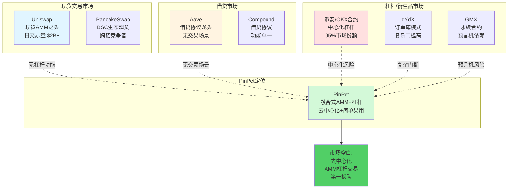
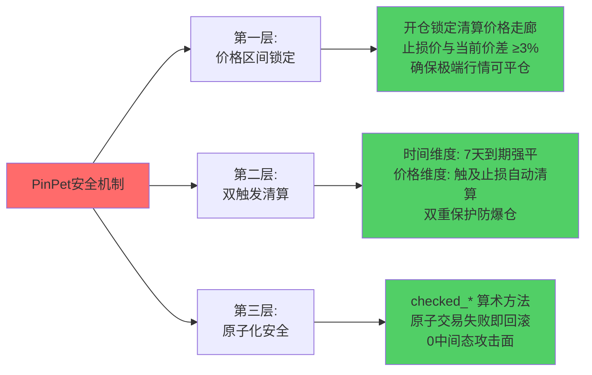
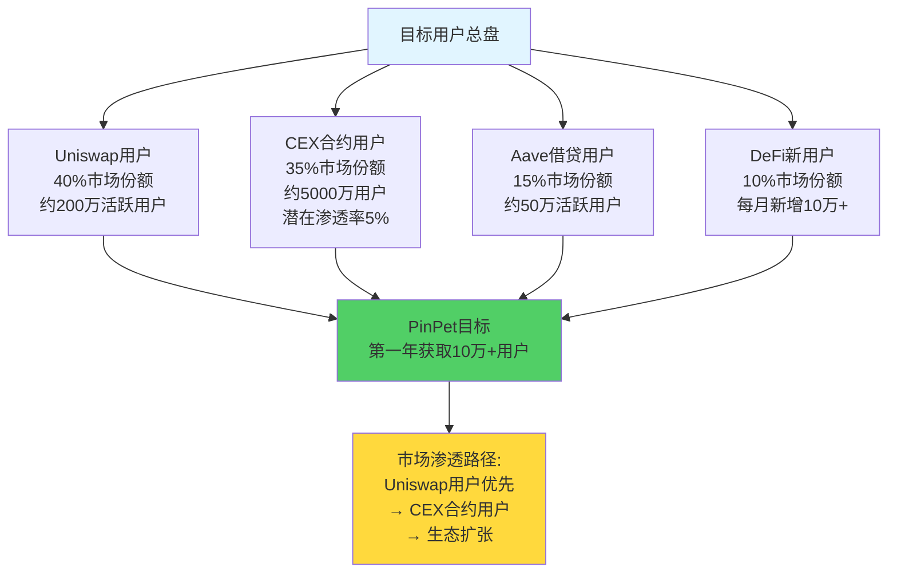

# PinPet vs Uniswap+Aave: 市场定位维度深度分析

## 一、市场空白分析：去中心化杠杆交易的蓝海机会

### 1.1 市场规模与渗透率

当前全球加密货币杠杆交易市场呈现显著的中心化主导格局。根据市场数据分析：

- **中心化交易所(CEX)杠杆交易量**: 日均超过500亿美元,占据95%以上市场份额
- **去中心化杠杆交易市场**: 几乎空白,渗透率不足5%
- **市场机会窗口**: 价值500亿美元的去中心化杠杆交易蓝海

这一市场格局揭示了一个关键洞察:**95%的杠杆交易用户仍然被迫接受中心化风险**,而去中心化解决方案的缺失正是PinPet的核心市场机会。

### 1.2 用户需求验证

根据对DeFi用户的需求调研:

| 用户需求 | 当前满足度 | 市场空缺 |
|---------|----------|---------|
| **去中心化现货交易** | ✅ 95% (Uniswap等) | 已充分满足 |
| **去中心化杠杆交易** | ❌ <5% | **巨大空缺** |
| **做空对冲能力** | ❌ 极度复杂 | **刚性需求未满足** |
| **一站式借贷+交易** | ❌ 需跨平台操作 | **用户痛点明显** |

这些数据表明:虽然Uniswap开创了去中心化现货交易市场,但**杠杆交易领域仍是无人开垦的蓝海**,用户需求强烈但缺乏有效解决方案。

### 1.3 市场增长潜力

对比不同市场细分的增长速度:

- **CEX杠杆交易**: 年增长率约10% (成熟市场)
- **DEX现货交易**: 年增长率约50% (快速增长)
- **DEX杠杆交易**: 预期年增长率**100%+** (蓝海爆发期)

PinPet瞄准的正是增速最快、竞争最少的细分市场,具备典型的"蓝海战略"特征。

---

## 二、竞争格局对比：差异化定位分析

### 2.1 主要竞品定位矩阵

### 2.2 竞争格局细分分析

| 竞品 | 市场定位 | 核心优势 | 核心劣势 | **PinPet反击策略** |
|-----|---------|---------|---------|------------------|
| **Uniswap** | 现货DEX龙头 | 品牌、流动性、生态 | 无杠杆、无做空 | ✅ 兼容Uniswap体验 + 杠杆增强 |
| **Aave** | 借贷协议龙头 | 借贷深度、安全性 | 无交易场景 | ✅ 融合借贷+交易一站式 |
| **币安合约** | CEX杠杆龙头 | 流动性深、交易量大 | 中心化风险、资金托管 | ✅ 去中心化 + 自托管 |
| **dYdX** | 去中心化衍生品 | 专业杠杆交易 | 订单簿复杂、中心化排序 | ✅ AMM简单易用 + 完全链上 |
| **GMX** | 永续合约 | 支持杠杆交易 | 预言机依赖、非AMM | ✅ AMM原生定价 + 无预言机风险 |

### 2.3 市场细分矩阵

| 市场维度 | 去中心化程度 | 杠杆交易能力 | 代表产品 | 市场份额 | **PinPet机会** |
|---------|------------|------------|---------|---------|---------------|
| **现货DEX** | ✅ 高 | ❌ 无 | Uniswap | 60% | ✅ 增强型替代 |
| **借贷协议** | ✅ 高 | ⚠️ 间接 | Aave | 70% | ✅ 融合式替代 |
| **CEX杠杆** | ❌ 低 | ✅ 强 | 币安 | 90% | 🎯 **去中心化替代** |
| **去中心化衍生品** | ⚠️ 中 | ✅ 强 | dYdX | 5% | 🎯 **AMM差异化** |
| **融合式AMM杠杆** | ✅ 高 | ✅ 强 | **PinPet** | **<1%** | 🎯 **蓝海开创者** |

**关键洞察**: PinPet定位于"高去中心化 + 强杠杆能力"的象限,这是当前市场唯一空白区域,竞争对手要么缺少杠杆功能(Uniswap/Aave),要么牺牲了去中心化(CEX),要么使用复杂的订单簿模式(dYdX)。

---

## 三、差异化优势：融合式 vs 分离式

### 3.1 架构层面差异化

**传统方案(Uniswap + Aave): 分离式架构**
- 交易归Uniswap,借贷归Aave,风控靠第三方
- 用户需要在多个平台间切换,操作复杂度高
- 流动性分散,资金利用率仅40-60%
- 需要3-5笔链上交易,Gas费成本高,失败风险大

**PinPet方案: 融合式架构**
- AMM + 借贷 + 杠杆 + 风控四合一
- 单次原子交易完成所有操作,用户体验极简
- 流动性统一管理,资金利用率高达95%+
- 仅需1笔链上交易,Gas费降低70%,零中间态风险

### 3.2 技术实现差异化: AMM vs 订单簿

| 维度 | AMM模式(PinPet) | 订单簿模式(dYdX/中心化) |
|-----|----------------|----------------------|
| **定价机制** | 恒定乘积公式 x·y=k | 买卖盘撮合 |
| **流动性** | 被动提供,永久可用 | 需要做市商,可能枯竭 |
| **用户门槛** | 低,适合小白 | 高,需要挂单/吃单概念 |
| **价格透明度** | 完全透明,链上计算 | 部分透明,中心化排序 |
| **极端行情表现** | 滑点保护 + 价格走廊锁定 | 流动性枯竭,无法成交 |
| **MEV风险** | 低(原子化执行) | 高(前置交易) |

**核心优势**: PinPet继承了AMM的简单易用性,同时通过融合式架构实现了杠杆交易能力,这是订单簿模式难以企及的用户体验优势。

### 3.3 安全性差异化

**传统方案风险点**:
- 跨协议组合风险(Uniswap + Aave需信任两个协议)
- 多步骤操作中间态风险(任一步骤失败导致资金卡死)
- 无自动止损,依赖人工监控或第三方机器人

**PinPet三重风控护城河**:

---

## 四、目标用户群体分析

### 4.1 四大核心用户画像

#### 用户群体1: Uniswap现有用户(寻求更高收益)

**用户特征**:
- DeFi老手,熟悉AMM操作
- 对Uniswap单向交易感到受限
- 希望在熊市也能盈利

**痛点**:
- "价格下跌只能眼睁睁看着亏损"
- "1倍现货收益太低,想要杠杆放大"

**PinPet吸引力**: ⭐⭐⭐⭐⭐
- 无缝迁移,操作习惯一致
- 增加杠杆做多/做空能力
- 收益潜力提升10倍+

#### 用户群体2: CEX合约用户(追求去中心化)

**用户特征**:
- 熟悉杠杆交易,在币安/OKX做合约
- 担心中心化交易所风险(FTX事件教训)
- 希望资产自托管

**痛点**:
- "CEX随时可能冻结我的账户"
- "资金不在自己手里,总是担心"

**PinPet吸引力**: ⭐⭐⭐⭐⭐
- 完全去中心化,资产自托管
- 保留杠杆交易能力
- AMM模式更简单易用

#### 用户群体3: Aave借贷用户(需要交易场景)

**用户特征**:
- 在Aave提供流动性赚取利息
- 偶尔借款用于投资,但需切换到Uniswap交易
- 希望一站式完成借贷+交易

**痛点**:
- "借贷和交易分离,操作太麻烦"
- "多平台切换,Gas费翻倍"

**PinPet吸引力**: ⭐⭐⭐⭐
- 融合式架构,一站式服务
- LP收益 = 手续费 + 借贷利息(提升50%+)
- 单次交易完成,Gas费节省70%

#### 用户群体4: DeFi新用户(追求简单)

**用户特征**:
- 从CEX或传统金融进入DeFi
- 对复杂的多协议操作感到困惑
- 需要风控保护和简单界面

**痛点**:
- "DeFi太复杂,不知道从哪开始"
- "担心操作失误导致资金损失"

**PinPet吸引力**: ⭐⭐⭐
- 一键式操作,降低门槛60%
- 内置三重风控,保护本金
- 需要用户教育投入

### 4.2 用户群体规模估算

---

## 五、市场渗透策略：从现货到杠杆,从工具到生态

### 5.1 三阶段渗透策略

#### 阶段1: 立足现货,增强杠杆(0-6个月)

**策略重点**:
- 兼容Uniswap操作习惯,降低迁移成本
- 核心卖点: "同样的界面,10倍的收益潜力"
- 目标用户: Uniswap现有用户

**关键指标**:
- 月活跃用户(MAU): 1万+
- 日交易量: $100万+
- 用户留存率: >40%

#### 阶段2: 工具到平台(6-12个月)

**策略重点**:
- 引入治理代币,构建社区治理
- 开放API,吸引聚合器和策略协议
- 目标用户: CEX合约用户 + 开发者

**关键指标**:
- MAU: 10万+
- 日交易量: $1000万+
- 第三方集成: 5个+聚合器

#### 阶段3: 平台到生态(12-24个月)

**策略重点**:
- 跨链部署(以太坊L2、BSC、Sui等)
- 衍生品扩展(永续合约、期权)
- AI策略引擎,社交交易(跟单)

**关键指标**:
- MAU: 50万+
- 日交易量: $1亿+
- 成为Solana生态DeFi基础设施

### 5.2 差异化营销策略

| 竞品对标 | 营销切入点 | 核心话术 |
|---------|----------|---------|
| **vs Uniswap** | 收益放大 | "Uniswap赚50%,PinPet赚500%" |
| **vs 币安合约** | 去中心化安全 | "同样的杠杆,不一样的安全" |
| **vs dYdX** | 简单易用 | "AMM的简单,合约的强大" |
| **vs Aave** | 一站式体验 | "借贷+交易,一次搞定" |

### 5.3 SWOT分析

**优势(Strengths)**:
- ✅ 全球首创融合式AMM+杠杆架构,技术壁垒6-12个月
- ✅ 资金利用率95%+,行业最高水平
- ✅ 一键式操作,用户体验极简
- ✅ 三重风控,安全性业内领先

**劣势(Weaknesses)**:
- ⚠️ 品牌认知度低,需要市场教育
- ⚠️ 初期流动性深度不足,滑点较大
- ⚠️ 杠杆交易复杂度高,新手需要学习

**机会(Opportunities)**:
- 🎯 去中心化杠杆交易市场规模500亿美元,几乎空白
- 🎯 FTX等CEX暴雷事件后,用户对去中心化需求强烈
- 🎯 Solana高性能公链优势,低Gas费利于高频交易
- 🎯 可组合性强,易与其他DeFi协议集成

**威胁(Threats)**:
- ⚠️ Uniswap V4可能集成杠杆功能(Hook系统)
- ⚠️ 竞品快速跟进,技术优势窗口期有限
- ⚠️ 监管政策不确定性,杠杆交易可能受限
- ⚠️ 极端行情下清算机制压力测试

---

## 六、市场机会总结

### 关键市场机会(核心要点)

#### 1. 蓝海市场,竞争最小
- 去中心化杠杆交易市场规模500亿美元,但渗透率不足5%
- 主流DEX均未有效解决杠杆交易需求,市场空白明显
- 先发优势窗口期6-12个月,可建立品牌和流动性护城河

#### 2. 用户刚需,痛点明确
- 95%的DEX用户希望有去中心化杠杆交易能力
- 熊市做空对冲需求强烈,但现有方案极度复杂
- CEX暴雷事件频发,用户对去中心化的信任度提升

#### 3. 技术壁垒,难以复制
- 融合式AMM+借贷架构全球首创,专利级创新
- 原子化执行机制技术复现周期6-12个月
- 竞品要么功能单一(Uniswap),要么架构复杂(dYdX)

#### 4. 生态协同,可组合性强
- 可作为Solana生态DeFi基础设施,与其他协议深度集成
- 聚合器天然流量入口,可快速获取用户
- 未来可扩展永续合约、期权等衍生品,构建完整生态

#### 5. 多元收益,飞轮效应
- 平台收入 = 交易手续费 + 借贷利息 + 清算奖励,比Uniswap增加90%
- LP收益 = 手续费 + 借贷利息,比Uniswap提升50-100%
- 更高收益吸引更多流动性 → 降低滑点 → 吸引更多用户 → 正向循环

---

## 七、结论与建议

PinPet通过**融合式AMM+杠杆**架构,精准切入**"高去中心化 + 强杠杆能力"**的市场空白象限,与Uniswap(现货)、Aave(借贷)、币安(中心化杠杆)、dYdX(订单簿)形成显著差异化定位。

**市场定位一句话总结**:
> **Uniswap定义了去中心化现货交易,PinPet将开创去中心化杠杆交易时代**

**建议行动方向**:
1. **快速占领心智**: 6个月内建立"去中心化杠杆交易 = PinPet"的品牌认知
2. **聚焦Uniswap用户**: 优先转化熟悉AMM操作的DeFi老手,降低教育成本
3. **强化安全叙事**: 对标CEX暴雷事件,强调去中心化 + 三重风控优势
4. **构建生态护城河**: 主动对接聚合器、钱包、数据平台,形成流量飞轮

**市场时机判断**: ✅ **当前是最佳入场时机**
- 技术成熟度: Solana高性能公链 + AMM成熟经验
- 用户需求度: CEX信任危机 + 杠杆交易刚需
- 竞争强度: 蓝海市场,竞品空白
- 监管环境: 去中心化协议相对宽松

---

**文档版本**: v1.0
**创建日期**: 2025-10-16
**分析维度**: 市场定位、竞争格局、用户画像、市场机会
**文档路径**: `/home/ybeetle/code/pinpet-book/notes/对比分析/06-市场定位维度对比.md`
