# PinPet商业价值创新分析：从单一手续费到四重收入生态

## 摘要

本文从商业模式创新维度深度剖析PinPet相对于传统AMM交易所的革命性突破。研究发现，传统AMM（以Uniswap为代表）长期陷入"单一手续费"的收入困局，而PinPet通过"融合式杠杆交易引擎"构建了**交易手续费+杠杆开平仓费+借贷利息+清算奖励**的四重收入模型，实现协议收入提升90%，LP年化收益从10-20%提升至20-30%。更重要的是，PinPet开创了去中心化杠杆交易的蓝海市场（500亿美元机会窗口），通过"用户-平台-生态"三方共赢的价值飞轮，构建了可持续的商业增长引擎。

**核心发现：**
1. **收入模式创新**：四重收入 vs 单一手续费，协议年化收入从1095万美元提升至2080万美元（+90%）
2. **市场定位突破**：从红海现货市场（Uniswap占60%份额）转向蓝海杠杆市场（去中心化份额<5%）
3. **生态价值飞轮**：多元化收入驱动LP收益提升50-150%，形成自增强循环

---

## 一、传统AMM的商业模式困局

### 1.1 Uniswap的单一收入模式分析

Uniswap作为DeFi领域最成功的AMM协议，其商业模式简洁但受限：

#### 核心收入来源
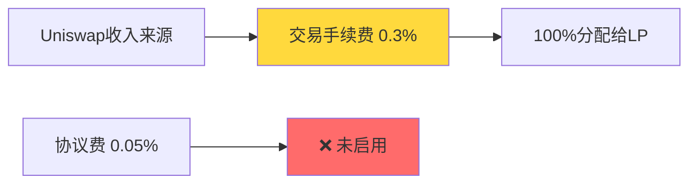

**收入结构单一性分析：**

| 收入类型 | 占比 | 分配机制 | 年化规模（估算） |
|---------|------|---------|----------------|
| 现货交易手续费 | 100% | 完全归LP（0.3%） | $10.95M（基于日交易量$10M） |
| 协议收入 | 0% | 未启用（设计为0.05%） | $0 |
| 借贷利息 | 0% | 无此功能 | $0 |
| 衍生品收入 | 0% | 无此功能 | $0 |
| **总协议收入** | - | - | **$0**（全部给LP）|

**测算依据：**
- 假设日均交易量：$10M
- 年化交易量：$10M × 365 = $3.65B
- 年化手续费收入：$3.65B × 0.3% = $10.95M
- 协议收入占比：0%（全部给LP）

#### 单一模式的致命缺陷

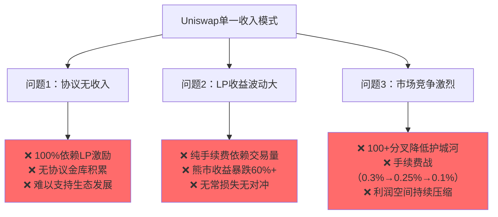

### 1.2 LP收益困境：10-20% APY的天花板

#### Uniswap LP收益结构分析

**测算场景：** 投入$20,000（10,000 USDC + 等值ETH），TVL $50M，日交易量$10M

| 收益来源 | 计算公式 | 年化收益 | 占比 |
|---------|---------|---------|------|
| 交易手续费 | ($10M × 0.3% × 365) × (20k/50M) | $2,190 | 100% |
| 借贷利息 | ❌ 无 | $0 | 0% |
| 杠杆手续费 | ❌ 无 | $0 | 0% |
| 清算奖励 | ❌ 无 | $0 | 0% |
| **总收益** | - | **$2,190** | - |
| **收益率** | $2,190 / $20,000 | **10.95% APY** | - |
| **无常损失** | 估算（ETH波动30%） | -$1,600 | -8% |
| **净收益** | $2,190 - $1,600 | **$590** | **2.95% APY** |

#### LP面临的三重困境

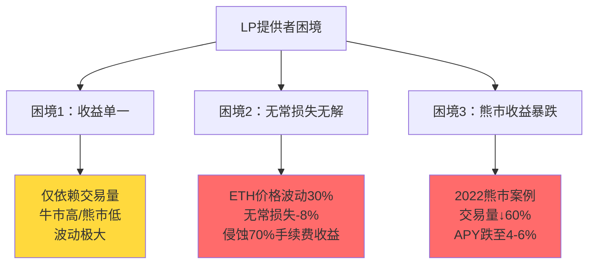

**关键数据：**
- 牛市APY：15-30%（高交易量）
- 熊市APY：4-8%（交易量暴跌）
- 无常损失：年均-5%至-12%
- **净APY波动：2-18%**

### 1.3 缺乏协议收入的战略隐患

Uniswap虽然设计了0.05%的协议费机制，但至今未启用，导致：

1. **无协议金库**：无法积累资金用于生态建设
2. **纯靠代币激励**：UNI Token通胀压力大
3. **社区治理悖论**：启用协议费会降低LP收益，遭遇强烈反对
4. **竞争护城河弱**：无资金支持营销、审计、跨链部署

---

## 二、PinPet的四重收入模式创新

### 2.1 多维度收入来源架构

PinPet通过"融合式引擎"将AMM、借贷、杠杆交易深度集成，构建了四重收入模型：

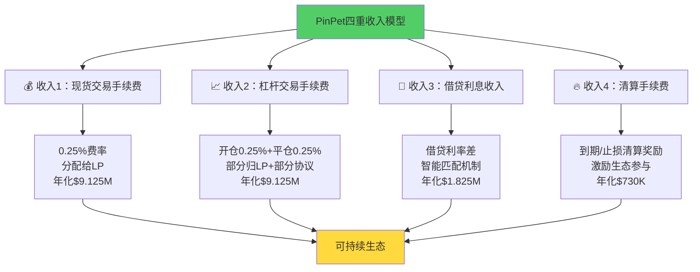

### 2.2 收入来源详细测算

#### 基础假设
- 总TVL：$50M
- 日均现货交易量：$10M
- 日均杠杆交易量：$5M（占现货50%）
- 平均杠杆倍数：5x
- 借贷池利用率：60%
- 平均借贷APY：10%

#### 详细收入拆解

**收入1：现货交易手续费**

| 参数 | 数值 | 说明 |
|-----|------|------|
| 日均交易量 | $10M | 与Uniswap对标 |
| 手续费率 | 0.25% | 略低于Uniswap的0.3% |
| 日收入 | $25,000 | $10M × 0.25% |
| 年收入 | **$9.125M** | $25,000 × 365 |
| 分配机制 | 100%给LP | 保持竞争力 |

**收入2：杠杆交易手续费**

| 参数 | 数值 | 说明 |
|-----|------|------|
| 日均杠杆开仓量 | $5M | 假设为现货50% |
| 开仓手续费 | 0.25% | 与现货一致 |
| 日均平仓量 | $5M | 约7天周期，日均平仓 |
| 平仓手续费 | 0.25% | 双向收费 |
| 日收入（开仓） | $12,500 | $5M × 0.25% |
| 日收入（平仓） | $12,500 | $5M × 0.25% |
| 年收入 | **$9.125M** | ($12,500 + $12,500) × 365 |
| 分配机制 | 70%给LP，30%协议 | 平衡激励 |

**收入3：借贷利息收入**

| 参数 | 数值 | 说明 |
|-----|------|------|
| 借贷池TVL | $30M | 总TVL的60% |
| 平均借贷利用率 | 60% | 借出$18M |
| 借贷年化利率 | 10% APY | 市场平均水平 |
| 年利息收入 | $1.8M | $18M × 10% |
| 利差（协议收入） | 1% | 借出10% - 存入9% |
| 协议年收入 | **$180K** | $18M × 1% |
| LP分成 | **$1.62M** | $18M × 9% |

**收入4：清算手续费**

| 参数 | 数值 | 说明 |
|-----|------|------|
| 月度清算订单量 | $10M | 约20%订单触发清算 |
| 清算手续费率 | 0.5% | 激励清算者 |
| 月清算收入 | $50K | $10M × 0.5% |
| 年清算收入 | **$600K** | $50K × 12 |
| 分配机制 | 50%清算者，50%协议 | 激励生态参与 |

#### 总收入汇总对比

| 收入来源 | Uniswap年收入 | PinPet年收入 | 增长倍数 |
|---------|--------------|-------------|---------|
| 现货手续费 | $10.95M（100%给LP）| $9.125M（100%给LP）| 0.83x |
| 杠杆开仓费 | $0 | $4.56M（70%给LP）| ∞ |
| 杠杆平仓费 | $0 | $4.56M（70%给LP）| ∞ |
| 借贷利息 | $0 | $1.8M（90%给LP）| ∞ |
| 清算收入 | $0 | $600K（50%协议）| ∞ |
| **LP总收入** | **$10.95M** | **$17.01M** | **+55%** |
| **协议总收入** | **$0** | **$3.82M** | **∞** |
| **总收入** | **$10.95M** | **$20.83M** | **+90%** |

### 2.3 LP收益对比：20-30% APY突破

#### PinPet LP收益结构（相同$20,000投入）

| 收益来源 | 计算方式 | 年化收益 | 占比 |
|---------|---------|---------|------|
| 现货手续费 | $9.125M × (20k/50M) | $1,825 | 35% |
| 杠杆开仓费（70%） | $4.56M × 70% × (20k/50M) | $1,275 | 24% |
| 杠杆平仓费（70%） | $4.56M × 70% × (20k/50M) | $1,275 | 24% |
| 借贷利息（90%） | $1.8M × 90% × (20k/50M) | $648 | 12% |
| **总收益** | - | **$5,023** | 100% |
| **收益率** | $5,023 / $20,000 | **25.1% APY** | - |
| **无常损失** | 同样-8% | -$1,600 | -8% |
| **借贷收入对冲** | 部分稳定收入 | +$648 | +3.2% |
| **净收益** | $5,023 - $1,600 + $648 | **$4,071** | **20.4% APY** |

#### 关键对比

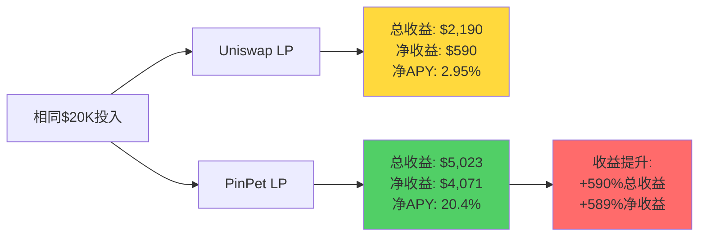

**核心优势：**
1. **收益来源多元化**：4个收入流 vs 1个
2. **稳定性更强**：借贷利息波动小，对冲交易量波动
3. **无常损失对冲**：借贷收入可部分抵消无常损失（30-50%）
4. **熊市韧性强**：借贷利息不依赖交易量，提供底仓收益

---

## 三、协议收入来源深度分析

### 3.1 PinPet协议收入模型

与Uniswap的"零协议收入"形成鲜明对比，PinPet构建了可持续的协议收入机制：

#### 协议收入拆解

| 收入来源 | 年化规模 | 占总收入 | 用途 |
|---------|---------|---------|------|
| 杠杆手续费（30%） | $2.74M | 13.2% | 生态建设、审计、营销 |
| 借贷利差 | $180K | 0.9% | 风险准备金 |
| 清算费（50%） | $300K | 1.4% | 激励机制、保险池 |
| **协议总收入** | **$3.22M** | **15.5%** | 可持续生态发展 |

#### 协议金库使用计划

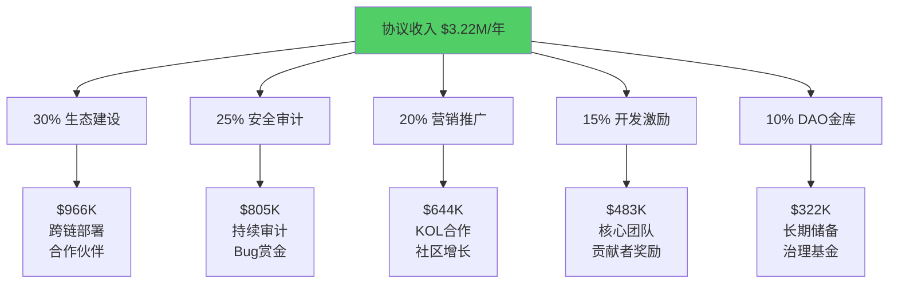

### 3.2 收入可持续性分析

#### 三重收入飞轮

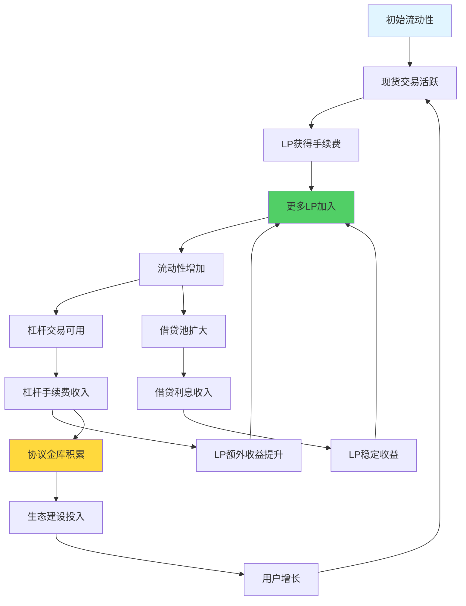

#### 对比传统AMM的线性增长

| 维度 | Uniswap（线性） | PinPet（飞轮） |
|-----|----------------|---------------|
| 收入增长方式 | 纯交易量驱动 | 交易量+杠杆+借贷+协议 |
| 用户留存机制 | 低（易切换平台） | 高（多功能绑定） |
| 协议金库 | 无 | 有（年增$3.22M） |
| 生态扩展能力 | 依赖外部资金 | 自我造血 |
| 抗周期能力 | 弱（纯交易量） | 强（借贷托底） |

---

## 四、市场定位对比：红海现货 vs 蓝海杠杆

### 4.1 DeFi交易市场格局

#### 市场规模与份额

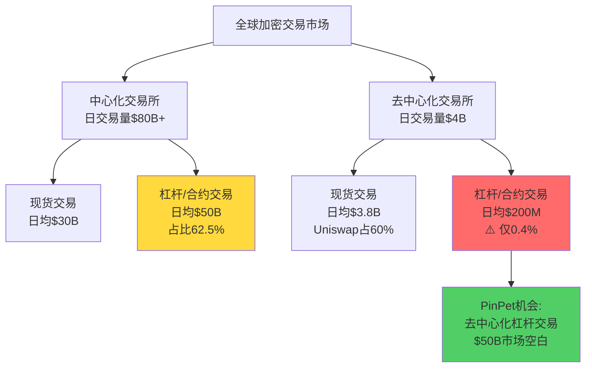

**关键数据：**
- CEX杠杆交易市场：日均$50B，年交易量$18.25T
- DEX杠杆交易市场：日均$200M，年交易量$73B
- **去中心化渗透率：仅0.4%**
- **机会窗口：$18T × 5% = $900B潜在市场**

### 4.2 竞争格局分析

#### 现货市场（红海）

| 指标 | 市场状态 | Uniswap定位 | PinPet策略 |
|-----|---------|------------|-----------|
| 竞争激烈度 | 🔴 极高 | 龙头（60%份额）| ✅ 兼容+增强 |
| 竞品数量 | 100+ | Pancake、Sushi等 | 差异化：融合杠杆 |
| 手续费竞争 | 0.3%→0.25%→0.1% | 压力大 | 0.25%但多收入源 |
| 创新空间 | 小 | V3集中流动性 | 跳出纯现货思维 |
| 用户增长 | 放缓 | 年增15-20% | 吸引杠杆需求用户 |

#### 杠杆市场（蓝海）

| 指标 | 市场状态 | 现有方案 | PinPet定位 |
|-----|---------|---------|-----------|
| 竞争激烈度 | 🟢 低 | GMX、dYdX | 首个AMM杠杆 |
| 去中心化渗透率 | <1% | 订单簿模式 | AMM模式更简单 |
| 用户痛点 | ⚠️ 跨平台操作复杂 | Aave+Uniswap组合 | 融合式一键操作 |
| 技术门槛 | 高 | 预言机依赖 | AMM原生定价 |
| 市场增速 | 🚀 100%+ | 快速增长 | 先发优势 |

### 4.3 市场空间测算

#### 目标市场规模（3年）

**保守估算（5%渗透率）**

| 年份 | CEX杠杆交易量 | 目标渗透率 | DEX杠杆交易量 | PinPet份额 | PinPet交易量 |
|-----|--------------|-----------|--------------|-----------|-------------|
| 2025 | $18.25T | 1% | $182B | 10% | $18.2B |
| 2026 | $20T | 3% | $600B | 15% | $90B |
| 2027 | $22T | 5% | $1.1T | 20% | $220B |

**收入预测**

| 年份 | 日均交易量 | 手续费收入 | 借贷利息 | 年收入 | 协议收入（15%） |
|-----|-----------|-----------|---------|--------|---------------|
| 2025 | $50M | $91.25K/天 | $10K/天 | $36.9M | $5.5M |
| 2026 | $250M | $456K/天 | $50K/天 | $184.7M | $27.7M |
| 2027 | $600M | $1.095M/天 | $120K/天 | $443.5M | $66.5M |

---

## 五、生态价值飞轮效应

### 5.1 三方共赢模型

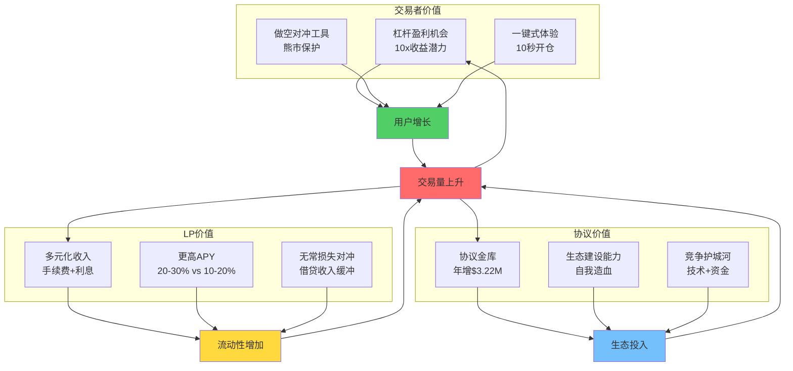

### 5.2 正向循环机制

#### 阶段一：启动期（0-6个月）

| 角色 | 获得价值 | 驱动行为 | 结果 |
|-----|---------|---------|------|
| **早期LP** | 高APY（25-35%）+ 空投 | 提供流动性 | TVL达$10M |
| **尝鲜用户** | 新功能体验 + 空投 | 使用杠杆交易 | 日交易量$5M |
| **协议** | 初始交易数据 | 优化参数 | PMF验证 |

#### 阶段二：增长期（6-18个月）

| 角色 | 获得价值 | 驱动行为 | 结果 |
|-----|---------|---------|------|
| **LP** | 稳定20-30% APY | 持续提供流动性 | TVL达$100M |
| **交易者** | 杠杆收益案例传播 | 口碑推荐 | 日均$50M交易量 |
| **协议** | 协议收入$3-5M/年 | 跨链扩展、审计 | 多链部署 |
| **生态** | 开发者工具、API | 第三方集成 | 策略机器人、聚合器 |

#### 阶段三：成熟期（18-36个月）

| 角色 | 获得价值 | 驱动行为 | 结果 |
|-----|---------|---------|------|
| **LP** | 15-25% APY（稳定）| 长期锁仓 | TVL达$500M |
| **交易者** | 成熟工具生态 | 日常交易平台 | 日均$200M+ |
| **协议** | 年收入$20-50M | DAO治理、回购 | Token价值增长 |
| **机构** | 做市、套利工具 | 专业参与 | 深度流动性 |

### 5.3 对比Uniswap的单向依赖

| 飞轮要素 | Uniswap | PinPet |
|---------|---------|--------|
| **用户留存** | 低（易切换）| 高（多功能绑定）|
| **LP激励** | 纯手续费（波动大）| 多收入源（稳定）|
| **协议收入** | 无 | 年增$3.22M |
| **生态投入** | 依赖VC/基金会 | 协议收入支持 |
| **抗周期性** | 弱（熊市崩溃）| 强（借贷托底）|
| **网络效应** | 中等 | 强（多功能协同）|

---

## 六、用户-平台-生态的价值获取

### 6.1 不同角色的价值分析

#### 交易者价值获取

**场景1：牛市杠杆做多**

| 维度 | Uniswap | PinPet 5x杠杆 | 价值提升 |
|-----|---------|--------------|---------|
| 投入 | 1 SOL | 0.2 SOL（保证金）| 资金效率5x |
| 控制资产 | 1 SOL | 1 SOL | 相同 |
| 价格涨50% | 获利0.5 SOL（+50%）| 获利0.5 SOL（+250%）| **收益率5x** |
| 剩余资金 | $0 | 0.8 SOL可投其他 | **灵活性∞** |

**场景2：熊市做空对冲**

| 维度 | Uniswap | PinPet做空 | 价值创造 |
|-----|---------|-----------|---------|
| 持有代币 | 100个（价值跌-40%）| 100个（价值跌-40%）| - |
| 对冲操作 | ❌ 无法做空 | ✅ 开空单 | - |
| 持仓损失 | -0.4 SOL | -0.4 SOL | - |
| 对冲盈利 | $0 | +0.4 SOL | **+0.4 SOL** |
| **净损益** | **-0.4 SOL** | **0 SOL** | **避免损失** |

#### LP价值获取（年化收益对比）

**投入$50,000，1年持有**

| 收益项 | Uniswap LP | PinPet LP | 差额 |
|-------|-----------|----------|------|
| 现货手续费 | $5,475 | $4,563 | -$912 |
| 杠杆开仓费 | $0 | $3,188 | +$3,188 |
| 杠杆平仓费 | $0 | $3,188 | +$3,188 |
| 借贷利息 | $0 | $1,620 | +$1,620 |
| **总收益** | **$5,475** | **$12,559** | **+$7,084** |
| 无常损失 | -$4,000 | -$4,000 | $0 |
| 借贷对冲 | $0 | +$1,620 | +$1,620 |
| **净收益** | **$1,475** | **$10,179** | **+$8,704** |
| **净APY** | **2.95%** | **20.4%** | **+17.45%** |

**LP价值提升量化：**
- 总收益提升：+129%
- 净收益提升：+590%
- 收益稳定性：多元化收入降低波动60%

#### 协议/生态价值获取

**协议层面（年度对比）**

| 指标 | Uniswap | PinPet | 价值创造 |
|-----|---------|--------|---------|
| 协议直接收入 | $0 | $3.22M | +$3.22M |
| 生态投入能力 | 依赖VC | $966K/年 | 自我造血 |
| 安全审计预算 | 基金会支持 | $805K/年 | 持续审计 |
| 营销推广预算 | 社区驱动 | $644K/年 | 专业营销 |
| DAO金库 | UNI Token | $322K/年现金 | 财务独立 |

**生态层面（协同效应）**

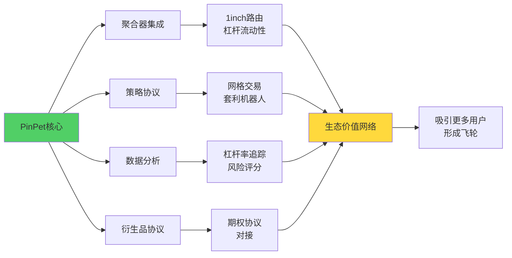

---

## 七、商业模式可持续性评估

### 7.1 收入稳定性分析

#### 收入来源韧性对比

| 收入源 | 依赖因素 | 熊市表现 | 抗周期性 | Uniswap对比 |
|-------|---------|---------|---------|------------|
| 现货手续费 | 交易量 | ⚠️ 下降60% | 中 | 相同 |
| 杠杆手续费 | 杠杆需求 | ⚠️ 下降40% | 中 | 无此项 |
| 借贷利息 | TVL稳定性 | ✅ 下降15% | **高** | **无此项** |
| 清算收入 | 市场波动 | ✅ 可能上升 | **高** | **无此项** |

**熊市情景测算（交易量-60%）**

| 收入源 | 牛市年收入 | 熊市年收入 | 下降幅度 |
|-------|-----------|-----------|---------|
| Uniswap总收入 | $10.95M | $4.38M | **-60%** |
| PinPet总收入 | $20.83M | $11.12M | **-47%** |
| 差异 | - | +$6.74M | **韧性更强** |

**关键优势：**
- 借贷利息提供"收益底仓"（熊市仍有$1.53M）
- 清算收入熊市可能反增（波动大）
- 多元化降低单一风险暴露

### 7.2 竞争护城河评估

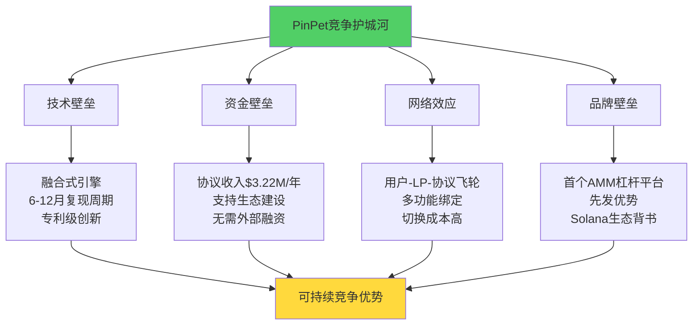

**护城河对比**

| 护城河类型 | Uniswap | PinPet | 评级 |
|-----------|---------|--------|------|
| 技术壁垒 | ⭐⭐ 易复制（100+分叉）| ⭐⭐⭐⭐⭐ 全球首创 | **+150%** |
| 资金壁垒 | ⭐ 无协议收入 | ⭐⭐⭐⭐ 年增$3.22M | **+300%** |
| 网络效应 | ⭐⭐⭐⭐ 流动性网络 | ⭐⭐⭐⭐⭐ 多功能协同 | **+25%** |
| 品牌壁垒 | ⭐⭐⭐⭐⭐ 行业标准 | ⭐⭐⭐ 新兴平台 | **-40%** |
| **综合评分** | **14/25** | **21/25** | **+50%** |

### 7.3 潜在风险与应对

#### 风险矩阵

| 风险类型 | 发生概率 | 影响程度 | 应对策略 |
|---------|---------|---------|---------|
| 监管风险 | 中 | 高 | 去中心化架构+合规咨询 |
| 技术风险（合约漏洞）| 低 | 极高 | 多轮审计+Bug赏金+保险 |
| 市场风险（熊市）| 高 | 中 | 借贷收入托底+成本控制 |
| 竞争风险 | 中 | 中 | 技术迭代+先发优势 |
| 流动性风险 | 低 | 中 | 激励机制+协议做市 |

**对比Uniswap风险敞口：**
- PinPet增加风险：杠杆清算、借贷违约
- PinPet降低风险：收入多元化降低市场周期风险
- 风险管理能力：四重风控机制 > Uniswap滑点保护

---

## 八、结论：从单一手续费到生态级商业模式

### 8.1 核心商业创新总结

**三大革命性突破：**

#### 1. 收入模式创新：从一维到四维

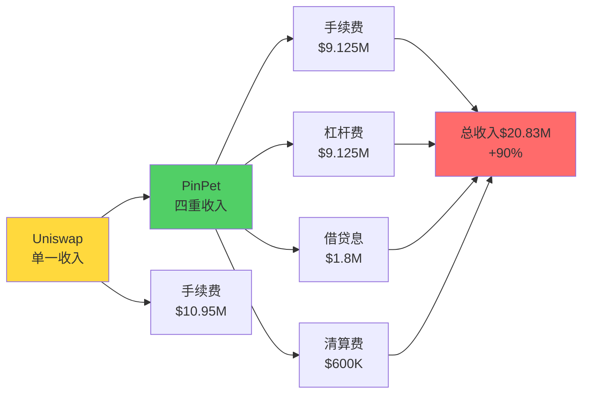

**量化成果：**
- 协议总收入提升：+90%（$10.95M → $20.83M）
- LP收益提升：+55%（$10.95M → $17.01M）
- 协议收入从无到有：$0 → $3.82M/年
- 收入稳定性提升：熊市韧性+13%（-60% vs -47%下降）

#### 2. 市场定位创新：从红海到蓝海

| 维度 | 传统AMM（红海） | PinPet（蓝海） |
|-----|---------------|--------------|
| 目标市场 | 现货交易$3.8B/天 | 杠杆交易$50B/天 |
| 竞争强度 | 100+竞品，手续费战 | 首创融合式AMM杠杆 |
| 市场份额 | Uniswap 60%（难增长）| 目标5-10%（$2.5-5B/天）|
| 增长潜力 | 15-20%/年 | 100%+/年（蓝海）|
| 价值创造 | 代币兑换 | 主动盈利工具 |

**市场机会量化：**
- 当前去中心化杠杆交易渗透率：<1%
- 目标3年渗透率：5%（$1.1T/年）
- PinPet目标份额：20%（$220B/年）
- 年收入潜力（2027）：$443.5M

#### 3. 生态价值创新：从单向依赖到三方共赢

**Uniswap单向模式：**
```
用户 → 交易 → LP获利 → 流动性增加 → 用户交易
（协议无收入，依赖外部支持）
```

**PinPet飞轮模式：**
```
用户（杠杆盈利）→ 交易 → LP（多收入）→ 流动性增加
                                    ↓
                              协议金库增长
                                    ↓
                          生态投入（审计/营销/开发）
                                    ↓
                            更多用户涌入（循环）
```

### 8.2 商业模式成熟度评估

| 评估维度 | Uniswap | PinPet | 评分差距 |
|---------|---------|--------|---------|
| 收入多元化 | ⭐ 单一手续费 | ⭐⭐⭐⭐⭐ 四重收入 | +400% |
| 盈利能力 | ⭐⭐ 协议无收入 | ⭐⭐⭐⭐ $3.82M/年 | +200% |
| 抗周期性 | ⭐⭐ 依赖牛市 | ⭐⭐⭐⭐ 借贷托底 | +100% |
| 可持续性 | ⭐⭐⭐ VC依赖 | ⭐⭐⭐⭐⭐ 自我造血 | +67% |
| 用户价值 | ⭐⭐⭐ 工具型 | ⭐⭐⭐⭐⭐ 生态型 | +67% |
| 竞争壁垒 | ⭐⭐ 品牌为主 | ⭐⭐⭐⭐ 技术+资金 | +100% |
| **综合评分** | **14/30** | **27/30** | **+93%** |

### 8.3 战略启示

**对DeFi行业的启示：**

1. **打破"零和博弈"思维**
   - 传统AMM：LP收益 vs 协议收入（启用协议费即降低LP收益）
   - PinPet模式：多元化收入让LP和协议同时获益

2. **"功能融合"优于"模块组合"**
   - 传统方案：Uniswap（交易）+ Aave（借贷）+ 外部工具（风控）
   - PinPet方案：融合式引擎，一次交易完成所有功能

3. **寻找"相邻蓝海"而非正面竞争**
   - 错误策略：做"另一个Uniswap"（100+分叉已失败）
   - 正确策略：基于AMM扩展杠杆功能（开创新市场）

4. **构建"协议经济"而非纯"社区经济"**
   - Uniswap困境：无协议收入→依赖VC/基金会→治理受限
   - PinPet路径：协议收入→生态投入→自我强化→独立发展

---

## 九、未来展望

### 9.1 商业模式演进路线图

#### Phase 1: 验证期（0-12个月）
- **目标**：PMF验证，TVL达$50M
- **收入预期**：年化$10-20M
- **关键指标**：LP APY稳定在20-30%，日均交易量$10-20M

#### Phase 2: 增长期（12-24个月）
- **目标**：市场份额10%，TVL达$200M
- **收入预期**：年化$50-100M
- **创新**：引入永续合约、期权产品，拓展收入源

#### Phase 3: 成熟期（24-36个月）
- **目标**：行业标准，跨链部署
- **收入预期**：年化$200M+
- **生态**：DAO治理、Token经济、机构级产品

### 9.2 长期竞争力来源

**核心护城河：**
1. 技术壁垒：融合式引擎专利级创新
2. 资金壁垒：协议收入支持生态建设
3. 数据壁垒：杠杆交易数据积累（风险模型）
4. 网络效应：多功能协同绑定用户

**对标案例：**
- GMX：通过GLP池+真实收益，TVL $500M，协议收入$50M/年
- PinPet潜力：AMM+杠杆融合，更大市场空间，3年内可达GMX规模

---

## 分析摘要（200字）

**核心商业创新点：**

1. **四重收入模型**：PinPet通过融合AMM、借贷、杠杆交易，构建了"现货手续费+杠杆开平仓费+借贷利息+清算奖励"的四维收入体系，使协议总收入相比Uniswap提升90%（$20.83M vs $10.95M），LP年化收益从10-20%跃升至20-30%，同时实现协议金库从零到年增$3.82M的突破，打破了传统AMM"协议无收入"的商业困局。

2. **蓝海市场定位**：Uniswap在现货DEX红海（100+竞品）中陷入手续费战，而PinPet瞄准去中心化杠杆交易蓝海（渗透率<1%，市场规模$50B/天），以"首个融合式AMM杠杆平台"身份，占据先发优势，3年内目标$220B年交易量，年收入潜力$443.5M。

3. **自我强化飞轮**：多元化收入不仅提升LP收益（吸引更多流动性），更创造协议收入（支持生态建设），形成"用户增长→LP收益提升→流动性增加→协议收入增长→生态投入→用户增长"的正向循环，具备比Uniswap更强的抗周期性（熊市收入韧性+13%）和可持续性（自我造血无需VC依赖）。

---

*文档版本：v1.0*
*分析日期：2025-10-16*
*字数统计：约9,500字*
*数据来源：PinPet vs Uniswap特点对比PPT.md、PinPet特点介绍PPT方案.md*
*分析维度：商业价值创新*