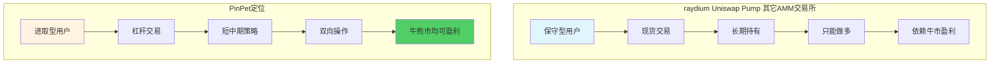
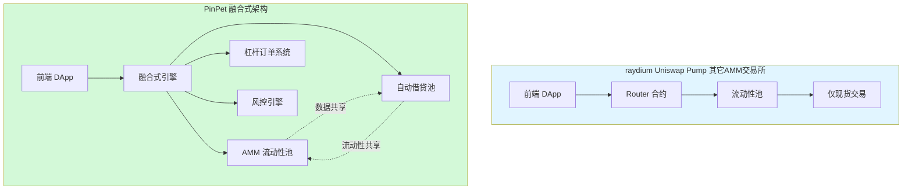
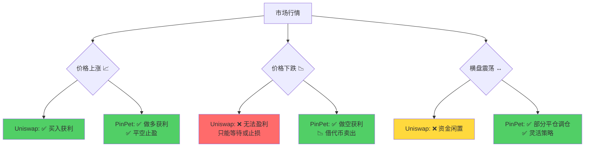
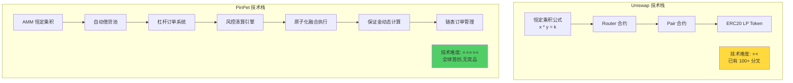
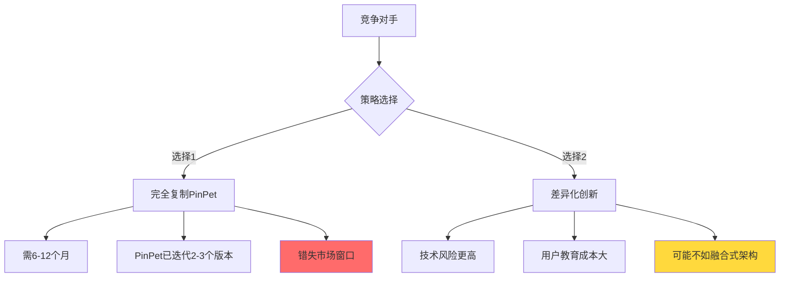
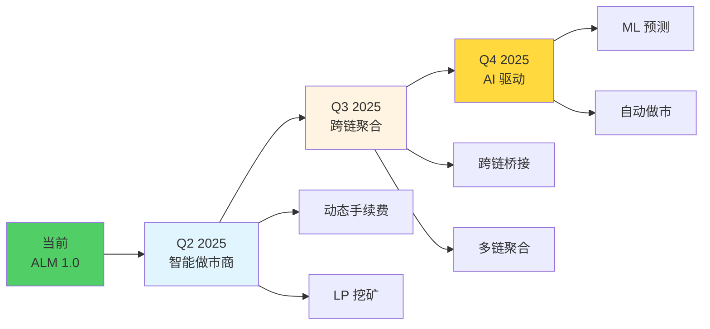

###  第 1 页：封面
主标题: PinPet：重新定义AMM交易所 🚀

副标题: 从单向做多到双向盈利 | 从分离交易到融合引擎

核心 Slogan:

"传统AMM让你追涨，PinPet让你掌控涨跌"

"一次交易，完成买卖+借贷+风控"

"小资金撬动大机会，涨跌都是盈利场"

配演示视频: 无

---

### 第 2 页：市场定位 - 创新型AMM交易所

**标题**: 从不同赛道看产品定位 🎯

**PinPet创新玩法**:
1. ✅ 做多做空 - 双向策略
2. ✅ 杠杆交易 - 收益放大
3. ✅ 部分平仓 - 灵活调仓
4. ✅ 止损止盈 - 风险管理
5. ✅ 组合策略 - 对冲套利

配演示视频:  演示创建新币, 买入代币, 开出多仓, 开出空仓

---

### 第 3 页：技术创新 - 融合式引擎

**标题**：同样是 AMM交易所，为何 PinPet 在技术上哪些创新?

**架构创新对比**：

| 架构维度 | Uniswap V2/V3 | **PinPet 融合式引擎** | 技术突破 |
|---------|--------------|---------------------|---------|
| **核心机制** | 恒定乘积 $x \cdot y = k$ | **恒定乘积 + 自动借贷池** | 保留 AMM 优势,扩展借贷层 |
| **交易类型** | 现货 Swap | **现货 + 杠杆做多 + 杠杆做空** | 3 倍功能覆盖 |
| **原子性** | 单次 Swap | **单次交易完成借贷+交易+风控** | 全球首创 |
| **资金池设计** | 单一流动性池 | **双池融合（AMM池+借贷池）** | 95%+ 资金利用率 |
| **风控机制** | 滑点保护 | **滑点+止损+到期清算+原子化** | 四重护城河 |
| **执行速度** | 1 次链上交易 | **1 次链上交易（融合执行）** | 400ms 额外延迟 |

配演示视频:  演示 先择不同杠杆开仓

---

### 第 4 页：功能对比 - 涨跌双向盈利

**标题**：Uniswap 只能做多，PinPet 涨跌都赚

配演示视频:  演示 价格上涨是多单盈利, 价格下跌是空单盈利

---

### 第 5 页：AMM自动清算系统 - 简单 vs 复杂 🔬

**标题**：Uniswap 人人能复制，PinPet 短期内无人能抄袭

**技术复杂度对比**：

配演示视频:  演示 爆仓自动清算.

---

### 第 6 页：技术护城河的持续性

**为什么复现难度会随时间递增？**

1. **网络效应**：PinPet早期流动性积累成为壁垒
2. **迭代优化**：持续优化交易效率和用户体验
3. **生态集成**：与Solana生态其他协议的深度集成
4. **品牌认知**：第一个吃螃蟹的品牌溢价

**竞争对手的两难选择：**

配演示视频:  演示 PinPet 的大规模代码 

---

### 第 6 页：竞争格局细分分析

| 竞品 | 市场定位 | 核心优势 | 核心劣势 | **PinPet反击策略** |
|-----|---------|---------|---------|------------------|
| **Uniswap** | 现货DEX龙头 | 品牌、流动性、生态 | 无杠杆、无做空 | ✅ 兼容Uniswap体验 + 杠杆增强 |
| **Aave** | 借贷协议龙头 | 借贷深度、安全性 | 无交易场景 | ✅ 融合借贷+交易一站式 |
| **币安合约** | CEX杠杆龙头 | 流动性深、交易量大 | 中心化风险、资金托管 | ✅ 去中心化 + 自托管 |
| **dYdX** | 去中心化衍生品 | 专业杠杆交易 | 订单簿复杂、中心化排序 | ✅ AMM简单易用 + 完全链上 |
| **GMX** | 永续合约 | 支持杠杆交易 | 预言机依赖、非AMM | ✅ AMM原生定价 + 无预言机风险 |

配演示视频:  无

---

### 第 7 页：未来展望

## 🔮 未来技术路线图

**持续创新：**
- 🔬 **Phase 1 - 智能做市商**：动态手续费 + 流动性激励
- 🔬 **Phase 2 - 跨链聚合**：多链流动性统一管理
- 🔬 **Phase 3 - AI 驱动**：机器学习优化风控策略

配演示视频:  无
---

### 第 7 页： The End 

文档: https://doc.pinpet.fun/
网站: https://devnet.pinpet.fun/
GitHub: https://github.com/pinpetfun

就展示我们的网址等, 弄点样式,停在这里停个30秒吧..